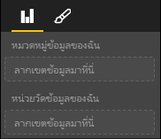

# <a name="capabilities-and-properties-of-power-bi-visuals"></a>ความสามารถและคุณสมบัติของวิชวล Power BI 

คุณใช้ความสามารถในการให้ข้อมูลกับโฮสต์เกี่ยวกับวิชวลของคุณ คุณสมบัติทั้งหมดบนแบบจำลองความสามารถเป็น `optional`

ออบเจ็กต์รูทของความสามารถของวิชวลคือ `dataRoles`, `dataViewMappings` และอื่น ๆ

```json
{
    "dataRoles": [ ... ],
    "dataViewMappings": [ ... ],
    "objects":  { ... },
    "supportsHighlight": true|false,
    "advancedEditModeSupport": 0|1|2,
    "sorting": { ... }
}

```

## <a name="define-the-data-fields-that-your-visual-expects-dataroles"></a>กำหนดเขตข้อมูลที่วิชวลของคุณคาดหวัง: dataRoles

เพื่อกำหนดเขตข้อมูลที่สามารถผูกกับข้อมูล ให้คุณใช้ `dataRoles` `dataRoles` รับอาร์เรย์ของออบเจ็กต์ `DataViewRole` ซึ่งกำหนดคุณสมบัติที่จำเป็นทั้งหมด

### <a name="properties"></a>คุณสมบัติ

* **ชื่อ**: ชื่อภายในของเขตข้อมูลนี้ (ต้องไม่ซ้ำกัน)
* **ชนิด**: ชนิดของเขตข้อมูล:
    * `Grouping`: ค่าไม่ต่อเนื่องที่ใช้ในการจัดกลุ่มเขตข้อมูลหน่วยวัด
    * `Measure`: ค่าข้อมูลตัวเลข
    * `GroupingOrMeasure`: ค่าที่สามารถใช้เป็นการจัดกลุ่มหรือหน่วยวัด
* **displayName**: ชื่อที่แสดงให้กับผู้ใช้ในบานหน้าต่าง**คุณสมบัติ**
* **คำอธิบาย**: คำอธิบายแบบสั้นของเขตข้อมูล (เป็นทางเลือก)
* **requiredTypes**: ชนิดของข้อมูลที่จำเป็นสำหรับบทบาทข้อมูลนี้ ค่าที่ไม่ตรงกันถูกตั้งค่าเป็น null (เป็นทางเลือก)
* **preferredTypes**: ชนิดของข้อมูลที่ต้องการสำหรับบทบาทข้อมูลนี้ (เป็นทางเลือก)

### <a name="valid-data-types-in-requiredtypes-and-preferredtypes"></a>ชนิดข้อมูลที่ถูกต้องใน requiredTypes และ preferredTypes

* **bool**: ค่าบูลีน
* **integer**: ค่าจำนวนเต็ม (จำนวนเต็ม)
* **numeric**: ค่าตัวเลข
* **text**: ค่าข้อความ
* **geography**: ข้อมูลทางภูมิศาสตร์

### <a name="example"></a>ตัวอย่าง:

```json
"dataRoles": [
    {
        "displayName": "My Category Data",
        "name": "myCategory",
        "kind": "Grouping",
        "requiredTypes": [
            {
                "text": true
            },
            {
                "numeric": true
            },
            {
                "integer": true
            }
        ],
        "preferredTypes": [
            {
                "text": true
            }
        ]
    },
    {
        "displayName": "My Measure Data",
        "name": "myMeasure",
        "kind": "Measure",
        "requiredTypes": [
            {
                "integer": true
            },
            {
                "numeric": true
            }
        ],
        "preferredTypes": [
            {
                "integer": true
            }
        ]
    },
    {
        "displayNameKey": "Visual_Location",
        "name": "Locations",
        "kind": "Measure",
        "displayName": "Locations",
        "requiredTypes": [
            {
                "geography": {
                    "address": true
                }
            },
            {
                "geography": {
                    "city": true
                }
            },
            {
                "geography": {
                    "continent": true
                }
            },
            {
                "geography": {
                    "country": true
                }
            },
            {
                "geography": {
                    "county": true
                }
            },
            {
                "geography": {
                    "place": true
                }
            },
            {
                "geography": {
                    "postalCode": true
                }
            },
            {
                "geography": {
                    "region": true
                }
            },
            {
                "geography": {
                    "stateOrProvince": true
                }
            }
        ]
    }
]
```

บทบาทข้อมูลก่อนหน้านี้จะสร้างเขตข้อมูลที่แสดงในรูปภาพต่อไปนี้:



## <a name="define-how-you-want-the-data-mapped-dataviewmappings"></a>กำหนดวิธีที่คุณต้องการแมปข้อมูล - dataViewMappings

คุณสมบัติ DataViewMapping จะอธิบายว่าบทบาทข้อมูลเกี่ยวข้องกันอย่างไรและอนุญาตให้คุณระบุข้อกำหนดเงื่อนไขสำหรับบทบาทดังกล่าวได้

การแสดงภาพส่วนใหญ่ให้การแมปเดียวแต่คุณสามารถใส่หลาย dataViewMappings ได้ การแมปที่ถูกต้องแต่ละครั้งจะสร้างมุมมองข้อมูล 

```json
"dataViewMappings": [
    {
        "conditions": [ ... ],
        "categorical": { ... },
        "table": { ... },
        "single": { ... },
        "matrix": { ... }
    }
]
```

สำหรับข้อมูลเพิ่มเติม โปรดดูที่ [ทำความเข้าใจเกี่ยวกับการแมปมุมมองข้อมูลในวิชวล Power BI](dataview-mappings.md)

## <a name="define-property-pane-options-objects"></a>กำหนดตัวเลือกบานหน้าต่างคุณสมบัติ: ออบเจ็กต์

ออบเจ็กต์อธิบายคุณสมบัติแบบปรับแต่งได้ที่เกี่ยวข้องกับวิชวล ออบเจ็กต์แต่ละชนิดสามารถมีคุณสมบัติได้หลายรายการและแต่ละคุณสมบัติมีชนิดที่สัมพันธ์กัน ชนิดอ้างอิงถึงสิ่งที่คุณสมบัติจะเป็น 

```json
"objects": {
    "myCustomObject": {
        "displayName": "My Object Name",
        "properties": { ... }
    }
}
```

สำหรับข้อมูลเพิ่มเติม โปรดดูที่ [ออบเจ็กต์และคุณสมบัติของวิชวล Power BI](objects-properties.md)

## <a name="handle-partial-highlighting-supportshighlight"></a>จัดการการเน้นบางส่วน: supportsHighlight

ตามค่าเริ่มต้น ค่านี้จะถูกตั้งค่าเป็น `false` ซึ่งหมายความว่าค่าของคุณจะถูกกรองโดยอัตโนมัติเมื่อมีการเลือกบางสิ่งในหน้า การกรองอัตโนมัตินี้จะอัปเดตวิชวลของคุณให้แสดงเฉพาะค่าที่เลือกเท่านั้น หากคุณต้องการแสดงข้อมูลทั้งหมด แต่เน้นเฉพาะรายการที่คุณเลือกเท่านั้น คุณต้องตั้งค่า `supportsHighlight` เป็น `true` ในไฟล์ *capabilities.json* ของคุณ

สำหรับข้อมูลเพิ่มเติม โปรดดูหัวข้อ [การเน้นจุดข้อมูลในวิชวล Power BI](highlight.md)

## <a name="handle-advanced-edit-mode-advancededitmodesupport"></a>จัดการโหมดแก้ไขขั้นสูง: advancedEditModeSupport

วิชวลสามารถประกาศการสนับสนุนของโหมดแก้ไขขั้นสูงได้ ตามค่าเริ่มต้น วิชวลไม่สนับสนุนโหมดแก้ไขขั้นสูง เว้นแต่ว่าจะมีการระบุไว้เป็นอย่างอื่นในไฟล์ *capabilities.json*

สำหรับข้อมูลเพิ่มเติม โปรดดูหัวข้อ [โหมดแก้ไขขั้นสูงในวิชวล Power BI](advanced-edit-mode.md)

## <a name="data-sorting-options-for-visual-sorting"></a>ตัวเลือกการเรียงลำดับข้อมูลสำหรับวิชวล: การเรียงลำดับ

การแสดงผลด้วยภาพสามารถกำหนดพฤติกรรมการเรียงลำดับผ่านความสามารถ ตามค่าเริ่มต้น วิชวลไม่รองรับการแก้ไขคำสั่งการเรียงลำดับเว้นแต่จะระบุไว้เป็นอย่างอื่นในไฟล์ *capabilities.json*

สำหรับข้อมูลเพิ่มเติม โปรดดูหัวข้อ [ตัวเลือกการเรียงลำดับสำหรับวิชวล Power BI](sort-options.md)
