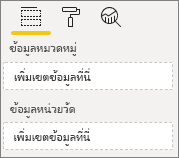

# <a name="build-a-bar-chart"></a>สร้างแผนภูมิแท่ง

บทความนี้เป็นคำแนะนำทีละขั้นตอนสำหรับการสร้างวิชวลแผนภูมิแท่ง Power BI ของตัวอย่างที่มีรหัส คุณสามารถรับตัวอย่างรหัสที่เสร็จสมบูรณ์ได้ที่ [https://github.com/Microsoft/PowerBI-visuals-sampleBarChart](https://github.com/Microsoft/PowerBI-visuals-sampleBarChart)

## <a name="view-model"></a>ดูแบบจำลอง
สิ่งสำคัญคือการกำหนดแบบจำลองมุมมองแผนภูมิแท่งก่อนและทำซ้ำกับการแสดงผลด้วยภาพของคุณในขณะที่คุณสร้าง

```typescript
/**
 * Interface for BarCharts viewmodel.
 *
 * @interface
 * @property {BarChartDataPoint[]} dataPoints - Set of data points the visual will render.
 * @property {number} dataMax                 - Maximum data value in the set of data points.
 */
interface BarChartViewModel {
    dataPoints: BarChartDataPoint[];
    dataMax: number;
};

/**
 * Interface for BarChart data points.
 *
 * @interface
 * @property {number} value    - Data value for the point.
 * @property {string} category - Corresponding category of the data value.
 */
interface BarChartDataPoint {
    value: number;
    category: string;
};
```

### <a name="use-static-data"></a>ใช้ข้อมูลแบบคงที่

การใช้ข้อมูลแบบคงที่เป็นวิธีที่ยอดเยี่ยมในการทดสอบวิชวลของคุณโดยไม่มีการผูกข้อมูล แบบจำลองมุมมองของคุณจะไม่เปลี่ยนแปลงแม้หลังจากที่คุณเพิ่มการผูกข้อมูลในขั้นตอนถัดไป

```typescript
let testData: BarChartDataPoint[] = [
    {
        value: 10,
        category: 'a'
    },
    {
        value: 20,
        category: 'b'
    },
    {
        value: 1,
        category: 'c'
    },
    {
        value: 100,
        category: 'd'
    },
    {
        value: 500,
        category: 'e'
    }];

let viewModel: BarChartViewModel = {
    dataPoints: testData,
    dataMax: d3.max(testData.map((dataPoint) => dataPoint.value))
};
```

## <a name="data-binding"></a>การผูกข้อมูล 
คุณเพิ่มการผูกข้อมูลโดยการกำหนดความสามารถในการแสดงผลด้วยภาพของคุณใน *capabilities.json* โค้ดตัวอย่างมี schema ให้คุณใช้อยู่แล้ว

การผูกข้อมูลทำงานบน **เขตข้อมูล** ได้ดีใน Power BI



### <a name="add-data-roles"></a>เพิ่มบทบาทข้อมูล
โค้ดตัวอย่างมีบทบาทข้อมูลอยู่แล้วแต่คุณสามารถกำหนดค่าได้

- `displayName` ชื่อที่แสดงใน **เขตข้อมูล** ได้เป็นอย่างดี
- `name` ชื่อภายในใช้เพื่ออ้างอิงถึงบทบาทข้อมูล
- `kind` คือสำหรับชนิดของเขตข้อมูล *การจัดกลุ่ม* เขตข้อมูล (0) มีค่าที่ไม่ต่อเนื่อง *หน่วยวัด* เขตข้อมูล (1) มีค่าข้อมูลตัวเลข

```json
"dataRoles": [
    {
        "displayName": "Category Data",
        "name": "category",
        "kind": 0
    },
    {
        "displayName": "Measure Data",
        "name": "measure",
        "kind": 1
    }
],
```

สำหรับข้อมูลเพิ่มเติมให้ดู [บทบาทข้อมูล](./capabilities.md#define-the-data-fields-that-your-visual-expects-dataroles)

### <a name="add-conditions-to-dataviewmapping"></a>เพิ่มเงื่อนไขลงใน DataViewMapping
กำหนดเงื่อนไขภายใน `dataViewMappings` ของคุณ   เพื่อตั้งค่าจำนวนเขตข้อมูลแต่ละเขตข้อมูลอย่างดีสามารถผูกได้ ใช้ `name` ภายในของบทบาทข้อมูลเพื่ออ้างอิงถึงแต่ละเขตข้อมูล

```json
    "dataViewMappings": [
        {
            "conditions": [
                {
                    "category": {
                        "max": 1
                    },
                    "measure": {
                        "max": 1
                    }
                }
            ],
        }
    ]
```

สำหรับข้อมูลเพิ่มเติมดู [การแมปมุมมองข้อมูล](./dataview-mappings.md)

### <a name="define-and-use-visualtransform"></a>กำหนดและใช้ visualTransform
`DataView` คือโครงสร้างที่ Power BI ให้ไปยังวิชวลของคุณซึ่งมีข้อมูลคิวรีที่จะแสดงภาพ อย่างไรก็ตาม `DataView` สามารถให้ข้อมูลในฟอร์มที่แตกต่างกันเช่นประเภทและตาราง หากต้องการสร้างวิชวลประเภทเช่นแผนภูมิแท่งคุณจะต้องใช้คุณสมบัติประเภทบน `DataView`เท่านั้น การกำหนด `visualTransform` ช่วยให้คุณสามารถแปลง `DataView` ลงในแบบจำลองมุมมองวิชวลของคุณจะใช้

เพื่อกำหนดสีและเลือกเมื่อกำหนดแต่ละจุดข้อมูล คุณใช้ `IVisualHost` 

```typescript
/**
 * Function that converts queried data into a view model that will be used by the visual
 *
 * @function
 * @param {VisualUpdateOptions} options - Contains references to the size of the container
 *                                        and the dataView which contains all the data
 *                                        the visual had queried.
 * @param {IVisualHost} host            - Contains references to the host which contains services
 */
function visualTransform(options: VisualUpdateOptions, host: IVisualHost): BarChartViewModel {
    /*Convert dataView to your viewModel*/
}

```

## <a name="color"></a>สี 
การแสดงสีเป็นหนึ่งในบริการที่พร้อมใช้งานบน `IVisualHost`

### <a name="add-color-to-data-points"></a>เพิ่มสีไปยังจุดข้อมูล
สีที่แตกต่างกันแสดงแทนแต่ละจุดข้อมูล คุณเพิ่มสีไปยังอินเทอร์เฟซ `BarChartDataPoint`

```typescript
/**
 * Interface for BarChart data points.
 *
 * @interface
 * @property {number} value    - Data value for the point.
 * @property {string} category - Corresponding category of the data value.
 * @property {string} color    - Color corresponding to the data point.
 */
interface BarChartDataPoint {
    value: number;
    category: string;
    color: string;
};
```

### <a name="the-colorpalette-service"></a>บริการ colorPalette
บริการ `colorPalette` จะจัดการสีที่ใช้ในวิชวลของคุณ อินสแตนซ์พร้อมใช้งานบน `IVisualHost`

### <a name="assign-color-to-data-points"></a>เพิ่มสีไปยังจุดข้อมูล
คุณได้กำหนด `visualTransform` เป็นตัวสร้างเพื่อแปลง `dataView` เป็นแบบจำลองมุมมองที่แผนภูมิแท่งสามารถใช้ได้ เนื่องจากคุณทำซ้ำจุดข้อมูลใน `visualTransform`ซึ่งเป็นสถานที่ที่เหมาะสำหรับการกำหนดสี

```typescript
let colorPalette: IColorPalette = host.colorPalette; // host: IVisualHost
for (let i = 0, len = Math.max(category.values.length, dataValue.values.length); i < len; i++) {
    barChartDataPoints.push({
        category: category.values[i],
        value: dataValue.values[i],
        color: colorPalette.getColor(category.values[i]).value,
    });
}
```

## <a name="selection-and-interactions"></a>การเลือกและการโต้ตอบ
การเลือกช่วยให้ผู้ใช้สามารถโต้ตอบกับวิชวลของคุณและวิชวลอื่นๆได้ 

### <a name="add-selection-to-each-data-point"></a>เพิ่มการเลือกไปยังแต่ละจุดข้อมูล
เนื่องจากแต่ละจุดข้อมูลไม่ซ้ำกันให้เพิ่มการเลือกลงในแต่ละจุดข้อมูล คุณเพิ่มคุณสมบัติการเลือกบนอินเทอร์เฟซ `BarChartDataPoint`

```typescript
/**
 * Interface for BarChart data points.
 *
 * @interface
 * @property {number} value             - Data value for the point.
 * @property {string} category          - Corresponding category of data value.
 * @property {string} color             - Color corresponding to data point.
 * @property {ISelectionId} selectionId - Id assigned to data point for cross filtering
 *                                        and visual interaction.
 */
interface BarChartDataPoint {
    value: number;
    category: string;
    color: string;
    selectionId: ISelectionId;
};
```

### <a name="assign-selection-ids-to-each-data-point"></a>กำหนด ID การเลือกให้กับแต่ละจุดข้อมูล
เนื่องจากคุณทำซ้ำจุดข้อมูลใน `visualTransform`ซึ่งเป็นสถานที่ที่เหมาะในการสร้าง ID การเลือก ตัวแปรโฮสต์คือ `IVisualHost`ซึ่งประกอบด้วยบริการที่วิชวลอาจใช้เช่นตัวสร้างสีและการเลือก 

ใช้วิธีการ `createSelectionIdBuilder` โรงงานบน `IVisualHost` เพื่อสร้างรหัสการเลือกใหม่ สร้างตัวสร้างการเลือกใหม่สำหรับแต่ละจุดข้อมูล

เนื่องจากคุณกำลังทำการเลือกตามหมวดหมู่เท่านั้นคุณจำเป็นต้องกำหนด `withCategory`การเลือกเท่านั้น

```typescript
for (let i = 0, len = Math.max(category.values.length, dataValue.values.length); i < len; i++) {
    barChartDataPoints.push({
        category: category.values[i],
        value: dataValue.values[i],
        color: colorPalette.getColor(category.values[i]).value,
        selectionId: host.createSelectionIdBuilder()
            .withCategory(category, i)
            .createSelectionId()
    });
}
```

สำหรับข้อมูลเพิ่มเติม ดู [สร้างอินสแตนซ์ของตัวสร้างการเลือก](./selection-api.md#create-an-instance-of-the-selection-builder)

### <a name="interact-with-data-points"></a>โต้ตอบกับจุดข้อมูล
คุณสามารถโต้ตอบกับแผนภูมิแท่งแต่ละแท่งเมื่อมีการกำหนดรหัสการเลือกให้กับจุดข้อมูล แผนภูมิแท่งจะฟังเหตุการณ์ `click`

ใช้วิธีการ `selectionManager` โรงงานบน `IVisualHost` เพื่อสร้างตัวจัดการการเลือกสำหรับการกรองข้ามและการเลือกการล้างข้อมูล

```typescript
let selectionManager = this.selectionManager;

//This must be an anonymous function instead of a lambda because
//d3 uses 'this' as the reference to the element that was clicked.
bars.on('click', function(d) {
    selectionManager.select(d.selectionId).then((ids: ISelectionId[]) => {
        bars.attr({
            'fill-opacity': ids.length > 0 ? BarChart.Config.transparentOpacity : BarChart.Config.solidOpacity
        });

        d3.select(this).attr({
            'fill-opacity': BarChart.Config.solidOpacity
        });
    });

    (<Event>d3.event).stopPropagation();
});
```

สำหรับข้อมูลเพิ่มเติมให้ดู [วิธีการใช้ SelectionManager](./selection-api.md#how-to-use-selectionmanager-to-select-data-points)

## <a name="static-objects"></a>วัตถุคงที่

คุณสามารถเพิ่มวัตถุลงในบานหน้าต่าง **คุณสมบัติ** เพื่อปรับแต่งวิชวลได้ การกำหนดเองเหล่านี้อาจเป็นการเปลี่ยนแปลงส่วนติดต่อผู้ใช้หรือการเปลี่ยนแปลงที่เกี่ยวข้องกับข้อมูลที่มีคิวรี ตัวอย่างใช้วัตถุแบบคงที่เพื่อแสดงแกน X สำหรับแผนภูมิแท่ง

คุณสามารถสลับเปิดวัตถุหรือปิดในบานหน้าต่าง **คุณสมบัติ**


### <a name="define-objects-in-capabilities"></a>กำหนดวัตถุในความสามารถ
กำหนดคุณสมบัติ `objects` ภายในไฟล์ capabilities.json *ของคุณ*  สำหรับวัตถุที่จะแสดงในบานหน้าต่าง **คุณสมบัติ**
- `enableAxis` คือชื่อภายในที่ `dataView` การอ้างอิง 
- `displayName` ชื่อที่แสดงในบานหน้าต่าง **คุณสมบัติ**
- `bool` เป็นค่าดั้งเดิมที่ใช้โดยทั่วไปกับวัตถุคงที่เช่นกล่องข้อความหรือสลับ
- `show` เป็นคุณสมบัติพิเศษบน `properties` ที่เปิดใช้งาน `show` สลับไปยังวัตถุ เนื่องจาก `show` คือสวิตช์จะถูกพิมพ์เป็น `bool`


```typescript
"objects": {
    "enableAxis": {
        "displayName": "Enable Axis",
        "properties": {
            "show": {
                "displayName": "Enable Axis",
                "type": { "bool": true }
            }
        }
    }
}
```

สำหรับข้อมูลเพิ่มเติม ดู [วัตถุ](./objects-properties.md)

### <a name="define-property-settings"></a>กำหนดการตั้งค่าคุณสมบัติ

ส่วนต่อไปนี้อธิบายหลักการพื้นฐานของการกำหนดการตั้งค่าคุณสมบัติ คุณยังสามารถใช้คลาสที่ยูทิลิตี้ที่กำหนดไว้ในแพคเกจ `powerbi-visuals-utils-dataviewutils` สำหรับกำหนดการตั้งค่าคุณสมบัติได้ สำหรับข้อมูลเพิ่มเติมให้ดูคู่มือและตัวอย่างสำหรับคลาส [DataViewObjectsParser](https://github.com/Microsoft/powerbi-visuals-utils-dataviewutils/blob/master/docs/api/data-view-objects-parser.md)


แม้ว่าจะเป็นตัวเลือก แต่ก็เป็นการดีที่สุดที่จะจำกัด การตั้งค่าส่วนใหญ่ลงในวัตถุเดียวเพื่อการอ้างอิงได้ง่าย

```typescript
/**
 * Interface for BarCharts viewmodel.
 *
 * @interface
 * @property {BarChartDataPoint[]} dataPoints - Set of data points the visual will render.
 * @property {number} dataMax                 - Maximum data value in the set of data points.
 * @property {BarChartSettings} settings      - Object property settings
 */
interface BarChartViewModel {
    dataPoints: BarChartDataPoint[];
    dataMax: number;
    settings: BarChartSettings;
};

/**
 * Interface for BarChart settings.
 *
 * @interface
 * @property "show" enableAxis - Object property that allows axis to be enabled.
 */
interface BarChartSettings {
    enableAxis: {
        show: boolean;
    };
}
```

### <a name="define-and-use-objectenumerationutility"></a>กำหนดและใช้ ObjectEnumerationUtility
ค่าคุณสมบัติวัตถุจะพร้อมใช้งานในรูปแบบเมตาดาต้าบน `dataView`แต่ไม่มีบริการที่จะช่วยดึงข้อมูลคุณสมบัติเหล่านี้ `ObjectEnumerationUtility` คือชุดของฟังก์ชันคงที่ที่คุณสามารถใช้เพื่อดึงค่าวัตถุจาก `dataView`และสำหรับโครงการวิชวลอื่นๆ `ObjectEnumerationUtility` เป็นตัวเลือกแต่ยอดเยี่ยมสำหรับการวนผ่าน `dataView` เพื่อเรียกใช้คุณสมบัติของวัตถุ

```typescript
/**
 * Gets property value for a particular object.
 *
 * @function
 * @param {DataViewObjects} objects - Map of defined objects.
 * @param {string} objectName       - Name of desired object.
 * @param {string} propertyName     - Name of desired property.
 * @param {T} defaultValue          - Default value of desired property.
 */
export function getValue<T>(objects: DataViewObjects, objectName: string, propertyName: string, defaultValue: T ): T {
    if(objects) {
        let object = objects[objectName];
        if(object) {
            let property: T = object[propertyName];
            if(property !== undefined) {
                return property;
            }
        }
    }
    return defaultValue;
}
```

ดู [objectEnumerationUtility.ts](https://github.com/Microsoft/PowerBI-visuals-sampleBarChart/blob/master/src/objectEnumerationUtility.ts) สำหรับรหัสแหล่งข้อมูล

### <a name="retrieve-property-values-from-dataview"></a>เรียกใช้ค่าคุณสมบัติจาก dataView
`visualTransform` เป็นสถานที่ที่เหมาะสำหรับการจัดการแบบจำลองมุมมองของวิชวล หากต้องการใช้รูปแบบนี้ต่อให้ดึงข้อมูลคุณสมบัติของวัตถุจาก `dataView`

กำหนดสถานะเริ่มต้นของคุณสมบัติและใช้ `getValue` เพื่อดึงข้อมูลคุณสมบัติจาก `dataView`

```typescript
let defaultSettings: BarChartSettings = {
    enableAxis: {
        show: false,
    }
};

let barChartSettings: BarChartSettings = {
    enableAxis: {
        show: getValue<boolean>(objects, 'enableAxis', 'show', defaultSettings.enableAxis.show),
    }
}
```

### <a name="populate-property-pane-with-enumerateobjectinstances"></a>เติมพื้นที่ให้กับบานหน้าต่างคุณสมบัติด้วย enumerateObjectInstances
`enumerateObjectInstances` วิธีการที่เลือกได้บน `IVisual` ที่ระบุผ่านวัตถุทั้งหมดและวางในบานหน้าต่าง **คุณสมบัติ** มีการเรียกใช้แต่ละวัตถุด้วย `enumerateObjectInstances` ชื่อวัตถุพร้อมใช้งานบน `EnumerateVisualObjectInstancesOptions`

สำหรับแต่ละวัตถุ ให้กำหนดคุณสมบัติด้วยสถานะปัจจุบัน

```typescript
/**
 * Enumerates through the objects defined in the capabilities and adds the properties to the format pane
 *
 * @function
 * @param {EnumerateVisualObjectInstancesOptions} options - Map of defined objects
 */
public enumerateObjectInstances(options: EnumerateVisualObjectInstancesOptions): VisualObjectInstanceEnumeration {
    let objectName = options.objectName;
    let objectEnumeration: VisualObjectInstance[] = [];

    switch(objectName) {
        case 'enableAxis':
            objectEnumeration.push({
                objectName: objectName,
                properties: {
                    show: this.barChartSettings.enableAxis.show,
                },
                selector: null
            });
    };

    return objectEnumeration;
}
```

### <a name="control-property-update-logic"></a>ตรรกะการอัปเดตคุณสมบัติตัวควบคุม
เมื่อเพิ่มวัตถุในบานหน้าต่าง **คุณสมบัติ**  แล้วแต่ละสวิตช์จะทริกเกอร์การอัปเดต เพิ่มตรรกะวัตถุเฉพาะในบล็อก `if`:

```typescript
if(settings.enableAxis.show) {
    let margins = BarChart.Config.margins;
    height -= margins.bottom;
}
```

## <a name="databound-objects"></a>วัตถุ Databound
วัตถุ Databound จะคล้ายกับวัตถุคงที่แต่โดยทั่วไปแล้วจะจัดการกับการเลือกข้อมูล ตัวอย่างเช่นคุณสามารถเปลี่ยนสีที่เชื่อมโยงกับจุดข้อมูล


### <a name="define-object-in-capabilities"></a>กำหนดวัตถุในความสามารถ
คล้ายกับวัตถุคงที่ ให้กำหนดวัตถุอื่นใน *capabilities.json* 
- `colorSelector` คือชื่อภายในที่ `dataView` การอ้างอิง
- `displayName` ชื่อที่แสดงในบานหน้าต่าง **คุณสมบัติ**
- `fill` ไม่มีการเชื่อมโยงค่าวัตถุโครงสร้างกับชนิดดั้งเดิม

```typescript
"colorSelector": {
    "displayName": "Data Colors",
    "properties": {
        "fill": {
            "displayName": "Color",
            "type": {
                "fill": {
                    "solid": {
                        "color": true
                    }
                }
            }
        }
    }
}
```

สำหรับข้อมูลเพิ่มเติม ดู [วัตถุ](./objects-properties.md)

### <a name="use-objectenumerationutility"></a>ใช้ ObjectEnumerationUtility
เช่นเดียวกับวัตถุคงที่ คุณจำเป็นต้องเรียกรายละเอียดวัตถุจาก `dataView` อย่างไรก็ตาม แทนที่ค่าวัตถุที่อยู่ภายในเมตาดาต้า ค่าวัตถุจะเชื่อมโยงกับแต่ละประเภท

```typescript
/**
 * Gets property value for a particular object in a category.
 *
 * @function
 * @param {DataViewCategoryColumn} category - List of category objects.
 * @param {number} index                    - Index of category object.
 * @param {string} objectName               - Name of desired object.
 * @param {string} propertyName             - Name of desired property.
 * @param {T} defaultValue                  - Default value of desired property.
 */
export function getCategoricalObjectValue<T>(category: DataViewCategoryColumn, index: number, objectName: string, propertyName: string, defaultValue: T): T {
    let categoryObjects = category.objects;

    if(categoryObjects) {
        let categoryObject: DataViewObject = categoryObjects[index];
        if(categoryObject) {
            let object = categoryObject[objectName];
            if(object) {
                let property: T = object[propertyName];
                if(property !== undefined) {
                    return property;
                }
            }
        }
    }
    return defaultValue;
}
```

ดู [objectEnumerationUtility.ts](https://github.com/Microsoft/PowerBI-visuals-sampleBarChart/blob/master/src/objectEnumerationUtility.ts) สำหรับรหัสแหล่งข้อมูล

### <a name="define-default-color-and-retrieve-categorical-object-from-dataview"></a>กำหนดสีเริ่มต้นและดึงวัตถุประเภทจาก dataView
ในตอนนี้แต่ละสีจะเชื่อมโยงกับแต่ละประเภทภายใน `dataView` คุณสามารถตั้งค่าแต่ละจุดข้อมูลเป็นสีที่สอดคล้องกันได้

```typescript
for (let i = 0, len = Math.max(category.values.length, dataValue.values.length); i < len; i++) {
    let defaultColor: Fill = {
        solid: {
            color: colorPalette.getColor(category.values[i]).value
        }
    }

    barChartDataPoints.push({
        category: category.values[i],
        value: dataValue.values[i],
        color: getCategoricalObjectValue<Fill>(category, i, 'colorSelector', 'fill', defaultColor).solid.color,
        selectionId: host.createSelectionIdBuilder()
            .withCategory(category, i)
            .createSelectionId()
    });
}
```

### <a name="populate-property-pane-with-enumerateobjectinstances"></a>เติมพื้นที่ให้กับบานหน้าต่างคุณสมบัติด้วย enumerateObjectInstances
ใช้ `enumerateObjectInstances` เพื่อเติมข้อมูลในบานหน้าต่าง **คุณสมบัติ** กับวัตถุ 

สำหรับอินสแตนซ์นี้ให้เพิ่มตัวเลือกสีเพื่อแสดงแต่ละประเภทในบานหน้าต่าง **คุณสมบัติ** เมื่อต้องการทำเช่นนี้ให้เพิ่มกรณีเพิ่มเติมไปยังคำสั่ง `switch` สำหรับ `colorSelector`และทำซ้ำผ่านแต่ละจุดข้อมูลด้วยสีที่สัมพันธ์กัน 

จำเป็นต้องมีการเลือกเพื่อเชื่อมโยงสีกับจุดข้อมูล

```typescript
/**
 * Enumerates through the objects defined in the capabilities and adds the properties to the format pane
 *
 * @function
 * @param {EnumerateVisualObjectInstancesOptions} options - Map of defined objects
 */
public enumerateObjectInstances(options: EnumerateVisualObjectInstancesOptions): VisualObjectInstanceEnumeration {
    let objectName = options.objectName;
    let objectEnumeration: VisualObjectInstance[] = [];

    switch(objectName) {
        case 'enableAxis':
            objectEnumeration.push({
                objectName: objectName,
                properties: {
                    show: this.barChartSettings.enableAxis.show,
                },
                selector: null
            });
            break;
        case 'colorSelector':
            for(let barDataPoint of this.barDataPoints) {
                objectEnumeration.push({
                    objectName: objectName,
                    displayName: barDataPoint.category,
                    properties: {
                        fill: {
                            solid: {
                                color: barDataPoint.color
                            }
                        }
                    },
                    selector: barDataPoint.selectionId.getSelector()
                });
            }
            break;
    };

    return objectEnumeration;
}
```

หลังจากให้ตัวเลือกสำหรับแต่ละคุณสมบัติคุณจะได้รับอาร์เรย์วัตถุ `dataView` ต่อไปนี้:


แต่ละรายการในอาร์เรย์ `dataViews[0].categorical.categories[0].objects` สอดคล้องกับประเภทที่เป็นรูปธรรมของชุดข้อมูล

ฟังก์ชัน `getCategoricalObjectValue` ให้วิธีที่สะดวกในการเข้าถึงคุณสมบัติตามดัชนีประเภท คุณต้องระบุ `objectName` และ `propertyName` ที่ตรงกับวัตถุและคุณสมบัติใน *capabilities.json*

## <a name="other-features"></a>คุณลักษณะอื่น ๆ 
คุณสามารถเพิ่มตัวควบคุมแถบเลื่อนหรือคำแนะนำเครื่องมือไปยังแผนภูมิแท่ง สำหรับรหัสที่จะเพิ่มดูการยอมรับที่ [เพิ่มแถบเลื่อนบานหน้าต่างคุณสมบัติเพื่อควบคุมความทึบ](https://github.com/Microsoft/PowerBI-visuals-sampleBarChart/commit/e2e0bc5888d9a3ca305a7a7af5046068645c8b30) และ [เพิ่มการรองรับสำหรับคำแนะนำเครื่องมือ](https://github.com/Microsoft/PowerBI-visuals-sampleBarChart/commit/981b021612d7b333adffe9f723ab27783c76fb14) สำหรับข้อมูลเพิ่มเติมเกี่ยวกับคำแนะนำเครื่องมือ ดู [คำแนะนำเครื่องมือในวิชวล Power BI](./add-tooltips.md)

## <a name="packaging"></a>การบรรจุ

ก่อนที่คุณสามารถโหลดวิชวลของคุณลงใน [Power BI Desktop](https://powerbi.microsoft.com/desktop/) หรือแชร์กับชุมชนใน [แกลเลอรีวิชวลของ Power BI](https://visuals.powerbi.com/) คุณต้องแพคเกจ นำทางไปยังโฟลเดอร์รากของโครงการวิชวลของคุณซึ่งประกอบด้วยไฟล์ *pbiviz.json*และใช้คำสั่งต่อไปนี้เพื่อสร้าง *ไฟล์* pbiviz:

```bash
pbiviz package
```
คำสั่งนี้สร้างไฟล์ *pbiviz* ในไดเรกทอรี *dist/* ของโครงการวิชวลของคุณและเขียนทับไฟล์ *pbiviz* ใดๆจากการดำเนินการของแพคเกจก่อนหน้านี้

## <a name="next-steps"></a>ขั้นตอนถัดไป
คุณสามารถเพิ่มความสามารถดังต่อไปนี้ลงในวิชวลของคุณ:
* [เพิ่มเมนูบริบทลงในวิชวล](./context-menu.md)
* [หน้าเริ่มต้น](./landing-page.md)
* [เปิดใช้ URL](./launch-url.md)
* [การสนับสนุนตำแหน่งที่ตั้ง](./localization.md)