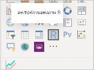
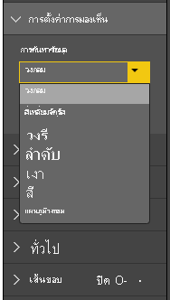

# <a name="tutorial-create-an-r-powered-power-bi-visual"></a>บทช่วยสอน: สร้าง วิชวล Power BI แบบ R

บทช่วยสอนนี้อธิบายถึงวิธีการสร้างวิชวลแบบ R สำหรับ Power BI

ในบทช่วยสอนนี้ คุณจะเรียนรู้วิธีการ:

> [!div class="checklist"]
>
> * สร้างวิชวลแบบ R
> * แก้ไขวิชวลแบบ R ใน Power BI Desktop
> * เพิ่มไลบรารีไปยังวิชวล
> * เพิ่มคุณสมบัติแบบคงที่

## <a name="prerequisites"></a>ข้อกำหนดเบื้องต้น

* บัญชี **Power BI Pro** [ลงทะเบียนทดลองใช้ฟรี](https://powerbi.microsoft.com/pricing/) ก่อนที่คุณจะเริ่มต้น
* โปรแกรม R คุณสามารถดาวน์โหลดและติดตั้งได้ฟรีจากตำแหน่งที่ตั้งต่างๆ ซึ่งรวมถึง [หน้าดาวน์โหลด Revolution Open](https://mran.revolutionanalytics.com/download/) และ [CRAN Repository](https://cran.r-project.org/bin/windows/base/) สำหรับข้อมูลเพิ่มเติมดู [สร้างวิชวล Power BI โดยใช้ภาษา R](../../desktop-r-visuals.md)
* [Power BI Desktop](../../fundamentals/desktop-get-the-desktop.md).
* [Windows PowerShell](https://docs.microsoft.com/powershell/scripting/install/installing-windows-powershell?view=powershell-6) เวอร์ชัน 4 หรือใหม่กว่าสำหรับผู้ใช้ Windows หรือ [Terminal](https://macpaw.com/how-to/use-terminal-on-mac) สำหรับผู้ใช้ OSX

## <a name="getting-started"></a>เริ่มต้นใช้งาน

1. เตรียมข้อมูลตัวอย่างสำหรับวิชวล คุณสามารถบันทึกค่าเหล่านี้ลงในฐานข้อมูล Excel หรือไฟล์ *.csv* และนำเข้าไปยัง Power BI Desktop ได้

    | MonthNo | ผลรวมหน่วย |
    |-----|-----|
    | 1 | 2303 |
    | 2 | 2319 |
    | 3 | 1732 |
    | 4 | 1615 |
    | 5 | 1427 |
    | 6 | 2253 |
    | 7 | 1147 |
    | 8 | 1515 |
    | 9 | 2516 |
    | 10 | 3131 |
    | 11 | 3170 |
    | 12 | 2762 |

1. หากต้องการสร้างวิชวล เปิด PowerShell หรือ Terminal และเรียกใช้คำสั่งต่อไปนี้:

   ```cmd
   pbiviz new rVisualSample -t rvisual
   ```

   คำสั่งนี้สร้างโครงสร้างโฟลเดอร์ใหม่โดยยึดตามเทมเพลต `rvisual` เทมเพลตนี้มีวิชวลแบบ R ในแบบพื้นฐานที่พร้อมใช้งาน ซึ่งเรียกใช้สคริปต์ R ต่อไปนี้:

   ```r
   plot(Values)
   ```

   เฟรมข้อมูล `Values` จะประกอบด้วยคอลัมน์ในบทบาทข้อมูล `Values`

1. กำหนดข้อมูลไปยังวิชวลของนักพัฒนาโดยการเพิ่ม **MonthNo** และ **หน่วยทั้งหมด** ไปยัง **ค่า** สำหรับวิชวล

   

## <a name="editing-the-r-script"></a>การแก้ไขสคริปต์ R

เมื่อคุณใช้ `pbiviz` เพื่อสร้างวิชวลแบบ R ที่ยึดตามเทมเพลต `rvisual` จะมีการสร้างไฟล์ชื่อว่า *script.r* ในโฟลเดอร์รากของวิชวล ไฟล์นี้มีสคริปต์ R ที่ใช้งานเพื่อสร้างรูปภาพสำหรับผู้ใช้ คุณสามารถสร้างสคริปต์ R ได้ใน Power BI Desktop

1. ใน Power BI Desktop เลือก **วิชวลสคริปต์ R**:

   

1. วางโค้ด R นี้ลงใน **ตัวแก้ไขสคริปต์ R**:

    ```r
    x <- dataset[,1] # get the first column from dataset
    y <- dataset[,2] # get the second column from dataset

    columnNames = colnames(dataset) # get column names

    plot(x, y, type="n", xlab=columnNames[1], ylab=columnNames[2]) # draw empty plot with axis and labels only
    lines(x, y, col="green") # draw line plot
    ```

1. เลือกไอคอน **เรียกใช้สคริปต์** เพื่อดูผลลัพธ์

    

1. เมื่อสคริปต์ R ของคุณพร้อมแล้ว ให้คัดลอกไปยังไฟล์ `script.r` ในโครงการวิชวลของคุณที่สร้างขึ้นในหนึ่งในขั้นตอนก่อนหน้านี้

1. เปลี่ยน `name` ของ `dataRoles` ใน *capabilities.json* เป็น `dataRoles` Power BI ส่งผ่านข้อมูลเป็นวัตถุเฟรมข้อมูล `dataset` สำหรับวิชวลสคริปต์ R แต่วิชวล R ได้รับชื่อเฟรมข้อมูลตามชื่อ `dataRoles`

    ```json
    {
      "dataRoles": [
        {
          "displayName": "Values",
          "kind": "GroupingOrMeasure",
          "name": "dataRoles"
        }
      ],
      "dataViewMappings": [
        {
          "scriptResult": {
            "dataInput": {
              "table": {
                "rows": {
                  "select": [
                    {
                      "for": {
                        "in": "dataset"
                      }
                    }
                  ],
                  "dataReductionAlgorithm": {
                    "top": {}
                  }
                }
              }
            },
            ...
          }
        }
      ],
    }
    ```

1. เพิ่มโค้ดต่อไปนี้เพื่อรองรับการปรับขนาดรูปภาพในไฟล์ *src/visual.ts*

    ```typescript
      public onResizing(finalViewport: IViewport): void {
          this.imageDiv.style.height = finalViewport.height + "px";
          this.imageDiv.style.width = finalViewport.width + "px";
          this.imageElement.style.height = finalViewport.height + "px";
          this.imageElement.style.width = finalViewport.width + "px";
      }
    ```

## <a name="add-libraries-to-visual-package"></a>เพิ่มไลบรารีไปยังแพคเกจวิชวล

ขั้นตอนนี้อนุญาตให้วิชวลของคุณใช้แพคเกจ `corrplot`

1. เพิ่มการขึ้นต่อกันของไลบรารีสำหรับวิชวลของคุณไปยัง `dependencies.json` ต่อไปนี้เป็นตัวอย่างของเนื้อหาไฟล์:

    ```json
    {
      "cranPackages": [
        {
          "name": "corrplot",
          "displayName": "corrplot",
          "url": "https://cran.r-project.org/web/packages/corrplot/"
        }
      ]
    }
    ```

    แพคเกจ `corrplot` คือการแสดงผลกราฟของเมทริกซ์ความสัมพันธ์ สำหรับข้อมูลเพิ่มเติมเกี่ยวกับ `corrplot` ดู [แนะนำแพคเกจ corrplot](https://cran.r-project.org/web/packages/corrplot/vignettes/corrplot-intro.html)

1. หลังจากที่คุณทำการเปลี่ยนแปลงเหล่านี้แล้ว ให้เริ่มต้นใช้แพคเกจในไฟล์ `script.r` ของคุณ

    ```r
    library(corrplot)
    corr <- cor(dataset)
    corrplot(corr, method="circle", order = "hclust")
    ```

ผลลัพธ์ของการใช้แพคเกจ `corrplot` มีลักษณะดังตัวอย่างนี้:


## <a name="adding-a-static-property-to-the-property-pane"></a>การเพิ่มคุณสมบัติแบบคงที่ลงในบานหน้าต่างคุณสมบัติ

อนุญาตให้ผู้ใช้เปลี่ยนการตั้งค่า UI เมื่อต้องการทำเช่นนี้ ให้เพิ่มคุณสมบัติไปยังบานหน้าต่างคุณสมบัติที่เปลี่ยนลักษณะการทำงานตามการป้อนข้อมูลผู้ใช้ของสคริปต์ R

คุณสามารถกำหนดค่า `corrplot` ได้โดยใช้อาร์กิวเมนต์ `method` สำหรับฟังก์ชัน `corrplot` สคริปต์เริ่มต้นใช้วงกลม ปรับเปลี่ยนวิชวลของคุณเพื่อให้ผู้ใช้สามารถเลือกระหว่างตัวเลือกต่างๆ

1. กำหนดวัตถุและคุณสมบัติในไฟล์ *capabilities.json* จากนั้นใช้ชื่อวัตถุนี้ในวิธีการแจงนับเพื่อรับค่าเหล่านั้นจากบานหน้าต่างคุณสมบัติ

    ```json
    {
      "settings": {
      "displayName": "Visual Settings",
      "description": "Settings to control the look and feel of the visual",
      "properties": {
        "method": {
          "displayName": "Data Look",
          "description": "Control the look and feel of the data points in the visual",
          "type": {
            "enumeration": [
              {
                "displayName": "Circle",
                "value": "circle"
              },
              {
                "displayName": "Square",
                "value": "square"
              },
              {
                "displayName": "Ellipse",
                "value": "ellipse"
              },
              {
                "displayName": "Number",
                "value": "number"
              },
              {
                "displayName": "Shade",
                "value": "shade"
              },
              {
                "displayName": "Color",
                "value": "color"
              },
              {
                "displayName": "Pie",
                "value": "pie"
              }
            ]
          }
        }
      }
    }
    ```

1. เปิดไฟล์*src/settings.ts* สร้างคลาส `CorrPlotSettings` ด้วยคุณสมบัติสาธารณะ `method` ชนิดคือ `string` และค่าเริ่มต้นคือ `circle` เพิ่มคุณสมบัติ `settings` ไปยังคลาส `VisualSettings` ด้วยค่าเริ่มต้น:

    ```typescript
    "use strict";

    import { dataViewObjectsParser } from "powerbi-visuals-utils-dataviewutils";
    import DataViewObjectsParser = dataViewObjectsParser.DataViewObjectsParser;

    export class VisualSettings extends DataViewObjectsParser {
      public rcv_script: rcv_scriptSettings = new rcv_scriptSettings();
      public settings: CorrPlotSettings = new CorrPlotSettings();
    }

    export class CorrPlotSettings {
      public method: string = "circle";
    }

    export class rcv_scriptSettings {
      public provider;
      public source;
    }
    ```

    หลังจากขั้นตอนเหล่านี้ คุณสามารถเปลี่ยนคุณสมบัติของวิชวลได้

   

    สุดท้าย สคริปต์ R ต้องเริ่มต้นด้วยคุณสมบัติ ถ้าผู้ใช้ไม่เปลี่ยนแปลงคุณสมบัติ วิชวลจะไม่ได้รับค่าใดๆ สำหรับคุณสมบัตินี้

    สำหรับตัวแปรรันไทม์ R สำหรับคุณสมบัติ หลักการตั้งชื่อคือ `<objectname>_<propertyname>` ในกรณีนี้ `settings_method`

1. เปลี่ยนสคริปต์ R ในวิชวลของคุณเพื่อให้ตรงกับโค้ดต่อไปนี้:

    ```r
    library(corrplot)
    corr <- cor(dataset)

    if (!exists("settings_method"))
    {
        settings_method = "circle";
    }

    corrplot(corr, method=settings_method, order = "hclust")
    ```

วิชวลสุดท้ายของคุณมีลักษณะดังต่อไปนี้:


## <a name="next-steps"></a>ขั้นตอนถัดไป

หากต้องการเรียนรู้เพิ่มเติมเกี่ยวกับวิชวลแบบ R ดูที่ [ใช้วิชวล Power BI แบบ R ใน Power BI](../../desktop-r-powered-custom-visuals.md)

สำหรับข้อมูลเพิ่มเติมเกี่ยวกับวิชวลแบบ R ใน Power BI Desktop ดูที่ [สร้างวิชวล Power BI โดยใช้ R](../../desktop-r-visuals.md)
