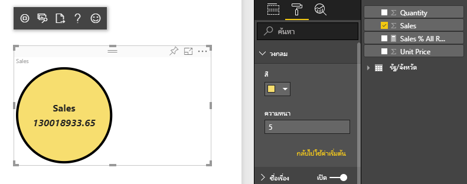
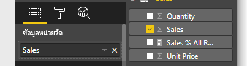
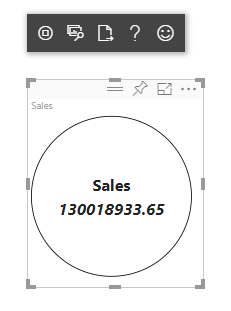

# <a name="tutorial-create-a-react-based-visual"></a>บทช่วยสอน: สร้างวิชวลตาม React

บทช่วยสอนนี้อธิบายวิธีการสร้างวิชวล Power BI โดยใช้ [React](https://reactjs.org/) วิชวลแสดงค่าในวงกลม วิชวลมีขนาดและการตั้งค่าที่สามารถปรับเปลี่ยนได้เพื่อให้สามารถกำหนดเองได้ ด้วยข้อมูลในบทความนี้ คุณสามารถสร้างวิชวล Power BI ของคุณเองได้ด้วย React



ในบทช่วยสอนนี้ คุณจะเรียนรู้วิธีการ:

> [!div class="checklist"]
>
> * ตั้งค่าสภาพแวดล้อมการพัฒนาของคุณ
> * สร้างวิชวล React
> * กำหนดค่าความสามารถสำหรับวิชวล
> * แสดงข้อมูลจาก Power BI
> * ปรับขนาดวิชวล
> * ทำให้วิชวลสามารถปรับแต่งได้

## <a name="prerequisites"></a>ข้อกำหนดเบื้องต้น

* บัญชี **Power BI Pro** [ลงทะเบียนทดลองใช้ฟรี](https://powerbi.microsoft.com/pricing/) ก่อนที่คุณจะเริ่มต้น
* [Visual Studio Code](https://www.visualstudio.com/)
* [Windows PowerShell](https://docs.microsoft.com/powershell/scripting/install/installing-windows-powershell?view=powershell-6) เวอร์ชัน 4 หรือใหม่กว่าสำหรับผู้ใช้ windows หรือ [Terminal](https://macpaw.com/how-to/use-terminal-on-mac) สำหรับผู้ใช้ OSX
* สภาพแวดล้อมตามที่อธิบายไว้ใน [การตั้งค่าสภาพแวดล้อมของนักพัฒนา](custom-visual-develop-tutorial.md#setting-up-the-developer-environment)

## <a name="getting-started"></a>เริ่มต้นใช้งาน

เมื่อต้องการเริ่มต้น ให้สร้างวิชวล Power BI แบบมินิมอลโดยใช้ `pbiviz` สำหรับข้อมูลเพิ่มเติมเกี่ยวกับโครงการและโครงสร้างของโครงการ โปรดดู [โครงสร้างโครงการวิชวล Power BI](visual-project-structure.md) สำหรับโค้ดแหล่งที่มาแบบเต็มของวิชวลนี้ โปรดดู [Circle Card React Visual](https://github.com/Microsoft/powerbi-visuals-circlecard-react)

คุณสามารถลอกแบบหรือดาวน์โหลดแหล่งที่มาแบบเต็มของวิชวลจาก [GitHub](https://github.com/Microsoft/powerbi-visuals-circlecard-react)

1. เปิด PowerShell และเรียกใช้คำสั่งต่อไปนี้:

   ```powershell
   pbiviz new ReactCircleCard
   ```

   คำสั่งสร้างโฟลเดอร์ที่ชื่อว่า *ReactCircleCard*

1. เปลี่ยนไดเรกทอรีไปยังโฟลเดอร์นั้นและเปิด Visual Studio Code

   ```powershell
   cd ./ReactCircleCard
   code .
   ```

1. เริ่มต้นเซิร์ฟเวอร์สำหรับนักพัฒนาสำหรับวิชวลของคุณ

   ```powershell
   pbiviz start
   ```

   

วิชวลพื้นฐานนี้แสดงถึงจำนวนการอัปเดต ลองแปลงเป็นการ์ดวงกลมในขั้นตอนถัดไป

## <a name="change-the-visual-to-a-circle-card"></a>เปลี่ยนวิชวลเป็นการ์ดวงกลม

วิชวลพื้นฐานนี้แสดงถึงจำนวนการอัปเดต ถัดไป แปลงเป็นการ์ดวงกลมซึ่งแสดงถึงหน่วยวัดและชื่อเรื่อง

1. เรียกใช้คำสั่งต่อไปนี้เพื่อติดตั้งการอ้างอิงที่จำเป็น:

   ```powershell
   npm i react react-dom
   ```

1. เรียกใช้คำสั่งต่อไปนี้เพื่อติดตั้ง React 16 และเวอร์ชันที่เกี่ยวข้องของ `react-dom` และการพิมพ์:

   ```powershell
   npm i @types/react @types/react-dom
   ```

1. สร้าง class ของคอมโพเนนต์ React ใน Visual Studio Code เลือก **ไฟล์** > **ไฟล์ใหม่** คัดลอกโค้ดต่อไปนี้ลงในไฟล์

    ```typescript
    import * as React from "react";

    export class ReactCircleCard extends React.Component<{}>{
        render(){
            return (
                <div className="circleCard">
                    Hello, React!
                </div>
            )
        }
    }

    export default ReactCircleCard;
    ```

1. เลือก **บันทึกเป็น** ไปยังไดเรกทอรี *src* ใส่ชื่อ *คอมโพเนนต์* สำหรับ **บันทึกเป็นชนิด** เลือก **TypeScript React**

1. เปิด *src/visual.ts* แทนที่โค้ดปัจจุบันด้วยโค้ดต่อไปนี้:

    ```typescript
    "use strict";
    import powerbi from "powerbi-visuals-api";

    import DataView = powerbi.DataView;
    import VisualConstructorOptions = powerbi.extensibility.visual.VisualConstructorOptions;
    import VisualUpdateOptions = powerbi.extensibility.visual.VisualUpdateOptions;
    import IVisual = powerbi.extensibility.visual.IVisual;

    import "./../style/visual.less";

    export class Visual implements IVisual {

        constructor(options: VisualConstructorOptions) {

        }

        public update(options: VisualUpdateOptions) {

        }
    }
    ```

1. นำเข้าการอ้างอิง React และคอมโพเนนต์ที่คุณเพิ่งเพิ่ม

    ```typescript
    import * as React from "react";
    import * as ReactDOM from "react-dom";
    ...
    import ReactCircleCard from "./component";
    ```

   การตั้งค่าเริ่มต้นของ Power BI TypeScript ไม่รองรับไฟล์ *tsx* ของ React Visual Studio Code ไฮไลท์ `component` เป็นข้อผิดพลาด

1. เปิดไฟล์ *tsconfig.json* และเพิ่มสองบรรทัดไปยังจุดเริ่มต้นของรายการ `compilerOptions`

    ```json
    {
      "compilerOptions": {
        "jsx": "react",
        "types": ["react", "react-dom"],
        //...
      }
    }
    ```

   ข้อผิดพลาดใน `component` ควรหายไป

   เมื่อต้องการแสดงคอมโพเนนต์ ให้เพิ่มองค์ประกอบเป้าหมาย HTML องค์ประกอบนี้คือ `HTMLElement` ใน `VisualConstructorOptions` ซึ่งจะถูกส่งผ่านไปยังคอนสตรักเตอร์

1. ปรับเปลี่ยน class `Visual` ดังในโค้ดต่อไปนี้:

    ```typescript
      private target: HTMLElement;
      private reactRoot: React.ComponentElement<any, any>;

      constructor(options: VisualConstructorOptions) {
          this.reactRoot = React.createElement(ReactCircleCard, {});
          this.target = options.element;

          ReactDOM.render(this.reactRoot, this.target);
      }
    ```

1. บันทึกการเปลี่ยนแปลงและเรียกใช้โค้ดที่มีอยู่ด้วยคำสั่งนี้:

    ```bash
    pbiviz start
    ```

   > [!NOTE]
   > ถ้าคุณเรียกใช้ `pbiviz`ก่อนหน้านี้ คุณต้องเริ่มต้นใหม่เพื่อทำการเปลี่ยนแปลงใน *tsconfig.json*

  

## <a name="configure-capabilities"></a>กำหนดค่าความสามารถ

คุณสามารถกำหนดค่าความสามารถของวิชวลได้

1. เปิด `capabilities.json` ลบวัตถุ `Category Data` ออกจาก `dataRoles` `ReactCircleCard` จะแสดงเพียงค่าเดียว ดังนั้นเราจำเป็นต้องมี `Measure Data` เท่านั้น ในตอนนี้คีย์ `dataRoles` มีลักษณะดังนี้:

    ```json
    "dataRoles": [
        {
            "displayName": "Measure Data",
            "name": "measure",
            "kind": "Measure"
        }
    ],
    ```

1. ลบเนื้อหาทั้งหมดของคีย์ `objects` ออก คุณจะใส่ข้อมูลลงในภายหลัง

    ```json
        "objects": {},
    ```

1. คัดลอกโค้ดของคุณสมบัติ `dataViewMappings` ต่อไปนี้ ค่าของ `max: 1` หมายความว่าสามารถส่งได้เพียงหนึ่งคอลัมน์หน่วยวัดเท่านั้น

    ```json
        "dataViewMappings": [
            {
                "conditions": [
                    {
                        "measure": {
                            "max": 1
                        }
                    }
                ],
                "single": {
                    "role": "measure"
                }
            }
        ]
    ```

ในตอนนี้คุณสามารถนำข้อมูลจากบานหน้าต่าง `Fields` ลงในการตั้งค่าวิชวลได้



## <a name="receive-properties-from-power-bi"></a>รับคุณสมบัติจาก Power BI

คุณสามารถแสดงผลข้อมูลโดยใช้ React คอมโพเนนต์สามารถแสดงข้อมูลจากสถานะของตนเอง

1. ปรับเปลี่ยน *src/component.tsx*

    ```javascript
    export interface State {
        textLabel: string,
        textValue: string
    }

    export const initialState: State = {
        textLabel: "",
        textValue: ""
    }

    export class ReactCircleCard extends React.Component<{}, State>{
        constructor(props: any){
            super(props);
            this.state = initialState;
        }

        render(){
            const { textLabel, textValue } = this.state;

            return (
                <div className="circleCard">
                    <p>
                        {textLabel}
                        <br/>
                        <em>{textValue}</em>
                    </p>
                </div>
            )
        }
    }
    ```

1. เพิ่มสไตล์สำหรับมาร์กอัปใหม่โดยการแก้ไข *styles/visual.less*

    ```css
    .circleCard {
        position: relative;
        box-sizing: border-box;
        border: 1px solid #000;
        border-radius: 50%;
        width: 200px;
        height: 200px;
    }

    p {
        text-align: center;
        line-height: 30px;
        font-size: 20px;
        font-weight: bold;

        position: relative;
        top: -30px;
        margin: 50% 0 0 0;
    }
    ```

1. วิชวลได้รับข้อมูลปัจจุบันเป็นอาร์กิวเมนต์ของวิธีการ `update` เปิด *src/visual.ts* และเพิ่มโค้ดไปยัง `ReactCircleCard.update`

    ```typescript
    //...
    import { ReactCircleCard, initialState } from "./component";
    //...

    export class Visual implements IVisual {
        //...
        public update(options: VisualUpdateOptions) {

            if(options.dataViews && options.dataViews[0]){
                const dataView: DataView = options.dataViews[0];

                ReactCircleCard.update({
                    textLabel: dataView.metadata.columns[0].displayName,
                    textValue: dataView.single.value.toString()
                });
            }
            } else {
                this.clear();
            }
        }

        private clear() {
            ReactCircleCard.update(initialState);
        }
    }
    ```

    โค้ดเลือก `textLabel` และ `textValue` จาก `DataView` และถ้ามีข้อมูลอยู่ ให้อัปเดตสถานะคอมโพเนนต์

1. หากต้องการส่งการอัปเดตไปยังอินสแตนซ์คอมโพเนนต์ ให้ใส่โค้ดต่อไปนี้ใน class `ReactCircleCard`:

    ```typescript
        private static updateCallback: (data: object) => void = null;

        public static update(newState: State) {
            if(typeof ReactCircleCard.updateCallback === 'function'){
                ReactCircleCard.updateCallback(newState);
            }
        }

        public state: State = initialState;

        public componentWillMount() {
            ReactCircleCard.updateCallback = (newState: State): void => { this.setState(newState); };
        }

        public componentWillUnmount() {
            ReactCircleCard.updateCallback = null;
        }
    ```

1. ทดสอบวิชวล ตรวจสอบให้แน่ใจว่ามีการเรียกใช้ `pbiviz start` และบันทึกไฟล์ทั้งหมด รีเฟรชวิชวล

   

## <a name="make-component-resizable"></a>ทำให้คอมโพเนนต์สามารถปรับขนาดได้

ในส่วนนี้ คุณจะทำให้คอมโพเนนต์สามารถปรับขนาดได้ ในขณะนี้ คอมโพเนนต์มีความกว้างและความสูงคงที่

รับขนาดปัจจุบันของวิวพอร์ตวิชวลจากวัตถุ `options`

1. เปิด *src/visual.ts* นำเข้าอินเทอร์เฟซ `IViewport` และเพิ่มคุณสมบัติ `viewport` ไปยัง class `visual`

    ```typescript
    import IViewport = powerbi.IViewport;

    //...

    export class Visual implements IVisual {
        private viewport: IViewport;
        //...
    }
    ```

1. เพิ่มโค้ดต่อไปนี้ไปยังวิธี `update` ของ `visual`

    ```typescript
      if (options.dataViews && options.dataViews[0]) {
          const dataView: DataView = options.dataViews[0];

          this.viewport = options.viewport;
          const { width, height } = this.viewport;
          const size = Math.min(width, height);

          ReactCircleCard.update({
              size,
              //...
          });
      }
    ```

1. เพิ่มคุณสมบัติไปยังอินเทอร์เฟซ `State` ใน *src/component.tsx*

    ```typescript
    export interface State {
        //...
        size: number
    }

    const initialState: State = {
        //...
        size: 200
    }
    ```

1. ทำการเปลี่ยนแปลงต่อไปนี้ในวิธีการ `render` ใน *src/component.tsx*:

    ```typescript
        render() {
            const { textLabel, textValue, size } = this.state;

            const style: React.CSSProperties = { width: size, height: size };

            return (
                <div className="circleCard" style={style}>
                    {/* ... */}
                </div>
            )
        }
    ```

1. แทนที่ `width` และกฎ `height` ในรูปแบบ *style/visual.less* ด้วย `min-width` และ `min-height`

    ```css
        min-width: 200px;
        min-height: 200px;
    ```

ในตอนนี้คุณสามารถปรับขนาดวิวพอร์ตได้ เส้นผ่านศูนย์กลางของวงกลมสอดคล้องกับขนาดที่น้อยที่สุดตามความกว้างหรือความสูง

## <a name="make-your-power-bi-visual-customizable"></a>ทำให้วิชวล Power BI ของคุณสามารถปรับแต่งได้

ในส่วนนี้ คุณจะทำให้วิชวลสามารถปรับแต่งได้

1. เปิด *capabilities.json* เพิ่มการตั้งค่าต่อไปนี้ลงในคุณสมบัติ `objects`

    ```json
    //...
        "objects": {
            "circle": {
                "displayName": "Circle",
                "properties": {
                    "circleColor": {
                        "displayName": "Color",
                        "description": "The fill color of the circle.",
                        "type": {
                            "fill": {
                                "solid": {
                                    "color": true
                                }
                            }
                        }
                    },
                    "circleThickness": {
                        "displayName": "Thickness",
                        "description": "The circle thickness.",
                        "type": {
                            "numeric": true
                        }
                    }
                }
            }
        },
    //...
    ```

1. แทนที่โค้ดที่มีอยู่ใน *src/settings.ts* ด้วยโค้ดนี้:

    ```typescript
    "use strict";

    import { dataViewObjectsParser } from "powerbi-visuals-utils-dataviewutils";
    import DataViewObjectsParser = dataViewObjectsParser.DataViewObjectsParser;

    export class CircleSettings {
        public circleColor: string = "white";
        public circleThickness: number = 2;
    }

    export class VisualSettings extends DataViewObjectsParser {
        public circle: CircleSettings = new CircleSettings();
    }
    ```

1. เพิ่มคำสั่ง `import` เหล่านี้ที่ด้านบนของ *src/visual.ts*:

    ```typescript
    import VisualObjectInstance = powerbi.VisualObjectInstance;
    import EnumerateVisualObjectInstancesOptions = powerbi.EnumerateVisualObjectInstancesOptions;
    import VisualObjectInstanceEnumerationObject = powerbi.VisualObjectInstanceEnumerationObject;

    import { VisualSettings } from "./settings";

    ```

1. เพิ่มวิธีการ `enumerateObjectInstances` ไปยัง *src/visual.ts* วิธีการนี้ใช้เพื่อตั้งค่าวิชวล

    ```typescript
    export class Visual implements IVisual {
        private settings: VisualSettings;

        //...

        public enumerateObjectInstances(
            options: EnumerateVisualObjectInstancesOptions
        ): VisualObjectInstance[] | VisualObjectInstanceEnumerationObject {

            return VisualSettings.enumerateObjectInstances(this.settings || VisualSettings.getDefault(), options);
        }
    }
    ```

1. เพิ่มโค้ดเพื่อให้วัตถุ `dataView` สามารถรับการตั้งค่าได้ในขณะนี้

    ```typescript
        public update(options: VisualUpdateOptions) {

            if(options.dataViews && options.dataViews[0]){
                //...
                this.settings = VisualSettings.parse(dataView) as VisualSettings;
                const object = this.settings.circle;

                ReactCircleCard.update({
                    borderWidth: object && object.circleThickness ? object.circleThickness : undefined,
                    background: object && object.circleColor ? object.circleColor : undefined,
                    //...
                });
            }
        }
    }
    ```

1. นำการเปลี่ยนแปลงที่เกี่ยวข้องมาใช้กับ *src/component.tsx* เริ่มต้นโดยการเพิ่มค่าเหล่านี้ไปยัง `State`:

    ```typescript
    export interface State {
        //...
        background?: string,
        borderWidth?: number
    }
    ```

1. จากนั้นจึงเพิ่มโค้ดต่อไปนี้ไปยังวิธีการ `render`:

    ```typescript
        const { /*...*/ background, borderWidth } = this.state;

        const style: React.CSSProperties = { /*...*/ background, borderWidth };
    ```

    

## <a name="next-steps"></a>ขั้นตอนถัดไป

สำหรับข้อมูลเพิ่มเติมเกี่ยวกับการพัฒนา Power BI ดู [คำแนะนำสำหรับวิชวล Power BI](guidelines-powerbi-visuals.md) และ [วิชวลใน Power BI](power-bi-visuals-concept.md)