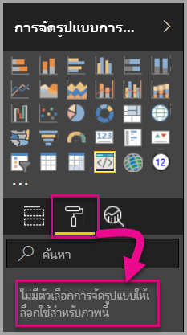
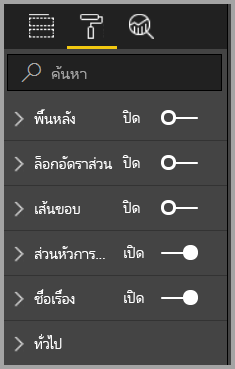
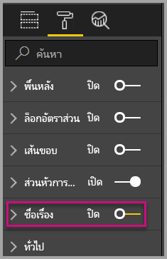
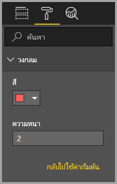
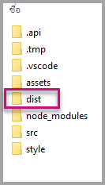
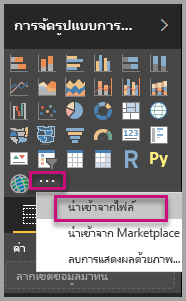
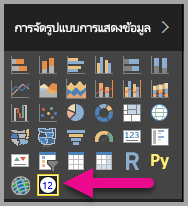

# <a name="tutorial-adding-formatting-options-to-a-power-bi-visual"></a>บทช่วยสอน: การเพิ่มตัวเลือกการจัดรูปแบบให้กับวิชวลแบบกำหนดเองของ Power BI

ในบทช่วยสอนนี้ เราจะได้ดูวิธีการเพิ่มคุณสมบัติทั่วไปให้กับวิชวล

ในบทช่วยสอนนี้ คุณจะเรียนรู้วิธีการ:
> [!div class="checklist"]
> * เพิ่มคุณสมบัติวิชวล
> * แพคเกจวิชวล
> * นำเข้าวิชวลแบบกำหนดเองไปยังรายงาน Power BI Desktop

## <a name="adding-formatting-options"></a>เพิ่มตัวเลือกการจัดรูปแบบ

1. เลือก **หน้าการจัดรูปแบบ** ใน **Power BI**

    คุณจะเห็นข้อความแสดงว่า -*ตัวเลือกการจัดรูปแบบสำหรับวิชวลนี้ไม่พร้อมใช้งาน*

    

2. เปิดไฟล์ *capabilities.json* ใน**รหัส Visual Studio**

3. เพิ่ม**วัตถุ**(หลังบรรทัดที่ 8) ก่อนอาร์เรย์ **dataViewMappings**

    ```json
    "objects": {},
    ```

    

4. บันทึกไฟล์ **capabilities.json**

5. ตรวจทานตัวเลือกการจัดรูปแบบอีกครั้งใน**Power BI**

    > [!Note]
    > ถ้าคุณไม่เห็นการเปลี่ยนแปลงในตัวเลือกการจัดรูปแบบ โปรดเลือก**โหลดวิชวลแบบกำหนดเองอีกครั้ง**

    

6. ตั้งค่าตัวเลือก **ชื่อเรื่อง** เป็น *ปิด* โปรดสังเกตว่าวิชวลหยุดแสดงชื่อหน่วยวัดที่มุมบนซ้ายแล้ว

    

    

### <a name="adding-custom-formatting-options"></a>การเพิ่มตัวเลือกการจัดรูปแบบแบบกำหนดเอง

คุณอาจเพิ่มคุณสมบัติแบบกำหนดเองเพื่อเปิดใช้งานการกำหนดค่าสีของวงกลม และความกว้างเส้นขอบได้

1. หยุดวิชวลแบบกำหนดเอง ใน PowerShell

2. แทรกส่วนย่อย JSON ลงในออบเจ็กต์ที่ระบุชื่อว่า**ออบเจ็กต์** ในแฟ้ม**capabilities.json** สำหรับ Visual Studio Code

    ```json
        {
            "circle": {
                "displayName": "Circle",
                "properties": {
                    "circleColor": {
                        "displayName": "Color",
                        "description": "The fill color of the circle.",
                        "type": {
                            "fill": {
                                "solid": {
                                    "color": true
                                }
                            }
                        }
                    },
                    "circleThickness": {
                        "displayName": "Thickness",
                        "description": "The circle thickness.",
                        "type": {
                            "numeric": true
                        }
                    }
                }
            }
        }
    ```

    ส่วนย่อย JSON จะอธิบายเกี่ยวกับกลุ่มที่ชื่อวงกลม ซึ่งประกอบด้วยตัวเลือกสองตัวที่ชื่อว่า circleColor และ circleThickness

   

3. บันทึกไฟล์ **capabilities.json**

4. ใน **แผง Explorer**จากด้านในโฟลเดอร์**src** และจากนั้นเลือก**settings.ts** *ไฟล์นี้แสดงการตั้งค่าสำหรับวิชวลเริ่มต้น*

5. ในไฟล์ **settings.ts** ให้แทนที่คลาสทั้งสองด้วยรหัสต่อไปนี้

    ```typescript
    export class CircleSettings {
        public circleColor: string = "white";
        public circleThickness: number = 2;
    }
    export class VisualSettings extends DataViewObjectsParser {
        public circle: CircleSettings = new CircleSettings();
    }
    ```

    

    โมดูลนี้จะกำหนดคลาสสองคลาส คลาส **CircleSettings** จะกำหนดคุณสมบัติไว้สองอย่าง ด้วยชื่อที่ตรงกับวัตถุที่กำหนดไว้ในไฟล์ **capabilities.json** (**circleColor** และ  **circleThickness**) และกำหนดค่าเริ่มต้นด้วย คลาส **VisualSettings** จะรับช่วงมาจากคลาส **DataViewObjectParser** และเพิ่มคุณสมบัติชื่อ **วงกลม** ซึ่งจะตรงกับวัตถุที่กำหนดไว้ในไฟล์ *capabilities.json* และส่งกลับอินสแตนซ์ของ **CircleSettings**

6. บันทึกไฟล์ **settings.ts**

7. เปิดไฟล์ **visual.ts**

8. ในไฟล์ **visual.ts**

    นำเข้า `VisualSettings`, `VisualObjectInstanceEnumeration` และ `EnumerateVisualObjectInstancesOptions`:

    ```typescript
    import { VisualSettings } from "./settings";
    import VisualObjectInstanceEnumeration = powerbi.VisualObjectInstanceEnumeration;
    import EnumerateVisualObjectInstancesOptions = powerbi.EnumerateVisualObjectInstancesOptions;
    ```

    และเพิ่มคุณสมบัติต่อไปนี้ในคลาส **วิชวล**:

    ```typescript
    private visualSettings: VisualSettings;
    ```

    คุณสมบัตินี้จะจัดเก็บค่าอ้างอิงไปยังวัตถุ **VisualSettings**ซึ่งอธิบายการตั้งค่าวิชวล

    

9. เพิ่มวิธีการต่อไปนี้ก่อนวิธี **อัปเดต** ในคลาส **วิชวล** วิธีนี้ใช้เพื่อรวบรวมตัวเลือกการจัดรูปแบบ

    ```typescript
    public enumerateObjectInstances(options: EnumerateVisualObjectInstancesOptions): VisualObjectInstanceEnumeration {
        const settings: VisualSettings = this.visualSettings || <VisualSettings>VisualSettings.getDefault();
        return VisualSettings.enumerateObjectInstances(settings, options);
    }
    ```

    วิธีนี้ใช้เพื่อรวบรวมตัวเลือกการจัดรูปแบบ

    

10. ในวิธี **อัปเดต** หลังจากยืนยันตัวแปร **รัศมี** แล้ว ให้เพิ่มรหัสต่อไปนี้

    ```typescript
    this.visualSettings = VisualSettings.parse<VisualSettings>(dataView);

    this.visualSettings.circle.circleThickness = Math.max(0, this.visualSettings.circle.circleThickness);
    this.visualSettings.circle.circleThickness = Math.min(10, this.visualSettings.circle.circleThickness);
    ```

    รหัสนี้จะเรียกใช้ตัวเลือกการจัดรูปแบบ โดยจะปรับเปลี่ยนค่าใดๆ ที่ส่งผ่านไปยังคุณสมบัติ **circleThickness** โดยแปลงค่านั้นเป็น 0 ถ้าเป็นค่าลบ หรือแปลงเป็น 10 ถ้ามีค่ามากกว่า 10

    

11. สำหรับ**องค์ประกอบวงกลม** ให้ปรับเปลี่ยนค่าที่ส่งผ่านไปยัง**เติมสไตล์** ให้เป็นนิพจน์ต่อไปนี้

    ```typescript
    this.visualSettings.circle.circleColor
    ```

    

12. สำหรับ**องค์ประกอบวงกลม** ให้ปรับเปลี่ยนค่าที่ส่งผ่านไปยัง**ลักษณะความกว้างเส้น** ให้เป็นนิพจน์ต่อไปนี้

    ```typescript
    this.visualSettings.circle.circleThickness
    ```

    

13. บันทึกไฟล์ visual.ts

14. เริ่มวิชวล ใน PowerShell

    ```powershell
    pbiviz start
    ```

15. เลือก**ปิดเปิดการรีโหลดอัตโนมัติ** ในแถบเครื่องมือที่ลอยอยู่เหนือวิชวล ใน**Power BI**

16. ขยาย**วงกลม** ในตัวเลือก **การจัดรูปแบบวิชวล**

    

    ปรับเปลี่ยนตัวเลือก **สี** และ **ความหนา**

    ปรับเปลี่ยนตัวเลือก **ความหนา** ให้เป็นค่าที่น้อยกว่าศูนย์ และค่าที่สูงกว่า 10 จากนั้นโปรดสังเกตว่าวิชวลได้อัปเดตค่าให้เป็นค่าจำกัดต่ำสุดหรือสูงสุด

## <a name="packaging-the-custom-visual"></a>การแพคเกจวิชวลแบบกำหนดเอง

ป้อนค่าคุณสมบัติให้โครงการของวิชวลแบบกำหนดเอง อัปเดตไฟล์ไอคอน และจากนั้นจึงแพคเกจวิชวลแบบกำหนดเอง

1. หยุดวิชวลแบบกำหนดเอง ใน **PowerShell**

2. เปิดไฟล์ **pbiviz.json** ใน **รหัส Visual Studio**

3. ในวัตถุ **วิชวล** ให้ปรับเปลี่ยนคุณสมบัติ **displayName** เป็น *การ์ดวงกลม*

    ในแผง **การแสดงภาพ** ที่ลอยอยู่เหนือไอคอน จะปรากฏชื่อที่แสดง

    

4. สำหรับคุณสมบัติ **คำอธิบาย** ให้ใส่ข้อความต่อไปนี้

    *แสดงค่าการวัดที่จัดรูปแบบแล้วภายในวงกลม*

5. กรอห **supportUrl** และ **gitHubUrl** สำหรับการแสดงผลด้วยภาพ

    ตัวอย่าง:

    ```json
    {
        "supportUrl": "https://community.powerbi.com",
        "gitHubUrl": "https://github.com/microsoft/PowerBI-visuals-circlecard"
    }
    ```

6. กรอกรายละเอียดของคุณในวัตถุ **ผู้เขียน**

7. บันทึกไฟล์ **pbiviz.json**

8. ในวัตถุ **แอสเซท** โปรดสังเกตว่า ส่วนเอกสารจะกำหนดเส้นทางให้กับไอคอน ไอคอนนั้นคือรูปภาพที่ปรากฏในแผง **_การแสดงภาพ_** โดยต้องเป็นไฟล์**PNG** *20 พิกเซล คูณ 20 พิเซล*

9. ใน Windows Explorer ให้คัดลอกไฟล์ icon.png และวาง เพื่อแทนที่ไฟล์เริ่มต้นที่อยู่ในโฟลเดอร์แอสเซท

10. ในรหัส Visual Studio ในแผง Explorer ให้ขยายโฟลเดอร์แอสเซท จากนั้น เลือกไฟล์ icon.png

11. ตรวจทานไอคอน

    

12. ในรหัส Visual Studio ให้ยืนยันว่าไฟล์ทั้งหมดได้รับการบันทึกแล้ว

13. เมื่อต้องการแพคเกจวิชวลแบบกำหนดเอง ใน PowerShell ให้ป้อนคำสั่งต่อไปนี้

    ```powershell
    pbiviz package
    ```

    

ในตอนนี้แพคเกจก็ส่งออกไปยังโฟลเดอร์**แจกจ่าย**ของโครงการแล้ว ตัวแพคเกจจะมีทุกอย่างที่จำเป็นต้องใช้ในการนำเข้าวิชวลแบบกำหนดเองไปยังบริการของ Power BI หรือรายงาน Power BI Desktop ตอนนี้คุณก็มีวิชวลแบบกำหนดเองที่ทำการแพคเกจแล้ว และพร้อมใช้งาน

## <a name="importing-the-custom-visual"></a>การนำเข้าวิชวลแบบกำหนดเอง

ในตอนนี้คุณสามารถเปิดรายงาน Power BI Desktop และนำเข้าวิชวลแบบกำหนดเองของการ์ดวงกลมได้แล้ว

1. เปิด **Power BI Desktop** และสร้างรายงานใหม่ด้วย*ชุดข้อมูลตัวอย่าง*

2. ในแผง **_การแสดงภาพ_** ให้เลือกแบบ **จุดไข่ปลา** แล้ว เลือก **นำเข้า** จากไฟล์

    

3. ใน**หน้าต่างการนำเข้า** ให้เลือก**นำเข้า**

4. ในหน้าต่างการเปิด ให้ไปยังโฟลเดอร์**แจกจ่าย** ในไดเรกทอรีโครงการของคุณ

5. เลือกไฟล์ **circleCard.pbiviz** แล้วเลือก **เปิด**

6. เมื่อนำเข้าวิชวลสำเร็จเรียบร้อยแล้ว ให้เลือก**ตกลง**

7. ตรวจสอบว่ามีการเพิ่มวิชวลไปยังแผง **_การแสดงภาพ_**

    

8. ไปที่เหนือไอคอน **การ์ดวงกลม** แล้วสังเกตที่คำแนะนำเครื่องมือที่ปรากฏขึ้น

## <a name="debugging"></a>การดีบัก

สำหรับเคล็ดลับเกี่ยวกับการดีบักวิชวลแบบกำหนดเองของคุณ ดู[คู่มือการแก้จุดบกพร่อง](https://microsoft.github.io/PowerBI-visuals/docs/how-to-guide/how-to-debug/)

## <a name="next-steps"></a>ขั้นตอนถัดไป

คุณสามารถแสดงวิชวลที่ปรับปรุงใหม่ของคุณเพื่อให้บุคคลอื่นได้ใช้งานโดยการส่งไป **AppSource** สำหรับข้อมูลเพิ่มเติมเกี่ยวกับกระบวนการนี้ กรุณาอ้างอิง [เผยแพร่วิชวลแบบกำหนดเองลงใน AppSource](office-store.md)
