# <a name="tutorial-developing-a-power-bi-visual"></a>บทช่วยสอน: การพัฒนาวิชวลสำหรับ Power BI

เรากำลังเปิดให้นักพัฒนาเพิ่มวิชวลแบบกำหนดเองเข้าใน Power BI ได้อย่างง่ายดาย เพื่อนำไปใช้ในแดชบอร์ดและรายงาน เพื่อช่วยให้คุณเริ่มใช้งานได้ เราได้เผยแพร่รหัสสำหรับการแสดงภาพทั้งหมดไว้ใน GitHub

และนอกจาก Framework การแสดงภาพแล้ว เรายังให้ชุดการทดสอบและเครื่องมือไว้ด้วย เพื่อช่วยชุมชนในการสร้างวิชวลแบบกำหนดเองคุณภาพสูงสำหรับ Power BI

บทช่วยสอนนี้จะแสดงวิธีการพัฒนาวิชวลแบบกำหนดเองของ Power BI ที่ชื่อว่าการ์ดวงกลม เพื่อแสดงค่าการวัดที่จัดรูปแบบแล้วภายในวงกลม วิชวลการ์ดวงกลมรองรับการกำหนดสีที่เติมและความหนาของเส้นรอบนอก

ในรายงานของ Power BI Desktop การ์ดจะได้รับการปรับเปลี่ยนเพื่อให้เป็นการ์ดวงกลม

  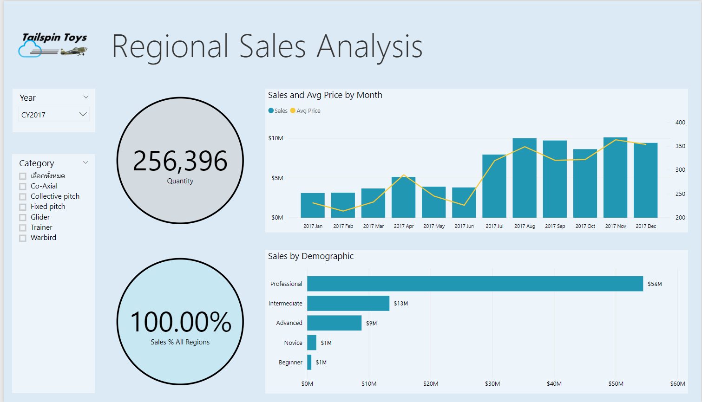

ในบทช่วยสอนนี้ คุณจะเรียนรู้วิธีการ:
> [!div class="checklist"]
> * สร้างวิชวลแบบกำหนดเองของ Power BI
> * พัฒนาวิชวลแบบกำหนดเองด้วยองค์ประกอบวิชวล D3
> * กำหนดค่าการผูกข้อมูลด้วยองค์ประกอบวิชวล
> * จัดรูปแบบค่าข้อมูล

## <a name="prerequisites"></a>ข้อกำหนดเบื้องต้น

* ถ้าคุณยังไม่ได้ลงทะเบียนสำหรับ **Power BI Pro**[ลงทะเบียนทดลองใช้ฟรี](https://powerbi.microsoft.com/pricing/)ก่อนที่คุณจะเริ่ม
* คุณต้องใช้[รหัส Visual Studio](https://www.visualstudio.com/)ที่ติดตั้งแล้ว
* คุณจำเป็นต้องมี [Windows PowerShell](https://docs.microsoft.com/powershell/scripting/install/installing-windows-powershell?view=powershell-6)เวอร์ชัน 4 หรือใหม่กว่าสำหรับผู้ใช้ windows หรือ[เทอร์มินัล](https://macpaw.com/how-to/use-terminal-on-mac)สำหรับผู้ใช้ OSX

## <a name="setting-up-the-developer-environment"></a>การตั้งค่าสภาพแวดล้อมสำหรับนักพัฒนา

นอกเหนือจากเครื่องมือเบื้องต้น ยังมีเครื่องมือที่คุณต้องติดตั้งเพิ่มอีกสองหรือสามตัว

### <a name="installing-nodejs"></a>การติดตั้ง node.js

1. เมื่อต้องการติดตั้ง Node.js ในเว็บเบราว์เซอร์ ให้ไปที่[Node.js](https://nodejs.org)

2. ดาวน์โหลดตัวติดตั้ง MSI ฟีเจอร์ตัวล่าสุด

3. เรียกใช้ตัวติดตั้ง และจากนั้นทำตามขั้นตอนการติดตั้ง ยอมรับเงื่อนไขตามข้อตกลงอนุญาตใช้สิทธิ์และข้อกำหนดเริ่มต้นทั้งหมด

   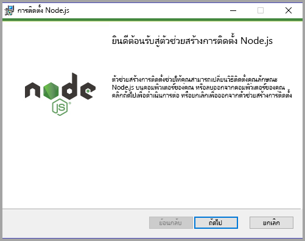

4. เริ่มระบบของคอมพิวเตอร์ใหม่

### <a name="installing-packages"></a>การติดตั้งแพคเกจ

ในตอนนี้คุณต้องติดตั้งแพคเกจ **pbiviz**

1. เปิด Windows PowerShell หลังจากที่เริ่มระบบคอมพิวเตอร์ใหม่แล้ว

2. เมื่อต้องการติดตั้ง pbiviz ให้ป้อนคำสั่งต่อไปนี้

    ```powershell
    npm i -g powerbi-visuals-tools
    ```

### <a name="creating-and-installing-a-certificate"></a>การสร้างและติดตั้งใบรับรอง

#### <a name="windows"></a>Windows

1. เมื่อต้องการสร้างและติดตั้งใบรับรอง ให้ป้อนคำสั่งต่อไปนี้

    ```powershell
    pbiviz --install-cert
    ```

    จะเป็นการส่งกลับผลลัพธ์ที่สร้าง *วลีรหัสผ่าน* ในกรณีนี้ *วลีรหัสผ่าน*คือ **_15105661266553327_** นอกจากนี้ยังเริ่มต้นตัวช่วยสร้างการนำเข้าใบรับรอง

    

2. ในตัวช่วยสร้างการนำเข้าใบรับรอง ให้ตรวจสอบยืนยันว่าตำแหน่งที่เก็บอยู่ที่ผู้ใช้ปัจจุบัน จากนั้นเลือก*ถัดไป*

      

3. ที่ขั้นตอน**ไฟล์เพื่อนำเข้า** ให้เลือก*ถัดไป*

4. ที่ขั้นตอน**ป้องกันคีย์ส่วนตัว** ในกล่องรหัสผ่าน ให้วางวลีรหัสผ่านที่คุณได้รับจากการสร้างใบรับรอง  และในกรณีนี้คือ **_15105661266553327_**

      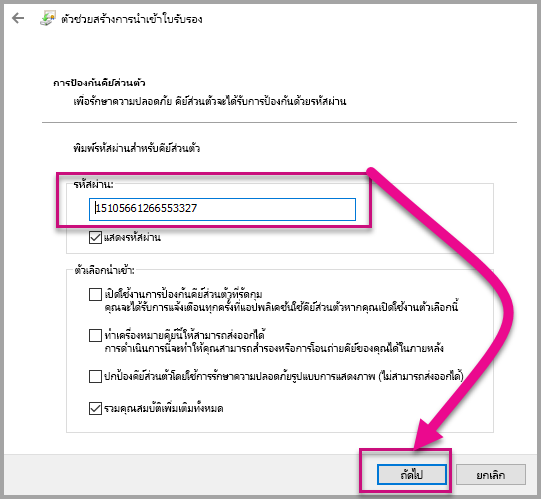

5. ที่ขั้นตอน**ที่เก็บใบรับรอง** ให้เลือกตัวเลือก**วางใบรับรองทั้งหมดในที่เก็บต่อไปนี้** จากนั้นให้เลือก*เรียกดู*

      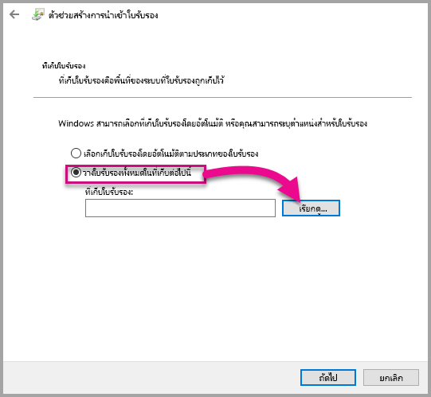

6. ในหน้าต่าง**เลือกที่เก็บใบรับรอง** ให้เลือก**ผู้ออกใบรับรองหลักที่เชื่อถือได้** จากนั้นเลือก *ตกลง* แล้วเลือก*ถัดไป*บนหน้าจอ**ที่เก็บใบรับรอง**

      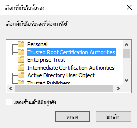

7. เลือก**เสร็จสิ้น**เพื่อจบการนำเข้า

8. ถ้าคุณได้รับคำเตือนด้านความปลอดภัย ให้เลือก**ใช่**

    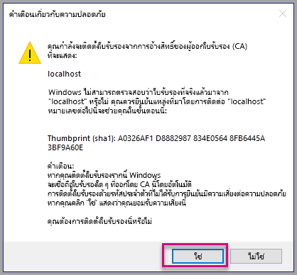

9. เมื่อได้รับแจ้งว่าการนำเข้าเสร็จเรียบร้อย ให้เลือก**ตกลง**

    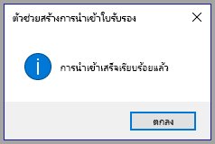

> [!Important]
> อย่าปิดเซสชัน Windows PowerShell

#### <a name="osx"></a>OSX

1. ถ้าล็อกมุมบนซ้ายถูกล็อค เลือกเพื่อปลดล็อก ค้นหา *localhost* และดับเบิลคลิกที่ใบรับรอง

    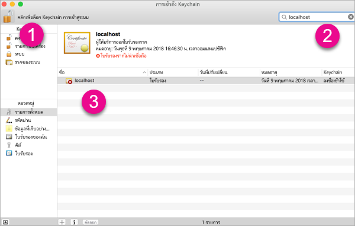

2. เลือก**เชื่อถือเสมอ**และปิดหน้าต่าง

    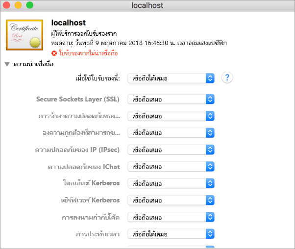

3. ใส่ชื่อผู้ใช้และรหัสผ่านของคุณ เลือก**อัพเดทการตั้งค่า**

    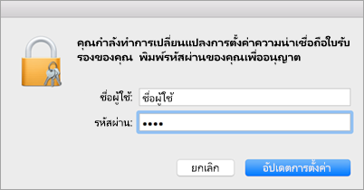

4. ปิดทุกเบราว์เซอร์ที่คุณเปิดอยู่

> [!NOTE]
> ถ้าเบราว์เซอร์ยังไม่รู้จักใบรับรอง คุณอาจจำเป็นต้องรีสตาร์ตคอมพิวเตอร์ของคุณ

## <a name="creating-a-custom-visual"></a>การสร้างวิชวลแบบกำหนดเองได้

ในตอนนี้คุณได้ตั้งค่าสภาพแวดล้อมแล้ว ถึงตอนนี้ให้สร้างวิชวลแบบกำหนดเอง

คุณสามารถ[ดาวน์โหลด](https://github.com/Microsoft/PowerBI-visuals-circlecard)รหัสต้นทางแบบเต็มสำหรับบทช่วยสอนนี้ได้

1. ้ตรวจสอบว่า มีการติดตั้งแพคเกจเครื่องมือวิชวลของ Power BI แล้ว

    ```powershell
    pbiviz
    ```
    คุณควรเห็นการแสดงผลความช่วยเหลือ

    <pre><code>
        +syyso+/
    oms/+osyhdhyso/
    ym/       /+oshddhys+/
    ym/              /+oyhddhyo+/
    ym/                     /osyhdho
    ym/                           sm+
    ym/               yddy        om+
    ym/         shho /mmmm/       om+
        /    oys/ +mmmm /mmmm/       om+
    oso  ommmh +mmmm /mmmm/       om+
    ymmmy smmmh +mmmm /mmmm/       om+
    ymmmy smmmh +mmmm /mmmm/       om+
    ymmmy smmmh +mmmm /mmmm/       om+
    +dmd+ smmmh +mmmm /mmmm/       om+
            /hmdo +mmmm /mmmm/ /so+//ym/
                /dmmh /mmmm/ /osyhhy/
                    //   dmmd
                        ++

        PowerBI Custom Visual Tool

    Usage: pbiviz [options] [command]

    Commands:

    new [name]        Create a new visual
    info              Display info about the current visual
    start             Start the current visual
    package           Package the current visual into a pbiviz file
    update [version]  Updates the api definitions and schemas in the current visual. Changes the version if specified
    help [cmd]        display help for [cmd]

    Options:

    -h, --help      output usage information
    -V, --version   output the version number
    --install-cert  Install localhost certificate
    </code></pre>

    <a name="ssl-setup"></a>

2. ตรวจทานผลลัพธ์ รวมถึงรายการคำสั่งที่ได้รับการสนับสนุน

    

3. ในการสร้างโครงการวิชวลแบบกำหนดเอง ให้ป้อนคำสั่งต่อไปนี้ **CircleCard** คือชื่อของโครงการ

    ```PowerShell
    pbiviz new CircleCard
    ```
    

    > [!Note]
    > คุณสร้างโครงการใหม่ที่ตำแหน่งที่ตั้งปัจจุบันของพร้อมท์

4. ไปยังโฟลเดอร์โครงการ

    ```powershell
    cd CircleCard
    ```
5. เริ่มวิชวลแบบกำหนดเอง วิชวล CircleCard ของคุณกำลังทำงาน พร้อมกับได้รับการโฮสต์บนคอมพิวเตอร์

    ```powershell
    pbiviz start
    ```

    

> [!Important]
> อย่าปิดเซสชัน Windows PowerShell

### <a name="testing-the-custom-visual"></a>การทดสอบวิชวลแบบกำหนดเอง

ในส่วนนี้ เราจะทำการทดสอบวิชวลแบบกำหนดเองของ CircleCard โดยการอัปโหลดรายงาน Power BI Desktop จากนั้นทำการแก้ไขรายงานเพื่อให้แสดงวิชวลแบบกำหนดเอง

1. ลงชื่อเข้าใช้[PowerBI.com](https://powerbi.microsoft.com/) > ไปที่**ไอคอนรูปเฟือง** > แล้วเลือก**การตั้งค่า**

      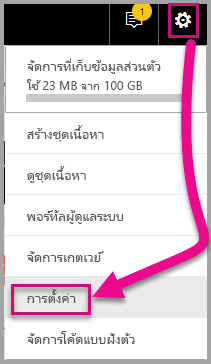

2. เลือก**นักพัฒนา** แล้วทำเครื่องหมายที่กล่อง**เปิดใช้งานวิชวลนักพัฒนาสำหรับการทดสอบ**

    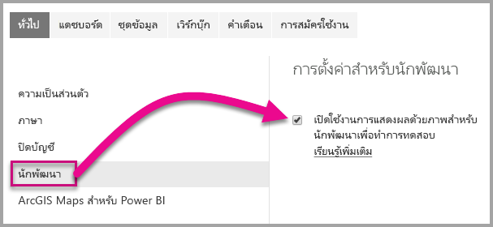

3. อัปโหลดรายงาน Power BI Desktop  

    รับข้อมูล > ไฟล์ > ไฟล์ภายในเครื่อง

    คุณสามารถ[ดาวน์โหลด](https://microsoft.github.io/PowerBI-visuals/docs/step-by-step-lab/images/US_Sales_Analysis.pbix)รายงาน Power BI Desktop ตัวอย่างได้ ถ้าคุณไม่ได้สร้างไว้ก่อนแล้ว

    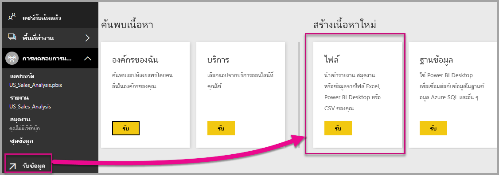 

    เมื่อต้องการดูรายงานในตอนนี้ ให้เลือก **US_Sales_Analysis** จากส่วน**รายงาน** ในบานหน้าต่างนำทางด้านซ้าย

    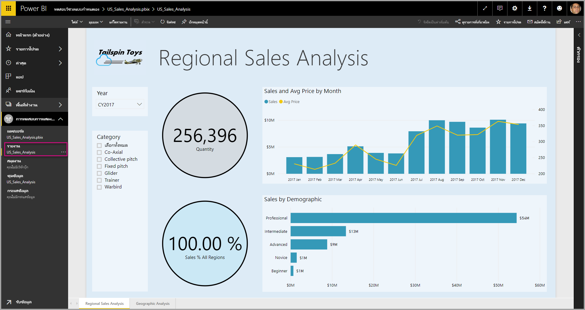

4. ในตอนนี้คุณต้องแก้ไขรายงานขณะที่อยู่ในการบริการของ Power BI

    ไปที่ **แก้ไขรายงาน**

    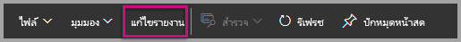

5. เลือก**วิชวลนักพัฒนา**ในแผง**การแสดงภาพ**

    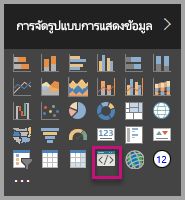

    > [!Note]
    > การแสดงภาพนี้จะแสดงวิชวลแบบกำหนดเอง ที่คุณได้เริ่มไว้แล้วบนคอมพิวเตอร์ ซึ่งจะพร้อมใช้งานเมื่อมีการเปิดใช้งานการตั้งค่านักพัฒนา

6. โปรดสังเกตว่าการแสดงภาพเพิ่มไปยังพื้นที่รายงานแล้ว

    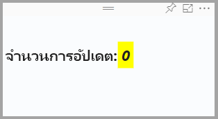

    > [!Note]
    > นี่คือวิชวลอย่างง่ายที่แสดงจำนวนครั้งที่มีการเรียกวิธีการอัปเดต ในขั้นตอนนี้ วิชวลยังไม่ได้เรียกข้อมูลใด

7. ในระหว่างการเลือกวิชวลใหม่ในรายงาน ให้ไปที่แผงเขตข้อมูล > ขยายส่วนยอดขาย > เลือกส่วนปริมาณ

    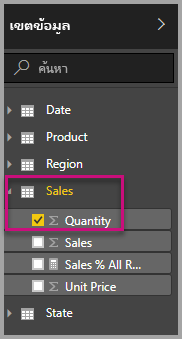

8. และเมื่อต้องการทดสอบวิชวลใหม่ ให้ปรับขนาดวิชวลและสังเกตดูการเพิ่มค่าการอัปเดต

    

เมื่อต้องการหยุดวิชวลแบบกำหนดเองที่ทำงานอยู่ใน PowerShell ให้ป้อน Ctrl+C เมื่อได้รับการแจ้งให้ระงับชุดงาน ให้ป้อน Y แล้วกด Enter

## <a name="adding-visual-elements"></a>การเพิ่มองค์ประกอบวิชวล

ในตอนนี้คุณต้องติดตั้ง **ไลบรารี JavaScript D3** D3 คือไลบรารี JavaScript สำหรับการผลิตการแสดงภาพข้อมูลเชิงโต้ตอบแบบไดนามิก ในเว็บเบราว์เซอร์ ซึ่งเป็นการใช้มาตรฐาน SVG HTML5 และ CSS ที่นำมาใช้อย่างกว้างขวาง

ในตอนนี้คุณสามารถพัฒนาวิชวลแบบกำหนดเองเพื่อแสดงวงกลมพร้อมข้อความได้แล้ว

> [!Note]
> สามารถคัดลอกรายการข้อความจำนวนมากในบทช่วยสอนนี้ได้จาก [ที่นี่](https://github.com/Microsoft/powerbi-visuals-circlecard)

1. เมื่อต้องการติดตั้ง**ไลบรารี D3**ใน PowerShell ให้ป้อนคำสั่งด้านล่าง

    ```powershell
    npm i d3@^5.0.0 --save
    ```

    ```powershell
    PS C:\circlecard>npm i d3@^5.0.0 --save
    + d3@5.11.0
    added 179 packages from 169 contributors and audited 306 packages in 33.25s
    found 0 vulnerabilities

    PS C:\circlecard>
    ```

2. เมื่อต้องการติดตั้งคำจำกัดความประเภทสำหรับ**ไลบรารี D3** ให้ป้อนคำสั่งด้านล่าง

    ```powershell
    npm i @types/d3@^5.0.0 --save
    ```

    ```powershell
    PS C:\circlecard>npm i @types/d3@^5.0.0 --save
    + @types/d3@5.7.2
    updated 1 package and audited 306 packages in 2.217s
    found 0 vulnerabilities

    PS C:\circlecard>
    ```

    คำสั่งนี้จะติดตั้งคำจำกัดความของ TypeScript ตามไฟล์ JavaScript ซึ่งเป็นการเปิดให้คุณพัฒนาวิชวลแบบกำหนดเองใน TypeScript (ซึ่งเป็นเซตใหญ่ของ JavaScript) รหัส Visual Studio คือ IDE ในอุดมคติเพื่อพัฒนาแอปพลิเคชัน TypeScript

3. เมื่อต้องการติดตั้ง**core-js**ใน PowerShell ให้ป้อนคำสั่งด้านล่าง

    ```powershell
    npm i core-js@3.2.1 --save
    ```

    ```powershell
    PS C:\circlecard> npm i core-js@3.2.1 --save

    > core-js@3.2.1 postinstall F:\circlecard\node_modules\core-js
    > node scripts/postinstall || echo "ignore"

    Thank you for using core-js ( https://github.com/zloirock/core-js ) for polyfilling JavaScript standard library!

    The project needs your help! Please consider supporting of core-js on Open Collective or Patreon:
    > https://opencollective.com/core-js
    > https://www.patreon.com/zloirock

    + core-js@3.2.1
    updated 1 package and audited 306 packages in 6.051s
    found 0 vulnerabilities

    PS C:\circlecard>
    ```

    คำสั่งนี้จะติดตั้งไลบรารีมาตรฐานแบบโมดูลาร์สำหรับ JavaScript ซึ่งรวมถึง polyfills สำหรับ ECMAScript ที่อัปถึงปี 2019 อ่านเพิ่มเติมเกี่ยวกับ[`core-js`](https://www.npmjs.com/package/core-js)

4. เมื่อต้องการติดตั้ง**powerbi-visual-api**ใน PowerShell ให้ป้อนคำสั่งด้านล่าง

    ```powershell
    npm i powerbi-visuals-api --save-dev
    ```

    ```powershell
    PS C:\circlecard>npm i powerbi-visuals-api --save-dev

    + powerbi-visuals-api@2.6.1
    updated 1 package and audited 306 packages in 2.139s
    found 0 vulnerabilities

    PS C:\circlecard>
    ```

    คำสั่งนี้จะติดตั้งข้อกำหนด API ของวิชวล Power BI

5. เปิดใช้งาน [รหัส Visual Studio](https://code.visualstudio.com/)

    คุณสามารถเปิดใช้งาน **รหัส Visual Studio** จาก PowerShell โดยใช้คำสั่งต่อไปนี้ได้

    ```powershell
    code .
    ```

6. ใน**แผง Explorer** ให้ขยายโฟลเดอร์ **node_modules** เพื่อตรวจสอบยืนยันว่ามีการติดตั้ง **ไลบรารี D3**

    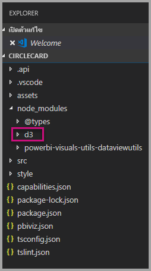

7. โปรดแน่ใจว่ามีการเพิ่มไฟล์ **index.d.ts** โดยการขยาย node_modules > @types > d3 ใน**แผง Explorer**

    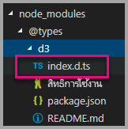

### <a name="developing-the-visual-elements"></a>การพัฒนาองค์ประกอบวิชวล

ในตอนนี้เราก็สามารถสำรวจวิธีพัฒนาวิชวลแบบกำหนดเองเพื่อแสดงวงกลมและข้อความตัวอย่างได้แล้ว

1. ใน**แผง Explorer** ให้ขยายโฟลเดอร์ **src** จากนั้นเลือก **visual.ts**

    > [!Note]
    > สังเกตดูข้อคิดเห็นที่ด้านบนของไฟล์ **visual.ts** ได้รับอนุญาตให้ใช้แพคเกจวิชวลแบบกำหนดเองของ Power BI โดยไม่เสียค่าใช้จ่าย ภายใต้ข้อกำหนดสิทธิ์การใช้งาน MIT คุณต้องออกจากข้อคิดเห็นที่ด้านบนของไฟล์ ตามส่วนหนึ่งของข้อตกลง

2. ลบตรรกะของวิชวลแบบกำหนดเองเริ่มต้นต่อไปนี้ออกจากคลาสวิชวล
    * การยืนยันตัวแปรส่วนตัวระดับคลาสทั้งสี่ครั้ง
    * บรรทัดทั้งหมดของรหัสจากคอนสตรักเตอร์
    * บรรทัดทั้งหมดของรหัสจากวิธีอัปเดต
    * บรรทัดที่เหลืออยู่ทั้งหมดภายในโมดูล รวมถึงวิธี parseSettings และ enumerateObjectInstances

    ตรวจสอบยืนยันว่ารหัสโมดูลมีลักษณะดังต่อไปนี้

    ```typescript
    "use strict";
    import "core-js/stable";
    import "../style/visual.less";
    import powerbi from "powerbi-visuals-api";
    import IVisual = powerbi.extensibility.IVisual;
    import VisualConstructorOptions = powerbi.extensibility.visual.VisualConstructorOptions;
    import VisualUpdateOptions = powerbi.extensibility.visual.VisualUpdateOptions;
    import EnumerateVisualObjectInstancesOptions = powerbi.EnumerateVisualObjectInstancesOptions;
    import VisualObjectInstanceEnumeration = powerbi.VisualObjectInstanceEnumeration;
    import IVisualHost = powerbi.extensibility.visual.IVisualHost;

    import * as d3 from "d3";
    type Selection<T extends d3.BaseType> = d3.Selection<T, any,any, any>;

    export class Visual implements IVisual {

        constructor(options: VisualConstructorOptions) {

        }

        public update(options: VisualUpdateOptions) {

        }
    }
    ```

3. ภายใต้การยืนยันคลาส*วิชวล* ให้แทรกคุณสมบัติระดับคลาสต่อไปนี้

    ```typescript
    export class Visual implements IVisual {
        // ...
        private host: IVisualHost;
        private svg: Selection<SVGElement>;
        private container: Selection<SVGElement>;
        private circle: Selection<SVGElement>;
        private textValue: Selection<SVGElement>;
        private textLabel: Selection<SVGElement>;
        // ...
    }
    ```

    

4. เพิ่มรหัสต่อไปนี้ไปยัง*คอนสตรักเตอร์*

    ```typescript
    this.svg = d3.select(options.element)
        .append('svg')
        .classed('circleCard', true);
    this.container = this.svg.append("g")
        .classed('container', true);
    this.circle = this.container.append("circle")
        .classed('circle', true);
    this.textValue = this.container.append("text")
        .classed("textValue", true);
    this.textLabel = this.container.append("text")
        .classed("textLabel", true);
    ```

    รหัสนี้จะเพิ่มกลุ่ม SVG ภายในวิชวล และจากนั้นเพิ่มรูปร่างสามรูป: วงกลมและองค์ประกอบข้อความสองอัน

    เพื่อจัดรูปแบบรหัสในเอกสาร ให้คลิกขวาที่ตำแหน่งใดก็ได้ใน**เอกสารรหัส Visual Studio** จากนั้นเลือก**จัดรูปแบบเอกสาร**

      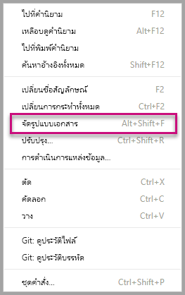

    เพื่อปรับปรุงให้อ่านง่ายขึ้น ขอแนะนำให้จัดรูปแบบเอกสารทุกครั้งที่วางส่วนย่อยของรหัส

5. เพิ่มรหัสต่อไปนี้ไปยังวิธี*อัปเดต*

    ```typescript
    let width: number = options.viewport.width;
    let height: number = options.viewport.height;
    this.svg.attr("width", width);
    this.svg.attr("height", height);
    let radius: number = Math.min(width, height) / 2.2;
    this.circle
        .style("fill", "white")
        .style("fill-opacity", 0.5)
        .style("stroke", "black")
        .style("stroke-width", 2)
        .attr("r", radius)
        .attr("cx", width / 2)
        .attr("cy", height / 2);
    let fontSizeValue: number = Math.min(width, height) / 5;
    this.textValue
        .text("Value")
        .attr("x", "50%")
        .attr("y", "50%")
        .attr("dy", "0.35em")
        .attr("text-anchor", "middle")
        .style("font-size", fontSizeValue + "px");
    let fontSizeLabel: number = fontSizeValue / 4;
    this.textLabel
        .text("Label")
        .attr("x", "50%")
        .attr("y", height / 2)
        .attr("dy", fontSizeValue / 1.2)
        .attr("text-anchor", "middle")
        .style("font-size", fontSizeLabel + "px");
    ```

    *รหัสนี้จะตั้งความกว้างและความสูงของวิชวล จากนั้นจะเตรียมใช้งานคุณลักษณะและรูปแบบขององค์ประกอบวิชวล*

6. บันทึกไฟล์ **visual.ts**

7. บันทึกไฟล์ **capabilities.json**

    ที่บรรทัด 14 เอาองค์ประกอบวัตถุทั้งหมดออก (บรรทัดที่ 14- 60)

8. บันทึกไฟล์ **capabilities.json**

9. เริ่มวิชวลแบบกำหนดเองใน PowerShell

    ```powershell
    pbiviz start
    ```

### <a name="toggle-auto-reload"></a>สลับการโหลดโดยอัตโนมัติ

1. กลับไปยังรายงาน Power BI
2. เลือก **ปิดเปิดการรีโหลดอัตโนมัติ** ในแถบเครื่องมือที่ลอยอยู่เหนือวิชวลนักพัฒนา

    

    ตัวเลือกนี้จะยืนยันว่ามีการรีโหลดวิชวลโดยอัตโนมัติทุกครั้งที่คุณบันทึกการเปลี่ยนแปลงโครงการ

3. จาก**แผงเขตข้อมูล** ให้ลากเขตข้อมูล**ปริมาณ**เข้าไปในวิชวลนักพัฒนา

4. ตรวจสอบยืนยันว่าวิชวลมีลักษณะดังต่อไปนี้

    

5. ปรับขนาดวิชวล

    สังเกตว่าวงกลมและข้อความได้ขนาดพอดีกับมิติที่พร้อมใช้งานของวิชวล

    มีการเรียกวิธีการอัปเดตอย่างต่อเนื่อง พร้อมการปรับขนาดวิชวล และได้ผลเป็นการปรับมาตราของไหลซ้ำในองค์ประกอบวิชวล

    ในตอนนี้คุณได้ปรับปรุงองค์ประกอบวิชวลแล้ว

6. ใช้งานวิชวลต่อ

## <a name="process-data-in-the-visual-code"></a>ดำเนินการเกี่ยวกับข้อมูลในโค้ดวิชวล

กำหนดบทบาทข้อมูลและการแมปมุมมองข้อมูล จากนั้นปรับเปลี่ยน ตรรกะวิชวลแบบกำหนดเอง เพื่อแสดงค่าและชื่อที่แสดงของหน่วยวัด

### <a name="configuring-the-capabilities"></a>การกำหนดค่าความสามารถ

ปรับเปลี่ยนไฟล์ **capabilities.json** เพื่อกำหนดบทบาทข้อมูลและการแมปมุมมองข้อมูล

1. ในรหัส Visual Studio ในไฟล์ **capabilities.json** จากภายในอาร์เรย์ **dataRoles** ให้ลบเนื้อหาทั้งหมด (บรรทัดที่ 3-12)

2. ภายในอาร์เรย์ **dataRoles** ให้แทรกรหัสต่อไปนี้

    ```json
    {
        "displayName": "Measure",
        "name": "measure",
        "kind": "Measure"
    }
    ```

    ในตอนนี้อาร์เรย์ **dataRoles** จะกำหนดบทบาทข้อมูลเดี่ยวของประเภท**หน่วยวัด** ซึ่งเรียกว่า**หน่วยวัด** และจะแสดงเป็น**Measure** บทบาทข้อมูลนี้จะอนุญาตให้ทั้งเขตข้อมูลหน่วยวัดหรือเขตข้อมูลที่สรุปไว้ส่งผ่านได้

3. จากภายในอาร์เรย์ **dataViewMappings** ให้ลบเนื้อหาทั้งหมด (บรรทัดที่ 10-31)

4. ภายในอาร์เรย์ **dataViewMappings** ให้แทรกรหัสต่อไปนี้

    ```json
    {
        "conditions": [
            { "measure": { "max": 1 } }
        ],
        "single": {
            "role": "measure"
        }
    }
    ```

    ในตอนนี้อาร์เรย์ **dataViewMappings** จะกำหนดให้เขตข้อมูลหนึ่งสามารถส่งไปยังบทบาทข้อมูลที่ชื่อว่า**หน่วยวัด**ได้

5. บันทึกไฟล์ **capabilities.json**

6. ใน Power BI โปรดสังเกตว่าในตอนนี้วิชวลสามารถกำหนดค่าด้วย**หน่วยวัด**ได้แล้ว

    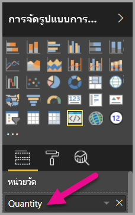

    > [!Note]
    > โครงการวิชวลยังไม่ได้รวมตรรกะการผูกข้อมูลเอาไว้

### <a name="exploring-the-dataview"></a>การสำรวจมุมมองข้อมูล

1. ในแถบเครื่องมือที่ลอยอยู่เหนือวิชวล ให้เลือก**แสดงมุมมองข้อมูล**

    

2. ขยายลงใน**เดี่ยว** และสังเกตดูค่า

    

3. ขยายลงใน**เมตาดาต้า** จากนั้นลงในอาร์เรย์**คอลัมน์** และสังเกตดูค่า**รูปแบบ**และ**ชื่อที่แสดง**โดยเฉพาะ

    

4. เมื่อต้องการสลับกลับไปที่วิชวล ในแถบเครื่องมือที่ลอยอยู่เหนือวิชวล ให้เลือก **แสดงมุมมองข้อมูล**

    

### <a name="consume-data-in-the-visual-code"></a>ดำเนินการเกี่ยวกับข้อมูลในโค้ดวิชวล

1. ใน **Visual Studio Code** ในไฟล์ **visual ts**

    นำเข้า`DataView`อินเทอร์เฟซจาก`powerbi`โมดูล

    ```typescript
    import DataView = powerbi.DataView;
    ```

    และให้เพิ่มรายงานต่อไปนี้เป็นรายงานแรกของวิธีอัปเดต

    ```typescript
    let dataView: DataView = options.dataViews[0];
    ```

    

    รายงานนี้กำหนด*มุมมองข้อมูล*กับตัวแปรเพื่อให้เข้าถึงได้ง่าย และยืนยันตัวแปรสำหรับอ้างอิงวัตถุ*dataView*

2. ในวิธี**อัปเดต** ให้แทนที่ **.text("Value")** ดังต่อไปนี้

    ```typescript
    .text(<string>dataView.single.value)
    ```

    

3. ในวิธี**อัปเดต** ให้แทนที่ **.text(“Label”)** ดังต่อไปนี้

    ```typescript
    .text(dataView.metadata.columns[0].displayName)
    ```

    

4. บันทึกไฟล์ **visual.ts**

5. ใน **Power BI** ให้ตรวจทานวิชวล ซึ่งตอนนี้จะแสดงค่าและชื่อที่แสดง

คุณได้กำหนดค่าให้บทบาทข้อมูลและผูกวิชวลเข้ากับมุมมองข้อมูลแล้ว

ในบทช่วยสอนถัดไป คุณจะได้เรียนรู้วิธีเพิ่มตัวเลือกการจัดรูปแบบเข้าวิชวลแบบกำหนดเอง

## <a name="debugging"></a>การดีบัก

สำหรับเคล็ดลับเกี่ยวกับการดีบักวิชวลแบบกำหนดเองของคุณ ดู[คู่มือการแก้จุดบกพร่อง](./visuals-how-to-debug.md#how-to-debug-power-bi-visuals)

## <a name="next-steps"></a>ขั้นตอนถัดไป

> [!div class="nextstepaction"]
> [การเพิ่มตัวเลือกการจัดรูปแบบ](custom-visual-develop-tutorial-format-options.md)
