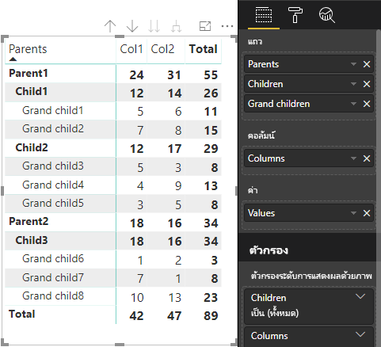

# <a name="understand-data-view-mapping-in-power-bi-visuals"></a>ทำความเข้าใจเกี่ยวกับการแมปมุมมองข้อมูลในวิชวล Power BI

บทความนี้อธิบายการแมปมุมมองข้อมูลและอธิบายว่าบทบาทข้อมูลเกี่ยวข้องกันอย่างไร และอนุญาตให้คุณระบุข้อกำหนดตามเงื่อนไขสำหรับพวกเขา บทความนี้ยังอธิบายประเภท `dataMappings` แต่ละประเภท

การแมปที่ถูกต้องแต่ละครั้งจะสร้างมุมมองข้อมูล แต่ขณะนี้เราสนับสนุนการดำเนินการคิวรัหนึ่งรายการต่อหนึ่งวิชวลเท่านั้น โดยปกติคุณจะได้รับมุมมองข้อมูลเดียวเท่านั้น อย่างไรก็ตาม คุณสามารถทำการแมปข้อมูลหลายรายการโดยมีเงื่อนไขเฉพาะได้ ซึ่งช่วยให้:

```json
"dataViewMappings": [
    {
        "conditions": [ ... ],
        "categorical": { ... },
        "single": { ... },
        "table": { ... },
        "matrix": { ... }
    }
]
```

Power BI สร้างการแมปไปยังมุมมองข้อมูล หากว่าและเฉพาะในกรณีที่มีการกรอกข้อมูลการแมปที่ถูกต้องลงใน `dataViewMappings` เท่านั้น

กล่าวอีกนัยหนึ่งคือ `categorical` อาจกำหนดใน `dataViewMappings` แต่การแมปอื่น เช่น `table` หรือ `single` อาจไม่เป็นเช่นนั้น ตัวอย่างเช่น:

```json
"dataViewMappings": [
    {
        "categorical": { ... }
    }
]
```

Power BI สร้างมุมมองข้อมูลด้วยการแมป `categorical` เดียว และการแมป `table` และการแมปอื่น ๆ ไม่ได้ถูกกำหนด:

```javascript
{
    "categorical": {
        "categories": [ ... ],
        "values": [ ... ]
    },
    "metadata": { ... }
}
```

## <a name="conditions"></a>เงื่อนไข

ส่วนนี้อธิบายเงื่อนไขสำหรับการแมปข้อมูลที่เฉพาะเจาะจง คุณสามารถระบุเงื่อนไขได้หลายชุด และถ้าข้อมูลตรงกับชุดของเงื่อนไขที่อธิบาย วิชวลจะยอมรับข้อมูลได้อย่างถูกต้อง

ในขณะนี้สำหรับแต่ละเขตข้อมูล คุณสามารถระบุค่าต่ำสุดและสูงสุดได้ ซึ่งค่าแสดงถึงจำนวนของเขตข้อมูลที่สามารถผูกกับบทบาทข้อมูลนั้นได้ 

> [!NOTE]
> หากคุณละเว้นบทบาทข้อมูลในเงื่อนไข ตัวเลขในเขตข้อมูลจะเป็นเท่าใดก็ได้

### <a name="example-1"></a>ตัวอย่าง 1

คุณสามารถลากเขตข้อมูลหลายรายการลงในแต่ละบทบาทข้อมูลได้ ในตัวอย่างนี้ คุณจำกัดประเภทด้วยหนึ่งเขตข้อมูล และหน่วยวัดด้วยสองเขตข้อมูล

```json
"conditions": [
    { "category": { "max": 1 }, "y": { "max": 2 } },
]
```

### <a name="example-2"></a>ตัวอย่าง 2

ในตัวอย่างนี้จำเป็นต้องใช้ทั้งสองเงื่อนไข:
* เขตข้อมูลประเภทหนึ่งรายการอย่างแน่นอนและหน่วยวัดสองรายการอย่างแน่นอน
* สองประเภทอย่างแน่นอนและหนึ่งหน่วยวัดอย่างแน่นอน

```json
"conditions": [
    { "category": { "min": 1, "max": 1 }, "measure": { "min": 2, "max": 2 } },
    { "category": { "min": 2, "max": 2 }, "measure": { "min": 1, "max": 1 } }
]
```

## <a name="single-data-mapping"></a>การแมปข้อมูลเดียว

การแมปข้อมูลเดี่ยวเป็นรูปแบบที่ง่ายที่สุดของการแมปข้อมูล ซึ่งเป็นการยอมรับเขตข้อมูลหน่วยวัดเดียวและให้ผลรวมแก่คุณ ถ้าเขตข้อมูลเป็นตัวเลขจะให้ผลรวมแก่คุณ มิฉะนั้นจะให้จำนวนของค่าที่ไม่ซ้ำกัน

หากต้องการใช้การแมปข้อมูลเดียว คุณจะต้องกำหนดชื่อของบทบาทข้อมูลที่คุณต้องการแมป การแมปนี้จะทำงานกับเขตข้อมูลหน่วยวัดเดียวเท่านั้น หากมีการกำหนดเขตข้อมูลที่สอง จะไม่มีการสร้างมุมมองข้อมูล ดังนั้นจึงเป็นแนวทางปฏิบัติที่ดีที่จะรวมเงื่อนไขที่จำกัดข้อมูลไว้ในเขตข้อมูลเดียว

> [!NOTE]
> การแมปข้อมูลนี้ไม่สามารถใช้ร่วมกับการแมปข้อมูลอื่น ๆ ได้ ซึ่งหมายถึงการลดข้อมูลลงไปเป็นค่าตัวเลขเดียว

### <a name="example-3"></a>ตัวอย่างที่ 3

```json
"dataViewMappings": {
    "conditions": [
        { "Y": { "max": 1 } }
    ],
    "single": {
        "role": "Y"
    }
}  
```

มุมมองข้อมูลที่เกิดขึ้นจะยังคงประกอบด้วยชนิดอื่นๆ (ตาราง จัดกลุ่ม ฯลฯ) แต่การแมปแต่ละครั้งจะมีเพียงค่าเดียวเท่านั้น แนวทางปฏิบัติที่ดีที่สุดคือ เข้าถึงเพียงแค่ค่าเดียว

```JSON
{
    "dataView": [
        {
            "metadata": null,
            "categorical": null,
            "matrix": null,
            "table": null,
            "tree": null,
            "single": {
                "value": 94163140.3560001
            }
        }
    ]
}
```

## <a name="categorical-data-mapping"></a>การแมปข้อมูลจัดกลุ่ม

การแมปข้อมูลจัดกลุ่มถูกใช้เพื่อให้ได้มาซึ่งการจัดกลุ่มข้อมูลอิสระหนึ่งหรือสองรายการ

### <a name="example-4"></a>ตัวอย่างที่ 4

นี่คือคำนิยามจากตัวอย่างก่อนหน้าสำหรับบทบาทข้อมูล:

```json
"dataRole":[
    {
        "displayName": "Category",
        "name": "category",
        "kind": "Grouping"
    },
    {
        "displayName": "Y Axis",
        "name": "measure",
        "kind": "Measure"
    }
]
```

ในตอนนี้คือการแมป:

```json
"dataViewMappings": {
    "categorical": {
        "categories": {
            "for": { "in": "category" }
        },
        "values": {
            "select": [
                { "bind": { "to": "measure" } }
            ]
        }
    }
}
```

นี่เป็นตัวอย่างแบบง่าย ซึ่งอ่าน "แมปบทบาทข้อมูล `category` ของฉันเพื่อให้ทุกเขตข้อมูลที่ฉันลากไปอยู่ใน `category` ดังนั้นข้อมูลจะถูกแมปไปยัง `categorical.categories` นอกจากนี้ยังแมปบทบาทข้อมูล `measure` ของฉันไปยัง `categorical.values` อีกด้วย"

* **for...in**: สำหรับรายการทั้งหมดในบทบาทข้อมูลนี้ ให้รวมไว้ในคิวรีข้อมูล
* **bind...to**: สร้างผลลัพธ์เดียวกับใน *for...in* แต่คาดว่าบทบาทข้อมูลจะมีเงื่อนไขที่ จำกัดให้อยู่ในเขตข้อมูลเดียว

### <a name="example-5"></a>ตัวอย่างที่ 5

ตัวอย่างนี้ใช้บทบาทข้อมูลสองรายการแรกจากตัวอย่างก่อนหน้านี้และกำหนดเพิ่มเติม `grouping` และ `measure2`

```json
"dataRole":[
    {
        "displayName": "Category",
        "name": "category",
        "kind": "Grouping"
    },
    {
        "displayName": "Y Axis",
        "name": "measure",
        "kind": "Measure"
    },
    {
        "displayName": "Grouping with",
        "name": "grouping",
        "kind": "Grouping"
    },
    {
        "displayName": "X Axis",
        "name": "measure2",
        "kind": "Grouping"
    }
]
```

ในตอนนี้คือการแมป:

```json
"dataViewMappings":{
    "categorical": {
        "categories": {
            "for": { "in": "category" }
        },
        "values": {
            "group": {
                "by": "grouping",
                "select":[
                    { "bind": { "to": "measure" } },
                    { "bind": { "to": "measure2" } }
                ]
            }
        }
    }
}
```

ที่นี่ความแตกต่างสำหรับวิธีที่เราทำการแมป categorical.values เรากำลังพูดว่า "แมปบทบาทข้อมูล `measure` และ `measure2` ของฉันเพื่อจัดกลุ่มตามบทบาทข้อมูล `grouping`"

### <a name="example-6"></a>ตัวอย่างที่ 6

นี่คือบทบาทของข้อมูล:

```json
"dataRoles": [
    {
        "displayName": "Categories",
        "name": "category",
        "kind": "Grouping"
    },
    {
        "displayName": "Measures",
        "name": "measure",
        "kind": "Measure"
    },
    {
        "displayName": "Series",
        "name": "series",
        "kind": "Measure"
    }
]
```

นี่คือการแมปมุมมองข้อมูล:

```json
"dataViewMappings": [
    {
        "categorical": {
            "categories": {
                "for": {
                    "in": "category"
                }
            },
            "values": {
                "group": {
                    "by": "series",
                    "select": [{
                            "for": {
                                "in": "measure"
                            }
                        }
                    ]
                }
            }
        }
    }
]
```

มุมองข้อมูลแบบจัดกลุ่มอาจมีวิชวลเป็นแบบนี้:

| จัดกลุ่ม |  |  | | | |
|-----|-----|------|------|------|------|
| | ปี | 2013 | 2014 | 2015 | 2016 |
| ประเทศ | | |
| สหรัฐอเมริกา | | x | x | 125 | 100 |
| แคนาดา | | x | 50 | 200 | x |
| เม็กซิโก | | 300 | x | x | x |
| สหราชอาณาจักร | | x | x | 75 | x |

Power BI สร้างเป็นมุมองข้อมูลแบบจัดกลุ่ม ซึ่งเป็นชุดของหมวดหมู่

```JSON
{
    "categorical": {
        "categories": [
            {
                "source": {...},
                "values": [
                    "Canada",
                    "Mexico",
                    "UK",
                    "USA"
                ],
                "identity": [...],
                "identityFields": [...],
            }
        ]
    }
}
```

แต่ละหมวดหมู่จะถูกแมปไปยังชุดของค่าด้วย ค่าเหล่านี้แต่ละค่าจัดกลุ่มตามลำดับ ซึ่งแสดงเป็นปี

ตัวอย่างเช่น ยอดขายในแคนาดาปี 2013 เป็น null, ยอดขายในแคนาดาปี 2014 เป็น 50

```JSON
{
    "values": [
        {
            "source": {...},
            "values": [
                null,
                300,
                null,
                null
            ],
            "identity": [...],
        },
        {
            "source": {...},
            "values": [
                50,
                null,
                150,
                null
            ],
            "identity": [...],
        },
        {
            "source": {...},
            "values": [
                200,
                null,
                null,
                125
            ],
            "identity": [...],
        },
        {
            "source": {...},
            "values": [
                null,
                null,
                null,
                100
            ],
            "identity": [...],
        }
    ]
}
```

## <a name="table-data-mapping"></a>การแมปข้อมูลตาราง

มุมมองข้อมูลตารางเป็นการแมปข้อมูลอย่างง่าย โดยพื้นฐานแล้วเป็นรายการของจุดข้อมูลที่สามารถรวมจุดข้อมูลตัวเลขได้

### <a name="example-7"></a>ตัวอย่างที่ 7

ด้วยความสามารถที่กำหนด:

```json
"dataRoles": [
    {
        "displayName": "Values",
        "name": "values",
        "kind": "Measure"
    }
]
```

```json
"dataViewMappings": [
    {
        "table": {
            "rows": {
                "for": {
                    "in": "values"
                }
            }
        }
    }
]
```

คุณสามารถแสดงวิชวลข้อมูลตารางได้ดังต่อไปนี้:  

| ประเทศ| ปี | ยอดขาย |
|-----|-----|------|
| สหรัฐอเมริกา | 2016 | 100 |
| สหรัฐอเมริกา | 2015 | 50 |
| แคนาดา | 2015 | 200 |
| แคนาดา | 2015 | 50 |
| เม็กซิโก | 2013 | 300 |
| สหราชอาณาจักร | 2014 | 150 |
| สหรัฐอเมริกา | 2015 | 75 |

Power BI จะแสดงข้อมูลของคุณเป็นมุมมองข้อมูลตาราง คุณไม่ควรสันนิษฐานว่ามีการจัดลำดับข้อมูลแล้ว

```JSON
{
    "table" : {
        "columns": [...],
        "rows": [
            [
                "Canada",
                2014,
                50
            ],
            [
                "Canada",
                2015,
                200
            ],
            [
                "Mexico",
                2013,
                300
            ],
            [
                "UK",
                2014,
                150
            ],
            [
                "USA",
                2015,
                100
            ],
            [
                "USA",
                2015,
                75
            ],
            [
                "USA",
                2016,
                100
            ]
        ]
    }
}
```

คุณสามารถรวมข้อมูลโดยเลือกเขตข้อมูลที่ต้องการจากนั้นเลือกผลรวม  


## <a name="matrix-data-mapping"></a>การแมปข้อมูลเมทริกซ์

การแมปข้อมูลเมทริกซ์คล้ายกับการแมปข้อมูลตาราง แต่มีการแสดงแถวแบบลำดับชั้น ค่าบทบาทข้อมูลใดก็ตามสามารถใช้เป็นค่าส่วนหัวคอลัมน์ได้

```json
{
    "dataRoles": [
        {
            "name": "Category",
            "displayName": "Category",
            "displayNameKey": "Visual_Category",
            "kind": "Grouping"
        },
        {
            "name": "Column",
            "displayName": "Column",
            "displayNameKey": "Visual_Column",
            "kind": "Grouping"
        },
        {
            "name": "Measure",
            "displayName": "Measure",
            "displayNameKey": "Visual_Values",
            "kind": "Measure"
        }
    ],
    "dataViewMappings": [
        {
            "matrix": {
                "rows": {
                    "for": {
                        "in": "Category"
                    }
                },
                "columns": {
                    "for": {
                        "in": "Column"
                    }
                },
                "values": {
                    "select": [
                        {
                            "for": {
                                "in": "Measure"
                            }
                        }
                    ]
                }
            }
        }
    ]
}
```

Power BI สร้างโครงสร้างข้อมูลแบบลำดับชั้น รากของลำดับชั้นต้นไม้รวมถึงข้อมูลจากคอลัมน์ **โหนดแม่** ของบทบาทข้อมูล `Category` โดยมีโหนดลูกจากคอลัมน์ **โหนดลูก** ของตารางบทบาทข้อมูล

ชุดข้อมูล:

| โหนดพ่อ | โหนดลูก | โหนดหลาน | คอลัมน์ | ค่า |
|-----|-----|------|-------|-------|
| Parent1 | Child1 | Grand child1 | Col1 | 5 |
| Parent1 | Child1 | Grand child1 | Col2 | 6 |
| Parent1 | Child1 | Grand child2 | Col1 | 7 |
| Parent1 | Child1 | Grand child2 | Col2 | 8 |
| Parent1 | Child2 | Grand child3 | Col1 | 5 |
| Parent1 | Child2 | Grand child3 | Col2 | 3 |
| Parent1 | Child2 | Grand child4 | Col1 | 4 |
| Parent1 | Child2 | Grand child4 | Col2 | 9 |
| Parent1 | Child2 | Grand child5 | Col1 | 3 |
| Parent1 | Child2 | Grand child5 | Col2 | 5 |
| Parent2 | Child3 | Grand child6 | Col1 | 1 |
| Parent2 | Child3 | Grand child6 | Col2 | 2 |
| Parent2 | Child3 | Grand child7 | Col1 | 7 |
| Parent2 | Child3 | Grand child7 | Col2 | 1 |
| Parent2 | Child3 | Grand child8 | Col1 | 10 |
| Parent2 | Child3 | Grand child8 | Col2 | 13 |

วิชวลแบบเมทริกซ์หลักของ Power BI แสดงผลข้อมูลเป็นตาราง



วิชวลได้รับโครงสร้างข้อมูลตามที่อธิบายในโค้ดต่อไปนี้ (แสดงเฉพาะสองแถวแรกของตารางเท่านั้น):

```json
{
    "metadata": {...},
    "matrix": {
        "rows": {
            "levels": [...],
            "root": {
                "childIdentityFields": [...],
                "children": [
                    {
                        "level": 0,
                        "levelValues": [...],
                        "value": "Parent1",
                        "identity": {...},
                        "childIdentityFields": [...],
                        "children": [
                            {
                                "level": 1,
                                "levelValues": [...],
                                "value": "Child1",
                                "identity": {...},
                                "childIdentityFields": [...],
                                "children": [
                                    {
                                        "level": 2,
                                        "levelValues": [...],
                                        "value": "Grand child1",
                                        "identity": {...},
                                        "values": {
                                            "0": {
                                                "value": 5 // value for Col1
                                            },
                                            "1": {
                                                "value": 6 // value for Col2
                                            }
                                        }
                                    },
                                    ...
                                ]
                            },
                            ...
                        ]
                    },
                    ...
                ]
            }
        },
        "columns": {
            "levels": [...],
            "root": {
                "childIdentityFields": [...],
                "children": [
                    {
                        "level": 0,
                        "levelValues": [...],
                        "value": "Col1",
                        "identity": {...}
                    },
                    {
                        "level": 0,
                        "levelValues": [...],
                        "value": "Col2",
                        "identity": {...}
                    },
                    ...
                ]
            }
        },
        "valueSources": [...]
    }
}
```

## <a name="data-reduction-algorithm"></a>อัลกอริธึมการลดมิติข้อมูล

ในการควบคุมปริมาณข้อมูลที่จะรับในมุมมองข้อมูล คุณสามารถใช้อัลกอริธึมการลดมิติข้อมูลได้

ตามค่าเริ่มต้น วิชวล Power BI ทั้งหมดจะมีอัลกอริทึมการลดข้อมูลสูงสุดที่นำไปใช้กับ *count* ตั้งค่าเป็น 1000 จุดข้อมูล ซึ่งเหมือนกับการตั้งค่าคุณสมบัติต่อไปนี้ในไฟล์ *capabilities.json*:

```json
"dataReductionAlgorithm": {
    "top": {
        "count": 1000
    }
}
```

คุณสามารถแก้ไขค่า *count* เป็นค่าจำนวนเต็มใดก็ตามได้สูงถึง 30000 วิชวล Power BI ที่ใช้ภาษา R สามารถรองรับได้ถึง 150000 แถว

## <a name="data-reduction-algorithm-types"></a>ประเภทของอัลกอริธึมการลดมิติข้อมูล

มีการตั้งค่าอัลกอริธึมการลดมิติข้อมูลสี่ประเภท:

* `top`: ถ้าคุณต้องการจำกัดข้อมูลให้เป็นค่าที่นำมาจากด้านบนของชุดข้อมูล ค่า *count* อันดับบนสุดจะถูกนำมาจากชุดข้อมูล
* `bottom`: หากคุณต้องการจำกัดข้อมูลให้เป็นค่าที่นำมาจากด้านล่างของชุดข้อมูล ค่า "count" อันดับท้ายสุดจะถูกนำมาจากชุดข้อมูล
* `sample`: ลดมิติชุดข้อมูลโดยอัลกอริทึมการสุ่มตัวอย่างแบบง่าย ซึ่งจำกัดจำนวนรายการ *count* ซึ่งหมายความว่ามีการรวมรายการแรกและสุดท้าย และจำนวนของรายการ *count* มีช่วงเท่ากันระหว่างจำนวนดังกล่าว
ตัวอย่างเช่น ถ้าคุณมีชุดข้อมูล [0, 1, 2, ... 100] และ *count* เป็น 9 คุณจะได้รับค่า [0, 10, 20 ... 100]
* `window`: โหลด *window* ของจุดข้อมูลหนึ่งรายการในช่วงเวลาที่มีองค์ประกอบ *count* ในปัจจุบัน `top` และ `window` เทียบเท่ากัน เรากำลังทำงานเพื่อสนับสนุนการตั้งค่าฟังก์ชัน window อย่างเต็มที่

## <a name="data-reduction-algorithm-usage"></a>การใช้งานอัลกอริธึมการลดมิติข้อมูล

อัลกอริธึมการลดมิติข้อมูลสามารถใช้ในการแมปมุมมองตาราง จัดกลุ่ม หรือเมทริกซ์

คุณสามารถตั้งอัลกอริทึมเป็น `categories` และ/หรือส่วนกลุ่มของ `values` สำหรับการแมปข้อมูลแบบจัดกลุ่มได้

### <a name="example-8"></a>ตัวอย่างที่ 8

```json
"dataViewMappings": {
    "categorical": {
        "categories": {
            "for": { "in": "category" },
            "dataReductionAlgorithm": {
                "window": {
                    "count": 300
                }
            }  
        },
        "values": {
            "group": {
                "by": "series",
                "select": [{
                        "for": {
                            "in": "measure"
                        }
                    }
                ],
                "dataReductionAlgorithm": {
                    "top": {
                        "count": 100
                    }
                }  
            }
        }
    }
}
```

คุณสามารถใช้อัลกอริธึมการลดมิติข้อมูลกับส่วน `rows` ของตารางการแมปมุมมองข้อมูล

### <a name="example-9"></a>ตัวอย่างที่ 9

```json
"dataViewMappings": [
    {
        "table": {
            "rows": {
                "for": {
                    "in": "values"
                },
                "dataReductionAlgorithm": {
                    "top": {
                        "count": 2000
                    }
                } 
            }
        }
    }
]
```

คุณสามารถใช้อัลกอริธึมการลดมิติข้อมูลกับส่วน `rows` และ `columns` ของเมทริกซ์การแมปมุมมองข้อมูล
