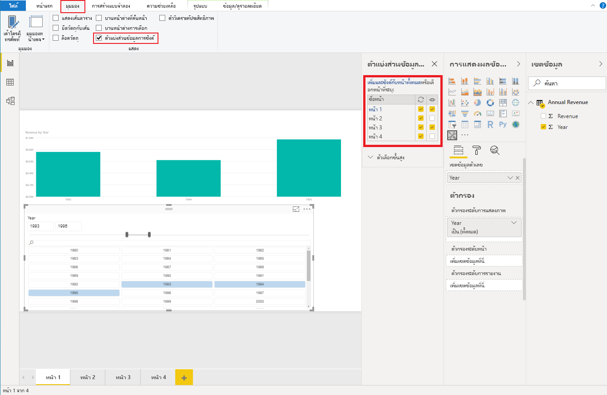

# <a name="sync-slicers-in-power-bi-visuals"></a>ซิงค์ตัวแบ่งส่วนข้อมูลในวิชวล Power BI

เพื่อรองรับคุณสมบัติ [ซิงค์ตัวแบ่งส่วนข้อมูล](https://docs.microsoft.com/power-bi/desktop-slicers) วิชวลตัวแบ่งส่วนข้อมูลแบบกำหนดเองของคุณต้องใช้ API เวอร์ชัน 1.13 หรือใหม่กว่า

นอกจากนี้คุณต้องเปิดใช้งานตัวเลือกในไฟล์ *capabilities.json* ดังที่แสดงในโค้ดต่อไปนี้:

```json
{
    ...
    "supportsHighlight": true,
    "suppressDefaultTitle": true,
    "supportsSynchronizingFilterState": true,
    "sorting": {
        "default": {}
    }
}
```

หลังจากคุณอัปเดตไฟล์ *capabilities.json* แล้วคุณสามารถดูบานหน้าต่างตัวเลือก **ซิงค์ตัวแบ่งส่วนข้อมูล** เมื่อคุณเลือกวิชวลตัวแบ่งส่วนข้อมูลแบบกำหนดเอง

> [!NOTE]
> คุณลักษณะซิงค์ตัวแบ่งส่วนข้อมูลไม่สนับสนุนเขตข้อมูลมากกว่าหนึ่งรายการ ถ้าตัวแบ่งส่วนข้อมูลของคุณมีเขตข้อมูลมากกว่าหนึ่งรายการ (**หมวดหมู่** หรือ **หน่วยวัด**) คุณลักษณะนี้จะถูกปิดใช้งาน



ในบานหน้าต่าง **ซิงค์ตัวแบ่งส่วนข้อมูล** คุณจะเห็นว่าการแสดงผลของตัวแบ่งส่วนข้อมูลของคุณและการกรองสามารถนำไปใช้กับหน้ารายงานหลายหน้าได้
