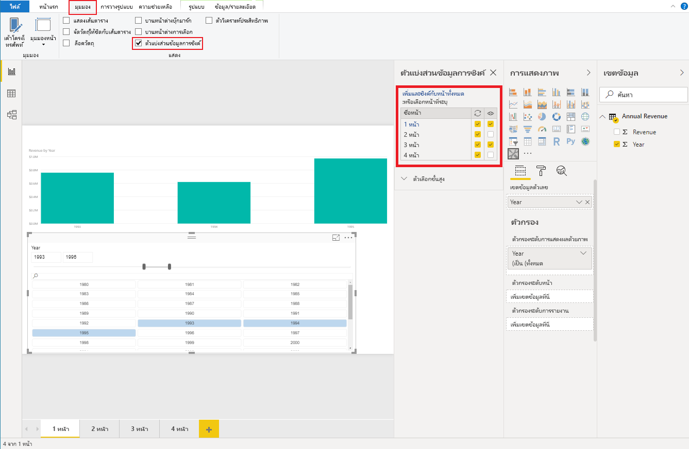

# <a name="sync-slicers"></a>ตัวแบ่งส่วนข้อมูลการซิงค์

หากต้องการสนับสนุน[ตัวแบ่งส่วนข้อมูลการซิงค์](https://docs.microsoft.com/power-bi/desktop-slicers) วิชวลตัวแบ่งส่วนข้อมูลแบบกำหนดเองของคุณต้องใช้ API 1.13 หรือสูงกว่า

มีการเปิดใช้งานมุมมองที่จำเป็นสำรองใน `capabilities.json` (ดูตัวอย่างด้านล่าง)

```json
{
    ...
    "supportsHighlight": true,
    "suppressDefaultTitle": true,
    "supportsSynchronizingFilterState": true,
    "sorting": {
        "default": {}
    }
}
```

หลังจากการเปลี่ยนแปลงใน `capabilities.json` คุณสามารถดูบานหน้าต่างตัวเลือกตัวแบ่งส่วนข้อมูลการซิงค์เมื่อคุณคลิกที่วิชวลตัวแบ่งส่วนข้อมูลแบบกำหนดเองของคุณ

> [!NOTE]
> ถ้าตัวแบ่งส่วนข้อมูลของคุณมีมากกว่า 1 เขตข้อมูล (ประเภทหรือหน่วยวัด) คุณลักษณะนี้จะถูกปิดใช้งานเนื่องจากตัวแบ่งส่วนข้อมูลการซิงค์ไม่สนับสนุนหลายเขตข้อมูล



ในบานหน้าต่าง คุณสามารถดูว่าการแสดงผลของตัวแบ่งส่วนข้อมูลและการกรองอาจถูกนำไปใช้กับหน้ารายงานจำนวนมาก
