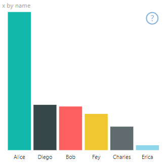
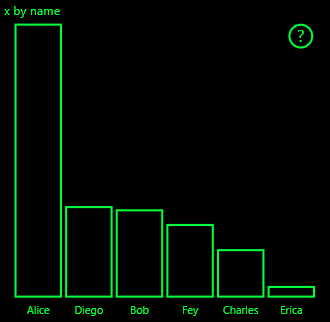
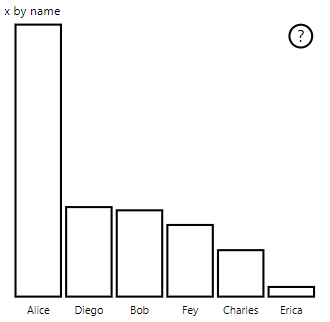

# <a name="high-contrast-mode-support"></a>การรองรับโหมดความคมชัดสูง

การตั้งค่า*ความคมชัดสูง*ของ Windows ทำให้ข้อความและแอปสามารถดูได้ง่ายขึ้นโดยใช้สีที่แตกต่างกันมากขึ้น
อ่านเพิ่มเติม [เกี่ยวกับการรองรับความคมชัดสูงใน Power BI](https://powerbi.microsoft.com/blog/power-bi-desktop-june-2018-feature-summary/#highContrast)

การเพิ่มการรองรับความคมชัดสูงไปยังวิชวลของคุณจำเป็นต้องมีสิ่งต่อไปนี้:

1. เมื่อเริ่มใช้: ตรวจสอบว่า Power BI อยู่ในโหมดความคมชัดสูงและถ้าเป็นเช่นนั้น จะสามารถรับสีความคมชัดสูงในปัจจุบัน
2. การอัปเดตทุกครั้ง: เปลี่ยนวิธีการแสดงวิชวลเพื่อให้มองเห็นได้ง่ายขึ้น

วิชวล PowerBI-visuals-sampleBarChart มีการใช้งานการรองรับความคมชัดสูง

สำหรับข้อมูลเพิ่มเติม ให้ดู [ที่เก็บวิชวล PowerBI-visuals-sampleBarChart](https://github.com/Microsoft/PowerBI-visuals-sampleBarChart/commit/61011c82b66ca0d3321868f1d089c65101ca42e6)

## <a name="on-init"></a>เมื่อเริ่มใช้

สมาชิก colorPalette ของ `options.host` มีคุณสมบัติหลายอย่างสำหรับโหมดความคมชัดสูง ใช้คุณสมบัติเหล่านี้เพื่อตรวจสอบมีการใช้งานโหมดความคมชัดสูงหรือไม่ และถ้าเป็นเช่นนั้น สีอะไรที่จะใช้

### <a name="detect-that-power-bi-is-in-high-contrast-mode"></a>ตรวจพบว่า Power BI อยู่ในโหมดความคมชัดสูง

ถ้า`host.colorPalette.isHighContrast` เป็น`true` โหมดความคมชัดสูงมีการใช้งานอยู่และวิชวลควรวาดตัวเองตามลำดับ

### <a name="get-high-contrast-colors"></a>รับสีที่มีความคมชัดสูง

ในโหมดความคมชัดสูง วิชวลของคุณควรจำกัดตัวเองเป็นสีดังต่อไปนี้:

* **สีพื้นหน้า** ใช้ในการวาดเส้น ไอคอน ข้อความ และเค้าร่างหรือการเติมรูปร่าง
* **สีพื้นหลัง** ใช้สำหรับพื้นหลังและเป็นสีเติมของรูปร่างที่มีการระบุไว้
* **สีที่เลือกไว้สำหรับเบื้องหน้า**  จะใช้เพื่อระบุองค์ประกอบที่เลือกหรือที่ใช้งานอยู่
* **สีของการเชื่อมโยงหลายมิติ** จะใช้เฉพาะกับข้อความที่เชื่อมโยงหลายมิติ

> [!NOTE]
> หากจำเป็นต้องใช้สีทุติยภูมิ อาจใช้สีพื้นหน้ากับความทึบแสงบางอย่าง (วิชวลแบบดั้งเดิมของ Power BI ใช้ความทึบ 40%) ใช้การดำเนินการนี้เพื่อให้สามารถดูรายละเอียดของวิชวลได้ง่ายขึ้น

คุณสามารถจัดเก็บค่าเหล่านี้ในระหว่างการเตรียมใช้งาน:

```typescript
private isHighContrast: boolean;

private foregroundColor: string;
private backgroundColor: string;
private foregroundSelectedColor: string;
private hyperlinkColor: string;
//...

constructor(options: VisualConstructorOptions) {
    this.host = options.host;
    let colorPalette: ISandboxExtendedColorPalette = host.colorPalette;
    //...
    this.isHighContrast = colorPalette.isHighContrast;
    if (this.isHighContrast) {
        this.foregroundColor = colorPalette.foreground.value;
        this.backgroundColor = colorPalette.background.value;
        this.foregroundSelectedColor = colorPalette.foregroundSelected.value;
        this.hyperlinkColor = colorPalette.hyperlink.value;
    }
```

หรือคุณสามารถจัดเก็บวัตถุ `host` ในระหว่างการเตรียมใช้งานและเข้าถึงคุณสมบัติ `colorPalette` ที่เกี่ยวข้องในระหว่างการอัปเดตได้

## <a name="on-update"></a>ในการอัปเดต

การใช้งานที่เฉพาะเจาะจงของการรองรับความคมชัดสูงจะแตกต่างในแต่ละวิชวล และขึ้นอยู่กับรายละเอียดของการออกแบบกราฟิก โดยทั่วไป โหมดความคมชัดสูงจะต้องมีการออกแบบที่แตกต่างกันเล็กน้อยกว่าค่าเริ่มต้น เพื่อให้ง่ายต่อการแยกความแตกต่างของรายละเอียดที่สำคัญด้วยสีที่จำกัด

ต่อไปนี้เป็นคำแนะนำบางอย่างตามด้วยวิชวลแบบดั้งเดิมของ Power BI:

* จุดข้อมูลทั้งหมดใช้สีเดียวกัน (พื้นหน้า)
* ข้อความทั้งหมด แกน ลูกศร เส้น เป็นต้น ใช้สีพื้นหน้า
* รูปร่างหนาจะวาดเป็นเค้าร่างด้วยเส้นขีดหนา (อย่างน้อยสองพิกเซล) และการเติมสีพื้นหลัง
* เมื่อเกี่ยวข้อง จุดข้อมูลจะแตกต่างตามรูปร่างเครื่องหมายที่แตกต่างกัน เส้นข้อมูลมีความแตกต่างกันตามการลงเส้นประที่แตกต่างกัน
* เมื่อไฮไลท์องค์ประกอบข้อมูล องค์ประกอบอื่น ๆ ทั้งหมดเปลี่ยนความทึบของตนเป็น 40%
* สำหรับตัวแบ่งส่วนข้อมูล องค์ประกอบตัวกรองที่ใช้งานอยู่จะใช้สีที่เลือกไว้สำหรับเบื้องหน้า

ในแผนภูมิแท่งตัวอย่าง ตัวอย่างเช่น แถบทั้งหมดจะถูกวาดด้วยโครงร่างเบื้องหน้าที่หนาขนาดสองพิกเซลและการเติมพื้นหลัง เปรียบเทียบลักษณะที่ปรากฏกับสีเริ่มต้นและธีมสองแบบที่มีความคมชัดสูง:





นี่คือจุดหนึ่งในฟังก์ชั่น `visualTransform` ที่มีการเปลี่ยนแปลงเพื่อรองรับความคมชัดสูง เรียกว่าเป็นส่วนหนึ่งของการแสดงผลในระหว่าง `update`:

### <a name="before"></a>ก่อน

```typescript
for (let i = 0, len = Math.max(category.values.length, dataValue.values.length); i < len; i++) {
    let defaultColor: Fill = {
        solid: {
            color: colorPalette.getColor(category.values[i] + '').value
        }
    };

    barChartDataPoints.push({
        category: category.values[i] + '',
        value: dataValue.values[i],
        color: getCategoricalObjectValue<Fill>(category, i, 'colorSelector', 'fill', defaultColor).solid.color,
        selectionId: host.createSelectionIdBuilder()
            .withCategory(category, i)
            .createSelectionId()
    });
}
```

### <a name="after"></a>หลังจาก

```typescript
for (let i = 0, len = Math.max(category.values.length, dataValue.values.length); i < len; i++) {
    const color: string = getColumnColorByIndex(category, i, colorPalette);

    const selectionId: ISelectionId = host.createSelectionIdBuilder()
        .withCategory(category, i)
        .createSelectionId();

    barChartDataPoints.push({
        color,
        strokeColor,
        strokeWidth,
        selectionId,
        value: dataValue.values[i],
        category: `${category.values[i]}`,
    });
}

//...

function getColumnColorByIndex(
    category: DataViewCategoryColumn,
    index: number,
    colorPalette: ISandboxExtendedColorPalette,
): string {
    if (colorPalette.isHighContrast) {
        return colorPalette.background.value;
    }

    const defaultColor: Fill = {
        solid: {
            color: colorPalette.getColor(`${category.values[index]}`).value,
        }
    };

    return getCategoricalObjectValue<Fill>(category, index, 'colorSelector', 'fill', defaultColor).solid.color;
}
```
