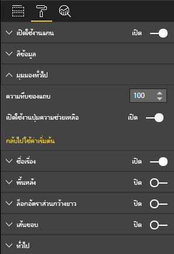

# <a name="launch-url"></a>เปิดใช้แอป

การเปิดใช้ URL จะอนุญาตให้เปิดแท็บเบราว์เซอร์ใหม่ (หรือหน้าต่าง) โดยการกำหนดงานที่แท้จริงใน Power BI

## <a name="sample"></a>ตัวอย่าง

```typescript
   this.host.launchUrl('https://powerbi.microsoft.com');
```

## <a name="usage"></a>การใช้งาน

ใช้การเรียกใช้ `host.launchUrl()` API ซึ่งเปลี่ยน URL ปลายทางของคุณเป็นอาร์กิวเมนต์ของสตริง:

```typescript
this.host.launchUrl('http://some.link.net');
```

## <a name="restrictions"></a>ข้อจำกัด

* ใช้เส้นทางสัมบูรณ์เท่านั้น ไม่สัมพันธ์กัน `http://some.link.net/subfolder/page.html` ใช้งานได้ แต่จะไม่สามารถเปิด `/page.html` ได้
* ปัจจุบัน รองรับเฉพาะโปรโตคอล `http` และ `https` เท่านั้น หลีกเลี่ยง `ftp` , `mailto` เป็นต้น

## <a name="best-practices"></a>แนวทางปฏิบัติที่ดีที่สุด

1. สำหรับกรณีส่วนใหญ่ เป็นวิธีการดีที่สุดที่จะเปิดลิงก์เพื่อเป็นการตอบสนองต่อการดำเนินการที่ชัดเจนของผู้ใช้ ทำให้ผู้ใช้เข้าใจได้ง่ายว่าการคลิกที่ลิงก์หรือปุ่มจะส่งผลให้เกิดการเปิดแท็บใหม่ การทริกเกอร์ `launchUrl()` การโทรโดยไม่มีการดำเนินการของผู้ใช้หรือเป็นผลข้างเคียงของการดำเนินการที่แตกต่างกันอาจทำให้ผู้ใช้เกิดความสับสนหรือหงุดหงิด
2. หากลิงก์ไม่สำคัญต่อการทำงานที่เหมาะสมของวิชวล เราแนะนำให้แจ้งวิธีการปิดใช้งานและซ่อนลิงก์แก่ผู้เขียนรายงาน ซึ่งเกี่ยวข้องโดยเฉพาะอย่างยิ่งสำหรับกรณีที่ใช้ Power BI พิเศษ เช่น การฝังรายงานในแอปพลิเคชันของบุคคลที่สามหรือการเผยแพร่ไปยังเว็บ
3. หลีกเลี่ยงการทริกเกอร์`launchUrl()`การเรียกใช้จากภายในการวนรอบ ฟังก์ชันของวิชวล `update`หรือรหัสที่เกิดซ้ำบ่อยอื่นๆ

## <a name="step-by-step-example"></a>ตัวอย่างทีละขั้นตอน

### <a name="adding-a-link-launching-element"></a>การเพิ่มองค์ประกอบการเปิดใช้ลิงก์

บรรทัดต่อไปนี้ถูกเพิ่มไปยังฟังก์ชัน`constructor`ของวิชวล:

```typescript
    this.helpLinkElement = this.createHelpLinkElement();
    options.element.appendChild(this.helpLinkElement);
```

และฟังก์ชันส่วนตัวที่เพิ่มการสร้างและการใส่องค์ประกอบของจุดยึดเข้าไป:

```typescript
private createHelpLinkElement(): Element {
    let linkElement = document.createElement("a");
    linkElement.textContent = "?";
    linkElement.setAttribute("title", "Open documentation");
    linkElement.setAttribute("class", "helpLink");
    linkElement.addEventListener("click", () => {
        this.host.launchUrl("https://docs.microsoft.com/power-bi/developer/custom-visual-develop-tutorial");
    });
    return linkElement;
};
```

ในท้ายที่สุด รายการในไฟล์ visual.less จะกำหนดลักษณะสำหรับองค์ประกอบของลิงก์:

```less
.helpLink {
    position: absolute;
    top: 0px;
    right: 12px;
    display: block;
    width: 20px;
    height: 20px;
    border: 2px solid #80B0E0;
    border-radius: 20px;
    color: #80B0E0;
    text-align: center;
    font-size: 16px;
    line-height: 20px;
    background-color: #FFFFFF;
    transition: all 900ms ease;

    &:hover {
        background-color: #DDEEFF;
        color: #5080B0;
        border-color: #5080B0;
        transition: all 250ms ease;
    }

    &.hidden {
        display: none;
    }
}
```

### <a name="adding-a-toggling-mechanism"></a>การเพิ่มกลไกการสลับ

ขั้นตอนนี้จำเป็นต้องเพิ่มวัตถุแบบคงที่ (ดูที่ [บทช่วยสอนวัตถุแบบคงที่](https://microsoft.github.io/PowerBI-visuals/docs/concepts/objects-and-properties)) เพื่อให้ผู้เขียนรายงานสามารถสลับการแสดงผลองค์ประกอบของลิงก์ (ค่าเริ่มต้นถูกตั้งค่าเป็นซ่อน)
`showHelpLink`เพิ่มวัตถุแบบคงที่ของบูลินไปยัง`capabilities.json`รายการวัตถุ:

```typescript
"objects": {
    "generalView": {
            "displayName": "General View",
            "properties":
                "showHelpLink": {
                    "displayName": "Show Help Button",
                    "type": {
                        "bool": true
                    }
                }
            }
        }
    }
```



และในฟังก์ชัน`update`ของวิชวล มีการเพิ่มบรรทัดต่อไปนี้:

```typescript
if (settings.generalView.showHelpLink) {
    this.helpLinkElement.classList.remove("hidden");
} else {
    this.helpLinkElement.classList.add("hidden");
}
```

คลาส `hidden` ถูกกำหนดใน visual.less เพื่อควบคุมการแสดงผลองค์ประกอบ
