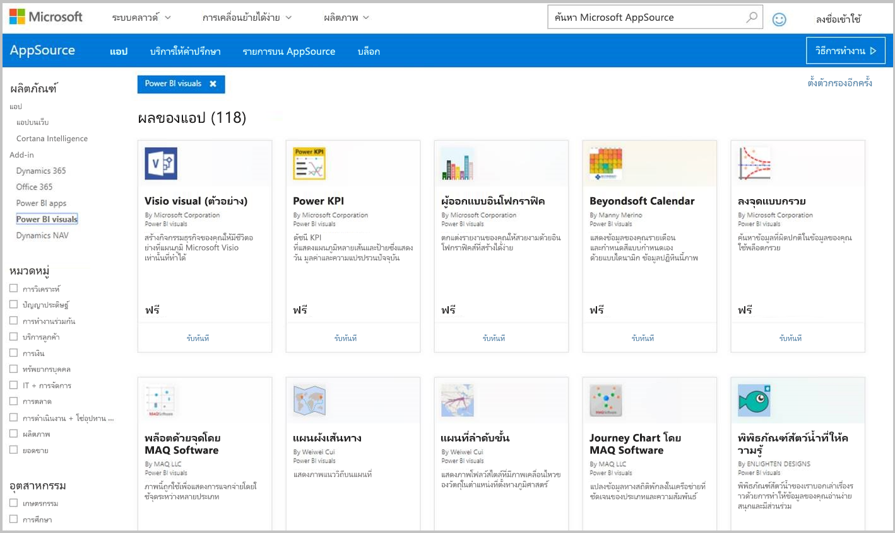
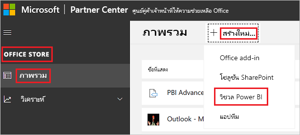

# เผยแพร่วิชวลแบบกำหนดเองไปยัง Partner Canter

เมื่อคุณสร้างวิชวล Power BI ของคุณเสร็จ คุณอาจต้องการเผยแพร่ลงใน AppSource ให้บุคคลอื่นสามารถค้นหา และใช้งาน สำหรับข้อมูลเพิ่มเติมเกี่ยวกับการสร้างวิชวล Power BI ให้ดูที่ [การพัฒนา](custom-visual-develop-tutorial.md)วิชวล Power BI

## AppSource คืออะไร

สามารถหาแอป SaaS และ add-in สำหรับผลิตภัณฑ์และบริการของ Microsoft ได้ใน [AppSource](https://appsource.microsoft.com/marketplace/apps?product=power-bi-visuals)

## การเตรียมเพื่อส่งวิชวล Power BI ของคุณ

ก่อนที่จะส่งวิชวล Power BI ไปยัง AppSource ตรวจสอบให้แน่ใจว่าคุณได้อ่าน[แนวทางการแสดงภาพ Power BI](guidelines-powerbi-visuals.md) และ [ทดสอบวิชวลแบบกำหนดเองของคุณ](./submission-testing.md)

เมื่อคุณพร้อมที่จะส่งวิชวล Power BI ของคุณให้ตรวจสอบว่าวิชวลของคุณตรงตามข้อกำหนดทั้งหมดที่ระบุไว้ด้านล่าง

| รายการ | จำเป็น | คำอธิบาย |
| --- | --- | --- |
| แพคเกจ .pbiviz |ใช่ |แพ็ควิชวล Power BI ของคุณลงในแพคเกจ .Pbiviz ที่ประกอบด้วยเมตาดาต้าที่จำเป็นทั้งหมด ชื่อของวิชวล ชื่อที่แสดง GUID เวอร์ชัน คำอธิบาย ชื่อผู้เขียนและอีเมล |
| ตัวอย่างไฟล์รายงาน .pbix |ใช่ |เพื่อใช้แสดงผลงานวิชวลของคุณ คุณควรช่วยให้ผู้ใช้สามารถทำความคุ้นเคยการใช้งานวิชวล เน้นสิ่งที่วิชวลเพิ่มคุณค่าให้กับผู้ใช้ และให้ตัวอย่างของการใช้งานและ ตัวเลือกจัดรูปแบบ คุณยังสามารถเพิ่มหน้า *"คำแนะนำ"* ตอนท้ายที่ให้เคล็ดลับ เทคนิคการใช้และสิ่งที่ต้องหลีกเลี่ยง เป็นต้น ไฟล์รายงาน .pbix ตัวอย่างจะต้องทำงานแบบออฟไลน์ โดยไม่ต้องเชื่อมต่อใด ๆ กับภายนอก |
| ไอคอน |ใช่ |คุณควรใส่โลโก้ของวิชวลแบบกำหนดเองที่จะปรากฏในหน้าร้านค้า รูปแบบสามารถเป็น .png, .jpg, .jpeg หรือ .gif จะต้องมีขนาด 300 px (ความกว้าง) x 300 px (ความสูง) **สิ่งสำคัญ!** โปรดดู[คำแนะนำการเก็บภาพใน Appsource](https://docs.microsoft.com/office/dev/store/craft-effective-appsource-store-images) อย่างระมัดระวังก่อนที่จะส่งไอคอน |
| ภาพหน้าจอ |ใช่ |ต้องมีภาพหน้าจอให้อย่างน้อยหนึ่งภาพ รูปแบบสามารถเป็น .png, .jpg, .jpeg หรือ .gif ขนาดต้องตรงกับ1366 px (ความกว้าง) กับ 768 px (ความสูง) ขนาดของไฟล์ไม่สามารถมีขนาดใหญ่กว่า1024 kb เพื่อดึงดูดให้มีคนใช้มากขึ้น เพิ่มข้อความอธิบายลงในภาพหน้าจอเพื่อแสดงความสามารถ และประโยชน์ที่มีให้กับผู้ใช้ |
| ลิงก์ดาวน์โหลดสนับสนุน |ใช่ |ใส่ URL การสนับสนุนสำหรับลูกค้าของคุณ ลิงก์นี้ถูกใส่เป็นส่วนหนึ่งของรายการแดชบอร์ดผู้จำหน่ายของคุณ และจะให้ผู้ใช้มองเห็นเมื่อพวกเขาเข้าถึงรายการแสดงผลด้วยภาพของคุณบน AppSource รูปแบบของ URL ของคุณควรมี https:// หรือ https:// |
| ลิงก์ไปยังเอกสารความเป็นส่วนตัว |ใช่ |ใส่ลิงก์ไปยังนโยบายความเป็นส่วนตัวของวิชวล ลิงก์นี้ถูกใส่เป็นส่วนหนึ่งของรายการแดชบอร์ดผู้จำหน่ายของคุณ และจะให้ผู้ใช้มองเห็นเมื่อพวกเขาเข้าถึงรายการแสดงผลด้วยภาพของคุณบน AppSource รูปแบบของลิงค์ของคุณควรมี http:// หรือ https:// |
| ข้อตกลงสิทธิ์การใช้งานสำหรับผู้ใช้ (EULA) |ใช่ |คุณต้องระบุไฟล์ EULA สำหรับการแสดงผลด้วยภาพของ Power BI ของคุณ คุณสามารถใช้ [สัญญามาตรฐาน](https://go.microsoft.com/fwlink/?linkid=2041178) [สัญญาวิชวล Power BI](https://visuals.azureedge.net/app-store/Power%20BI%20-%20Default%20Custom%20Visual%20EULA.pdf) หรือ EULA ของคุณเอง |
| ลิงก์วิดีโอ |ไม่ใช่ |เพื่อเพิ่มความน่าสนใจของวิชวลแบบกำหนดเองของคุณ ต้องมีลิงก์ไปยังวิดีโอเกี่ยวกับวิชวลของคุณ รูปแบบของ URL ของคุณควรมี https:// หรือ https:// |
| ที่จัดเก็บ GitHub |ไม่ใช่ |แชร์ลิงก์สาธารณะไปยังที่เก็บ [GitHub](https://www.github.com) กับแหล่งที่มาของข้อมูลวิชวลและตัวอย่างของ Power BI ของคุณ ซึ่งช่วยให้นักพัฒนาคนอื่นๆโอกาสในการให้คำติชมและเสนอการปรับปรุงให้กับรหัสของคุณ |

## การรับ XML ของแพคเกจแอป

เมื่อต้องการส่งวิชวล Power BI คุณจำเป็นต้องมี XML แพคเกจโปรแกรมประยุกต์จากทีม Power BI หากต้องการรับแพคเกจ XML ของแอปให้ส่งอีเมลไปยังทีมส่งวิชวล Power BI ([pbivizsubmit@microsoft.com](mailto:pbivizsubmit@microsoft.com))

ก่อนที่คุณจะสร้างแพคเกจ **.pbiviz** คุณต้องกรอกข้อมูลต่อไปนี้ในไฟล์ **pbiviz.json:**
* คำอธิบาย
* supportUrl
* ผู้เขียน
* name
* อีเมล

แนบ **ไฟล์ .pbiviz** และ **ไฟล์ตัวอย่างรายงาน .pbix** ในอีเมลของคุณ ทีม Power BI จะตอบกลับพร้อมคำชี้แนะ และไฟล์ XML ของแพคเกจแอปเพื่อการอัปโหลด ไฟล์ XML ของแพคเกจแอป นี้จำเป็นตอนส่งวิชวลของคุณผ่านทาง ศูนย์นักพัฒนา Office

> [!NOTE]
> เพื่อคุณภาพที่ดีขึ้น และมั่นใจว่ารายงานที่มีอยู่ก่อนแล้วจะไม่มีปัญหา การปรับปรุงวิชวลที่มีเดิม จะใช้เวลาเพิ่มอีกสองสัปดาห์ถึงไปยังสภาพแวดล้อมการทำงานจริง หลังจากผ่านการอนุมัติจากร้านค้า

## การส่งไป AppSource

หากต้องการส่งวิชวล Power BI ของคุณไปยัง AppSource คุณจำเป็นต้องได้รับแพคเกจแอปจากทีม Power BI จากนั้นส่งไปยังศูนย์คู่ค้า 

### การรับแพคเกจแอป

คุณต้องส่งอีเมลที่ มีไฟล์ **.pbiviz** และไฟล์ **.pbix** ไปยังทีม Power BI ก่อนที่จะส่งไปที่ AppSource ซึ่งทีม Power BI อัปโหลดไฟล์ดังกล่าวไปยังเซิร์ฟเวอร์ที่แชร์กับสาธารณะ มิฉะนั้นร้านค้าจะไม่สามารถดึงไฟล์นั้นได้ 

ทีมงาน Power BI ต้องตรวจสอบไฟล์ทุกครั้ง ไม่ว่าจะเป็นการส่งวิชวล Power BI ใหม่ ปรับปรุงวิชวล Power BI ที่มีอยู่ และการแก้ไขปัญหาการส่งที่ถูกปฏิเสธ

### ส่งไปยัง Partner Center

หากต้องการส่งวิชวล Power BI ของคุณไปยังศูนย์คู่ค้าคุณจะต้องได้รับการลงทะเบียนกับศูนย์คู่ค้า ถ้าคุณยังไม่ได้ลงทะเบียน [เปิดบัญชีนักพัฒนาในศูนย์คู่ค้า](https://docs.microsoft.com/office/dev/store/open-a-developer-account)

ทำตามขั้นตอนด้านล่างเพื่อส่งวิชวล Power BI ของคุณไปยังศูนย์คู่ค้า สำหรับข้อมูลเพิ่มเติมเกี่ยวกับกระบวนการส่งให้ดูที่การ [นำทางโซลูชัน Office ของคุณไปยัง AppSource ผ่านศูนย์คู่ค้า](https://docs.microsoft.com/office/dev/store/use-partner-center-to-submit-to-appsource)

1. ลงชื่อเข้าใช้ใน **Partner Center**

2. ในบานหน้าต่างด้านซ้ายเลือก **OFFICE STORE**

3. เลือก **ภาพรวม**

4. เลือก **สร้างใหม่** และจากเมนูดรอปดาวน์เลือก **วิชวล Power BI**

    

5. ใน **สร้างหน้าต่าง Power BI วิชวลใหม่** ใส่ชื่อสำหรับวิชวล Power BI ของคุณและเลือก **สร้าง**

6. เลือก**แพคเกจ** และอัปโหลดแพคเกจแอป Power BI วิชวลของคุณ

7. เลือก**คุณสมบัติ** และใส่ข้อมูลที่จำเป็น

8. ถ้าผลิตภัณฑ์ของคุณจำเป็นต้องมีการซื้อเพิ่มเติมให้เลือก  **การตั้งค่าผลิตภัณฑ์**และตรวจสอบกล่องกาเครื่องหมาย **การซื้อของบริการที่เกี่ยวข้อง**

9. (ไม่บังคับ) ถ้าคุณต้องการ [รับรอง](power-bi-custom-visuals-certified.md) วิชวลของคุณให้เลือกกล่องกาเครื่องหมาย **การตั้งค่าผลิตภัณฑ์** และตรวจสอบ **การรับรองความถูกต้องของ Power BI**
    >[!TIP]
    >กระบวนการขอใบรับรองThe Power BI อาจใช้เวลาสักระยะ หากคุณกำลังสร้างวิชวล Power BI ใหม่ เราแนะนำให้คุณเผยแพร่วิชวล Power BI ผ่าน Partner Center ก่อนที่คุณจะขอใบรับรอง Power BI กระบวนการนี้เพื่อให้แน่ใจว่าการเผยแพร่วิชวลของคุณจะไม่ถูกเลื่อนออกไป

10. เลือก **การตั้งค่าผลิตภัณฑ์** และคลิก **ตรวจสอบและเผยแพร่**

## การติดตามสถานะการส่งและการใช้งาน

คุณสามารถตรวจดู[นโยบายการตรวจสอบ](https://docs.microsoft.com/legal/marketplace/certification-policies#1180-power-bi-visuals)ได้

* หลังจากส่งแล้ว คุณจะสามารถดูสถานะการส่งได้ใน[แดชบอร์ดแอป](https://sellerdashboard.microsoft.com/Application/Summary/)

* หากต้องการรู้เมื่อวิชวล Power BI ของคุณพร้อมสำหรับการดาวน์โหลดจาก AppSource ให้ตรวจสอบ[ไทม์ไลน์ในการเผยแพร่](power-bi-custom-visuals-certified.md#publication-timeline)วิชวล Power BI

## การรับรองวิชวลของคุณ

เมื่อคุณได้สร้างวิชวลของคุณแล้ว หากคุณต้องการ คุณสามารถเลือกที่จะนำวิชวลของคุณไปขอ[การรับรอง](power-bi-custom-visuals-certified.md)ได้

## ขั้นตอนถัดไป

* [พัฒนาภาพแบบกำหนดเองของ Power BI](custom-visual-develop-tutorial.md)

* [จัดรูปแบบข้อมูลใน Power BI](../../visuals/power-bi-report-visualizations.md)  

* [วิชวลใน Power BI](power-bi-custom-visuals.md)  

* [การรับรองส่วนการจัดแสดง Power BI](power-bi-custom-visuals-certified.md)

* มีคำถามเพิ่มเติมหรือไม่ [ลองถามชุมชน Power BI](https://community.powerbi.com/)
