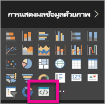

# แก้ปัญหาวิชวล Power BI

## ข้อบกพร่อง

**ไม่พบคำสั่ง Pbiviz (หรือข้อผิดพลาดที่คล้ายกัน)**

เมื่อคุณเรียกใช้ `pbiviz` ในบรรทัดคำสั่งของเทอร์มินัล คุณควรเห็นหน้าจอความช่วยเหลือ ถ้าไม่มี แสดงว่าคำสั่งนั้นไม่ได้ถูกติดตั้งอย่างถูกต้อง ตรวจสอบให้แน่ใจว่า คุณติดตั้ง NodeJS เวอร์ชันขั้นต่ำ 4.0

**ไม่พบวิชวลดีบักในแท็บการแสดงภาพ**

ดีบักวิชวล มีลักษณะเหมือนไอคอนรูปพร้อมท์ภายในแท็บ**แสดงภาพ**

ถ้าคุณไม่เห็นไอคอนนั้น ตรวจสอบให้แน่ใจว่าคุณได้เปิดใช้งานภายในการตั้งค่า Power BI

> [!NOTE]
> ดีบักวิชวล ในขณะใช้งานได้เฉพาะ ในบริการของ Power BI และยังไม่รองรับโดย Power BI Desktop หรือแอปสำหรับอุปกรณ์เคลื่อนที่ วิชวลที่แพคเกจแล้วจะยังคงทำงานได้ทุก ๆ ที่

**ไม่สามารถติดต่อเซิร์ฟเวอร์วิชวล**

เรียกใช้เซิร์ฟเวอร์วิชวลด้วยคำสั่ง `pbiviz start` ในบรรทัดคำสั่งของเทอร์มินัล จากรากของโครงการวิชวลของคุณ ถ้าเซิร์ฟเวอร์ไม่ทำงาน เป็นไปได้ว่าไม่ได้ติดตั้งใบรับรอง SSL ของคุณอย่างถูกต้อง

โปรดติดต่อทีมฝ่ายสนับสนุนด้านวิชวล Power BI (pbicvsupport@microsoft.com) เพื่อสอบถามข้อสงสัย แสดงความเห็น หรือแจ้งประเด็นใด ๆ ที่คุณมี

## ขั้นตอนถัดไป

สำหรับข้อมูลเพิ่มเติม โปรดเยี่ยมชม[คำถามที่ถามบ่อยเกี่ยวกับการแสดงผล Power BI](power-bi-custom-visuals-faq.md#organizational-power-bi-visuals)