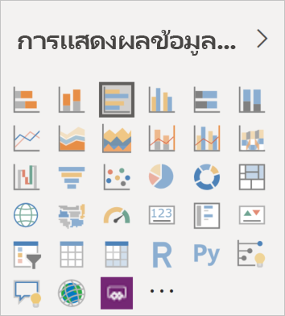

# วิชวลใน Power BI

Power BI มาพร้อมกับวิชวล Power BI แบบนอกกรอบ วิชวลเหล่านี้จะพร้อมใช้งานในบานหน้าต่างการแสดงผลข้อมูลด้วยภาพทั้งของ [Power BI Desktop](https://powerbi.microsoft.com/desktop/) และ [บริการ Power BI](https://app.powerbi.com) และสามารถใช้สำหรับการสร้างและแก้ไขเนื้อหา Power BI ได้

วิชวล Power BI อีกมากมายพร้อมใช้งานใน [AppSource](https://nam06.safelinks.protection.outlook.com/?url=https%3A%2F%2Fappsource.microsoft.com%2Fen-us%2Fmarketplace%2Fapps%3Fpage%3D1%26product%3Dpower-bi-visuals&data=02%7C01%7CKesem.Sharabi%40microsoft.com%7C6d9286afacb3468d4cde08d740b76694%7C72f988bf86f141af91ab2d7cd011db47%7C1%7C0%7C637049028749147718&sdata=igWm0e1vXdgGcbyvngQBrHQVAkahPnxPC1ZhUPntGI8%3D&reserved=0) ของ Microsoft หรือผ่าน Power BI วิชวลเหล่านี้จะถูกสร้างขึ้นโดย Microsoft และคู่ค้าของ Microsoft และได้รับการทดสอบและตรวจสอบความถูกต้องโดยทีมตรวจสอบ AppSource

นอกจากนี้คุณยังสามารถพัฒนาวิชวล Power BI ของคุณเองเพื่อใช้โดยคุณ องค์กรของคุณ หรือชุมชน Power BI ทั้งหมดได้

## วิชวล Power BI ตามค่าเริ่มต้น

นี่คือวิชวล Power BI แบบนอกกรอบที่พร้อมใช้งานจากบานหน้าต่างการแสดงผลข้อมูลด้วยภาพใน *Power BI Desktop* และ *บริการ Power BI*

เมื่อต้องการถอนหมุดวิชวล Power BI ออกจากบานหน้าต่างการแสดงผลข้อมูลด้วยภาพ ให้คลิกขวาและเลือก **ถอนหมุด**

เมื่อต้องการคืนค่าวิชวล Power BI ค่าเริ่มต้น ในบานหน้าต่างการแสดงผลข้อมูลด้วยภาพ ให้คลิก **นำเข้าวิชวลแบบกำหนดเอง** และเลือก **คืนค่าวิชวลค่าเริ่มต้น** 

## วิชวล Power BI ของ AppSource

สมาชิกของชุมชนและ Microsoft มีส่วนร่วมในวิชวล Power BI เพื่อสาธารณประโยชน์และเผยแพร่ไปยัง [AppSource](https://appsource.microsoft.com/marketplace/apps?product=power-bi-visuals) คุณสามารถดาวน์โหลดวิชวลเหล่านี้ และเพิ่มลงในรายงาน Power BI ของคุณได้ Microsoft ได้รับการทดสอบและอนุมัติส่วนแสดงผล Power BI เหล่านี้ทั้งหมด ทั้งฟังก์ชันการใช้งานและคุณภาพ

### AppSource คืออะไร

[AppSource](https://appsource.microsoft.com/marketplace/apps?product=power-bi-visuals) เป็นสถานที่ค้นหาแอป add-in และส่วนขยายสำหรับซอฟต์แวร์ Microsoft ของคุณ AppSource เชื่อมต่อผู้ใช้ของผลิตภัณฑ์ เช่น Office 365, Azure, Dynamics 365, Cortana และ Power BI นับล้านคน ไปยังโซลูชันที่ช่วยให้พวกเขาทำงานสำเร็จได้อย่างมีประสิทธิภาพขึ้น และเข้าใจได้ลึกซึ้งขึ้นกว่าที่เคย

### ส่วนจัดแสดง Power BI ที่ผ่านการรับรอง

ส่วนการจัดแสดง Power BI ที่ได้รับการรับรองคือวิชวลใน [AppSource](https://nam06.safelinks.protection.outlook.com/?url=https%3A%2F%2Fappsource.microsoft.com%2Fen-us%2Fmarketplace%2Fapps%3Fpage%3D1%26product%3Dpower-bi-visuals&data=02%7C01%7CKesem.Sharabi%40microsoft.com%7C6d9286afacb3468d4cde08d740b76694%7C72f988bf86f141af91ab2d7cd011db47%7C1%7C0%7C637049028749147718&sdata=igWm0e1vXdgGcbyvngQBrHQVAkahPnxPC1ZhUPntGI8%3D&reserved=0) ที่ตรงตามข้อกำหนดรหัสที่ระบุไว้ ซึ่งผ่านการทดสอบและได้รับอนุมัติจากทีม Microsoft Power BI team แล้ว มีการออกแบบการทดสอบที่ทำขึ้นเพื่อตรวจสอบวิชวลที่ไม่ได้เข้าถึงบริการหรือทรัพยากรภายนอก

เมื่อต้องการดูรายการของส่วนแสดงผล Power BI ที่ผ่านการรับรอง หรือต้องการส่งวิชวลของคุณเอง ให้ดู [วิชวล Power BI ที่ผ่านการรับรองแล้ว](power-bi-custom-visuals-certified.md)

### ตัวอย่างสำหรับวิชวล Power BI

วิชวล Power BI แต่ละวิชวลบน AppSource มีตัวอย่างข้อมูลที่แสดงให้เห็นวิธีการทำงานของวิชวล เมื่อต้องการดาวน์โหลดตัวอย่าง ให้เลือกวิชวล Power BI ใน [AppSource](https://nam06.safelinks.protection.outlook.com/?url=https%3A%2F%2Fappsource.microsoft.com%2Fen-us%2Fmarketplace%2Fapps%3Fpage%3D1%26product%3Dpower-bi-visuals&data=02%7C01%7CKesem.Sharabi%40microsoft.com%7C6d9286afacb3468d4cde08d740b76694%7C72f988bf86f141af91ab2d7cd011db47%7C1%7C0%7C637049028749147718&sdata=igWm0e1vXdgGcbyvngQBrHQVAkahPnxPC1ZhUPntGI8%3D&reserved=0) และจากส่วน *ลองตัวอย่าง* ให้คลิกลิงก์ **รายงานตัวอย่าง**

## ที่เก็บข้อมูลขององค์กร

ผู้ดูแลระบบ Power BI อนุมัติและปรับใช้วิชวล Power BI ไปยังองค์กรของพวกเขา การดำเนินการนี้จะช่วยให้ผู้เขียนรายงานสามารถค้นหา อัปเดต และใช้วิชวล Power BI เหล่านี้ได้อย่างง่ายดาย ผู้ดูแลระบบสามารถจัดการวิชวลเหล่านี้ได้อย่างง่ายดายด้วยการดำเนินการ เช่น อัปเดตเวอร์ชัน การปิดใช้งานและการเปิดใช้งานวิชวล Power BI

เมื่อต้องการเข้าถึงร้านค้าองค์กร ในบานหน้าต่าง*การแสดงผลข้อมูลด้วยภาพ* ให้คลิก **นำเข้าวิชวลแบบกำหนดเอง** เลือก **นำเข้าจาก marketplace** และที่ด้านบนของหน้าต่าง *วิชวล Power BI* ให้เลือกแท็บ **องค์กรของฉัน**

[อ่านเพิ่มเติมเกี่ยวกับการแสดงผลด้วยภาพขององค์กร](power-bi-custom-visuals-organization.md)

## ไฟล์วิชวล

ส่วนแสดงผล Power BI เป็นแพคเกจที่รวมเอาโค้ดสำหรับการนำเสนอข้อมูลที่ให้บริการในภาพ ทุกคนสามารถสร้างภาพแบบกำหนดเองและรวมภาพนั้นเป็นไฟล์ `.pbiviz` เดียวที่สามารถนำเข้าไปในรายงาน Power BI

เมื่อต้องการนำเข้าวิชวล Power BI ในบานหน้าต่าง *การแสดงผลข้อมูลด้วยภาพ* ให้คลิก **นำเข้า วิชวลแบบกำหนดเอง** และเลือก **นำเข้าจากไฟล์**

ถ้าคุณเป็นนักพัฒนาเว็บและมีความสนใจในการสร้างวิชวลของคุณเองและเพิ่มลงใน AppSource คุณสามารถเรียนรู้วิธีการ [พัฒนาวิชวล Power BI](custom-visual-develop-tutorial.md) และ [เผยแพร่วิชวล Power BI ไปยัง AppSource](office-store.md) ได้

> [!WARNING]
> วิชวล Power BI สามารถประกอบด้วยโค้ด ที่มีความเสี่ยงด้านความปลอดภัยหรือความเป็นส่วนตัว ตรวจสอบให้แน่ใจว่าคุณเชื่อถือผู้เขียนและแหล่งข้อมูลวิชวล Power BI ก่อนที่จะนำเข้าไปยังรายงานของคุณ

## ขั้นตอนถัดไป

* ถ้าคุณเป็นนักพัฒนา เริ่มต้นด้วยบทช่วยสอน [วิชวลพัฒนา Power BI](custom-visual-develop-tutorial.md)

* เรียนรู้วิธี [การจัดโครงสร้างโครงการวิชวลของ Power BI](visual-project-structure.md)

* สำรวจ [คำแนะนำสำหรับวิชวล Power BI](guidelines-powerbi-visuals.md)

มีคำถามเพิ่มเติมหรือไม่ ลองเยี่ยมชมหน้า [คำถามที่ถามบ่อยเกี่ยวกับวิชวล Power BI](power-bi-custom-visuals-faq.md) หรือ [ชุมชน Power BI](https://community.powerbi.com/)