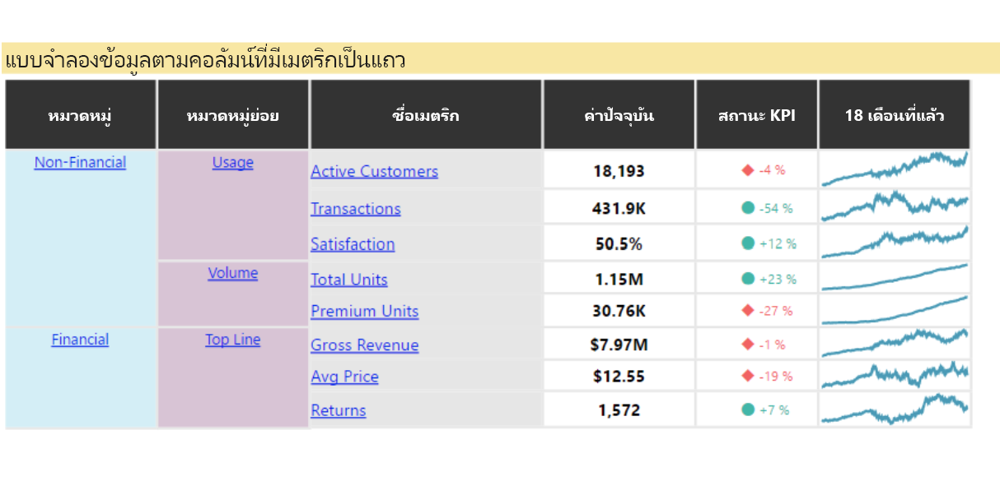
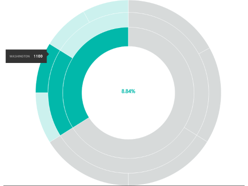
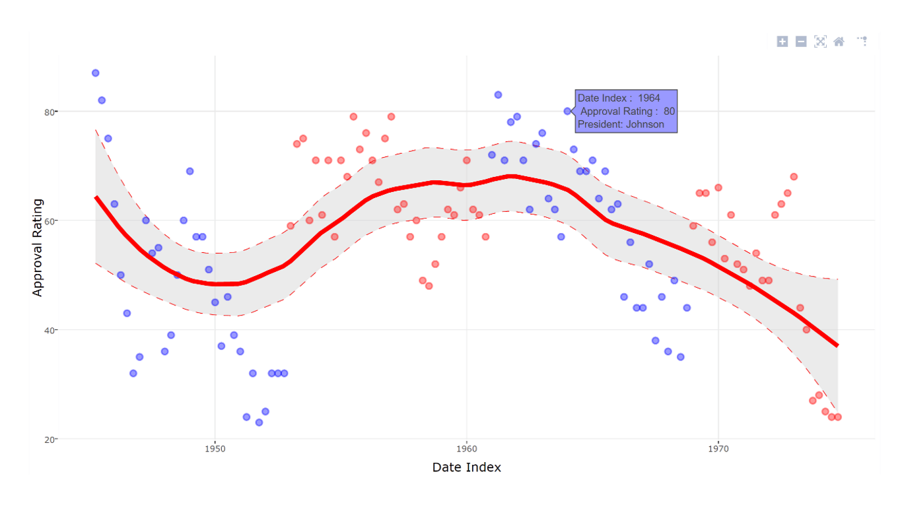

# ตัวอย่างสำหรับวิชวล Power BI

คุณสามารถดาวน์โหลด ใช้ และปรับเปลี่ยนวิชวล Power BI เหล่านี้ได้จาก GitHub ตัวอย่างเหล่านี้แสดงวิธีการจัดการสถานการณ์ทั่วไปเมื่อพัฒนาด้วย Power BI

## ตัวแบ่งส่วนข้อมูล

ตัวแบ่งส่วนข้อมูลจะจำกัดส่วนของข้อมูลที่แสดงอยู่ในการแสดงภาพอื่นๆ ในรายงาน ตัวแบ่งส่วนข้อมูลเป็นหนึ่งในหลายวิธีในการกรองข้อมูลใน Power BI

|   |  | |
| ------------- | ------------- | -------------|
| [Chiclet Slicer](https://github.com/Microsoft/powerbi-visuals-chicletslicer/)   แสดงรูปภาพหรือปุ่มข้อความที่ทำหน้าที่เป็นตัวกรองกราฟิกในพื้นที่บนวิชวลอื่น ๆ | [Timeline Slicer](https://github.com/Microsoft/powerbi-visuals-timeline/)  ตัวเลือกช่วงวันที่แบบกราฟิกที่กรองตามวันที่ | [ตัวอย่างตัวแบ่งส่วนข้อมูล](https://github.com/Microsoft/powerbi-visuals-sampleslicer/)  อธิบายการใช้ API การกรองขั้นสูง

## แผนภูมิ

รับแรงบันดาลใจจากแกลเลอรีของเรา ที่ประกอบด้วยแผนภูมิแท่ง แผนภูมิวงกลม  Word Cloud และอื่นๆ

|   |  | |
| ------------- | ------------- | -------------|
| [Aster Plot](https://github.com/Microsoft/powerbi-visuals-asterplot/)   แนวทางใหม่สำหรับแผนภูมิโดนัทมาตรฐาน ที่ใช้ค่าที่สองเพื่อลบมุม | [แผนภูมิหัวข้อย่อย](https://github.com/Microsoft/powerbi-visuals-bulletchart/)  แผนภูมิแท่งซึ่งมีองค์ประกอบภาพพิเศษที่ให้บริบท อันเป็นประโยชน์สำหรับการติดตามเป้าหมาย | [Chord](https://github.com/Microsoft/powerbi-visuals-chord/)  วิธีการทางกราฟิกที่แสดงความสัมพันธ์ของข้อมูลในเมทริกซ์
|  | |  
| [การพล็อตด้วยจุด](https://github.com/Microsoft/powerbi-visuals-dotplot/)  แสดงการกระจายของความถี่ในรูปแบบที่ดูดี | [Dual KPI](https://github.com/Microsoft/powerbi-visuals-dualkpi/)  แสดงภาพหน่วยวัดสองรายการในช่วงเวลา แสดงแนวโน้มของรายการดังกล่าวบนเส้นเวลาร่วมกันได้อย่างมีประสิทธิภาพ | [Enhanced Scatter](https://github.com/Microsoft/powerbi-visuals-enhancedscatter/)  การปรับปรุงของแผนภูมิกระจายที่มีอยู่
| | | 
| [Force Graph](https://github.com/Microsoft/powerbi-visuals-forcegraph/)  บังคับเค้าโครงไดอะแกรมด้วยเส้นโค้ง ซึ่งประโยชน์ในการแสดงการเชื่อมต่อระหว่างเอนทิตี | [Gantt](https://github.com/Microsoft/powerbi-visuals-gantt/)  แผนภูมิแท่งที่แสดงเส้นเวลาโครงการหรือกำหนดการพร้อมทรัพยากร | [Table Heatmap](https://github.com/Microsoft/powerbi-visuals-heatmap/)  เปรียบเทียบข้อมูลได้อย่างง่ายดายและคล่องตัวโดยใช้สีในตาราง
|  |  |  
| [Histogram chart](https://github.com/Microsoft/powerbi-visuals-histogram/)  แสดงภาพการกระจายข้อมูลในช่วงเวลาต่อเนื่องหรือบางช่วงเวลา | [LineDot chart](https://github.com/Microsoft/powerbi-visuals-linedotchart/)  แผนภูมิเส้นแบบเคลื่อนไหวที่มีจุดเคลื่อนไหว ซึ่งจะดึงดูดให้ผู้ชมสนใจข้อมูล | [Mekko chart](https://github.com/Microsoft/powerbi-visuals-mekkochart/)  การผสมผสานของแผนภูมิคอลัมน์แบบเรียงซ้อน 100% และแผนภูมิแท่งแบบเรียงซ้อน 100% รวมอยู่ในมุมมองเดียว
|  |  |  
| [หลาย KPI](https://github.com/microsoft/PowerBI-visuals-MultiKPI/)   การแสดงภาพหลาย KPI อันทรงพลังด้วย KPI หลักพร้อมกับกราฟ Sparklines ที่มีข้อมูลที่สนับสนุนหลายรายการ | [Power KPI](https://github.com/microsoft/PowerBI-visuals-PowerKPI/)  ตัวบ่งชี้ KPI อันทรงพลัง ด้วยแผนภูมิหลายเส้นและป้ายชื่อสำหรับวันที่  มูลค่า และความแปรปรวนปัจจุบัน | [Power KPI Matrix](https://github.com/microsoft/PowerBI-visuals-PowerKPIMatrix/)  ตรวจสอบดัชนีชี้วัดที่สมดุลและจำนวนเมตริกและ KPI ที่ไม่ จำกัด ในรายการขนาดกะทัดรัดและอ่านง่าย
| |  |  
| [Pulse chart](https://github.com/Microsoft/powerbi-visuals-pulsechart/)  แผนภูมิเส้นนี้มีซึ่งมีคำอธิบายประกอบของเหตุการณ์สำคัญ เหมาะสำหรับการบอกเล่าเรื่องราวด้วยข้อมูล| [Radar chart](https://github.com/Microsoft/powerbi-visuals-radarchart/)  นำเสนอหลายหน่วยวัดที่ลงจุดบนแกนบอกประเภท ซึ่งมีประโยชน์ในการเปรียบเทียบคุณลักษณะ | [Sankey Chart](https://github.com/Microsoft/powerbi-visuals-sankey/)  แผนภาพกระแสข้อมูลที่ความกว้างของชุดข้อมูลเป็นสัดส่วนกับปริมาณของกระแสข้อมูล
|  | | 
| [Stream graph](https://github.com/Microsoft/powerbi-visuals-streamgraph/)  แผนภูมิพื้นที่แบบเรียงซ้อนที่มีการประมาณค่าในช่วงอย่างราบรื่น ซึ่งมักจะใช้ในการแสดงค่าในช่วงเวลาหนึ่ง | [Sunburst chart](https://github.com/Microsoft/powerbi-visuals-sunburst/)  แผนภูมิโดนัทหลายระดับสำหรับการแสดงภาพข้อมูลตามลำดับชั้น| [Tornado chart](https://github.com/Microsoft/powerbi-visuals-tornado/)  เปรียบเทียบความสำคัญเชิงสัมพัทธ์ของตัวแปรระหว่างสองกลุ่ม
 | 
 | [Word Cloud](https://github.com/Microsoft/powerbi-visuals-wordcloud/)  สร้างวิชวลสนุกสนานจากข้อความในข้อมูลของคุณที่ใช้บ่อย

## WebGL

WebGL อนุญาตให้เนื้อหาเว็บใช้ API ที่ยึดตาม OpenGL ES 2.0 เพื่อทำการแสดงภาพแบบ 2 มิติ และ 3 มิติ ในพื้นที่ทำงาน HTML

| |
| ------------- |
| [Globe Map](https://github.com/Microsoft/powerbi-visuals-globemap/)  ลงจุดตำแหน่งที่ตั้งลงบนแผนที่ 3 มิติแบบโต้ตอบ

## วิชวล R

ตัวอย่างเหล่านี้สาธิตวิธีการใช้งานการวิเคราะห์และการแสดงผลด้วยภาพของวิชวล R และสคริปต์ R

| | | |
|------------- |------------- |------------- |------------- |
| [กฎความสัมพันธ์](https://github.com/Microsoft/powerbi-visuals-assorules/)  แสดงความสัมพันธ์ระหว่างข้อมูลที่ดูไม่เกี่ยวข้องกันโดยการใช้คำสั่ง if-then | [การทำคลัสเตอร์](https://github.com/Microsoft/powerbi-visuals-clustering-kmeans/)  ค้นหากลุ่มที่คล้ายคลึงกันในข้อมูลของคุณโดยใช้อัลกอริทึม k-means | [การทำคลัสเตอร์กับค่าผิดปกติ](https://github.com/microsoft/PowerBI-visuals-dbscan/)  ค้นหากลุ่มที่คล้ายคลึงกันและค่าผิดปกติในข้อมูลของคุณ
|  |  |  
| [การลงจุดค่าสหสัมพันธ์](https://github.com/Microsoft/powerbi-visuals-corrplot/)  เน้นตัวแปรที่สัมพันธ์กันมากที่สุดในตารางข้อมูล | [แผนผังต้นไม้การตัดสินใจ](https://github.com/Microsoft/powerbi-visuals-decision-tree/)  แผนผังรูปต้นไม้ที่เป็นแบบแผนสำหรับกำหนดความน่าจะเป็นทางสถิติโดยใช้การแบ่งพาร์ติชันแบบเรียกซ้ำ | [การคาดการณ์ TBATS](https://github.com/Microsoft/powerbi-visuals-forcasting-tbats/)  การพยากรณ์ชุดข้อมูลเวลาสำหรับชุดข้อมูลที่มีหลาย seasonality โดยใช้แบบจำลอง TBATS
|  |  |  
| [การคาดการณ์ด้วย ARIMA](https://github.com/Microsoft/powerbi-visuals-forcastingarima/)  ทำนายค่าในอนาคตโดยยึดตามข้อมูลในอดีตโดยใช้ Autoregressive Integrated Moving Avg (ARIMA) | [กราฟกรวยคว่ำ](https://github.com/Microsoft/powerbi-visuals-funnel/)  ค้นหาค่าผิดปกติในข้อมูลของคุณโดยใช้กราฟกรวยคว่ำ | [การตรวจจับค่าผิดปกติ](https://github.com/Microsoft/powerbi-visuals-outliers-det/)  ค้นหาค่าผิดปกติในข้อมูลของคุณโดยใช้วิธีการและการพล็อตกราฟที่เหมาะสมที่สุด
|  |  | 
| [Spline chart](https://github.com/Microsoft/powerbi-visuals-spline/)  แสดงภาพและทำความเข้าใจข้อมูลรบกวน | [แผนภูมิ Time series decomposition](https://github.com/Microsoft/powerbi-visuals-timeseriesdecomposition/)  ทำความเข้าใจคอมโพเนนต์ของชุดข้อมูลเวลาด้วย "Seasonal and Trend decomposition โดยใช้ Loess" | [แผนภูมิ Time series forecasting](https://github.com/Microsoft/powerbi-visuals-forcasting-exp/)  ใช้วิธี exponential smoothing เพื่อคาดการณ์ค่าอนาคตตามค่าที่ได้รับก่อนหน้านี้

## ขั้นตอนถัดไป

หากต้องการลองสร้างวิชวล Power BI โปรดดูที่ [บทช่วยสอน : การพัฒนาวิชวล Power BI](custom-visual-develop-tutorial.md)
