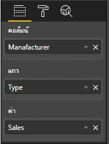

# <a name="add-interactivity-into-visual-by-power-bi-visuals-selections"></a>เพิ่มการโต้ตอบลงในภาพด้วยการเลือกภาพ Power BI

Power BI มีสองวิธีในการโต้ตอบระหว่างภาพคือ - การเลือกและการกรอง ตัวอย่างด้านล่างแสดงให้เห็นถึงวิธีการเลือกรายการใดๆ ในภาพเดียวและแจ้งภาพอื่นๆ ในรายงานเกี่ยวกับสถานะการเลือกใหม่

`Selection` ออบเจ็กต์ที่สอดคล้องกับอินเตอร์เฟซ:

```typescript
export interface ISelectionId {
    equals(other: ISelectionId): boolean;
    includes(other: ISelectionId, ignoreHighlight?: boolean): boolean;
    getKey(): string;
    getSelector(): Selector;
    getSelectorsByColumn(): SelectorsByColumn;
    hasIdentity(): boolean;
}
```

## <a name="how-to-use-selectionmanager-to-select-data-points"></a>วิธีใช้ SelectionManager เพื่อเลือกจุดข้อมูล

ออบเจ็กต์โฮสต์วิชวลให้เมธอดในการสร้างอินสแตนซ์ของเครื่องมือจัดการการเลือก ตัวจัดการการเลือกที่รับผิดชอบในการเลือก ล้างการเลือก แสดงเมนูบริบท จัดเก็บการเลือกปัจจุบันและตรวจสอบสถานะการเลือก และตัวจัดการการเลือกมีเมธอดที่สอดคล้องกันสำหรับการดำเนินการดังกล่าว

### <a name="create-an-instance-of-the-selection-manager"></a>สร้างอินสแตนซ์ของตัวจัดการการเลือก

สำหรับการใช้ตัวจัดการการเลือก คุณจะต้องสร้างอินสแตนซ์ของตัวจัดการการเลือก โดยทั่วไป วิชวลจะสร้างอินสแตนซ์ตัวจัดการการเลือกใน `constructor` ของออบเจ็กต์ของวิชวล

```typescript
export class Visual implements IVisual {
    private target: HTMLElement;
    private host: IVisualHost;
    private selectionManager: ISelectionManager;
    // ...
    constructor(options: VisualConstructorOptions) {
        this.host = options.host;
        // ...
        this.selectionManager = this.host.createSelectionManager();
    }
    // ...
}
```

### <a name="create-an-instance-of-the-selection-builder"></a>สร้างอินสแตนซ์ของตัวสร้างการเลือก

เมื่อมีการสร้างอินสแตนซ์ตัวจัดการการเลือก คุณจะต้องสร้าง `selections` สำหรับแต่ละจุดข้อมูลของภาพ วัตถุโฮสต์ภาพมีวิธีการ `createSelectionIdBuilder` ในการสร้างการเลือกสำหรับแต่ละจุดข้อมูล เมธอดนี้ส่งกลับอินสแตนซ์ของออบเจ็กต์ที่มีอินเทอร์เฟซ `powerbi.visuals.ISelectionIdBuilder`:

```typescript
export interface ISelectionIdBuilder {
    withCategory(categoryColumn: DataViewCategoryColumn, index: number): this;
    withSeries(seriesColumn: DataViewValueColumns, valueColumn: DataViewValueColumn | DataViewValueColumnGroup): this;
    withMeasure(measureId: string): this;
    withMatrixNode(matrixNode: DataViewMatrixNode, levels: DataViewHierarchyLevel[]): this;
    withTable(table: DataViewTable, rowIndex: number): this;
    createSelectionId(): ISelectionId;
}
```

ออบเจ็กต์นี้มีเมธอดที่สอดคล้องเพื่อสร้าง `selections` สำหรับการแมปมุมมองข้อมูลชนิดต่างๆ

> [!NOTE]
> มีการนำเมธอด `withTable` และ `withMatrixNode` มาใช้ใน API 2.5.0 ของวิชวล Power BI
> ถ้าคุณจำเป็นต้องใช้ตัวเลือกสำหรับการแมปมุมมองข้อมูลแบบตารางหรือเมทริกซ์ คุณจำเป็นต้องอัปเดต API ไปเป็นเวอร์ชัน 2.5.0 หรือใหม่กว่า

### <a name="create-selections-for-categorical-data-view-mapping"></a>สร้างการเลือกสำหรับการแมปมุมมองข้อมูลประเภท

มาดูกันว่าการเลือกจะแสดงถึงการแมปมุมมองข้อมูลแบบจัดกลุ่มสำหรับชุดข้อมูลตัวอย่างได้อย่างไร:

| ผู้ผลิต | ชนิด | ค่า |
| - | - | - |
| ไครสเลอร์ | รถภายในประเทศ | 28883 |
| ไครสเลอร์ | รถบรรทุกภายในประเทศ | 117131 |
| ไครสเลอร์ | รถนำเข้า | 0 |
| ไครสเลอร์ | รถบรรทุกนำเข้า | 6362 |
| ฟอร์ด | รถภายในประเทศ | 50032 |
| ฟอร์ด | รถบรรทุกภายในประเทศ | 122446 |
| ฟอร์ด | รถนำเข้า | 0 |
| ฟอร์ด | รถบรรทุกนำเข้า | 0 |
| GM | รถภายในประเทศ | 65426 |
| GM | รถบรรทุกภายในประเทศ | 138122 |
| GM | รถนำเข้า | 197 |
| GM | รถบรรทุกนำเข้า | 0 |
| ฮอนด้า | รถภายในประเทศ | 51450 |
| ฮอนด้า | รถบรรทุกภายในประเทศ | 46115 |
| ฮอนด้า | รถนำเข้า | 2932 |
| ฮอนด้า | รถบรรทุกนำเข้า | 0 |
| นิสสัน | รถภายในประเทศ | 51476 |
| นิสสัน | รถบรรทุกภายในประเทศ | 47343 |
| นิสสัน | รถนำเข้า | 5485 |
| นิสสัน | รถบรรทุกนำเข้า | 1430 |
| โตโยต้า | รถภายในประเทศ | 55643 |
| โตโยต้า | รถบรรทุกภายในประเทศ | 61227 |
| โตโยต้า | รถนำเข้า | 20799 |
| โตโยต้า | รถบรรทุกนำเข้า | 23614 |

และวิชวลใช้การแมปมุมมองข้อมูลต่อไปนี้:

```json
{
    "dataRoles": [
        {
            "displayName": "Columns",
            "name": "columns",
            "kind": "Grouping"
        },
        {
            "displayName": "Rows",
            "name": "rows",
            "kind": "Grouping"
        },
        {
            "displayName": "Values",
            "name": "values",
            "kind": "Measure"
        }
    ],
    "dataViewMappings": [
        {
            "categorical": {
                "categories": {
                    "for": {
                        "in": "columns"
                    }
                },
                "values": {
                    "group": {
                        "by": "rows",
                        "select": [
                            {
                                "for": {
                                    "in": "values"
                                }
                            }
                        ]
                    }
                }
            }
        }
    ]
}
```

ในตัวอย่าง `Manufacturer`คือ `columns` และ `Type` คือ `rows` มีชุดข้อมูลที่สร้างขึ้นโดยการจัดกลุ่มค่าโดย `rows` (`Type`)

และการแสดงผลด้วยภาพควรสามารถแบ่งข้อมูลด้วย `Manufacturer` และ `Type` ด้วย

ตัวอย่างเช่น เมื่อผู้ใช้เลือก `Chrysler` โดย `Manufacturer` ภาพอื่นๆ ควรแสดงข้อมูลต่อไปนี้:

| ผู้ผลิต | ชนิด | ค่า |
| - | - | - |
| **ไครสเลอร์** | รถภายในประเทศ | 28883 |
| **ไครสเลอร์** | รถบรรทุกภายในประเทศ | 117131 |
| **ไครสเลอร์** | รถนำเข้า | 0 |
| **ไครสเลอร์** | รถบรรทุกนำเข้า | 6362 |

เมื่อผู้ใช้เลือก`Import Car`โดย`Type` (เลือกข้อมูลตามชุด) ภาพอื่นๆ ควรแสดงข้อมูลต่อไปนี้:

| ผู้ผลิต | ชนิด | ค่า |
| - | - | - |
| ไครสเลอร์ | **รถนำเข้า** | 0 |
| ฟอร์ด | **รถนำเข้า** | 0 |
| GM | **รถนำเข้า** | 197 |
| ฮอนด้า | **รถนำเข้า** | 2932 |
| นิสสัน | **รถนำเข้า** | 5485 |
| โตโยต้า | **รถนำเข้า** | 20799 |


จำเป็นต้องเติมตะกร้าข้อมูลด้วยภาพ



มี `Manufacturer` เป็นประเภท (คอลัมน์) `Type` เป็นชุดข้อมูล (แถว) และ `Value` เป็น `Values` สำหรับชุดข้อมูล

> [!NOTE]
> จำเป็นต้องมี `Values` สำหรับชุดข้อมูลเนื่องจากการแมปมุมมองข้อมูลตามวิชวลคาดหวังว่า `Values` จะถูกจัดกลุ่มตามข้อมูล `Rows`

#### <a name="create-selections-for-categories"></a>สร้างการเลือกสำหรับประเภท

```typescript
// categories
const categories = dataView.categorical.categories;

// create label for 'Manufacturer' column
const p = document.createElement("p") as HTMLParagraphElement;
p.innerText = categories[0].source.displayName.toString();
this.target.appendChild(p);

// get count of category elements
const categoriesCount = categories[0].values.length;

// iterate all categories to generate selection and create button elements to use selections
for (let categoryIndex = 0; categoryIndex < categoriesCount; categoryIndex++) {
    const categoryValue: powerbi.PrimitiveValue = categories[0].values[categoryIndex];

    const categorySelectionId = this.host.createSelectionIdBuilder()
        .withCategory(categories[0], categoryIndex) // we have only one category (only one `Manufacturer` column)
        .createSelectionId();
    this.dataPoints.push({
        value: categoryValue,
        selection: categorySelectionId
    });
    console.log(categorySelectionId);

    // create button element to apply selection on click
    const button = document.createElement("button") as HTMLButtonElement;
    button.value = categoryValue.toString();
    button.innerText = categoryValue.toString();
    button.addEventListener("click", () => {
        // handle click event to apply correspond selection
        this.selectionManager.select(categorySelectionId);
    });
    this.target.appendChild(button);
}
```

ในโค้ดตัวอย่าง คุณจะเห็นว่าเราวนซ้ำทุกหมวดหมู่ และในแต่ละการวนซ้ำ เราเรียกใช้ `createSelectionIdBuilder` เพื่อสร้างการเลือกถัดไปสำหรับแต่ละหมวดหมู่โดยการเรียกเมธอด `withCategory` ของตัวสร้างการเลือก เมธอด `createSelectionId` ถูกใช้เป็นเมธอดสุดท้ายในการส่งกลับออบเจ็กต์ `selection` ที่สร้างขึ้น

ในเมธอด `withCategory` เราส่งผ่านคอลัมน์ของ `category` ในตัวอย่าง ซึ่งคือ `Manufacturer` และดัชนีขององค์ประกอบหมวดหมู่

#### <a name="create-selections-for-series"></a>สร้างการเลือกสำหรับชุดข้อมูล

```typescript
// get groupped values for series
const series: powerbi.DataViewValueColumnGroup[] = dataView.categorical.values.grouped();

// create label for 'Type' column
const p2 = document.createElement("p") as HTMLParagraphElement;
p2.innerText = dataView.categorical.values.source.displayName;
this.target.appendChild(p2);

// iterate all series to generate selection and create button elements to use selections
series.forEach( (ser: powerbi.DataViewValueColumnGroup) => {
    // create selection id for series
    const seriesSelectionId = this.host.createSelectionIdBuilder()
        .withSeries(dataView.categorical.values, ser)
        .createSelectionId();

    this.dataPoints.push({
        value: ser.name,
        selection: seriesSelectionId
    });

    // create button element to apply selection on click
    const button = document.createElement("button") as HTMLButtonElement;
    button.value =ser.name.toString();
    button.innerText = ser.name.toString();
    button.addEventListener("click", () => {
        // handle click event to apply correspond selection
        this.selectionManager.select(seriesSelectionId);
    });
    this.target.appendChild(button);
});
```

### <a name="create-selections-for-table-data-view-mapping"></a>สร้างการเลือกสำหรับการแมปมุมมองข้อมูลตาราง

ตัวอย่างของการแมปมุมมองข้อมูลตาราง

```json
{
    "dataRoles": [
        {
            "displayName": "Values",
            "name": "values",
            "kind": "GroupingOrMeasure"
        }
    ],
    "dataViewMappings": [
        {
            "table": {
                "rows": {
                    "for": {
                        "in": "values"
                    }
                }
            }
        }
    ]
}
```

หากต้องการสร้างการเลือกสำหรับการแมปมุมมองข้อมูลแบบตารางแต่ละแถว คุณต้องเรียกใช้เมธอด `withTable` ของตัวสร้างการเลือก

```typescript
public update(options: VisualUpdateOptions) {
    const dataView = options.dataViews[0];
    dataView.table.rows.forEach((row: DataViewTableRow, rowIndex: number) => {
        this.target.appendChild(rowDiv);
        const selection: ISelectionId = this.host.createSelectionIdBuilder()
            .withTable(dataView.table, rowIndex)
            .createSelectionId();
    }
}
```

โค้ดของวิชวลจะวนซ้ำแถวของตาราง และแต่ละแถวเรียกเมธอดตาราง `withTable` พารามิเตอร์ของวิธีการ `withTable` คือวัตถุ `table` และดัชนีของแถวตาราง

### <a name="create-selections-for-matrix-data-view-mapping"></a>สร้างการเลือกสำหรับการแมปมุมมองข้อมูลเมทริกซ์

```typescript
public update(options: VisualUpdateOptions) {
    const host = this.host;
    const rowLevels: powerbi.DataViewHierarchyLevel[] = dataView.matrix.rows.levels;
    const columnLevels: powerbi.DataViewHierarchyLevel[] = dataView.matrix.rows.levels;

    // iterate rows hierarchy
    nodeWalker(dataView.matrix.rows.root, rowLevels);
    // iterate columns hierarchy
    nodeWalker(dataView.matrix.columns.root, columnLevels);

    function nodeWalker(node: powerbi.DataViewMatrixNode, levels: powerbi.DataViewHierarchyLevel[]) {
        const nodeSelection = host.createSelectionIdBuilder().withMatrixNode(node, levels);

        if (node.children && node.children.length) {
            node.children.forEach(child => {
                nodeWalker(child, levels);
            });
        }
    }
}
```

ในตัวอย่าง `nodeWalker` เรียกซ้ำสำหรับแต่ละโหนดและโหนดย่อย

`nodeWalker` สร้างวัตถุ `nodeSelection` ในการโทรแต่ละครั้ง และแต่ละ `nodeSelection` เป็นตัวแทน `selection` ของโหนดที่ตรงกัน

## <a name="select-datapoints-to-slice-other-visuals"></a>เลือกจุดข้อมูลเพื่อแบ่งภาพอื่นๆ

ในตัวอย่าง โค้ดของการเลือกสำหรับการแมปมุมมองข้อมูลแบบจัดกลุ่ม คุณเห็นว่าเราได้สร้างตัวจัดการการคลิกสำหรับองค์ประกอบปุ่ม ตัวจัดการเรียกเมธอด `select` ของตัวจัดการการเลือกและส่งผ่านออบเจ็กต์การเลือก

```typescript
button.addEventListener("click", () => {
    // handle click event to apply correspond selection
    this.selectionManager.select(categorySelectionId);
});
```

อินเทอร์เฟซของวิธีการ `select` คือ

```typescript
interface ISelectionManager {
    // ...
    select(selectionId: ISelectionId | ISelectionId[], multiSelect?: boolean): IPromise<ISelectionId[]>;
    // ...
}
```

คุณสามารถดู `select` สามารถยอมรับอาร์เรย์ของการเลือกได้ ซึ่งหมายความว่าภาพของคุณสามารถเลือกหลายจุดข้อมูลได้ พารามิเตอร์ตัวที่สอง `multiSelect` รับผิดชอบการเลือกหลายรายการ ถ้าค่าเป็นจริง Power BI จะไม่ล้างสถานะการเลือกก่อนหน้าและใช้การเลือกปัจจุบัน มิฉะนั้นการเลือกก่อนหน้าจะรีเซ็ต

สถานการณ์โดยทั่วไปของการใช้การจัดการ `multiSelect` ของปุ่ม CTRL สำหรับการคลิกเหตุการณ์

```typescript
button.addEventListener("click", (mouseEvent) => {
    const multiSelect = (mouseEvent as MouseEvent).ctrlKey;
    this.selectionManager.select(seriesSelectionId, multiSelect);
});
```

## <a name="next-steps"></a>ขั้นตอนถัดไป

* [อ่านวิธีการใช้การเลือกสำหรับการผูกคุณสมบัติวิชวลกับจุดข้อมูล](objects-properties.md#objects-selector)

* [อ่านวิธีการจัดการกับการเลือกในการสลับบุ๊กมาร์ก](bookmarks-support.md#visuals-with-selection)

* [อ่านวิธีการเพิ่มเมนูบริบทสำหรับจุดข้อมูลภาพ](context-menu.md)

* [อ่านวิธีการใช้ InteractivityUtils เพื่อเพิ่มการเลือกลงในภาพ Power BI](utils-interactivity-selections.md)
