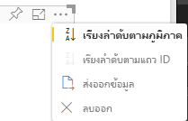

# <a name="sorting-options-for-power-bi-visuals"></a>ตัวเลือกการเรียงลำดับสำหรับวิชวล Power BI

บทความนี้อธิบายวิธีการที่ตัวเลือก *การเรียงลำดับ* ระบุพฤติกรรมการเรียงลำดับสำหรับวิชวล Power BI 

ความสามารถในการเรียงลำดับต้องการหนึ่งในพารามิเตอร์ต่อไปนี้

## <a name="default-sorting"></a>เรียงลำดับค่าเริ่มต้น

ตัวเลือก `default` คือฟอร์มที่ง่ายที่สุด ซึ่งช่วยการเรียงลำดับข้อมูลที่แสดงในส่วน 'DataMappings' ตัวเลือกช่วยให้สามารถเรียงลำดับการแมปข้อมูลโดยผู้ใช้และระบุทิศทางการเรียงลำดับได้

```json
    "sorting": {
        "default": {   }
    }
```



## <a name="implicit-sorting"></a>การเรียงลำดับโดยนัย

การเรียงลำดับโดยนัยเป็นการเรียงลำดับด้วยพารามิเตอร์อาร์เรย์ `clauses` ซึ่งอธิบายการเรียงลำดับสำหรับแต่ละบทบาทข้อมูล `implicit` หมายความว่าผู้ใช้ของวิชวลไม่สามารถเปลี่ยนลำดับการจัดเรียงได้ Power BI จะไม่แสดงตัวเลือกการเรียงลำดับในเมนูของวิชวล อย่างไรก็ตาม Power BI จะเรียงลำดับข้อมูลสอดคล้องกับการตั้งค่าที่ระบุ

พารามิเตอร์ `clauses` สามารถประกอบด้วยอ็อบเจ็กต์ ๆ ที่มีพารามิเตอร์สองตัว:

- `role`: กำหนด `DataMapping` สำหรับการจัดเรียง
- `direction`: กำหนดทิศทางการเรียงลำดับ (1 = จากน้อยไปหามาก 2 = จากมากไปหาน้อย)

```json
    "sorting": {
        "implicit": {
            "clauses": [
                {
                    "role": "category",
                    "direction": 1
                },
                {
                    "role": "measure",
                    "direction": 2
                }
            ]
        }
    }
```

## <a name="custom-sorting"></a>การเรียงลำดับแบบกำหนดเอง

การเรียงลำดับแบบกำหนดเองหมายถึงการจัดเรียงนั้นได้รับการจัดการโดยนักพัฒนาในโค้ดของวิชวล
