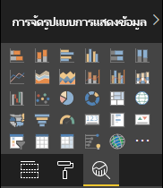

# <a name="power-bi-visual-project-structure"></a>โครงสร้างของโครงการแสดงผล Power BI

หลังจากดำเนินการใหม่ .pbiviz `<visual project name>`เครื่องมือจะสร้างโครงสร้างพื้นฐานของไฟล์และโฟลเดอร์ใน`<visual project name>`โฟลเดอร์

## <a name="visual-project-structure"></a>โครงสร้างของโครงการแสดงผล


* `.vscode` -มีการตั้งค่าของโครงการสำหรับ VS Code เพื่อกำหนดค่าพื้นที่ทำงานแก้ไขไฟล์ `.vscode/settings.json` ของคุณ อ่านเพิ่มเติม [เกี่ยวกับการตั้งค่า VS Code ในเอกสารประกอบ](https://code.visualstudio.com/docs/getstarted/settings)

* โฟลเดอร์ `assets` มีเฉพาะไฟล์ `icon.png` เครื่องมือจะใช้ไฟล์นี้เป็นไอคอนของการแสดงผลในหน้าต่างการแสดงภาพของ Power BI

    

* โฟลเดอร์ `node_modules` มีแพคเกจทั้งหมด [ ถูกติดตั้งโดยตัวจัดการแพคเกจโหนด](https://docs.npmjs.com/files/folders.html)

* โฟลเดอร์ `src` มีรหัสแหล่งที่มาของวิชวล ตามค่าเริ่มต้นเครื่องมือจะสร้างสองไฟล์:

  * `visual.ts` -รหัสแหล่งที่มาหลักของการแสดงผล

  * `settings.ts` -รหัสของการตั้งค่าสำหรับการแสดงผลด้วยภาพ คลาสในไฟล์ทำงานได้ง่ายขึ้น [ด้วยคุณสมบัติวิชวล](./objects-properties.md#properties)

* โฟลเดอร์ `style` มีไฟล์ `visual.less` ที่มีลักษณะสำหรับการแสดงผลด้วยภาพ

* ไฟล์ `capabilities.json` ประกอบด้วยคุณสมบัติหลักและการตั้งค่าสำหรับการแสดงผลด้วยภาพ ซึ่งช่วยให้การแสดงผลด้วยภาพเพื่อประกาศคุณลักษณะ วัตถุ คุณสมบัติ และการแมปมุมมองข้อมูลที่ได้รับการสนับสนุน

    อ่านเพิ่มเติม[เกี่ยวกับความสามารถในการจัดทำเอกสาร](./capabilities.md)

* `package-lock.json` ถูกสร้างขึ้นโดยอัตโนมัติสำหรับการดำเนินการใดๆที่ npm ปรับเปลี่ยนทรี `node_modules` หรือ `package.json`

    อ่านเพิ่มเติม[เกี่ยวกับ`package-lock.json` ในเอกสารที่เป็นทางการของ NPM](https://docs.npmjs.com/files/package-lock.json)

* `package.json` อธิบายแพคเกจโครงการ โดยทั่วไปแล้วจะมีข้อมูลเกี่ยวกับโครงการผู้เขียนคำอธิบายและการขึ้นต่อกันของโครงการ

    อ่านเพิ่มเติม[เกี่ยวกับ`package.json` ในเอกสารที่เป็นทางการของ NPM](https://docs.npmjs.com/files/package.json.html)

* `pbiviz.json` ประกอบด้วยเมตาดาต้าวิชวล ระบุเมตาดาต้าของวิชวลในไฟล์นี้

    เนื้อหาทั่วไปของไฟล์:

  ```json
    {
        "visual": {
            "name": "<visual project name>",
            "displayName": "<visual project name>",
            "guid": "<visual project name>23D8B823CF134D3AA7CC0A5D63B20B7F",
            "visualClassName": "Visual",
            "version": "1.0.0",
            "description": "",
            "supportUrl": "",
            "gitHubUrl": ""
        },
        "apiVersion": "2.6.0",
        "author": { "name": "", "email": "" },
        "assets": { "icon": "assets/icon.png" },
        "externalJS": null,
        "style": "style/visual.less",
        "capabilities": "capabilities.json",
        "dependencies": null,
        "stringResources": []
    }
  ```

    ที่ซึ่ง

  * `name` -ชื่อภายในของการแสดงผล

  * `displayName` -ชื่อของวิชวลในอินเทอร์เฟซ UI ของ Power BI

  * `guid` -ID ที่ไม่ซ้ำกันของการแสดงผล

  * `visualClassName` -ชื่อของระดับชั้นหลักสำหรับการแสดงผลด้วยภาพ Power BI สร้างตัวอย่างของคลาสนี้เพื่อเริ่มใช้การแสดงผลด้วยภาพในรายงาน Power BI

  * `version` - หมายเลขเวอร์ชันของการแสดงผล

  * `author` - มีชื่อของผู้สร้างและอีเมลติดต่อ

  * `icon` ใน `assets`-เส้นทางไปยังแฟ้มไอคอนสำหรับการแสดงผล

  * `externalJS` มีเส้นทางสำหรับไลบรารี JS ที่ใช้ในการแสดงผล

    > [!IMPORTANT]
    > เครื่องมือ3.x รุ่นล่าสุดหรือสูงกว่าไม่ได้ใช้ `externalJS` อีกต่อไป

  * `style` เป็นเส้นทางไปยังไฟล์ลักษณะ

  * `capabilities` เป็นเส้นทางไปยังไฟล์ `capabilities.json`

  * `dependencies` เป็นเส้นทางไปยังไฟล์ `dependencies.json` `dependencies.json` ประกอบด้วยข้อมูลเกี่ยวกับแพคเกจ R ที่ใช้ในการแสดงผลด้วยภาพตาม R

  * `stringResources` เป็นอาร์เรย์ของเส้นทางไปยังไฟล์ที่มีการระบุตำแหน่ง

  อ่านเพิ่มเติ่ม[เกี่ยวกับการระบุตำแหน่งในการแสดงผลในเอกสาร](./localization.md)

* `tsconfig.json` ไฟล์การกำหนดค่าสำหรับ TypeScript

    อ่านเพิ่มเติม[เกี่ยวกับการกำหนดค่า TypeScript ในเอกสารที่เป็นทางการ](https://www.typescriptlang.org/docs/handbook/tsconfig-json.html)

    ส่วน `tsconfig.json` ใน `files` ต้องประกอบด้วยเส้นทางไปยังแฟ้ม * ts ที่มีการระบุระดับชั้นหลักของวิชวลในคุณสมบัติ `visualClassName` ของไฟล์ `pbiviz.json`

* ไฟล์ `tslint.json` มีการกำหนดค่า TSLint

    อ่านเพิ่มเติม[เกี่ยวกับการกำหนดค่า TSLint ในเอกสารที่เป็นทางการ](https://palantir.github.io/tslint/usage/configuration/)

## <a name="next-steps"></a>ขั้นตอนถัดไป

* อ่านเพิ่มเติม[เกี่ยวกับแนวคิดการแสดงผลด้วยภาพ](./power-bi-visuals-concept.md) เพื่อทำความเข้าใจวิธีการแสดงผลด้วยภาพผู้ใช้และ Power BI โต้ตอบกับแต่ละอื่นๆได้ดียิ่งขึ้น

* เริ่มต้นการพัฒนาการแสดงผลของ Power BI ของคุณเองตั้งแต่เริ่มต้น [ด้วยคำแนะนำทีละขั้นตอน](./custom-visual-develop-tutorial.md)
