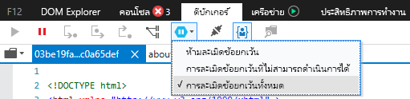
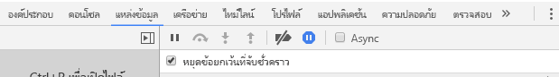

# <a name="how-to-debug-power-bi-visuals"></a>วิธีการแก้ไขจุดบกพร่องของการแสดงผลด้วยภาพของ Power BI

หน้านี้แสดงเคล็ดลับบางอย่างสำหรับการแก้ไขจุดบกพร่องในขณะที่สร้างการแสดงด้วยภาพของคุณ ซึ่งประกอบด้วยขั้นตอนพื้นฐานและแสดงความแตกต่างระหว่างแอปพลิเคชัน frontend มาตรฐานและการแก้ไขจุดบกพร่องของการแสดงผลด้วยภาพของ Power BI
หลังจากอ่านบทความ คุณจะสามารถแก้ไขจุดบกพร่องของวิชวล Power BI โดยใช้จุดสั่งหยุด ข้อยกเว้นการบันทึก และตรวจจับข้อยกเว้นใน Chrome และ Microsoft Edge

## <a name="using-breakpoints"></a>การใช้จุดสั่งหยุด

เนื่องจาก JavaScript ของการแสดงผลด้วยภาพจะโหลดทุกครั้งที่มีการอัปเดตแอปจุดสั่งหยุดใด ๆ ที่คุณเพิ่มจะหายไปเมื่อมีการรีเฟรชการแก้ไขจุดบกพร่องการแสดงผลด้วยภาพ เนื่องจากเป็นวิธีการแก้ไข ให้ใช้คำสั่ง `debugger` ในรหัสของคุณ ระบบขอแนะนำให้ปิดการโหลดอัตโนมัติในขณะที่ใช้ `debugger` ในรหัสของคุณ

```typescript
public update(options: VisualUpdateOptions) {
    console.log('Visual update', options);
    debugger;
    this.target.innerHTML = `<p>Update count: <em>${(this.updateCount</em></p>`;
}
```


## <a name="showing-exceptions"></a>แสดงข้อยกเว้น

เมื่อทำงานกับการแสดงผลด้วยภาพของคุณ คุณจะสังเกตเห็นว่าข้อผิดพลาดทั้งหมด 'ถูกใช้ไป' โดยบริการของ Power BI นี่คือฟีเจอร์ที่จงใจของ Power BI เพื่อป้องกันไม่ให้การแสดงผลด้วยภาพที่ไม่เหมาะสมทำให้แอปทั้งหมดไม่เสถียร

เนื่องจากเป็นวิธีการแก้ไข โปรดเพิ่มรหัสเพื่อจับและบันทึกข้อยกเว้นของคุณ หรือตั้งค่าตัวแก้ไขจุดบกพร่องของคุณเพื่อแบ่งข้อยกเว้นที่ถูกจับ


## <a name="log-exceptions"></a>ข้อยกเว้นของรายการบันทึก

หากต้องการบันทึกข้อยกเว้นในการแสดงผลด้วยภาพของ Power BI ของคุณ ให้เพิ่มรหัสต่อไปนี้ลงในการแสดงผลด้วยภาพเพื่อกำหนดมัณฑนาการบันทึกข้อยกเว้น

```typescript
export function logExceptions(): MethodDecorator {
     return function (target: Object, propertyKey: string, descriptor: TypedPropertyDescriptor<Function>)
    : TypedPropertyDescriptor<Function> {
            
        return {
            value: function () {
                try {
                    return descriptor.value.apply(this, arguments);
                } catch (e) {
                    console.error(e);
                    throw e;
                }
            }
        }
    }
}
```
จากนั้น คุณจะสามารถใช้มัณฑนานี้บนฟังก์ชันใดๆ เพื่อดูการบันทึกข้อผิดพลาดได้

```typescript
@logExceptions()
public update(options: VisualUpdateOptions) {
```

## <a name="break-on-exceptions"></a>แบ่งข้อยกเว้น

คุณยังสามารถตั้งค่าเบราว์เซอร์เพื่อแบ่งข้อยกเว้นที่ถูกจับได้ การดำเนินการนี้จะเป็นการหยุดการทำงานของรหัสที่มีข้อผิดพลาดเกิดขึ้น และช่วยให้คุณสามารถแก้จุดบกพร่องที่นั่นได้เลย

### <a name="edge"></a>Edge

1. เปิดเครื่องมือสำหรับนักพัฒนา (F12)
2. ไปที่แท็บ**ตัวแก้ไขจุดบกพร่อง**
3. คลิกที่ไอคอน**แบ่งส่วนข้อยกเว้น** (รูปหกเหลี่ยมที่มีสัญลักษณ์หยุดชั่วคราว)
4. เลือก**แบ่งส่วนข้อยกเว้นทั้งหมด**



## <a name="chrome"></a>Chrome

1. เปิดเครื่องมือสำหรับนักพัฒนา (F12)
2. ไปที่แท็บ**แหล่งที่มา**
3. คลิกที่ไอคอน**แบ่งส่วนข้อยกเว้น** (รูปหกเหลี่ยมที่มีสัญลักษณ์หยุดชั่วคราว)
4. เลือกกล่องกาเครื่องหมาย**หยุดชั่วคราวบนข้อยกเว้นที่ถูกจับ**



## <a name="next-steps"></a>ขั้นตอนถัดไป
* [แก้ปัญหาการแสดงผลด้วยภาพของ Power BI](power-bi-custom-visuals-troubleshoot.md)
* สำหรับข้อมูลเพิ่มเติมและคำตอบที่คุณอยากรู้  โปรดเยี่ยมชม[คำถามที่ถามบ่อยเกี่ยวกับการแสดงผลด้วยภาพของ Power BI](power-bi-custom-visuals-faq.md#organizational-power-bi-visuals)
