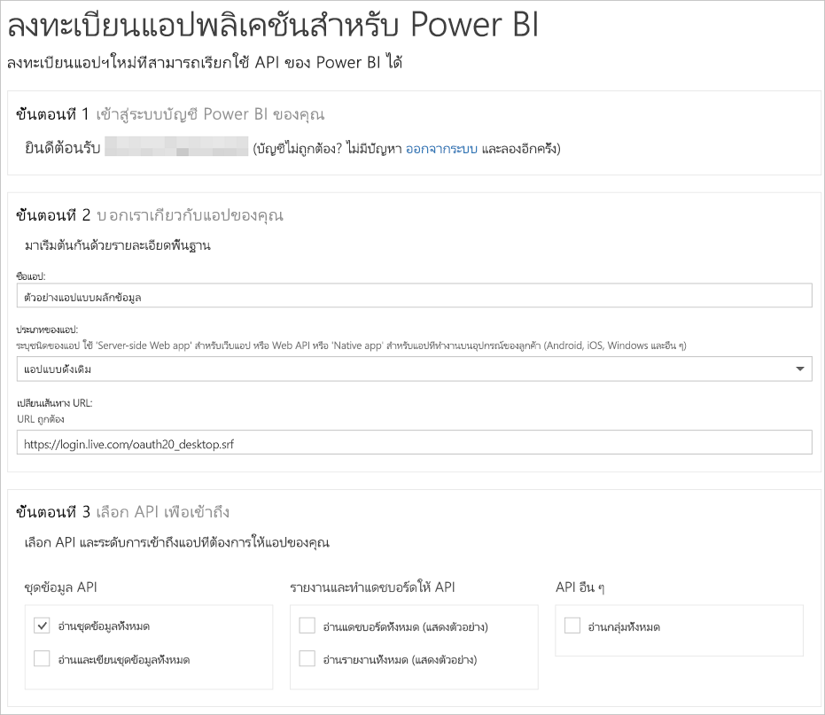

# ขั้นตอนที่ 1: ลงทะเบียนแอปด้วย Azure AD
บทความนี้เป็นส่วนหนึ่งของการฝึกปฏิบัติทีละขั้นตอนเพื่อ[ส่งข้อมูลไปยังชุดข้อมูล](walkthrough-push-data.md)

ขั้นตอนแรกเพื่อส่ง (push) ข้อมูลลงในชุดข้อมูลของ Power BI คือ ต้องลงทะเบียนแอปของคุณใน Azure AD คุณจำเป็นต้องทำสิ่งนี้ก่อนเพื่อให้คุณมี **ID ไคลเอ็นต์**ที่ระบุแอปของคุณใน Azure AD หากไม่มี **ID ไคลเอ็นต์** Azure AD จะไม่สามารถรับรองความถูกต้องแอปของคุณได้

> **หมายเหตุ**: ก่อนที่คุณลงทะเบียนแอปสำหรับ Power BI คุณจำเป็นต้อง[ลงทะเบียน Power BI](create-an-azure-active-directory-tenant.md)
> 
> 

ต่อไปนี้เป็นขั้นตอนในการลงทะเบียนแอปใน Azure AD

## ลงทะเบียนแอปใน Azure AD
1. ไปที่ dev.powerbi.com/apps
2. คลิก**ลงชื่อเข้าใช้ด้วยบัญชีของคุณที่มีอยู่**และลงชื่อเข้าใช้บัญชี Power BI ของคุณ
3. ใส่ข้อมูล**ชื่อแอป**เช่น "ตัวอย่างแอปการพุชข้อมูล"
4. สำหรับ**ชนิดของแอป**เลือก**แอปแบบดั้งเดิม**
5. ใส่ **เปลี่ยนเส้นทาง URL** เช่น **https://login.live.com/oauth20_desktop.srf** สำหรับ **Native client app** url เปลี่ยนเส้นทางให้รายละเอียดเพิ่มเติมแก่ **Azure AD** เกี่ยวกับแอปพลิเคชันเฉพาะเจาะจงที่จะรับรองความถูกต้อง Uri มาตรฐานสำหรับแอปไคลเอ็นต์คือ https://login.live.com/oauth20_desktop.srf
6. สำหรับ **เลือก API เพื่อเข้าถึง** ให้เลือก **อ่านและเขียนชุดข้อมูลทั้งหมด** สำหรับสิทธิ์แอป Power BI ทั้งหมด ดู [สิทธิ์ Power BI](power-bi-permissions.md)
7. คลิก**ลงทะเบียนแอป** และบันทึก **ID ไคลเอ็นต์**ที่ถูกสร้างขึ้น **ID ไคลเอ็นต์**ระบุแอปใน Azure AD

นี่คือลักษณะที่หน้า**ลงทะเบียนแอปพลิเคชันสำหรับ Power BI**ควรมี:

ขั้นตอนถัดไปคือวิธีการ[รับโทเค็นการเข้าถึงการรับรองความถูกต้อง](walkthrough-push-data-get-token.md)

[ขั้นตอนถัดไป >](walkthrough-push-data-get-token.md)

## ขั้นตอนถัดไป
[ลงทะเบียนใช้งาน Power BI](create-an-azure-active-directory-tenant.md)  
[รับโทเค็นการเข้าถึงการรับรองความถูกต้อง](walkthrough-push-data-get-token.md)  
[การฝึกปฏิบัติ: ส่งข้อมูลลงในชุดข้อมูล](walkthrough-push-data.md)  
[ลงทะเบียนแอปพลิเคชัน](register-app.md)  
[ภาพรวมของ Power BI REST API](overview-of-power-bi-rest-api.md)  

มีคำถามเพิ่มเติมหรือไม่ [ลองถามชุมชน Power BI](http://community.powerbi.com/)

