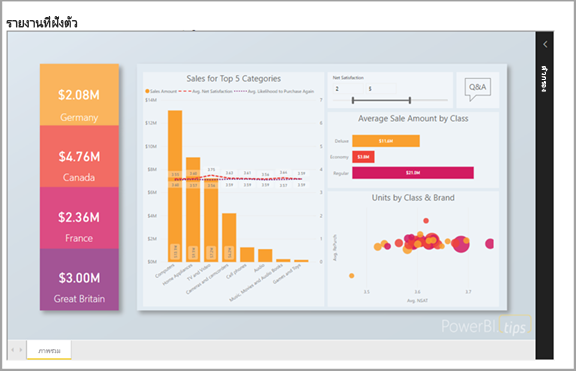
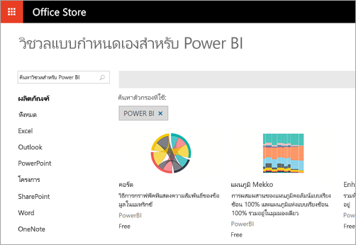

# นักพัฒนาสามารถทำอะไรกับ Power BI ได้บ้าง

นักพัฒนามีตัวเลือกอื่นในการพยายามใส่เนื้อหา Power BI ลงในแอปพลิเคชัน ในฐานะนักพัฒนา คุณสามารถใช้ตัวเลือกเหล่านี้รวมถึง**การฝังด้วย Power BI**, **ภาพแบบกำหนดเอง**และ**พุชข้อมูลลงใน Power BI**ได้

## ฝังเนื้อหา Power BI

บริการ Power BI (SaaS) และบริการ Power BI Embedded ใน Azure (PaaS) มี API สำหรับการฝังสำหรับแดชบอร์ดและรายงาน ฟีเจอร์นี้หมายความว่า คุณสามารถเข้าถึงฟีเจอร์ล่าสุด Power BI – เช่น แดชบอร์ด เกตเวย์ และพื้นที่ทำงานแอป – เมื่อมีการฝังเนื้อหาของคุณ

คุณสามารถเข้าถึง[เครื่องมือตั้งค่าการฝังตัว](https://aka.ms/embedsetup)เพื่อเริ่มต้นใช้งานได้อย่างรวดเร็ว และดาวน์โหลดแอปพลิเคชันตัวอย่างได้

เลือกโซลูชันที่เหมาะกับคุณ:

* [การฝังตัวสำหรับลูกค้าของคุณ](embedding.md#embedding-for-your-customers) จะมอบความสามารถในการฝังแดชบอร์ดและรายงานสำหรับผู้ใช้ที่ไม่มีบัญชี Power BI เรียกใช้โซลูชัน[การฝังตัวสำหรับลูกค้าของคุณ](https://aka.ms/embedsetup/AppOwnsData)

* [การฝังตัวสำหรับองค์กรของคุณ](embedding.md#embedding-for-your-organization) ให้คุณสามารถขยายบริการของ Power BI เรียกใช้โซลูชัน[การฝังตัวสำหรับองค์กรของคุณ](https://aka.ms/embedsetup/UserOwnsData)

เมื่อต้องการเรียนรู้เพิ่มเติมเกี่ยวกับการฝังตัวด้วย Power BI โปรดดู[การฝังตัวด้วย Power BI](embedding.md)

## สร้างภาพแบบกำหนดเอง

คุณสามารถใช้ภาพแบบกำหนดเองด้วย Power BI เพื่อสร้างภาพที่เป็นเอกลักษณ์ที่เหมาะสมกับคุณหรือบริษัทของคุณ นักพัฒนามักสร้างภาพแบบกำหนดเองเหล่านี้ การสร้างภาพดังกล่าวเกิดขึ้นเมื่อภาพต่าง ๆ ที่มีอยู่ใน Power BI ไม่ตรงกับความต้องการของคุณ

คุณสามารถสร้างภาพแบบกำหนดเองของคุณสำหรับใช้งานภายในรายงาน Power BI ได้ ภาพแบบกำหนดเองจะถูกเขียนในภาษา TypeScript ซึ่งเป็นเซตใหญ่ของ JavaScript TypeScript สนับสนุนคุณลักษณะขั้นสูงและสิทธิ์การเข้าถึงฟังก์ชัน ES6/ES7 บางอย่าง สามารถใช้สไตล์ชีต (CSS) กำหนดลักษณะของภาพได้ เพื่อความสะดวกของคุณ เราใช้พรีคอมไพเลอร์น้อยลง ซึ่งสนับสนุนฟีเจอร์ขั้นสูงบางอย่าง เช่น การซ้อน ตัวแปร เงื่อนไข การทำงานเป็นรอบซ้ำ ๆ และคุณลักษณะต่าง ๆ ถ้าคุณไม่ต้องการใช้คุณลักษณะเหล่านั้น คุณสามารถเขียน CSS แบบธรรมดาในไฟล์ที่เล็กกว่า

เมื่อต้องเริ่มเรียนรู้เพิ่มเติมเกี่ยวกับการพัฒนาภาพแบบกำหนดเอง โปรดดู[ใช้เครื่องมือสำหรับนักพัฒนาเพื่อสร้างวิชวลแบบกำหนดเอง](../service-custom-visuals-getting-started-with-developer-tools.md)

## ใช้ API อัตโนมัติ

Power BI แสดงแดชบอร์ดที่สามารถโต้ตอบกับผู้ใช้ และสามารถสร้างและปรับปรุงข้อมูลจากแหล่งข้อมูลที่หลากหลายในเวลาจริง เมื่อใช้ภาษาโปรแกรมใด ๆ ที่สนับสนุนการเรียก REST คุณสามารถสร้างแอปที่ทำงานร่วมกับแดชบอร์ด Power BI แบบเรียลไทม์ คุณยังสามารถรวมไทล์และรายงาน Power BI เข้าไปในแอป

นักพัฒนายังสามารถสร้างการแสดงภาพจากข้อมูลของพวกเขาเอง ที่สามารถใช้ในรายงานและแดชบอร์ดที่โต้ตอบกับผู้ใช้ได้

เมื่อต้องดูสิ่งที่คุณสามารถทำได้ด้วย API ของ Power BI โปรดดู[นักพัฒนาสามารถทำอะไรด้วย API ของ Power BI](overview-of-power-bi-rest-api.md)

## ขั้นตอนถัดไป

[การฝังด้วย Power BI](embedding.md)  

[พัฒนาภาพแบบกำหนดเองของ Power BI](https://microsoft.github.io/PowerBI-visuals/docs/step-by-step-lab/developing-a-power-bi-custom-visual/)

[นักพัฒนาสามารถทำอะไรด้วย API ของ Power BI ได้บ้าง](overview-of-power-bi-rest-api.md)

[ศูนย์นักพัฒนา Power BI](https://powerbi.microsoft.com/developers/)