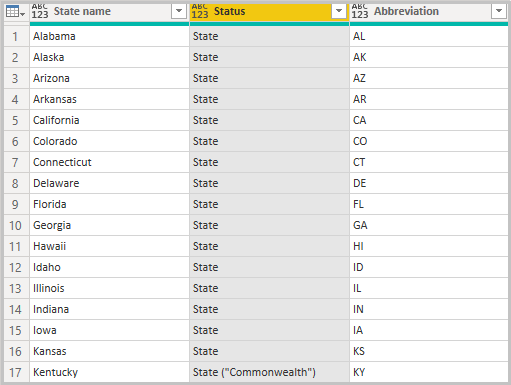

# เริ่มต้นใช้งาน Power BI Desktop
ยินดีต้อนรับสู่คู่มือการเริ่มต้นสำหรับ Power BI Desktop ทัวร์นี้แสดงวิธีการที่ Power BI Desktop ทำงาน สิ่งที่สามารถทำได ้และวิธีการสร้างโมเดลข้อมูลที่แข็งแกร่ง และรายงานที่น่าทึ่ง เพื่อขยายข่าวกรองธุรกิจของคุณ

สำหรับภาพรวมอย่างรวดเร็วของวิธีการ Power BI Desktop ทำงานและวิธีการใช้งาน คุณสามารถสแกนหน้าจอในคำแนะนำนี้ได้ในเวลาเพียงไม่กี่นาที เพื่อให้เข้าใจอย่างถ่องแท้มากขึ้น คุณสามารถอ่านแต่ละส่วนโดยละเอียดและดำเนินการตามขั้นตอน และสร้างไฟล์ Power BI Desktop ของคุณเองเพื่อโพสต์ไปยัง [บริการ Power BI](https://app.powerbi.com/) และแชร์กับผู้อื่น

นอกจากนี้คุณยังสามารถดูวิดีโอ [เริ่มต้นใช้งานกับ Power BI Desktop](https://www.youtube.com/watch?v=Qgam9M8I0xA) และดาวน์โหลดเวิร์กบุ๊ก Excel [ตัวอย่างทางการเงิน](https://go.microsoft.com/fwlink/?LinkID=521962) เพื่อทำตามวิดีโอ

> [!IMPORTANT]
> มีการอัปเดตและเผยแพร่ Power BI Desktop เป็นประจำทุกเดือน ซึ่งจะรวมคำติชมของลูกค้าและคุณสมบัติใหม่ด้วย รองรับเฉพาะเวอร์ชันล่าสุดของ Power BI Desktop เท่านั้น ซึ่งฝ่ายสนับสนุนสำหรับ Power BI Desktop จะขอให้ลูกค้าที่ติดต่อมาอัปเกรดเป็นเวอร์ชันล่าสุด คุณสามารถดาวน์โหลด Power BI Desktop เวอร์ชันล่าสุดได้จาก [Windows Store](https://aka.ms/pbidesktopstore) หรือไฟล์ปฏิบัติการเดียวซึ่งมีภาษาที่รองรับทั้งหมดที่คุณ[ดาวน์โหลด](https://www.microsoft.com/download/details.aspx?id=58494)และติดตั้งบนคอมพิวเตอร์ของคุณ

## วิธีการทำงานของ Power BI Desktop
ด้วย Power BI Desktop คุณสามารถ
1. เชื่อมต่อกับข้อมูล รวมถึงแหล่งข้อมูลที่หลากหลาย
1. จัดรูปร่างข้อมูลด้วยคิวรีที่สร้างรูปแบบข้อมูลเชิงลึกและน่าสนใจ
1. ใช้รูปแบบข้อมูลเพื่อสร้างการแสดงภาพและรายงาน 
1. แชร์ไฟล์รายงานของคุณให้กับผู้อื่นเพื่อใช้ประโยชน์ สร้างตาม และแชร์ คุณสามารถแชร์ไฟล์ Power BI Desktop *.pbix* เช่นเดียวกับไฟล์อื่นๆ แต่วิธีที่น่าสนใจที่สุดคือการอัปโหลดไปยัง [บริการของ Power BI](https://preview.powerbi.com/) 

Power BI Desktop ผสานรวมเทคโนโลยีกลไกจัดการคิวรี Microsoft การสร้างรูปแบบข้อมูล และการแสดงภาพ นักวิเคราะห์ข้อมูลและผู้อื่นสามารถสร้างคอลเลกชันของคิวรี การเชื่อมต่อข้อมูล แบบจำลอง และรายงานและแชร์กับผู้อื่นได้อย่างง่ายดาย ผ่านการรวมกันของ Power BI Desktop และบริการของ Power BI ข้อมูลเชิงลึกใหม่จากโลกของข้อมูลจะง่ายต่อการจำลอง สร้าง แชร์และขยาย

Power BI Desktop สร้างความเป็นศูนย์กลาง ลดความซับซ้อน และสร้างความราบรื่นในการใช้งานสิ่งที่อาจอยู่กระจัดกระจาย ไม่เชื่อมโยงกัน และกระบวนที่ยากลำบากในการออกแบบและสร้างเรื่องราวและรายงานข่าวกรองทางธุรกิจ
พร้อมที่จะลองทำหรือยัง? มาเริ่มต้นกันเลย

> [!NOTE]
> สำหรับข้อมูลและรายงานที่ต้องคงไว้ในสถานที่ มีเวอร์ชันแยกและเวอร์ชันพิเศษของ Power BI เรียกว่า [เซิร์ฟเวอร์รายงาน Power BI](../report-server/get-started.md) เซิร์ฟเวอร์รายงาน Power BI ใช้เวอร์ชันที่แยกต่างหากและเวอร์ชันเฉพาะของ Power BI Desktop ที่เรียกว่า Power BI Desktop สำหรับเซิร์ฟเวอร์รายงาน Power BI ซึ่งทำงานกับเวอร์ชันเซิร์ฟเวอร์รายงานของ Power BI เท่านั้น บทความนี้อธิบาย Power BI Desktop มาตรฐาน

## ติดตั้งและเปิดใช้งาน Power BI Desktop
หากต้องการดาวน์โหลด Power BI Desktop ให้ไปที่ [หน้าดาวน์โหลด Power BI Desktop](https://powerbi.microsoft.com/desktop) และเลือก **ดาวน์โหลดฟรี** หรือสำหรับตัวเลือกดาวน์โหลด ให้เลือก [ดูตัวเลือกดาวน์โหลดหรือภาษา](https://www.microsoft.com/download/details.aspx?id=58494) 

นอกจากนี้ คุณยังสามารถดาวน์โหลด Power BI Desktop จากบริการ Power BI เลือกไอคอน **ดาวน์โหลด** ในแถบเมนูด้านบน แล้วเลือก **Power BI Desktop**

ในหน้า Microsoft Store ให้เลือก **รับ** และทำตามพร้อมท์เพื่อติดตั้ง Power BI Desktop บนคอมพิวเตอร์ของคุณ เริ่มต้น Power BI Desktop จากเมนู **เริ่มต้น** Windows หรือจากไอคอนในแถบงาน Windows

ครั้งแรกที่เริ่มใช้ Power BI Desktop จะแสดงหน้าจอ **ยินดีต้อนรับ**

จากหน้าจอ **ยินดีต้อนรับ** คุณสามารถ **รับข้อมูล** ดู **ทรัพยากรล่าสุด** เปิดรายงานล่าสุด **เปิดรายงานอื่นๆ**  หรือเลือกลิงก์อื่น ๆ คุณยังสามารถเลือกว่าจะแสดงหน้าจอ **ยินดีต้อนรับ** เสมอเมื่อเริ่มต้นหรือไม่ เลือกไอคอนปิด เพื่อปิดหน้าจอ **ยินดีต้อนรับ**

ทางด้านซ้ายของ Power BI Desktop คือไอคอนสำหรับมุมมอง Power BI Desktop สามมุมมอง: **รายงาน** **ข้อมูล** และ **ความสัมพันธ์**จากบนลงล่าง มุมมองปัจจุบันจะแสดงโดยแถบสีเหลืองทางด้านซ้ายและคุณสามารถเปลี่ยนมุมมองได้โดยการเลือกไอคอนใดๆ 

มุมมอง **รายงาน** เป็นมุมมองเริ่มต้น 

Power BI Desktop ยังรวมถึง ตัวแก้ไข **Power Query** ซึ่งเปิดในหน้าต่างแยก ใน **ตัวแก้ไข Power Query** คุณสามารถสร้างคิวรีและแปลงข้อมูลได้ จากนั้นโหลดแบบจำลองข้อมูลที่ปรับแต่งแล้วนั้นลงใน Power BI Desktop เพื่อสร้างรายงาน

## เชื่อมต่อกับข้อมูล
เมื่อคุณติดตั้ง Power BI Desktop แล้ว คุณก็พร้อมที่จะเชื่อมต่อกับโลกแห่งข้อมูลที่ขยายขึ้นเรื่อย ๆ หากต้องการดูแหล่งข้อมูลหลายชนิดที่ใช้ได้ ให้เลือก **รับข้อมูล** > **เพิ่มเติม** ในแท็บ **หน้าแรก** ของ Power BI Desktop และในหน้าต่าง **รับข้อมูล** ให้เลื่อนผ่านรายการแหล่งข้อมูล **ทั้งหมด** ในการทัวร์ด่วนนี้ คุณเชื่อมต่อกับแหล่งข้อมูล **เว็บ** ที่แตกต่างกันสองสามแห่ง

จินตนาการว่าคุณเป็นนักวิเคราะห์ข้อมูลกำลังทำงานให้กับร้านค้าปลีกแว่นตากันแดด คุณต้องการช่วยยอดขายแว่นกันแดดตามเป้าหมายของลูกค้าในพื้นที่ที่มีีแดดแรงบ่อยมากที่สุด Bankrate.com หน้า [Best and worst states for retirement (รัฐที่ดีที่สุดและแย่ที่สุดสำหรับเกษียณ) ](https://www.bankrate.com/retirement/best-and-worst-states-for-retirement/) มีข้อมูลที่น่าสนใจในหัวเรื่องนี้

บนแท็บ **หน้าแรก** ของ Power BI Desktop ให้เลือก **รับข้อมูล** > **เว็บ** เพื่อเชื่อมต่อกับแหล่งข้อมูลเว็บ 

ในกล่องโต้ตอบ **จากเว็บ** วางที่อยู่ *https:\//www.bankrate.com/retirement/best-and-worst-states-for-retirement/* ลงในเขตข้อมูล **URL** แล้วเลือก **ตกลง** 

หากมีข้อความปรากฏขึ้น บนหน้าจอ **เข้าถึงเนื้อหาเว็บ** ให้เลือก **เนื้อหา** เพื่อใช้การเข้าถึงแบบไม่ระบุชื่อ 

ฟังก์ชันการทำงานของ Power BI Desktop จะทำงานและติดต่อทรัพยากรเว็บ หน้าต่าง **ตัวนำทาง** จะแสดงสิ่งที่พบบนหน้าเว็บ ในกรณีนี้คือตารางที่ชื่อว่า **Ranking of best and worst states for retirement (ลำดับของรัฐที่ดีที่สุดและแย่ที่สุดสำหรับเกษียณ)** และเอกสาร คุณสนใจในตาราง ดังนั้นให้เลือกตารางเพื่อดูตัวอย่าง

ในจุดนี้ คุณสามารถเลือก **โหลด** เพื่อโหลดตารางหรือ **การแปลงข้อมูล** เพื่อทำการเปลี่ยนแปลงในตารางก่อนที่คุณจะโหลด

เมื่อคุณเลือก **การแปลงข้อมูล** Power Query Editor จะเปิดขึ้นพร้อมกับมุมมองแสดงของตาราง บานหน้าต่าง **การตั้งค่าคิวรี** ด้านขวา หรือคุณสามารถแสดงได้โดยการเลือก **การตั้งค่าคิวรี** บนแท็บ **มุมมอง** ของตัวแก้ไข Power Query 

สำหรับข้อมูลเพิ่มเติมเกี่ยวกับการเชื่อมต่อกับข้อมูล ดู [เชื่อมต่อกับข้อมูลใน Power BI Desktop](../connect-data/desktop-connect-to-data.md)

## จัดรูปร่างข้อมูล
เวลานี้ที่เราเชื่อมต่อกับแหล่งข้อมูลแล้ว คุณสามารถปรับข้อมูลตามความต้องการของคุณ หากต้องการ *จัดรูปร่าง* ข้อมูล คุณให้ตัวแก้ไข Power Query พร้อมคำแนะนำทีละขั้นตอนสำหรับการปรับข้อมูลในขณะที่โหลดและนำเสนอ การจัดรูปร่างไม่กระทบต่อแหล่งข้อมูลเดิม แต่จะมีผลต่อมุมมองข้อมูลนี้เท่านั้น 

> [!NOTE]
> ข้อมูลตารางที่ใช้ในคู่มือนี้อาจเปลี่ยนแปลงเมื่อเวลาผ่านไป ดังนั้นขั้นตอนที่คุณต้องทำตามอาจแตกต่าง ซึ่งคุณจำเป็นต้องใช้ความคิดสร้างสรรค์เกี่ยวกับวิธีการปรับขั้นตอนหรือผลลัพธ์ ซึ่งเป็นส่วนหนึ่งของความสนุกในการเรียนรู้ 

การจัดรูปร่างอาจหมายถึง *การแปลง* ข้อมูล เช่น การเปลี่ยนชื่อคอลัมน์หรือตาราง การลบแถวหรือคอลัมน์ หรือเปลี่ยนประเภทข้อมูล Power Query Editor จะจับขั้นตอนเหล่านี้ตามลำดับภายใต้ **ใช้ขั้นตอน** ในบานหน้าต่าง **การตั้งค่าคิวรี** แต่ละครั้งที่คิวรีนี้เชื่อมต่อกับแหล่งข้อมูล จะดำเนินการตามขั้นตอนเหล่านั้นเพื่อจัดรูปร่างข้อมูลในรูปแบบที่คุณระบุเสมอ กระบวนการนี้เกิดขึ้นเมื่อคุณใช้คิวรีใน Power BI Desktop หรือเมื่อใครก็ตามที่ใช้คิวรีของคุณที่แชร์ เช่น ในบริการ Power BI 

โปรดทราบว่า **ขั้นตอนที่ใช้งาน** ใน **การตั้งค่าคิวรี** ประกอบด้วยสองสามขั้นตอนแล้ว คุณสามารถเลือกแต่ละขั้นตอนเพื่อดูผลกระทบในตัวแก้ไข Power Query ก่อนอื่นคุณระบุแหล่งที่มาของเว็บและจากนั้นคุณสามารถแสดงตัวอย่างตารางในหน้าต่าง **ตัวนำทาง** ในขั้นตอนที่สาม **เปลี่ยนประเภท** Power BI รับรู้ข้อมูลจำนวนเต็มเมื่อมีการนำเข้า และเปลี่ยน **ข้อความ** *ประเภทข้อมูล* ของเว็บเดิมเป็น **จำนวนเต็ม** 

หากคุณจำเป็นต้องเปลี่ยนประเภทข้อมูล ให้เลือกคอลัมน์หรือคอลัมน์สำหรับเปลี่ยน กดค้างแป้น **Shift** เพื่อเลือกคอลัมน์ติดกันหลายคอลัมน์ หรือกด **Ctrl** เพื่อเลือกคอลัมน์ที่ไม่ติดกัน คลิกขวาที่ส่วนหัวของคอลัมน์ เลือก **เปลี่ยนประเภท** และเลือกประเภทข้อมูลใหม่จากเมนู หรือเลื่อนลงรายการที่อยู่ถัดจาก **ประเภทข้อมูล** ในกลุ่ม **การแปลง** ของแท็บ **หน้าแรก** แล้วเลือกประเภทข้อมูลใหม่

> [!NOTE]
> ตัวแก้ไข Power Query ใน Power BI Desktop ใช้ริบบอน หรือเมนูคลิกขวาสำหรับงานที่พร้อมใช้งาน งานที่คุณสามารถเลือกได้ส่วนใหญ่ในแท็บ **หน้าแรก** หรือ **การแปลง** ของริบบอนยังสามารถใช้งานได้โดยการคลิกขวาบนรายการ แล้วเลือกจากเมนูที่ปรากฏขึ้น

ขณะนี้คุณสามารถใช้การเปลี่ยนและการแปลงข้อมูลของคุณเอง และดูได้ใน **ขั้นตอนที่ใช้** 

ตัวอย่างเช่น สำหรับยอดขายแว่นตากันแดดคุณสนใจในการจัดอันดับสภาพอากาศมากที่สุด ดังนั้นคุณตัดสินใจที่จะจัดเรียงตารางตามคอลัมน์ **สภาพอากาศ** แทนที่จะเป็น **อันดับโดยรวม** วางลูกศรลงที่ด้านข้างหัวข้อ **สภาพอากาศ** แล้วเลือก **จัดเรียงจากน้อยไปหามาก** ในตอนนี้ข้อมูลที่ปรากฏจัดเรียงตามการจัดอันดับสภาพอากาศ และขั้นตอน **แถวที่จัดเรียง** จะปรากฏใน **ขั้นตอนที่ใช้** 

คุณไม่สนใจที่จะขายแว่นกันแดดให้กับรัฐที่สภาพอากาศที่เลวร้ายที่สุด ดังนั้นคุณตัดสินใจที่จะลบรัฐเหล่านั้นออกจากตาราง จาก **ลดแถว**กลุ่มของแท็บ**หลัก**เลือก**เอาแถว** > **ลบแถวล่าง**ออก ในกล่องโต้ตอบ **ลบแถวล่าง** ให้ใส่ *10* จากนั้นเลือก **ตกลง** 

แถวสภาพอากาศที่เลวร้ายที่สุด 10 แถวล่างจะถูกเอาออกจากตาราง และขั้นตอน **ลบแถวล่าง** จะปรากฏใน **ขั้นตอนที่ใช้**

คุณตัดสินใจว่าตารางมีข้อมูลเพิ่มเติมมากเกินไปสำหรับความต้องการของคุณ และต้องการลบคอลัมน์ **กำลังในการซื้อ** **อาชญากรรม** **วัฒนธรรม** และ **สุขภาพ** เลือกส่วนหัวของแต่ละคอลัมน์ที่คุณต้องการลบออก กดค้างแป้น **Shift** เพื่อเลือกคอลัมน์ติดกันหลายคอลัมน์ หรือกด **Ctrl** เพื่อเลือกคอลัมน์ที่ไม่ติดกัน 

จากนั้นจาก **จัดการคอลัมน์** กลุ่มของแท็บ **หน้าแรก** เลือก **เอาคอลัมน์ออก** คุณยังสามารถคลิกขวาที่หนึ่งในหัวข้อคอลัมน์ที่เลือก แล้วเลือก **ลบคอลัมน์** จากเมนู คอลัมน์ที่เลือกจะถูกลบออก และขั้นตอน **ลบคอลัมน์** จะปรากฏใน **ขั้นตอนที่ใช้**

เมื่อคิดดูอีกที สุดท้ายแล้ว **กำลังในการซื้อ** อาจสัมพันธ์กับยอดขายแว่นกันแดด คุณต้องการที่จะได้รับคอลัมน์นั้นกลับมา คุณสามารถยกเลิกการทำขั้นตอนล่าสุดในบานหน้าต่าง **ขั้นตอนที่ใช้** โดยการเลือกไอคอนลบ **X** ที่อยู่ถัดจากขั้นตอน เวลานี้ยกเลิกการทำขั้นตอน ให้เลือกเฉพาะคอลัมน์ที่คุณต้องการลบ เพื่อให้มีความยืดหยุ่นมากขึ้นคุณสามารถลบแต่ละคอลัมน์เป็นขั้นตอนที่แยกต่างหาก 

คุณสามารถคลิกขวาที่ขั้นตอนใดๆ ในบานหน้าต่าง **ขั้นตอนที่ใช้** และเลือกเพื่อลบ เปลี่ยนชื่อ ย้ายขึ้นหรือลงในลำดับ หรือเพิ่มหรือลบขั้นตอนหลังจากนั้น สำหรับขั้นตอนระหว่างกลาง Power BI Desktop จะเตือนคุณหากการเปลี่ยนแปลงอาจส่งผลกระทบต่อขั้นตอนในภายหลังและทำให้คิวรีของคุณเสียหาย  

ตัวอย่างเช่น หากคุณไม่ต้องการจัดเรียงตารางตาม **สภาพอากาศ** อีกต่อไป คุณอาจต้องพยายามลบขั้นตอน **แถวที่จัดเรียงแล้ว** Power BI Desktop เตือนคุณว่าการลบขั้นตอนนี้อาจทำให้คิวรีของคุณเสียหาย คุณได้ลบแถวล่าง 10 แถวหลังจากที่คุณจัดเรียงตามสภาพอากาศไปแล้ว ดังนั้นถ้าคุณลบการจัดเรียงนี้ แถวอื่นๆ จะถูกลบไปด้วย คุณจะได้รับคำเตือนเช่นกัน ถ้าคุณเลือกขั้นตอน **แถวที่จัดเรียงแล้ว** และลองเพิ่มขั้นตอนระดับกลางใหม่ที่จุดนั้น  

สุดท้าย คุณเปลี่ยนชื่อตารางเป็นยอดขายแว่นตาแทนการเกษียณ ภายใต้ **คุณสมบัติ** ในบานหน้าต่าง **การตั้งค่าคิวรี่** ให้เปลี่ยนชื่อเรื่องเก่าด้วย *รัฐที่ดีที่สุดสำหรับการขายแว่นกันแดด*

คิวรีที่เสร็จสิ้นแล้วสำหรับข้อมูลที่จัดรูปร่างแล้วของคุณจะมีลักษณะดังนี้:

สำหรับข้อมูลเพิ่มเติมเกี่ยวกับการจัดรูปร่างข้อมูล ดู [จัดรูปร่างและรวมข้อมูลใน Power BI Desktop](../connect-data/desktop-shape-and-combine-data.md)

## รวมข้อมูล
ข้อมูลเกี่ยวกับรัฐต่าง ๆ นั้นน่าสนใจ และจะเป็นประโยชน์สำหรับการสร้างการวิเคราะห์และการคิวรีเพิ่มเติม แต่มีปัญหาหนึ่งอย่าง: ข้อมูลส่วนใหญ่ใช้ตัวย่อสองตัวอักษรสำหรับรหัสรัฐ ไม่ใช่ชื่อเต็มของรัฐ การใช้ข้อมูลนั้น คุณจำเป็นต้องมีวิธีการสัมพันธ์ชื่อของรัฐของคุณกับตัวย่อ

คุณกำลังโชคดี แหล่งข้อมูลสาธารณะอื่นมีเพียงเท่านั้น แต่ข้อมูลดังกล่าวจะต้องมีจำนวนการจัดรูปแบบที่เป็นธรรมก่อนที่คุณสามารถ *รวม* กับตารางแว่นกันแดดของคุณ

หากต้องการนำเข้าข้อมูลตัวย่อของรัฐลงในตัวแก้ไข Power Query ให้เลือก **แหล่งที่มาใหม่** > **เว็บ** จากกลุ่ม **คิวรีใหม่** บนแท็บ **หน้าแรก** ของริบบอน 

ในกล่องโต้ตอบ **จากเว็บ** ป้อน URL สำหรับเว็บไซต์ตัวย่อของรัฐ: *https:\//en.wikipedia.org/wiki/List_of_U.S._state_abbreviations*

ในหน้าต่าง **ตัวนำทาง** ให้เลือกตาราง **รหัสและตัวย่อสำหรับรัฐ เขตรัฐบาลกลาง ดินแดนในสหรัฐอเมริกา และภูมิภาคอื่น ๆ** และจากนั้นเลือก **ตกลง** ตารางเปิดในตัวแก้ไข Power Query

ลบคอลัมน์ทั้งหมดยกเว้นสำหรับ **ชื่อและรัฐของภูมิภาค** **ชื่อและรัฐของภูมิภาค2** และ **ANSI** การเลือกเฉพาะคอลัมน์เหล่านี้ ให้กดค้าง **Ctrl** แล้วเลือกคอลัมน์ จากนั้น ให้คลิกขวาที่หนึ่งในส่วนหัวของคอลัมน์และเลือก **ลบคอลัมน์อื่น** หรือ จากกลุ่ม **จัดการคอลัมน์** ของแท็บ **หน้าแรก** ให้เลือก **ลบคอลัมน์อื่น** 

เลื่อนลูกศรลงให้อยู่ถัดจากคอลัมน์ **ชื่อและรัฐของภูมิภาค2** แล้วเลือก **ตัวกรอง** > **เท่ากับ** ในกล่องโต้ตอบ **แถวตัวกรอง** เลื่อนลูกศรลงในเขตข้อมูล **ป้อนหรือเลือกค่า** ที่อยู่ถัดจาก **เท่ากับ** แล้วเลือก **รัฐ** 

เลือก **หรือ** และถัดจากเขตข้อมูล **เท่ากับ** ที่สอง ให้เลือก **รัฐ ("เครือจักรภพ")** เลือก**ตกลง** 

เมื่อลบค่าเพิ่มเติม เช่น **เขตของรัฐบาลกลาง** และ **เกาะ** ออกแล้ว เวลานี้คุณมีรายการของรัฐ 50 รัฐ และตัวย่อสองตัวอักษรอย่างเป็นทางการ คุณสามารถเปลี่ยนชื่อคอลัมน์เพื่อให้เข้าใจมากขึ้น ตัวอย่างเช่น **ชื่อรัฐ** **สถานะ** และ **ตัวย่อ** โดยการคลิกขวาที่ส่วนหัวของคอลัมน์ แล้วเลือก **เปลี่ยนชื่อ**

โปรดทราบว่าขั้นตอนเหล่านี้ถูกบันทึกไว้ภายใต้ **ขั้นตอนที่ใช้** ในบานหน้าต่าง **การตั้งค่าคิวรี**

ตารางที่จัดรูปร่างแล้วตอนนี้มีลักษณะดังนี้:

เปลี่ยนชื่อตารางเป็น *รหัสรัฐ* ในเขตข้อมูล **คุณสมบัติ** ของ **การตั้งค่าคิวรี** 

เมื่อจัดรูปร่างตาราง **รหัสรัฐ** แล้ว คุณสามารถ *รวม* ตารางสองตารางเหล่านี้เป็นหนึ่งตาราง เนื่องจากเวลานี้ตารางของคุณมีผลลัพธ์ของคิวรีที่คุณนำไปใช้กับข้อมูล ดังนั้นจึงเรียกตารางเหล่านี้ว่า *คิวรี* เช่นกัน มีสองวิธีหลักของการรวมคิวรีได้แก่ *ผสาน* และ *ผนวก* 

เมื่อคุณต้องการเพิ่มคอลัมน์หนึ่งคอลัมน์หรือมากกว่าเข้าไปในคิวรีอื่น ให้คุณ *ผสาน* คิวรี เมื่อคุณต้องการเพิ่มแถวของข้อมูลเพิ่มเติมลงในคิวรีที่มีอยู่แล้ว ให้คุณ *ผนวก* คิวรี

ในกรณีนี้ คุณต้องการ *ผสาน* คิวรี **รหัสรัฐ** ลงในคิวรี **รัฐที่ดีที่สุดสำหรับแว่นกันแดด** ในการผสานคิวรี ให้สลับคิวรี **รัฐที่ดีที่สุดสำหรับแว่นกันแดด** โดยการเลือกจากบานหน้าต่าง **คิวรี** ทางด้านซ้ายของตัวแก้ไข Power Query จากนั้นเลือก **ผสานคิวรี** จากกลุ่ม **รวม** ในแท็บ **หน้าแรก** ของริบบอน

ในหน้าต่าง **ผสาน** ให้เลื่อนเขตข้อมูลลงเพื่อเลือก **รหัสรัฐ** จากคิวรีอื่นๆ ที่พร้อมใช้งาน เลือกคอลัมน์ให้ตรงกันจากแต่ละตาราง ในกรณีนี้คือ **รัฐ** จากคิวรี **รัฐที่ดีที่สุดสำหรับแว่นกันแดด** และ **ชื่อรัฐ** จากคิวรี **รหัสรัฐ** 

หากคุณรับกล่องโต้ตอบ **ระดับความเป็นส่วนตัว** ให้เลือก **เพิกเฉยต่อการตรวจสอบระดับความเป็นส่วนตัวสำหรับไฟล์นี้** จากนั้นเลือก **บันทึก** เลือก**ตกลง** 

คอลัมน์ใหม่ที่เรียกว่า **รหัสรัฐ** จะปรากฏทางด้านขวาของตาราง **รัฐที่ดีที่สุดสำหรับยอดขายแว่นกันแดด** โดยประกอบด้วยคิวรีรหัสรัฐที่คุณผสานกับคิวรีรัฐที่ดีที่สุดสำหรับยอดขายแว่นกันแดด คอลัมน์ทั้งหมดจากตารางที่ผสานจะถูกบีบลงในคอลัมน์ **รหัสรัฐ** คุณสามารถ *ขยาย* ตารางที่ผสานและรวมเฉพาะคอลัมน์ที่คุณต้องการได้ 

การขยายตารางที่ผสานและเลือกว่ารวมคอลัมน์ใด ให้เลือกไอคอน **ขยาย** ในส่วนหัวของคอลัมน์ ในกล่องโต้ตอบ **ขยาย** ให้เลือกเฉพาะคอลัมน์ **ตัวย่อ** ยกเลิกการเลือก **ใช้ชื่อคอลัมน์เดิมเป็นคำนำหน้า** จากนั้นเลือก **ตกลง** 

> [!NOTE]
> คุณสามารถมีลูกเล่นเกี่ยวกับวิธีการนำเข้าในตาราง **รหัสรัฐ** ทดสอบเล็กน้อย และหากคุณไม่ชอบผลลัพธ์ เพียงแค่ลบขั้นตอนนี้จากรายการ **ขั้นตอนที่ใช้** ในบานหน้าต่าง **การตั้งค่าคิวรี** คุณสามารถทำซ้ำได้หลายครั้งตามที่ต้องการ จนกระทั่งกระบวนการขยายมีลักษณะตามที่คุณต้องการ

สำหรับคำอธิบายที่สมบูรณ์ของแต่ละขั้นตอนการจัดรูปร่างและรวมข้อมูล ดู [การจัดรูปร่างและรวมข้อมูลใน Power BI Desktop](../connect-data/desktop-shape-and-combine-data.md)

ในตอนนี้คุณมีคิวรีตารางเดียว ที่รวมแหล่งข้อมูลสองแหล่ง ซึ่งแต่ละแหล่งถูกจัดรูปร่างให้ตรงตามความต้องการของคุณแล้ว คิวรีนี้สามารถใช้เป็นพื้นฐานสำหรับการเชื่อมต่อข้อมูลเพิ่มเติมที่น่าสนใจอีกมากมาย เช่น ภูมิศาสตร์ ระดับความร่ำรวย และโอกาสสร้างใหม่ในรัฐ

สำหรับเวลานี้ คุณมีข้อมูลที่เพียงพอสำหรับสร้างรายงานที่น่าสนใจใน Power BI Desktop แล้ว เนื่องจากนี่เป็นเหตุการณ์สำคัญ ให้ปรับใช้การเปลี่ยนแปลงใน **ตัวแก้ไข Power Query** และโหลดลงไปใน Power BI Desktop โดยการเลือก **ปิดและปรับใช้** จากแท็บ **หน้าแรก** ของริบบอน นอกจากนี้คุณยังสามารถเลือกเพียง **ปรับใช้** เพื่อเก็บคิวรีให้เปิดอยู่ในตัวแก้ไข Power Query ในขณะที่คุณทำงานใน Power BI Desktop 

คุณสามารถทำการเปลี่ยนแปลงมากขึ้นไปยังตารางหลังจากที่โหลดเข้าใน Power BI Desktop แล้วรีโหลดโมเดลเพื่อปรับใช้การเปลี่ยนแปลงใดๆ ที่คุณได้แก้ไข หากต้องการเปิด **ตัวแก้ไข Power Query** จาก Power BI Desktop ให้เลือก **แก้ไขคิวรี** บนแท็บ **หน้าแรก** ของริบบอน Power BI Desktop 

## สร้างรายงาน
ในมุมมอง **รายงาน** Power BI Desktop คุณสามารถสร้างการแสดงภาพและรายงาน มุมมอง **รายงาน** มีพื้นที่หลักหกพื้นที่:

1. ริบบอนที่ด้านบน ซึ่งแสดงงานทั่วไปที่สัมพันธ์กับรายงานและการแสดงภาพ
2. พื้นที่จัดแสดงตรงกลางที่มีการสร้างและจัดการแสดงภาพ
3. พื้นที่แท็บหน้าที่ด้านล่างที่ให้คุณเลือกและเพิ่มหน้ารายงาน
4. บานหน้าต่าง **ตัวกรอง** ที่ซึ่งคุณสามารถกรองการแสดงภาพข้อมูล
5. บานหน้าต่าง **การแสดงผลด้วยภาพ** ที่คุณสามารถเพิ่มเปลี่ยนแปลงหรือกำหนดค่าการแสดงภาพและใช้เจาะลึกได้
6. บานหน้าต่าง **เขตข้อมูล** ซึ่งแสดงเขตข้อมูลที่ใช้ได้ในคิวรีของคุณ คุณสามารถลากเขตข้อมูลเหล่านี้ลงในพื้นที่จัดแสดง บานหน้าต่าง **ตัวกรอง** หรือบานหน้าต่าง **การแสดงผลด้วยภาพ** เพื่อสร้างหรือแก้ไขการแสดงผลด้วยภาพ

คุณสามารถขยายและย่อบานหน้าต่าง **ตัวกรอง** **การแสดงผลด้วยภาพ** และ **เขตข้อมูล** โดยการเลือกลูกศรที่ด้านบนของบานหน้าต่าง การย่อบานหน้าต่างให้พื้นที่เพิ่มเติมบนพื้นที่จัดแสดงเพื่อสร้างการแสดงภาพที่ดี 

การสร้างการแสดงผลด้วยภาพแบบง่าย เพียงเลือกเขตข้อมูลใดๆ ในรายการเขตข้อมูล หรือลากเขตข้อมูลจากรายการ **เขตข้อมูล** ลงในพื้นที่จัดแสดง ตัวอย่างเช่น ลากเขตข้อมูล **รัฐ** จาก **รัฐที่ดีที่สุดสำหรับยอดขายแว่นกันแดด** ไปยังพื้นที่จัดแสดง และดูสิ่งที่เกิดขึ้น

ดูนั่นสิ! Power BI Desktop รับรู้ได้ว่าเขตข้อมูล **รัฐ** นั้นประกอบด้วยข้อมูลทางภูมิศาสตร์ และสร้างการแสดงภาพที่ยึดตามแผนที่ขึ้นโดยอัตโนมัติ การแสดงภาพแสดงจุดข้อมูลสำหรับ 40 รัฐ จากรูปแบบข้อมูลของคุณ 

ในบานหน้าต่าง **การแสดงผลด้วยภาพ** แสดงข้อมูลเกี่ยวกับการแสดงผลด้วยภาพและให้คุณแก้ไข 

1. ไอคอนแสดงประเภทของการแสดงภาพที่สร้างขึ้น คุณสามารถเปลี่ยนแปลงประเภทของการแสดงภาพที่เลือกโดยการเลือกไอคอนอื่นๆ หรือสร้างการแสดงภาพใหม่ด้วยการเลือกไอคอนที่ไม่เลือกการแสดงภาพที่มีอยู่ 
2. ตัวเลือก **เขตข้อมูล** ในบานหน้าต่าง **การแสดงผลด้วยภาพ** ช่วยให้คุณลากเขตข้อมูลไปยัง **คำอธิบายแผนภูมิ** และเขตข้อมูลอื่นๆ ในบานหน้าต่างได้ดี 
3. ตัวเลือก **รูปแบบ** ช่วยให้คุณปรับใช้รูปแบบและควบคุมผู้อื่นในการแสดงผลด้วยภาพ 

ตัวเลือกที่ใช้ได้ในพื้นที่ **เขตข้อมูล** และ **รูปแบบ** ขึ้นอยู่กับประเภทของการแสดงผลด้วยภาพและข้อมูลที่คุณมี

คุณต้องการการแสดงภาพแผนที่ของคุณเพื่อแสดงเฉพาะรัฐที่มีสภาพอากาศ 10 อันดับแรก หากต้องการแสดงเฉพาะรัฐ 10 อันดับแรก ในบานหน้าต่าง **ตัวกรอง** เลื่อนเคเซอร์ให้อยู่บน **รัฐคือ (ทั้งหมด)** แล้วขยายลูกศรที่ปรากฏ ภายใต้ **ประเภทตัวกรอง** เลื่อนลงแล้วเลือก **Top N** ด้านล่าง **แสดงรายการ** ให้เลือก **ล่าง** เพราะคุณต้องการแสดงรายการที่มีช่วงจำนวนต่ำสุด แล้วป้อน *10* ลงในช่องรายการถัดไป

ลากเขตข้อมูล **สภาพอากาศ** จากบานหน้าต่าง **เขตข้อมูล** ลงในเขตข้อมูล **ตามค่า** จากนั้นเลือก **ปรับใช้ตัวกรอง** 

เวลานี้คุณจะเห็นเฉพาะรัฐที่มีสภาพอากาศ 10 อันดับแรกในการแสดงภาพแผนที่ 

เปลี่ยนชื่อการแสดงผลด้วยภาพของคุณโดยการเลือกไอคอน **รูปแบบ** ในบานหน้าต่าง **การแสดงผลด้วยภาพ** เลือก **ชื่อเรื่อง** แล้วพิมพ์ *รัฐที่มีสภาพอากาศ 10 อันดับแรก* ภายใต้ **ข้อความชื่อเรื่อง** 

การเพิ่มการแสดงผลด้วยภาพที่แสดงชื่อของรัฐที่มีสภาพอากาศ 10 อันดับแรกและการจัดอันดับจาก 1 ถึง 10 ให้เลือกพื้นที่ว่างของพื้นที่จัดแสดง จากนั้นเลือกไอคอน **แผนภูมิคอลัมน์** จากบานหน้าต่าง **การแสดงผลด้วยภาพ** ในบานหน้าต่าง **เขตข้อมูล** ให้เลือก **รัฐ** และ **สภาพอากาศ** แผนภูมิคอลัมน์แสดง 40 รัฐในคิวรีของคุณโดยจัดอันดับจากอันดับหมายเลขสูงสุดถึงอันดับหมายเลขต่ำสุดหรือสภาพอากาศที่เลวร้ายที่สุดถึงดีที่สุด 

เมื่อต้องการสลับลำดับของการจัดอันดับเพื่อให้หมายเลข 1 ปรากฏก่อน ให้เลือกจุดไข่ปลา **ตัวเลือกเพิ่มเติม** ที่ด้านบนขวาของการแสดงภาพและเลือก **การเรียงลำดับจากน้อยไปหามาก** จากเมนู 

หากต้องการจำกัดตารางเป็นรัฐ 10 อันดับแรก ให้ใช้วิธีเดียวกับกับตัวกรอง 10 อันดับล่างสุดเหมือนการแสดงภาพแผนที่ 

เปลี่ยนชื่อการแสดงภาพด้วยวิธีเดียวกันสำหรับการแสดงภาพแผนที่ นอกจากนี้ในส่วนของ **รูปแบบ** ของบานหน้าต่าง **การแสดงผลด้วยภาพ** ให้เปลี่ยน **แกน Y** > **ชื่อแกน** จาก **สภาพอากาศ** เป็น *การจัดอันดับอากาศ* เพื่อทำให้เข้าใจมากขึ้น จากนั้นให้ตัวเลือก **แกน Y** เป็น **ปิด** และให้ **ฉลากข้อมูล** เป็น **เปิด**

เวลานี้ รัฐที่มีสภาพอากาศ 10 อันดับแรกปรากฏขึ้นตามลำดับตามลำดับตัวเลข

คุณสามารถทำการแสดงภาพที่คล้ายกันหรืออื่นๆ สำหรับเขตข้อมูล **กำลังในการซื้อ** และ **การจัดอันดับโดยรวม** หรือรวมหลายเขตข้อมูลลงในการแสดงภาพหนึ่งรายการ มีรายงานและการสร้างภาพข้อมูลที่น่าสนใจจำนวนมากที่คุณสามารถสร้างได้ การแสดงภาพ **ตาราง** และ**บรรทัดและแผนภูมิคอลัมน์รวม** เหล่านี้แสดงรัฐที่มีสภาพอากาศ 10 อันดับแรกพร้อมกับกำลังในการซื้อและการจัดอันดับโดยรวม:

คุณสามารถแสดงการแสดงภาพที่แตกต่างกันบนหน้ารายงานที่แตกต่างกัน ในการเพิ่มบานหน้าต่างใหม่ ให้เลือกสัญลักษณ์ **+** ถัดจากหน้าที่มีอยู่บนแถบหน้า หรือเลือก **แทรก** > **หน้าใหม่** ในแท็บ **หน้าแรก** ของริบบอน หากต้องการเปลี่ยนชื่อหน้า ดับเบิลคลิกชื่อหน้าในแถบหน้า หรือคลิกขวาแล้วเลือก **เปลี่ยนชื่อหน้า** จากนั้นพิมพ์ชื่อใหม่ หากต้องการไปที่บานหน้าต่างอื่นๆ ของรายงาน ให้เลือกหน้าจากแถบหน้า 

คุณสามารถเพิ่มกล่องข้อความ รูปภาพ และปุ่มไปยังหน้ารายงานของคุณจากกลุ่ม **แทรก** ของแท็บ **หน้าแรก** ในการตั้งค่าตัวเลือกการจัดรูปแบบสำหรับการแสดงผลด้วยภาพ ให้เลือกการแสดงผลด้วยภาพ จากนั้นเลือกไอคอน **รูปแบบ** ในบานหน้าต่าง **การแสดงผลด้วยภาพ** ในการกำหนดค่าขนาดของหน้า พื้นหลัง และข้อมูลอื่นๆ ของหน้า ให้เลือกไอคอน **รูปแบบ** โดยไม่ต้องเลือกการแสดงผลภาพ

เมื่อคุณทำการสร้างบานหน้าต่างและการแสดงผลด้วยภาพของคุณเสร็จแล้ว ให้เลือก **ไฟล์** > **บันทึก** แล้วบันทึกรายงานของคุณ 

สำหรับข้อมูลเพิ่มเติมเกี่ยวกับรายงาน ดู[มุมมองรายงานใน Power BI Desktop](../create-reports/desktop-report-view.md)

## แชร์งานของคุณ
เวลานี้ที่คุณมีรายงาน Power BI Desktop คุณสามารถแชร์กับผู้อื่นได้ มีสองสามวิธีในการแชร์งานของคุณ คุณสามารถจำหน่ายจ่ายแจกไฟล์ *.pbix* ได้เช่นเดียวกับไฟล์อื่นๆ คุณสามารถอัปโหลดไฟล์ *.pbix* จากบริการ Power BI หรือคุณสามารถเผยแพร่โดยตรงจาก Power BI Desktop ไปยังบริการ Power BI คุณต้องมีบัญชี Power BI เพื่อเผยแพร่หรืออัปโหลดรายงานไปยังบริการ Powre BI 

หากต้องการเผยแพร่ไปยังบริการ **Power BI** จาก Power BI Desktop จากแท็บ **หน้าแรก** ของริบบอน ให้เลือก **เผยแพร่**

คุณอาจได้รับข้อความปรากฏให้ลงชื่อเข้าใช้ Power BI หรือให้เลือกปลายทาง

เมื่อกระบวนการเผยแพร่เสร็จสมบูรณ์ คุณจะเห็นกล่องโต้ตอบต่อไปนี้

เมื่อคุณเลือกลิงก์เพื่อเปิดใน Power BI รายงานของคุณจะเปิดในไซต์ Power BI ของคุณ ภายใต้ **พื้นที่ทำงานของฉัน** > **รายงาน** 

อีกวิธีในการแชร์งานของคุณคือการโหลดจากภายในบริการ **Power BI** ไปที่ *https:* \//app.powerbi.com เพื่อเปิด Power BI ในเบราว์เซอร์ บน **หน้าแรก** Power BI ของคุณ ให้เลือก **รับข้อมูล** ที่ด้านล่างซ้ายเพื่อเริ่มกระบวนการโหลดรายงาน Power BI Desktop ของคุณ

ในหน้าถัดไป เลือก **รับ** จากส่วน **ไฟล์**

ในหน้าถัดไป ให้เลือก **ไฟล์ในเครื่อง** เรียกดูและเลือกไฟล์ Power BI Desktop *.pbix*ของคุณ แล้วเลือก **เปิด** 

หลังจากนำเข้าไฟล์ คุณสามารถดูรายการภายใต้ **พื้นที่ทำงานของฉัน** > **รายงาน** ในบานหน้าต่างซ้ายของบริการ Power BI

เมื่อคุณเลือกไฟล์ หน้าแรกของรายงานจะปรากฏขึ้น คุณสามารถเลือกหน้าอื่น ๆ จากแท็บที่ด้านซ้ายของรายงาน 

คุณสามารถทำการเปลี่ยนแปลงไปยังรายงานในบริการ **Power BI** ได้โดยการเลือก **ตัวเลือกเพิ่มเติม** > **แก้ไข** จากด้านบนของพื้นที่จัดแสดงรายงาน การบันทึกการเปลี่ยนแปลง ให้เลือก **บันทึกสำเนา**

มีการแสดงภาพที่น่าสนใจมากมายหลายชนิดที่คุณสามารถสร้างได้จากรายงานของคุณในบริการ **Power BI** ซึ่งคุณสามารถปักหมุดไปยัง *แดชบอร์ด*ได้ หากต้องการเรียนรู้เกี่ยวกับแดชบอร์ดในบริการ **Power BI** ให้ดู [เคล็ดลับสำหรับการออกแบบแดชบอร์ดที่ดีเยี่ยม](../create-reports/service-dashboards-design-tips.md) สำหรับข้อมูลเพิ่มเติมเกี่ยวกับการสร้าง แชร์ และปรับเปลี่ยนแดชบอร์ด ดู[แชร์แดชบอร์ด](../collaborate-share/service-share-dashboards.md)

เมื่อต้องการแชร์รายงานหรือแดชบอร์ด ให้เลือก **แชร์** ที่ด้านบนของหน้ารายงานหรือแดชบอร์ดที่เปิดอยู่ หรือเลือกไอคอน **แชร์** ที่อยู่ถัดจากชื่อรายงานหรือแดชบอร์ดในรายงาน **พื้นที่ทำงานของฉัน**  > **หรือรายการ** **พื้นที่ทำงานของฉัน** > **แดชบอร์ด**

กรอกหน้าจอ **แชร์รายงาน** หรือ **แชร์แดชบอร์ด** ให้เสร็จสิ้นเพื่อส่งอีเมลหรือรับลิงก์เพื่อแชร์รายงานหรือแดชบอร์ดของคุณกับผู้อื่น 

มี Mashup ที่เกี่ยวข้องกับข้อมูลและการแสดงภาพที่น่าสนใจจำนวนมากที่คุณสามารถทำได้กับ Power BI Desktop และบริการ Power BI 

## ขั้นตอนถัดไป
Power BI Desktop รองรับการเชื่อมต่อไปยังพอร์ตการวินิจฉัย ช่องการวินิจฉัยจะอนุญาตให้เครื่องมืออื่นๆ เชื่อมต่อและทำการติดตามเพื่อวัตถุประสงค์ในการวินิจฉัย เมื่อใช้ส่วนของการวินิจฉัย *ไม่รองรับการเปลี่ยนแปลงใดๆ ไปยังโมเดล การเปลี่ยนแปลงไปยังรูปแบบอาจทำให้ข้อมูลเสียหายและสูญหายได้*

สำหรับข้อมูลเพิ่มเติมเกี่ยวกับความสามารถของ Power BI Desktop จำนวนมาก ให้ตรวจสอบทรัพยากรต่อไปนี้

* [ภาพรวมคิวรีใน Power BI Desktop](../transform-model/desktop-query-overview.md)
* [แหล่งข้อมูลใน Power BI Desktop](../connect-data/desktop-data-sources.md)
* [เชื่อมต่อกับข้อมูลใน Power BI Desktop](../connect-data/desktop-connect-to-data.md)
* [บทช่วยสอน: จัดรูปร่างและรวมข้อมูลด้วย Power BI Desktop](../connect-data/desktop-shape-and-combine-data.md)
* [งานแบบสอบถามทั่วไปใน Power BI Desktop](../transform-model/desktop-common-query-tasks.md)   
