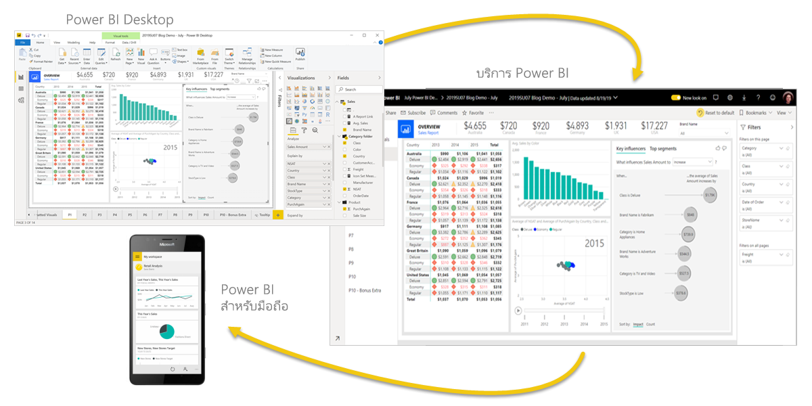

# Power BI คืออะไร
**Power BI** คือคอลเลกชันของบริการซอฟต์แวร์ แอป และตัวเชื่อมต่อที่ทำงานร่วมกันเพื่อเปลี่ยนแหล่งข้อมูลที่ไม่เกี่ยวข้องของคุณให้เป็นข้อมูลเชิงลึกที่สอดคล้องกัน แสดงข้อมูลได้ และโต้ตอบได้ ข้อมูลของคุณอาจเป็นสเปรดชีต Excel หรือคอลเลกชันของระบบ Cloud และคลังข้อมูลแบบไฮบริดภายในองค์กร Power BI ช่วยให้คุณเชื่อมต่อกับแหล่งข้อมูลของคุณ แสดงภาพและค้นพบเรื่องสำคัญ รวมถึงแชร์สิ่งเหล่านั้นกับบุคคลหรือทุกคนที่คุณต้องการได้อย่างง่ายดาย

## ส่วนต่างๆ ของ Power BI
Power BI ประกอบด้วย: 
- แอปพลิเคชันสำหรับเครื่องเดสก์ท็อป Windows ที่เรียกว่า **Power BI Desktop**
- บริการ SaaS (*Software as a Service*) แบบออนไลน์ที่เรียกว่า **บริการของ Power BI** 
- **แอปสำหรับอุปกรณ์เคลื่อนที่** Power BI สำหรับอุปกรณ์ Windows, iOS และ Android

องค์ประกอบทั้งสามเหล่านี้ อันได้แก่ &mdash;Pwer BI Desktop บริการ และแอปสำหรับอุปกรณ์เคลื่อนที่&mdash; ได้รับการออกแบบมาเพื่อช่วยคุณในการสร้าง แชร์ และใช้ข้อมูลเชิงลึกทางธุรกิจด้วยวิธีหรือบทบาทที่คุณต้องการได้อย่างมีประสิทธิภาพสูงสุด

ส่วน **เซิร์ฟเวอร์รายงาน Power BI** ซึ่งเป็นองค์ประกอบที่สี่จะช่วยให้คุณเผยแพร่รายงาน Power BI ไปยังเซิร์ฟเวอร์รายงานภายในองค์กรหลังจากสร้างขึ้นมาใน Power BI Desktop เรียนรู้เพิ่มเติมเกี่ยวกับ [Power BI Report Server](#on-premises-reporting-with-power-bi-report-server)

## Power BI เหมาะสมกับบทบาทของคุณอย่างไร
วิธีที่คุณใช้ Power BI อาจขึ้นอยู่กับบทบาทของคุณในโครงการหรือในทีม ผู้อื่นในบทบาทอื่นอาจใช้ Power BI แตกต่างกันไป ซึ่งเป็นสิ่งที่สามารถทำได้

ตัวอย่างเช่น คุณอาจใช้**บริการของ Power BI** เป็นหลักเพื่อดูรายงานและแดชบอร์ด เพื่อนร่วมงานที่ทำงานกับตัวเลขและสร้างรายงานทางธุรกิจอาจใช้งาน **Power BI Desktop** เพื่อสร้างรายงาน จากนั้นเผยแพร่รายงานเหล่านั้นไปยังบริการของ Power BI ซึ่งเป็นที่ที่คุณดูได้ และเพื่อนร่วมงานคนอื่นๆ ในแผนกการขายอาจใช้**แอป Power BI บนโทรศัพท์**  เพื่อตรวจดูความคืบหน้าของโควต้าการขาย และดูรายละเอียดลูกค้าเป้าหมาย

ถ้าคุณเป็นนักพัฒนา คุณอาจใช้ Power BI API เพื่อพุชข้อมูลลงในชุดข้อมูล หรือเพื่อฝังแดชบอร์ดและรายงานลงในแอปพลิเคชันแบบกำหนดเองของคุณ มีแนวคิดสำหรับวิชวลใหม่หรือไม่ ลองสร้างด้วยตัวคุณเอง แล้วแชร์กับผู้อื่น  

คุณยังอาจใช้แต่ละองค์ประกอบของ Power BI ในช่วงเวลาที่ต่างกัน โดยขึ้นอยู่กับสิ่งที่คุณต้องการทำหรือบทบาทของคุณในโครงการที่มี

วิธีที่คุณใช้ Power BI สามารถยึดตามลักษณะหรือบริการของ Power BI ซึ่งเป็นเครื่องมือที่ดีที่สุดสำหรับสถานการณ์ของคุณ ตัวอย่างเช่น คุณสามารถใช้ Power BI Desktop ในการสร้างรายงานเกี่ยวกับการส่วนมีส่วนร่วมกับลูกค้าสำหรับทีมของคุณเอง และคุณอาจดูสินค้าคงคลังและความคืบหน้ากระบวนการผลิตในแดชบอร์ดแบบเรียลไทม์ในบริการของ Power BI เนื่องจากแต่ละส่วนของ Power BI พร้อมให้บริการแก่คุณ จึงเป็นเหตุผลที่ผลิตภัณฑ์ Power BI มีความยืดหยุ่นและน่าสนใจ

สำรวจเอกสารประกอบที่เหมาะสมกับบทบาทของคุณ:
- Power BI Desktop สำหรับ[*นักออกแบบ*](desktop-what-is-desktop.md)
- Power BI สำหรับ [*ผู้บริโภค*](../consumer/end-user-consumer.md)
- Power BI สำหรับ [*ผู้ดูแลระบบ*](../admin/service-admin-administering-power-bi-in-your-organization.md)
- Power BI สำหรับ *นักพัฒนา*
    * [การวิเคราะห์แบบฝังตัวด้วย Power BI](../developer/embedded/embedding.md)
    * [Power BI อะไรที่ถูกฝังอยู่ใน Azure?](../developer/embedded/azure-pbie-what-is-power-bi-embedded.md)
    * [วิชวลใน Power BI](../developer/visuals/power-bi-custom-visuals.md)
    * [นักพัฒนาสามารถทำอะไรด้วย API ของ Power BI ได้บ้าง](../developer/automation/overview-of-power-bi-rest-api.md)

## ลำดับการทำงานใน Power BI
ลำดับการทำงานทั่วไปใน Power BI เริ่มจากการเชื่อมต่อกับแหล่งข้อมูล และสร้างรายงานใน Power BI Desktop จากนั้นคุณจึงเผยแพร่รายงานนั้นจาก Power BI Desktop ไปยัง บริการของ Power BI และแชร์เพื่อให้ผู้ใช้ปลายทางในบริการของ Power BI และอุปกรณ์เคลื่อนที่ สามารถดู และโต้ตอบกับรายงานได้
เวิร์กโฟลว์นี้เป็นปกติ และแสดงวิธีการทำงานขององค์ประกอบหลักทั้งสามของ Power BI

นี่คือ [การเปรียบเทียบของ Power BI Desktop และบริการของ Power BI](../fundamentals/service-service-vs-desktop.md) โดยละเอียด

## การรายงานในองค์กรด้วยเซิร์ฟเวอร์รายงาน Power BI

แต่ถ้าคุณยังไม่พร้อมที่จะย้ายไปยังคลาวด์ และต้องเก็บรายงานของคุณหลังไฟร์วอลล์ขององค์กร  ลองอ่านต่อไป

คุณสามารถสร้าง ปรับใช้ และจัดการ Power BI สำหรับอุปกรณ์เคลื่อนที่และรายงานที่มีการแบ่งหน้าภายในองค์กรกับช่วงเตรียมพร้อมสำหรับการใช้เครื่องมือและบริการที่เซิร์ฟเวอร์รายงาน Power BI มี

เซิร์ฟเวอร์รายงาน Power BI เป็นโซลูชันที่คุณปรับใช้หลังไฟร์วอลล์ของคุณ และจัดส่งรายงานของคุณไปยังผู้ใช้ที่ถูกต้อง ด้วยวิธีต่างๆ ไม่ว่าจะดูในเว็บเบราว์เซอร์ บนอุปกรณ์เคลื่อนที่ หรือทางอีเมล และเนื่องจากเซิร์ฟเวอร์รายงาน Power BI เข้ากันได้กับ Power BI ในระบบคลาวด์ คุณสามารถย้ายไปยังคลาวด์เมื่อคุณพร้อม 

เรียนรู้เพิ่มเติมเกี่ยวกับ [Power BI Report Server](../report-server/get-started.md)

## ขั้นตอนถัดไป
- [เริ่มต้นใช้งานด่วน: เรียนรู้วิธีการสำรวจบริการของ Power BI](../consumer/end-user-experience.md)   
- [บทช่วยสอน: เริ่มต้นใช้งานกับบริการของ Power BI](service-get-started.md)
- [เริ่มต้นใช้งานด่วน: เชื่อมต่อกับข้อมูลใน Power BI Desktop](../connect-data/desktop-quickstart-connect-to-data.md)
