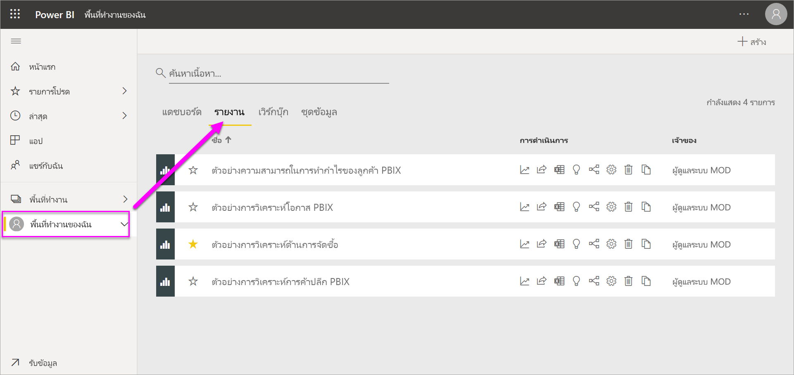
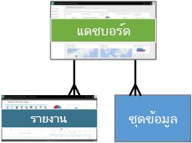
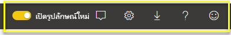

# แนวคิดพื้นฐานสำหรับนักออกแบบในบริการ Power BI

จุดประสงค์ของบทความนี้คือช่วยให้คุณคุ้นเคยกับบริการของ Power BI: องค์ประกอบต่างๆ วิธีการทำงานร่วมกัน และวิธีที่คุณสามารถทำงานกับผลิตภัณฑ์ คุณอาจได้เรียนรู้เพิ่มเติมหากคุณได้ [ลงชื่อเข้าใช้สำหรับบริการของ Power BI](service-self-service-signup-for-power-bi.md) และ [เพิ่มข้อมูลบางอย่าง](../connect-data/service-get-data.md) อยู่แล้ว ในฐานะนักออกแบบ เวิร์กโฟลว์ทั่วไปของคุณมักเริ่มต้น ด้วยการสร้างรายงานใน Power BI Desktop จากนั้นจึงเผยแพร่รายงานไปยังบริการของ Power BI ซึ่งเป็นที่ที่คุณสามารถดำเนินการปรับเปลี่ยนต่อได้ นอกจากนี้คุณยังสามารถสร้างแดชบอร์ดโดยยึดตามรายงานของคุณในบริการของ Power BI ได้อีกด้วย 

สำหรับบทความนี้ หากคุณยังไม่มีรายงานของตนเอง โปรดลองติดตั้ง [ชุดเนื้อหาตัวอย่าง Power BI](../create-reports/sample-datasets.md)

เมื่อคุณเปิดบริการของ Power BI ในเบราว์เซอร์ คุณจะเริ่มต้นที่หน้าจอหลักของคุณ นี่คือองค์ประกอบที่คุณอาจเห็น:

1. แผงนำทาง
2. ตัวเปิดใช้แอปฯ office 365
3. ปุ่มหน้าหลัก Power BI
4. ปุ่มไอคอน รวมถึงการตั้งค่า วิธีใช้ และคำติชม
5. กล่องค้นหา
6. แดชบอร์ดที่ใช้งานบ่อยและรายงานโปรด รายงานและพื้นที่ทำงาน
7. แดชบอร์ด รายงานและพื้นที่ทำงานที่พึ่งใช้งาน
8. พื้นที่ทำงานของคุณ

ผู้ใช้ปลายทางของคุณที่ใช้รายงานและแดชบอร์ดของคุณจะเริ่มประสบการณ์การใช้งานในบริการของ Power BI ในเบราว์เซอร์เหมือนกัน

เราจะเจาะลึกรายละเอียดคุณลักษณะเหล่านี้ในภายหลัง แต่ก่อนอื่นมาดูแนวคิดบางอย่างสำหรับ Power BI กันก่อน หรือคุณอาจต้องการดูวิดีโอนี้ก่อน  ในวิดีโอ Will จะรีวิวแนวคิดพื้นฐานและพาชมบริการของ Power BI

<iframe width="560" height="315" src="https://www.youtube.com/embed/B2vd4MQrz4M" frameborder="0" allowfullscreen></iframe>

## แนวคิดสำหรับ Power BI
โครงสร้างหลักห้าชนิดของ Power BI คือ: *แดชบอร์ด*, *รายงาน*, *เวิร์กบุค*, *ชุดข้อมูล* และ *กระแสข้อมูล* โครงสร้างทั้งหมดจะถูกจัดระเบียบเป็น *พื้นที่ทำงาน* และถูกสร้างขึ้นบน *ความจุ*  สิ่งสำคัญคือต้องเข้าใจความจุและพื้นที่ทำงานก่อนที่เราจะเจาะลึกลงไปในโครงสร้างหลักห้าชนิด ดังนั้นเรามาเริ่มต้นกันที่ส่วนแรกก่อนเลย

## ความจุ
ความจุเป็นแนวคิดหลักของ Power BI ที่แสดงถึงชุดของทรัพยากร (หน่วยเก็บข้อมูล ตัวประมวลผล และหน่วยความจำ) ที่ใช้เพื่อโฮสต์และส่งมอบเนื้อหา Power BI ของคุณ ความจุเป็น _แบบใช้ร่วมกัน_ หรือไม่ก็ _เฉพาะ_ ความจุแบบใช้ร่วมกันจะถูกแชร์กับลูกค้าคนอื่นของ Microsoft ในขณะที่ความจุแบบเฉพาะนั้นมุ่งมั่นอย่างเต็มที่กับลูกค้ารายเดียว ความจุแบบเฉพาะจำเป็นต้องใช้[การสมัครสมาชิก](../admin/service-premium-what-is.md) และอธิบายไว้ในบทความ [การจัดการความจุแบบพรีเมี่ยม](../admin/service-premium-capacity-manage.md)

ตามค่าเริ่มต้น พื้นที่ทำงานจะถูกสร้างขึ้นในความจุแบบใช้ร่วมกัน ในความจุที่ใช้ร่วมกัน ปริมาณงานจะทำงานบนแหล่งทรัพยากรเชิงคำนวณที่ใช้ร่วมกับลูกค้าคนอื่น ๆ เมื่อความจุต้องใช้ทรัพยากรร่วมกัน ขีดจำกัดจะถูกกำหนดไว้เพื่อให้แน่ใจว่า "fair play" เช่น ขนาดแบบจำลองสูงสุด (1 GB) และความถี่ในการรีเฟรชรายวันสูงสุด (แปดครั้งต่อวัน)

## พื้นที่ทำงาน
พื้นที่ทำงานจะถูกสร้างขึ้นบนความจุ โดยพื้นฐานแล้ว คือคอนเทนเนอร์สำหรับแดชบอร์ด รายงาน เวิร์กบุค ชุดข้อมูลและกระแสข้อมูลใน Power BI

มีพื้นที่ทำงานสองชนิด: *พื้นที่ทำงานของฉัน*และ*พื้นที่ทำงาน*

- *พื้นที่ทำงานของฉัน* เป็นพื้นที่ทำงานส่วนบุคคลสำหรับให้ลูกค้า Power BI ใด ๆ ทำงานกับเนื้อหาของตนเอง เฉพาะคุณเท่านั้นที่สามารถเข้าถึงพื้นที่ทำงานของฉัน (My Workspace) ของคุณเองได้ คุณสามารถแชร์แดชบอร์ดและรายงานจาก พื้นที่ทำงานของฉัน ได้ หากคุณต้องการทำงานร่วมกันบนแดชบอร์ดและรายงาน หรือสร้างแอป คุณจะต้องทำงานในพื้นที่ทำงาน      
-  *พื้นที่ทำงาน* ถูกใช้เพื่อทำงานร่วมกันและแบ่งปันเนื้อหากับเพื่อนร่วมงาน คุณสามารถเพิ่มเพื่อนร่วมงานลงในพื้นที่ทำงานของคุณและทำงานร่วมกันบนแดชบอร์ด รายงาน เวิร์กบุ๊ก และชุดข้อมูล ด้วยข้อยกเว้นหนึ่งข้อ สมาชิกของพื้นที่ทำงานทั้งหมดจำเป็นต้องมีสิทธิ์การใช้ Power BI Pro อ่านเพิ่มเติมเกี่ยวกับ[พื้นที่ทำงานใหม่](../collaborate-share/service-create-the-new-workspaces.md) 

    นอกจากนี้พื้นที่ทำงานยังเป็นสถานที่ที่คุณสร้าง เผยแพร่ และจัดการ*แอป* สำหรับองค์กรของคุณอีกด้วย คิดว่าพื้นที่ทำงานเป็นส่วนการจัดเตรียมและคอนเทนเนอร์สำหรับเนื้อหาที่ประกอบเป็นแอป Power BI *แอปฯ*คืออะไร? นี่คือคอลเลกชันของแดชบอร์ดและรายงานที่สร้างขึ้นเพื่อนำเสนอเมตริกหลักให้กับผู้บริโภค Power BI ในองค์กรของคุณ แอปเป็นแบบโต้ตอบได้ แต่ผู้บริโภคไม่สามารถแก้ไขได้ แต่ผู้บริโภคแอปฯ (ผู้ร่วมงานที่มีสิทธิ์เข้าถึงแอปฯ) ไม่จำเป็นต้องมีสิทธิ์การใช้งาน Pro  

เริ่มต้นด้วยการแชร์ทั่วไปเช่น [วิธีการแชร์แดชบอร์ดที่คุณทำงาน](../collaborate-share/service-how-to-collaborate-distribute-dashboards-reports.md) เพื่อเรียนรู้เพิ่มเติม

ในตอนนี้ เราก็จะมาพูดถึงโครงสร้างหลักห้าชนิดของ Power BI กัน

## กระแสข้อมูล
*กระแสข้อมูล* ช่วยให้องค์กรสามารถรวมข้อมูลจากแหล่งที่ไม่เหมือนกันให้สอดคล้องกันได้ ซึ่งเป็นตัวเลือก และมักใช้ในโครงการที่ซับซ้อนหรือใหญ่กว่า เป็นตัวแทนของข้อมูลที่เตรียมและจัดทำไว้สำหรับชุดข้อมูล อย่างไรก็ตาม กระแสข้อมูลไม่สามารถใช้เป็นแหล่งข้อมูลสำหรับการรายงานได้โดยตรง ซึ่งใช้ประโยชน์จากคอลเลกชันที่ครอบคลุมของตัวเชื่อมต่อข้อมูล Microsoft การเปิดใช้งานการเพิ่มข้อมูลจากแหล่งข้อมูลภายในองค์กรและแหล่งข้อมูลบนระบบคลาวด์

กระแสข้อมูลถูกสร้างและจัดการในพื้นที่ทำงานเท่านั้น (แต่ไม่ใช่ *พื้นที่ทำงานของฉัน*) และถูกเก็บเป็นเอนทิตีใน Common Data Model (CDM) ใน Azure Data Lake Storage Gen2 โดยทั่วไปแล้วจะมีการกำหนดตารางเวลาให้รีเฟรชตามการเกิดซ้ำเพื่อจัดเก็บข้อมูลที่เป็นปัจจุบัน ซึ่งเหมาะอย่างมากสำหรับการเตรียมข้อมูล เพื่อใช้งานและใช้ซ้ำ โดยชุดข้อมูลของคุณ โปรดดูที่บทความ [การเตรียมข้อมูลแบบบริการตนเองใน Power BI](../transform-model/service-dataflows-overview.md)

คุณไม่สามารถมีแดชบอร์ดหรือรายงานที่ไม่มีข้อมูล (เช่นกัน คุณสามารถมีแดชบอร์ดว่างเปล่าและรายงานเปล่า แต่ไม่มีประโยชน์จนกว่าพวกเขาจะมีข้อมูล) ดังนั้นในตอนนี้เราขอแนะนำ **ชุดข้อมูล**

## ชุดข้อมูล
*ชุดข้อมูล*คือคอลเลกชันของข้อมูลที่คุณ*นำเข้า*หรือ*เชื่อมต่อ* Power BI ช่วยให้คุณเชื่อมต่อและนำเข้าชุดข้อมูลทุกประเภท และการนำข้อมูลทั้งหมดมารวมกันไว้ในที่เดียว นอกจากนี้ชุดข้อมูลยังสามารถนำมาจากกระแสข้อมูลได้อีกด้วย

ชุดข้อมูลเกี่ยวข้องกับ*พื้นที่ทำงาน*และชุดข้อมูลหนึ่งสามารถเป็นส่วนหนึ่งของหลายพื้นที่ทำงานได้ เมื่อคุณเปิดพื้นที่ทำงาน ชุดข้อมูลที่เกี่ยวข้องจะแสดงอยู่ใต้แท็บ**ชุดข้อมูล** ชุดข้อมูลแต่ละรายการแสดงถึงแหล่งข้อมูลหนึ่งแหล่ง ตัวอย่างเช่น เวิร์กบุ๊ก Excel ใน OneDrive หรือชุดข้อมูลแบบตาราง SSAS ภายในองค์กร หรือชุดข้อมูล Salesforce มีแหล่งข้อมูลต่างๆ มากมายที่ระบบสนับสนุน และเราเพิ่มแหล่งข้อมูลใหม่ๆ อยู่ตลอดเวลา ดูรายการของชนิดของ[ชุดข้อมูลที่สามารถใช้ได้กับ Power BI](../connect-data/service-get-data.md)

ในตัวอย่างด้านล่าง เราเลือกพื้นที่ทำงาน "การขายและการตลาด" และคลิกที่แท็บสำหรับ**ชุดข้อมูล**

**หนึ่ง**ชุดข้อมูล...

* สามารถใช้ซ้ำได้ในหนึ่งหรือในหลายพื้นที่ทำงาน
* สามารถใช้ในรายงานต่าง ๆ มากมายได้
* การแสดงภาพจากชุดข้อมูลหนึ่งสามารถแสดงบนหลายแดชบอร์ดได้

  

หากต้องการ [เชื่อมต่อหรือนำเข้าชุดข้อมูล](../connect-data/service-get-data.md) ให้เลือก **รับข้อมูล** ที่ด้านล่างของบานหน้าต่างนำทาง ให้ทำตามคำแนะนำดังกล่าวเพื่อเชื่อมต่อหรือนำเข้าแหล่งข้อมูลที่เฉพาะเจาะจง และเพิ่มชุดข้อมูลลงในพื้นที่ทำงานที่ใช้งานอยู่ ชุดข้อมูลใหม่จะถูกทำเครื่องหมายดอกจันสีเหลือง งานที่คุณทำใน Power BI จะไม่เปลี่ยนแปลงชุดข้อมูลเบื้องต้น

 ชุดข้อมูลที่สมาชิกของพื้นที่ทำงานเพิ่มเข้าไป จะพร้อมใช้งานสำหรับสมาชิกอื่น ๆ ในพื้นที่ทำงานด้วยด้วยบทบาท *แอดมิน* *สมาชิก*และ*ผู้จัดจำหน่าย*

เราสามารถรีเฟรช เปลี่ยนชื่อ สำรวจ และลบชุดข้อมูลได้ ใช้ชุดข้อมูลเพื่อสร้างรายงานตั้งแต่เริ่มต้น หรือโดยการเรียกใช้[ข้อมูลเชิงลึกด่วน](../create-reports/service-insights.md)  เพื่อดูว่ารายงานและแดชบอร์ดใดที่ใช้ชุดข้อมูลแล้ว ให้เลือก**ดูที่เกี่ยวข้อง** ในการสำรวจชุดข้อมูล เลือกตัวเลือกนี้ สิ่งที่คุณกำลังทำอยู่คือการเปิดชุดข้อมูลในตัวแก้ไขรายงาน ซึ่งคุณสามารถเริ่มต้นการสำรวจข้อมูลได้โดยสร้างการแสดงผลข้อมูลด้วยภาพ

ในตอนนี้ เรามาย้ายไปยังหัวข้อถัดไป หัวข้อรายงานกันเถอะ

### เจาะลึกมากขึ้น
* [ชุดข้อมูลในบริการ Power BI](../connect-data/service-datasets-understand.md)
* [โหมดชุดข้อมูลในบริการ Power BI](../connect-data/service-dataset-modes-understand.md)
* [Power BI Premium คืออะไร?](../admin/service-premium-what-is.md)
* [รับข้อมูลสำหรับ Power BI](../connect-data/service-get-data.md)
* [ชุดข้อมูลตัวอย่างสำหรับ Power BI](../create-reports/sample-datasets.md)

## รายงาน
รายงาน Power BI คือหน้าเพจที่แสดงภาพอย่างน้อยหนึ่งหน้า เช่น แผนภูมิเส้น แผนที่ และทรีแมป นอกจากนี้ การแสดงภาพยังเรียกว่า **_วิชวล_** การแสดงภาพทั้งหมดในรายงานมาจากชุดข้อมูลเดียว คุณสามารถสร้างรายงานตั้งแต่เริ่มต้นภายใน Power BI ได้ และสามารถนำเข้ากับแดชบอร์ดที่เพื่อนร่วมงานแชร์กับคุณได้ หรือ Power BI สามารถสร้างขึ้นเมื่อคุณเชื่อมต่อกับชุดข้อมูลจาก Excel, Power BI Desktop ฐานข้อมูล แอปพลิเคชัน SaaS ได้  ตัวอย่างเช่น เมื่อคุณเชื่อมต่อกับเวิร์กบุ๊ก Excel ที่ประกอบด้วยแผ่นงาน Power View, Power BI สร้างรายงานที่ยึดตามแผ่นงานเหล่านั้น และเมื่อคุณเชื่อมต่อกับแอปพลิเคชัน SaaS, Power BI จะนำเข้ารายงานที่สร้างไว้ล่วงหน้า

มีสองโหมดสำหรับการดูและการโต้ตอบกับรายงาน: *มุมมองการอ่าน* และ*มุมมองการแก้ไข* เมื่อคุณเปิดรายงานจะเปิดขึ้นในมุมมองการอ่าน ถ้าคุณมีสิทธิ์ในการแก้ไขคุณจะเห็น **แก้ไขรายงาน** ในมุมบนซ้ายและคุณสามารถดูรายงานในมุมมองการแก้ไขได้  ถ้ารายงานอยู่ในพื้นที่ทำงานทุกคนที่มี *แอดมิน* *สมาชิก* หรือ *ผู้สนับสนุน* บทบาทสามารถแก้ไขได้ พวกเขามีสิทธิ์เข้าถึงการสำรวจการออกแบบการสร้างและการแชร์ความสามารถของมุมมองการแก้ไขสำหรับรายงานนั้น และบุคคลที่ได้รับการแชร์รายงานเหล่านี้สามารถสำรวจและโต้ตอบกับรายงานได้โดยใช ้มุมมองการอ่าน   

เมื่อคุณเปิดพื้นที่รายงานหนึ่งขึ้น รายงานที่เกี่ยวข้องจะแสดงอยู่ภายใต้แท็บ**รายงาน** แต่ละรายงานจะแสดงการแสดงภาพอย่างน้อยหนึ่งหน้าตามชุดข้อมูลเบื้องต้นเพียงหนึ่งชุด หากต้องการเปิดรายงาน ให้เลือกรายงานนั้น

เมื่อคุณเปิดแอปฯ คุณจะแสดงด้วยแดชบอร์ดหนึ่ง  หากต้องการเข้าถึงรายงานเบื้องต้น เลือกไทล์แดชบอร์ด (เราจะเรียนรู้เพิ่มเติมเกี่ยวกับไทล์ในภายหลัง) ที่ถูกปักหมุดจากรายงาน โปรดทราบว่า ไทล์ทั้งหมดไม่ได้ถูกปักหมุดจากรายงาน ดังนั้น คุณอาจจำเป็นต้องคลิกที่สองถึงสามไทล์เพื่อค้นหารายงาน

ตามค่าเริ่มต้น รายงานเปิดขึ้นในมุมมองการอ่าน  เพียงเลือก**แก้ไขรายงาน**เพื่อเปิดขึ้นในมุมมองการแก้ไข (ถ้าคุณมีสิทธิ์ในการแก้ไข)

ในตัวอย่างด้านล่าง เราเลือกพื้นที่ทำงาน "การขายและการตลาด" และคลิกที่แท็บสำหรับ**รายงาน**

**หนึ่ง**รายงาน...

* อยู่ในพื้นที่ทำงานเดียว
* สามารถเชื่อมโยงกับหลายแดชบอร์ดภายในพื้นที่ทำงานนั้น (ไทล์ที่ปักหมุดจากรายงานนั้นอาจปรากฏบนหลายแดชบอร์ด
* สามารถสร้างโดยใช้ข้อมูลจากชุดเดียว Power BI Desktop สามารถรวมแหล่งข้อมูลมากกว่าหนึ่งชุดช้อมูลลงในรายงานเดียว และคุณสามารถนำเข้ารายงานนั้นใน Power BI ได้

  

### เจาะลึกมากขึ้น
- [สร้างรายงานในบริการของ Power BI โดยการนำเข้าชุดข้อมูล](../create-reports/service-report-create-new.md)
- [ปรับรายงานให้เหมาะสมสำหรับแอป Power BI ในมือถือ](../create-reports/desktop-create-phone-report.md)

## แดชบอร์ด
*แดชบอร์ด* เป็นสิ่งที่คุณสร้าง **ในบริการของ Power BI** หรือสิ่งที่เพื่อนร่วมงานสร้าง **ในบริการของ Power BI** และแชร์กับคุณ เป็นพื้นที่ที่ประกอบด้วยไทล์และวิดเจ็ตศูนย์ไทล์หรือวิดเจ็ตหรือมากกว่านั้น แต่ละไทล์ที่ปักหมุดจากรายงานหรือจาก[การถามตอบ](../consumer/end-user-q-and-a.md)แสดง[การแสดงภาพ](../visuals/power-bi-report-visualizations.md)เดียวที่สร้างขึ้นจากชุดข้อมูลและปักหมุดไปยังแดชบอร์ด นอกจากนี้ หน้ารายงานทั้งหมดยังสามารถปักหมุดไปยังแดชบอร์ดเป็นหนึ่งไทล์ได้ มีหลายวิธีในการเพิ่มไทล์ไปยังแดชบอร์ด แต่มีจำนวนมากเกินไปจะรวมเข้าได้หมดในหัวข้อภาพรวมนี้ เมื่อต้องการเรียนรู้เพิ่มเติม ดู[ไทล์แดชบอร์ดใน Power BI](../create-reports/service-dashboard-tiles.md)

ทำไมผู้คนสร้างแดชบอร์ดขึ้น?  ต่อไปนี้เป็นเหตุผลเพียงบางส่วน:

* เพื่อดูข้อมูลทั้งหมดที่จำเป็นสำหรับการตัดสินใจอย่างรวดเร็ว
* เพื่อตรวจสอบข้อมูลที่สำคัญมากที่สุดเกี่ยวกับธุรกิจของคุณ
* เพื่อให้แน่ใจว่าเพื่อนร่วมงานทั้งหมดเข้าใจตรงกัน ดู และใช้ข้อมูลเดียวกัน
* เพื่อการตรวจสอบสถานภาพของธุรกิจ หรือผลิตภัณฑ์ หรือหน่วยธุรกิจ หรือแคมเปญการตลาด และอื่น ๆ
* เพื่อสร้างมุมมองส่วนบุคคลของแดชบอร์ดที่ใหญ่กว่า เมตริกทั้งหมดที่เกี่ยวข้องกับคุณ

เมื่อคุณเปิดพื้นที่ทำงาน แดชบอร์ดที่เกี่ยวข้องจะแสดงอยู่ใต้แท็บ**แดชบอร์ด** หากต้องการเปิดแดชบอร์ด ให้เลือกแดชบอร์ดนั้น เมื่อคุณเปิดแอปฯ คุณจะเห็นแดชบอร์ดหนึ่ง  แดชบอร์ดแต่ละรายการแสดงมุมมองแบบกำหนดเองของชุดย่อยบางรายการของชุดข้อมูลเบื้องต้น  ถ้าคุณเป็นเจ้าของแดชบอร์ด คุณจะสามารถเข้าถึงเพื่อแก้ไขชุดข้อมูลเบื้องต้นและรายงานได้  ถ้ามีการแชร์แดชบอร์ดดังกล่าวกับคุณ คุณจะสามารถโต้ตอบกับแดชบอร์ดและรายงานเบื้องต้นใด ๆ ได้ แต่จะไม่สามารถบันทึกการเปลี่ยนแปลงได้

มีวิธีต่าง ๆ มากมายที่คุณหรือเพื่อนร่วมงาน สามารถ[แชร์แดชบอร์ด](../collaborate-share/service-share-dashboards.md)ได้ Power BI Pro จำเป็นสำหรับการแชร์แดชบอร์ด และอาจจำเป็นสำหรับการดูแดชบอร์ดที่แชร์

**หนึ่ง**แดชบอร์ด...

* เกี่ยวเนื่องกับพื้นที่ทำงานเดียว
* สามารถแสดงภาพจากหลายชุดข้อมูลที่แตกต่างกันได้
* สามารถแสดงภาพจากหลายรายงานที่แตกต่างกันได้
* สามารถแสดงภาพที่ปักหมุดจากเครื่องมืออื่น ๆ ได้ (ตัวอย่างเช่น Excel)

  

### เจาะลึกมากขึ้น
* [สร้างแดชบอร์ดเปล่า จากนั้นรับข้อมูล](../create-reports/service-dashboard-create.md)
* [ทำซ้ำแดชบอร์ด](../create-reports/service-dashboard-copy.md)
* [สร้างมุมมองโทรศัพท์ของแดชบอร์ด](../create-reports/service-create-dashboard-mobile-phone-view.md)

## เวิร์กบุ๊ก
เวิร์กบุ๊กเป็นชุดข้อมูลชนิดพิเศษ ถ้าคุณได้อ่านในหัวข้อ**ชุดข้อมูล**ที่ด้านบน คุณจะทราบเกือบทั้งหมดที่คุณจำเป็นต้องทราบเกี่ยวกับเวิร์กบุ๊ก แต่คุณอาจสงสัยว่าทำไมในบางครั้ง Power BI แยกประเภทเวิร์กบุ๊ก Excel เป็นแบบ**ชุดข้อมูล**และในบางครั้งเป็นการ**สมุดงาน (Workbook)**

เมื่อคุณใช้**รับข้อมูล**กับไฟล์ Excel คุณสามารถเลือกที่จะ*นำเข้า*หรือ*เชื่อมต่อ*ไปยังไฟล์ได้ เมื่อคุณเลือกตัวเลือกนี้ เวิร์กบุ๊กของคุณจะปรากฏใน Power BI เช่นเดียวกับที่ปรากฏใน Excel Online แต่แตกต่างจาก Excel Online คือ คุณจะมีคุณลักษณะบางอย่างที่ช่วยให้คุณสามารถปักหมุดองค์ประกอบต่างๆ จากแผ่นงานของคุณไปยังแดชบอร์ดได้ทันที

คุณไม่สามารถแก้ไขเวิร์กบุ๊กของคุณใน Power BI ได้ แต่ถ้าคุณจำเป็นต้องทำการเปลี่ยนแปลงบางอย่าง คุณสามารถคลิก แก้ไข แล้วเลือกแก้ไขสมุดงานของคุณใน Excel Online หรือเปิดใน Excel บนคอมพิวเตอร์ของคุณ การเปลี่ยนแปลงใด ๆ ที่คุณดำเนินการจะถูกบันทึกไปยังสมุดงานบน OneDrive

### เจาะลึกมากขึ้น
* [รับข้อมูลจากไฟล์เวิร์กบุ๊ก Excel](../connect-data/service-excel-workbook-files.md)
* [เผยแพร่ไปยัง Power BI จาก Excel](../connect-data/service-publish-from-excel.md)

## แดชบอร์ดในพื้นที่ทำงานของฉัน
เราได้เรียนรู้ทั้งหมดสำหรับพื้นที่ทำงานและองค์ประกอบหลักแล้ว ลองมารวมเข้าด้วยกันและตรวจทานชิ้นส่วนที่ประกอบขึ้นเป็นประสบการณ์แดชบอร์ดในบริการ Power BI

### 1. **บานหน้าต่างนำทาง**
ใช้บานหน้าต่างนำทางเพื่อค้นหาและย้ายระหว่างพื้นที่ทำงานของคุณและโครงสร้างหลักของ Power BI : แดชบอร์ด รายงาน เวิร์กบุ๊ก และชุดข้อมูล  

  

* เลือก**รับข้อมูล**เพื่อ[เพิ่มชุดข้อมูล รายงาน และแดชบอร์ดไปยัง Power BI](../connect-data/service-get-data.md)
* ขยายและยุบบานหน้าต่างนำทางด้วยไอคอนนี้ .
* เปิดหรือจัดการเนื้อหาโปรดของคุณโดยการเลือก**รายการโปรด**
* ดูและเปิดเนื้อหาที่คุณเยี่ยมชมมากที่สุดเมื่อเร็ว ๆ นี้โดยการเลือก**ล่าสุด**
* ดู เปิด หรือลบแอปฯโดยการเลือก**แอปฯ**
* เพื่อนร่วมงานแชร์เนื้อหาร่วมกับคุณหรือไม่? เลือก**ที่แชร์กับฉัน**เพื่อค้นหาและจัดเรียงเนื้อหานั้นเพื่อค้นหาสิ่งที่คุณต้องการ
* แสดงและเปิดพื้นที่ทำงานของคุณโดยเลือก**พื้นที่ทำงาน**

คลิกองค์ประกอบเหล่านี้ครั้งเดียว:

* ที่ไอคอนหรือหัวข้อเพื่อเปิดในมุมมองเนื้อหา
* ลูกศรชี้ไปทางขวา (>) เพื่อเปิดเมนูลอยสำหรับรายการโปรด รายการล่าสุด และพื้นที่ทำงาน
* ไอคอนเครื่องหมายรูปตัว V เพื่อแสดงรายการ **My Workspace** ที่เลื่อนได้ของแดชบอร์ด รายงาน เวิร์กบุ๊ก และชุดข้อมูล

### 2. **พื้นที่ทำงาน**
เนื่องจากเราได้เปิดแดชบอร์ด พื้นที่ทำงานจะแสดงไทล์การแสดงภาพขึ้น ตัวอย่างเช่น ถ้าเราได้เปิดตัวแก้ไขรายงานนั้น พื้นที่ทำงานจะแสดงหน้ารายงานหนึ่งขึ้น

แดชบอร์ดที่จะประกอบด้วย[ไทล์](../create-reports/service-dashboard-tiles.md)ต่าง ๆ  ไทล์จะถูกสร้างขึ้นในมุมมองแก้ไข การถามตอบ แดชบอร์ดอื่น ๆ และสามารถปักหมุดจาก Excel, SSRS และอื่น ๆ ได้ ไทล์ชนิดพิเศษที่เรียกว่าการ[วิดเจ็ต](../create-reports/service-dashboard-add-widget.md)จะเพิ่มลงในแดชบอร์ดโดยตรง ไทล์ที่ปรากฏบนแดชบอร์ดถูกวางไว้ตรงนั้นโดยเฉพาะโดยผู้สร้าง/เจ้าของรายงาน  การเพิ่มไทล์ไปยังแดชบอร์ดจะเรียกว่า*การปักหมุด*

สำหรับข้อมูลเพิ่มเติม ดู[แดชบอร์ด](#dashboards)(ด้านบน)

### 3. **กล่องคำถาม Q&A**
วิธีหนึ่งในการสำรวจข้อมูลของคุณคือการถามคำถามและให้ Power BI ให้คำตอบแก่คุณในรูปแบบการแสดงภาพ เราสามารถเพิ่มการถามตอบเพื่อเพิ่มเนื้อหาลงในแดชบอร์ดหรือรายงานได้

การถามตอบจะค้นหาคำตอบในชุดข้อมูลที่เชื่อมต่อไปยังแดชบอร์ด  ชุดข้อมูลที่เชื่อมต่อเป็นชุดที่มีอย่างน้อยหนึ่งไทล์ปักหมุดไปยังแดชบอร์ดนั้น

ทันทีที่คุณเริ่มพิมพ์คำถามของคุณ การถามตอบจะนำคุณไปยังหน้าถามตอบ (Q&A) ขณะที่คุณพิมพ์ การถามตอบจะช่วยให้คุณถามคำถามที่ถูกต้องและค้นหาคำตอบที่ดีที่สุดด้วยการเปลี่ยนวลี เติมอัตโนมัติ คำแนะนำ และอื่น ๆ เมื่อคุณมีการแสดงภาพ (คำตอบ) ที่คุณชอบ ให้ปักหมุดลงในแดชบอร์ดของคุณ สำหรับข้อมูลเพิ่มเติม ดู[ถามตอบใน Power BI](../consumer/end-user-q-and-a.md)

### 4. **ไอคอนในแถบส่วนหัวสีดำ**
ไอคอนที่มุมบนขวาเป็นทรัพยากรที่คุณใช้สำหรับการตั้งค่า การแจ้งเตือน ดาวน์โหลด ขอความช่วยเหลือ เปิดและปิด **New look** และให้คำติชมไปยังทีม Power BI  

### 5. **ชื่อแดชบอร์ด** (เส้นทางนำทางหรือเบรดครัม (breadcrumb))
การที่จะทราบว่าพื้นที่ทำงานและแดชบอร์ดใดที่เปิดใช้งานอยู่นั้น ไม่ใช่เรื่องง่ายเสมอไป ดังนั้น Power BI จึงสร้างเส้นทางการนำทางให้คุณ  ในตัวอย่างนี้ เราเห็นพื้นที่ทำงาน (พื้นที่ทำงานของฉัน) และชื่อเรื่องแดชบอร์ด (ตัวอย่างการวิเคราะห์ร้านค้าปลีก)  ถ้าเราเปิดรายงานหนึ่งขึ้น ชื่อของรายงานจะถูกผนวกเข้ากับจุดสิ้นสุดของเส้นทางการนำทาง  แต่ละส่วนของเส้นทางจะเป็นไฮเปอร์ลิงก์ที่มีการใช้งานอยู่  

โปรดสังเกตไอคอน "C" หลังชื่อเรื่องแดชบอร์ด แดชบอร์ดนี้มี[แท็กการจัดประเภทข้อมูล](../create-reports/service-data-classification.md)ของ "ลับเฉพาะ" แท็กดังกล่าวระบุระดับความลับและระดับความปลอดภัยของข้อมูล ถ้าผู้ดูแลระบบของคุณได้เปิดใช้งานการจัดประเภทข้อมูล ทุกแดชบอร์ดจะมีแท็กตามค่าเริ่มต้น เจ้าของแดชบอร์ดควรเปลี่ยนแท็กเพื่อให้ตรงกับระดับความปลอดภัยที่เหมาะสมของแดชบอร์ดของตน

### 6. **ตัวเปิดใช้แอปฯ office 365**
ด้วยตัวเปิดใช้แอปฯ Office 365 ทั้งหมดของคุณจะพร้อมใช้งานได้อย่างง่ายดายด้วยหนึ่งคลิก จากตรงนี้ คุณสามารถเปิดใช้งานอีเมล เอกสาร ปฏิทิน และอื่น ๆ ของคุณได้อย่างรวดเร็ว

### 7. **หน้าหลัก Power BI**
การเลือก **Power BI** จะนำคุณกลับไปยัง Power BI Home

   

### 8. **ไอคอนที่มีป้ายชื่อในแถบเมนูสีเทา**
พื้นที่ของหน้าจอนี้ประกอบด้วยตัวเลือกเพิ่มเติมสำหรับการโต้ตอบกับเนื้อหา (ในกรณีนี้เป็นกับแดชบอร์ด)  นอกเหนือจากไอคอนที่มีป้ายชื่อที่คุณสามารถเห็นได้แล้ว เลือก**ตัวเลือกอื่นๆ (...)** เพื่อแสดงตัวเลือกสำหรับการทำซ้ำ พิมพ์ รีเฟรชแดชบอร์ดและอื่น ๆ อีกมาก

   

## ขั้นตอนถัดไป
- [Power BI คืออะไร](power-bi-overview.md)  
- [วิดีโอ Power BI](videos.md)  
- [ตัวแก้ไขรายงาน... ชมการแนะนำ](../create-reports/service-the-report-editor-take-a-tour.md)
- มีคำถามเพิ่มเติมหรือไม่ [ลองถามชุมชน Power BI](https://community.powerbi.com/)
