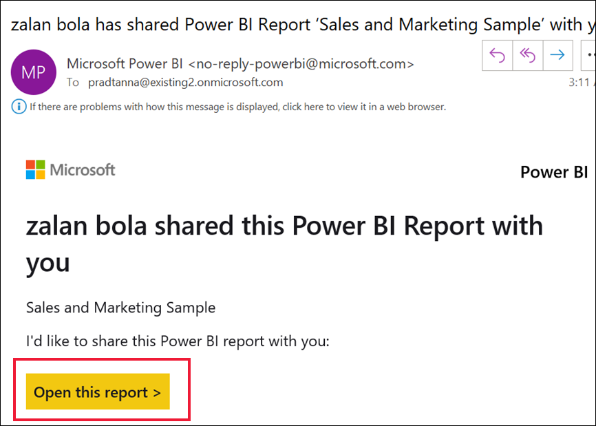

# ลงทะเบียนใช้งาน Power BI เป็นรายบุคคล

Power BI สามารถเป็นเครื่องมือการวิเคราะห์ข้อมูลส่วนบุคคลและเครื่องมือการแสดงภาพของคุณ และยังสามารถทำหน้าที่เป็นกลไกจัดการการวิเคราะห์และการตัดสินใจอยู่เบื้องหลังโครงการของกลุ่มบริษัท แผนก หรือบริษัททั้งหมด บทความนี้อธิบายวิธีการลงทะเบียนใช้งาน Power BI เป็นรายบุคคล ถ้าคุณเป็นผู้ดูแลระบบส่วนกลางหรือผู้ดูแลระบบการเรียกเก็บเงิน ให้ดูที่ [สิทธิ์การใช้งาน Power BI สำหรับองค์กรของคุณ](../admin/service-admin-licensing-organization.md)

## Power BI คืออะไร
Power BI คือแพลตฟอร์มข่าวกรองธุรกิจแบบบริการตนเองและสำหรับองค์กรที่รวมประสบการณ์ใช้งานแบบดั้งเดิมกับการแสดงข้อมูลอัจฉริยะเพื่อนำเสนอข้อมูลเชิงลึกมากขึ้น คุณสามารถแชร์รายงานภายในเครื่องมือของ Microsoft เช่น Teams, SharePoint, PowerPoint หรือภายในผลิตภัณฑ์ที่มีประสิทธิภาพอื่น ๆ ได้ ซึ่งนำเสนอเป็น SaaS (Software as a Service) ออนไลน์ที่มาพร้อมกับแอปพลิเคชันสนับสนุนสองตัวได้แก่ แอปพลิเคชันเดสก์ท็อป Microsoft Windows ที่เรียกว่า Power BI Desktop สำหรับการสร้างรายงาน และแอป BI สำหรับอุปกรณ์เคลื่อนที่แบบดั้งเดิมสำหรับการใช้งานรายงานบนอุปกรณ์ iOS และ Android 

องค์ประกอบทั้งสามเหล่านี้ อันได้แก่ Pwer BI Desktop บริการ และ แอปสำหรับอุปกรณ์เคลื่อนที่ได้รับการออกแบบมาเพื่อช่วยผู้ใช้ในการสร้าง แชร์ และใช้ข้อมูลเชิงลึกทางธุรกิจด้วยวิธีหรือบทบาทที่ผู้ใช้ต้องการได้อย่างมีประสิทธิภาพสูงสุด

## การลงทะเบียนสำหรับบริการของ Power BI
บทความนี้อธิบายขั้นตอนในการลงทะเบียนสำหรับ **บริการของ Power BI** เป็นรายบุคคล หากคุณกำลังมองหาความช่วยเหลือในการดาวน์โหลด Power BI Desktop หรือการติดตั้งแอปสำหรับอุปกรณ์เคลื่อนที่ โปรดดูที่บทความเหล่านี้แทน:
- [Power BI Desktop (ยังมีบริการดาวน์โหลดฟรีทั้งหมด)](desktop-get-the-desktop.md)    
- [แอปสำหรับอุปกรณ์เคลื่อนที่ Power BI (ยังมีบริการดาวน์โหลดฟรีทั้งหมด)](../consumer/mobile/mobile-apps-for-mobile-devices.md)

## ที่อยู่อีเมลที่สนับสนุน

ก่อนที่คุณจะเริ่มขั้นตอนการลงทะเบียน คุณจำเป็นต้องเรียนรู้ประเภทของที่อยู่อีเมลที่คุณสามารถใช้ในการลงทะเบียนสำหรับ Power BI:

* Power BI กำหนดให้คุณใช้ที่อยู่อีเมลที่ทำงาน หรือที่อยู่อีเมลโรงเรียนในการลงทะเบียน คุณไม่สามารถลงทะเบียนโดยใช้ที่อยู่อีเมลที่จัดหาให้ตามการบริการอีเมลของผู้ใช้งานหรือผู้ให้บริการระบบโทรคมนาคมได้ ซึ่งรวมถึง outlook.com, hotmail.com, gmail.com และอื่น ๆ ถ้าคุณยังไม่มีบัญชีที่ทำงานหรือโรงเรียน [เรียนรู้เกี่ยวกับวิธีการสำรองเพื่อลงทะเบียน](../admin/service-admin-signing-up-for-power-bi-with-a-new-office-365-trial.md)

* คุณสามารถลงทะเบียน Power BI ด้วยที่อยู่ gov หรือ. mil ได้ แต่ต้องใช้กระบวนการอื่น สำหรับข้อมูลเพิ่มเติม ดู [ลงทะเบียนหน่วยงานราชการของรัฐบาลสหรัฐในบริการของ Power BI](../admin/service-govus-signup.md)

## ลงชื่อออกจากบริการ Power BI

ทำตามขั้นตอนต่อไปนี้เพื่อลงทะเบียนบัญชี Power BI เมื่อคุณเสร็จสิ้นกระบวนการนี้ คุณจะมีสิทธิ์การใช้งาน Power BI (ฟรี) ที่คุณสามารถใช้เพื่อลองบริการของ Power BI ด้วยตนเองโดยใช้พื้นที่ทำงานของฉัน ซึ่งต้องอาศัยเนื้อหาจากพื้นที่ทำงาน Power BI ที่กำหนดไว้สำหรับความจุ Power BI Premium หรือเริ่มใช้ Power BI Pro รุ่นทดลองใช้เป็นรายบุคคล ดูข้อมูลเพิ่มเติมได้ที่ [คุณลักษณะของ Power BI ตามประเภทใบอนุญาตการใช้งาน](service-features-license-type.md) 

ขั้นตอนที่แน่นอนสำหรับการลงทะเบียนอาจแตกต่างกันไปขึ้นอยู่กับองค์กรของคุณ และสิ่งที่คุณคลิกเพื่อเริ่มกระบวนการ ด้วยเหตุผลนี้ คุณอาจไม่เห็นหน้าจอทั้งหมดที่แสดงด้านล่าง มีหลายวิธีในการลงทะเบียนสำหรับบริการของ Power BI เป็นรายบุคคล และขั้นตอนในบทความนี้นำไปใช้กับสองวิธีที่พบบ่อยเป็นส่วนใหญ่
- คุณเลือกปุ่ม **ลองใช้งานฟรี** หรือ **เริ่มต้นใช้งานฟรี**1     
- คุณจะได้รับอีเมลที่มีลิงก์ไปยังแดชบอร์ด รายงาน หรือแอป Power BI คุณยังไม่เคยลงชื่อเข้าใช้บัญชี Power BI ของคุณก่อนหน้านี้

    1คุณจะพบปุ่ม **ลองใช้งานฟรี** ฟรี powerbi.microsoft.com ในผลิตภัณฑ์ Microsoft ที่เกี่ยวข้องและในเอกสารและบทความการตลาด

### ขั้นตอนที่ 1

- เลือก **เริ่มต้นใช้งานฟรี** หรือ **ลองใช้งานฟรี** จาก [powerbi.microsoft.com](https://powerbi.com) คุณอาจต้องเลือกปุ่มสองครั้ง

        

- หรือเลือกลิงก์อีเมลไปยังแดชบอร์ด รายงาน หรือแอป Power BI

    

1. Microsoft 365 จะจดจำคุณและทราบว่าคุณมีบริการ Microsoft ติดตั้งอยู่แล้ว เลือก**ลงชื่อเข้าใช้**

    

1. คุณอาจได้รับหนึ่งในกล่องโต้ตอบเหล่านี้ 
    - ถ้าคุณได้รับพร้อมท์ ให้ลงชื่อเข้าใช้ด้วยบัญชีองค์กรของคุณ

        

    - ถ้าคุณได้รับข้อความเช่นนี้ ตรวจสอบให้แน่ใจว่าคุณกำลังใช้ที่อยู่อีเมลที่ทำงานหรือโรงเรียน และไม่ใช่ที่อยู่สาธารณะเช่น hotmail, gmail หรือ outlook โปรดดู [ที่อยู่อีเมลที่สนับสนุนข้างต้น](#supported-email-addresses)

       

    - หากคุณได้รับข้อความเช่นนี้ ให้ทบทวนข้อตกลงและเงื่อนไข หากคุณยอมรับ ให้เลือก **เริ่มต้น** 

        

1. อีกทางหนึ่ง คือเชิญเพื่อนร่วมงานบางคนเข้าร่วมกับคุณ

       

1. ในขั้นตอนนี้ คุณอาจต้องรอหาก Microsoft [กำลังตั้งค่าผู้เช่ารายใหม่](../admin/service-admin-signing-up-for-power-bi-with-a-new-office-365-trial.md) มิฉะนั้น บริการของ Power BI จะเปิดขึ้นในเบราว์เซอร์ของคุณ

        

## ลงทะเบียนสำหรับ Power BI Pro รุ่นทดลองใช้ฟรีเป็นรายบุคคล
ขอแสดงความยินดีในการลงชื่อเข้าใช้บัญชี Power BI ของคุณเป็นครั้งแรก! ขณะนี ้คุณมีสิทธิ์การใช้งานฟรี2 เมื่อคุณเริ่มสำรวจบริการของ Power BI คุณจะเห็นป็อปอัพเพื่อถามว่าคุณต้องการอัปเกรดเป็น Power BI Pro รุ่นทดลองใช้ฟรีเป็นรายบุคคลหรือไม่ [คุณลักษณะบางอย่างของบริการของ Power BI จำเป็นต้องใช้สิทธิ์การใช้งานแบบ Pro](../consumer/end-user-license.md) หากคุณต้องการเริ่มต้น Power BI Pro รุ่นทดลองใช้ฟรีเป็นรายบุคคล 60 วัน ให้เลือก **เริ่มใช้รุ่นทดลองใช้ฟรี**  

2 ในบางองค์กร บัญชี Power BI เริ่มต้นของคุณอาจเป็นสิทธิ์การใช้งาน Power BI **Pro** ตัวอย่างเช่น Microsoft 365 บางรุ่นมีสิทธิ์การใช้งาน Power BI Pro หากต้องการเรียนรู้วิธีการค้นหาสิทธิ์การใช้งานใบอนุญาตของผู้ใช้ของคุณ โปรดดู [สิทธิ์การใช้งานใดบ้างที่ฉันมี](../consumer/end-user-license.md)

## การหมดอายุของเวอร์ชันทดลอง

เมื่อ Power BI Pro รุ่นทดลองใช้ฟรีเป็นรายบุคคลหมดอายุ สิทธิ์การใช้งานของคุณจะเปลี่ยนกลับเป็นสิทธิ์การใช้งาน Power BI (ฟรี) ไม่สามารถขยายรุ่นทดลองใช้ฟรีได้ คุณไม่สามารถเข้าถึงคุณลักษณะที่จำเป็นต้องมีสิทธิ์การใช้งาน Power BI Pro ได้ สำหรับข้อมูลเพิ่มเติม โปรดดู [คุณลักษณะตามประเภทสิทธิ์การใช้งาน](service-features-license-type.md)

ถ้าสิทธิ์การใช้งาน Power BI (ฟรี) เพียงพอ คุณไม่จำเป็นต้องทำอะไรอีก หากต้องการใช้ประโยชน์จากคุณลักษณะ Power BI Pro ให้ซื้อสิทธิ์การใช้งาน Pro โดยการเลือก **ซื้อทันที** หรือเข้าดู [ราคา Power BI](https://powerbi.microsoft.com/pricing)

ถ้าไม่มีการซื้อแบบบริการตนเอง ให้ติดต่อผู้ดูแลระบบของคุณเกี่ยวกับการซื้อสิทธิ์การใช้งาน Power BI Pro

## การแก้ไขปัญหากระบวนการลงทะเบียน

ในกรณีส่วนใหญ่ คุณสามารถลงทะเบียน Power BI โดยทำตามขั้นตอนที่ได้อธิบายไว้ต่อไปนี้ ปัญหาบางอย่างที่อาจทำให้คุณไม่สามารถลงทะเบียนได้จะมีการอธิบายไว้ด้านล่าง โดยมีการแก้ไขปัญหาที่เป็นไปได้

**อีเมลแอดเดรสส่วนบุคคล** คุณพยายามลงทะเบียนโดยใช้อีเมลแอดเดรสส่วนบุคคล (ตัวอย่างเช่น nancy@gmail.com) และคุณได้รับข้อความที่คล้ายคลึงกับหนึ่งในข้อความต่อไปนี้: 

*คุณใส่ที่อยู่อีเมลส่วนบุคคล: โปรดป้อนที่อยู่อีเมลที่ทำงานของคุณเพื่อให้เราสามารถจัดเก็บข้อมูลของบริษัทของคุณได้อย่างปลอดภัย*

หรือ

*ที่มีลักษณะเหมือนอยู่อีเมลส่วนบุคคล ใส่ที่อยู่ทำงานของคุณเพื่อให้เราสามารถเชื่อมต่อคุณกับผู้อื่นในบริษัทของคุณ และไม่ต้องกังวล เราจะไม่แชร์ที่อยู่ของคุณกับผู้ใด*

**การแก้ไขปัญหา** Power BI ไม่รองรับอีเมลแอดเดรสของการบริการอีเมลของลูกค้าหรือจากผู้ให้บริการโทรคมนาคม หากต้องการลงทะเบียนให้เสร็จสมบูรณ์ ลองอีกครั้งโดยใช้ที่อยู่อีเมลที่ที่ทำงานหรือโรงเรียนของคุณกำหนดไว้ 

ถ้าคุณยังคงไม่สามารถลงทะเบียน และบีบเพื่อเสร็จสิ้นกระบวนการตั้งค่าขั้นสูงเพิ่มเติมหรือไม่ คุณสามารถ[ลงทะเบียนสำหรับการสมัครใช้งานเวอร์ชันทดลองใช้ Microsoft 365 ใหม่และใช้อีเมลแอดเดรสเพื่อลงทะเบียน](../admin/service-admin-signing-up-for-power-bi-with-a-new-office-365-trial.md)ได้ 

นอกจากนี้คุณยังสามารถอนุญาตให้ผู้ใช้ที่มีอยู่ [เชิญคุณเป็นผู้เยี่ยมชม](../admin/service-admin-azure-ad-b2b.md)ได้ 

[!INCLUDE[self-service-signup](../includes/self-service-signup-help.md)]

**อีเมลแอดเดรสของคุณไม่ใช่รหัส Microsoft 365 ID** คุณพยายามที่จะลงทะเบียนและรับข้อความต่อไปนี้:

*เราไม่พบคุณที่ contoso.com  คุณใช้ ID อื่นที่ที่ทำงานหรือโรงเรียนหรือไม่?  ลองลงชื่อเข้าใช้ด้วย ID ดังกล่าว และถ้าไม่สามารถใช้ได้ ให้ติดต่อแผนก IT ของคุณ*

**การแก้ไขปัญหา** องค์กรของคุณใช้รหัส ID (ซึ่งแตกต่างจากที่อยู่อีเมลของคุณ) ลงชื่อเข้าใช้ Microsoft 365 และบริการอื่น ๆ ของ Microsoft  ตัวอย่างเช่น ที่อยู่อีเมลของคุณอาจzalan.bola@contoso.comแต่ ID ของคุณคือzalanb@contoso.comได้

หากต้องการลงทะเบียนให้เสร็จสมบูรณ์ ให้ใช้รหัส ID ที่องค์กรของคุณกำหนดให้คุณสำหรับการลงชื่อเข้าใช้ Microsoft 365 หรือบริการอื่นๆ ของ Microsoft  ถ้าคุณไม่ทราบว่าคืออะไร ให้ติดต่อผู้ดูแลระบบของบริษัทของคุณ  

ถ้าคุณยังคงไม่สามารถลงทะเบียน และบีบเพื่อเสร็จสิ้นกระบวนการตั้งค่าขั้นสูงเพิ่มเติมหรือไม่ คุณสามารถ[ลงทะเบียนสำหรับการสมัครใช้งานเวอร์ชันทดลองใช้ Microsoft 365 ใหม่และใช้อีเมลแอดเดรสเพื่อลงทะเบียน](../admin/service-admin-signing-up-for-power-bi-with-a-new-office-365-trial.md)ได้

**การลงชื่อเข้าใช้ Power BI ไม่ได้จดจำรหัสผ่านของคุณ**

**การแก้ไขปัญหา** บางครั้งอาจใช้เวลาสักครู่ หากคุณลองใช้รหัสผ่านของคุณใหม่หลายครั้ง และคุณยังคงไม่สามารถเข้าสู่ระบบได้ ให้ลองเปิดเบราว์เซอร์ของคุณในโหมดที่ไม่ระบุตัวตน (Chrome) หรือ InPrivate (Microsoft Edge)

## ขั้นตอนถัดไป

[คุณลักษณะ Power BI ตามประเภทของสิทธิ์การใช้งาน](../consumer/end-user-features.md)    
[เคล็ดลับในการค้นหาการช่วยเหลือ](../fundamentals/service-tips-for-finding-help.md)    

มีคำถามเพิ่มเติมหรือไม่ [ลองถามชุมชน Power BI](https://community.powerbi.com/)
