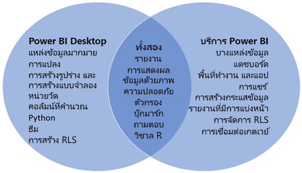

# การเปรียบเทียบ Power BI Desktop และบริการ Power BI

ในแผนภาพเวนน์ที่เปรียบเทียบ Power BI Desktop และบริการ Power BI พื้นที่ตรงกลางจะแสดงให้เห็นว่าทั้งสองทับซ้อนกันอย่างไร งานบางอย่างที่คุณสามารถทำได้ทั้งใน Power BI Desktop หรือบริการ ทั้งสองด้านของแผนภาพเวนน์แสดงคุณสมบัติที่เป็นเอกลักษณ์ของแอปพลิเคชันและบริการ  

**Power BI Desktop** เป็นเครื่องมือการวิเคราะห์ข้อมูลและการสร้างรายงานที่สมบูรณ์แบบ ซึ่งคุณสามารถติดตั้งแอปพลิเคชันฟรีได้บนคอมพิวเตอร์ของคุณ ซึ่งรวมถึง Query Editor ที่คุณสามารถเชื่อมต่อกับแหล่งข้อมูลที่แตกต่างกันมากมายและรวมเข้าด้วยกัน (มักเรียกว่าการสร้างแบบจำลอง) ลงในแบบจำลองข้อมูล จากนั้นคุณออกแบบรายงานที่ยึดตามแบบจำลองข้อมูลนั้น [แนวทางการเริ่มใช้งาน Power BI Desktop](desktop-getting-started.md) ผ่านกระบวนการต่างๆ

**บริการของ PowerBI** เป็นบริการบนคลาวด์ ซึ่งสนับสนุนการแก้ไขรายงานและความร่วมมือกับทีมและองค์กร คุณสามารถเชื่อมต่อกับแหล่งข้อมูลในบริการ Power BI ได้เช่นกัน แต่การสร้างแบบจำลองจะถูกจำกัดไว้ 

ผู้ออกแบบรายงานส่วนใหญ่ที่ทำงานในโครงการระบบธุรกิจอัจฉริยะใช้ **Power BI Desktop** เพื่อสร้างรายงาน จากนั้นใช้ **บริการ Power BI** เพื่อแจกจ่ายรายงานกับผู้อื่น

## การแก้ไขรายงาน

ทั้งในแอปพลิเคชันและบริการ คุณสามารถสร้างและแก้ไข *รายงาน* ได้ รายงานสามารถมีตั้งแต่หนึ่งหน้าขึ้นไปได้ พร้อมด้วยวิชวลและชุดของวิชวล เพิ่มบุ๊กมาร์ก ปุ่ม ตัวกรอง และการเจาะลึกข้อมูลเพื่อปรับปรุงการนำทางในรายงานของคุณ

เครื่องมือแก้ไขรายงานใน Power BI Desktop และในบริการมีความคล้ายคลึงกัน โดยมีการสร้างขึ้นจากสามส่วน:  

1. บานหน้าต่างนำทางด้านบนแตกต่างกันใน Power BI Desktop และบริการ    
2. พื้นที่รายงาน     
3. **ช่องข้อมูล** **การแสดงภาพ**และพื้นที่**ตัวกรอง**

วิดีโอนี้แสดงเครื่องมือแก้ไขรายงานใน Power BI Desktop 

<iframe width="560" height="315" src="https://www.youtube.com/embed/IkJda4O7oGs" frameborder="0" allowfullscreen></iframe>

## การทำงานในบริการของ Power BI

### การทำงานร่วมกัน

หลังจากที่คุณสร้างรายงาน คุณสามารถบันทึกลง *พื้นที่ทำงาน* ใน **บริการ Power BI** ซึ่งคุณและเพื่อนร่วมงานของคุณทำงานร่วมกันได้ คุณสร้าง *แดชบอร์ด* ด้านบนของรายงานเหล่านั้น จากนั้น คุณแชร์แดชบอร์ดและรายงานเหล่านั้นกับผู้ใช้รายงานภายในและภายนอกองค์กรของคุณ ผู้ใช้รายงานของคุณดูรายงานเหล่านั้นในบริการ Power BI ใน *มุมมองการอ่าน* ไม่ใช่มุมมองการแก้ไข พวกเขาไม่มีการเข้าถึงคุณลักษณะทั้งหมดที่พร้อมใช้งานสำหรับผู้สร้างรายงาน  คุณยังสามารถแชร์ชุดข้อมูลของคุณและให้ผู้อื่นสร้างรายงานของพวกเขาเองได้ อ่านเพิ่มเติมเกี่ยวกับ [การทำงานร่วมกันในบริการ Power BI](../collaborate-share/service-new-workspaces.md)

### การเตรียมข้อมูลด้วยตัวเองโดยใช้กระแสข้อมูล

กระแสข้อมูลช่วยให้องค์กรรวมข้อมูลจากแหล่งที่แตกต่างกันอย่างสิ้นเชิง และเตรียมข้อมูลนั้นเพื่อทำแบบจำลอง นักวิเคราะห์สามารถสร้างกระแสข้อมูลได้ง่ายๆ ด้วยการใช้เครื่องมือแบบบริการตนเองที่คุ้นเคยกันดี นักวิเคราะห์ใช้กระแสข้อมูลเพื่อนำเข้า แปลง ผสานรวม และเติมแต่งข้อมูลขนาดใหญ่โดยการกำหนดการเชื่อมต่อของแหล่งข้อมูล, ตรรกะ ETL, กำหนดการรีเฟรช และอื่นๆ อ่านเพิ่มเติมเกี่ยวกับ [การเตรียมข้อมูลด้วยตัวเองโดยใช้กระแสข้อมูล](../transform-model/service-dataflows-overview.md)

## ขั้นตอนถัดไป

[Power BI Desktop คืออะไร](desktop-what-is-desktop.md)

[สร้างรายงาน](../create-reports/service-report-create-new.md)นี้ในบริการของ Power BI

[แนวคิดพื้นฐานสำหรับนักออกแบบรายงาน](service-basic-concepts.md)

มีคำถามเพิ่มเติมหรือไม่ [ลองไปที่ชุมชน Power BI](https://community.powerbi.com/)
