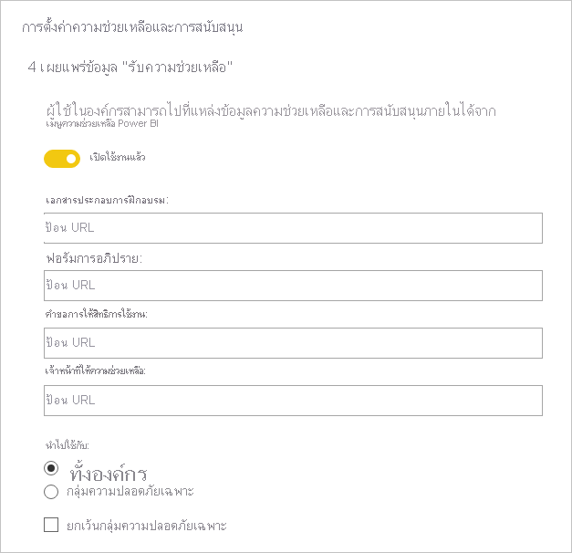
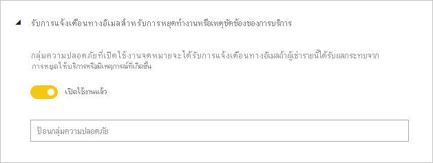
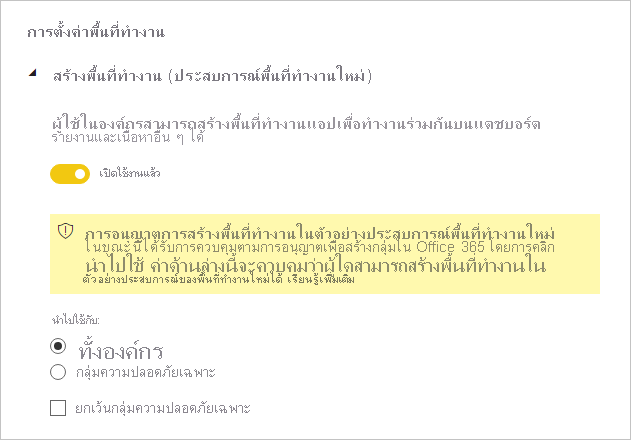
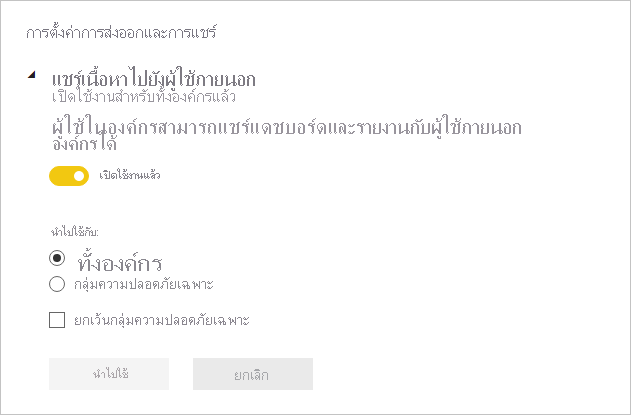
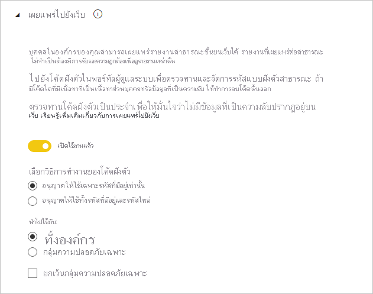
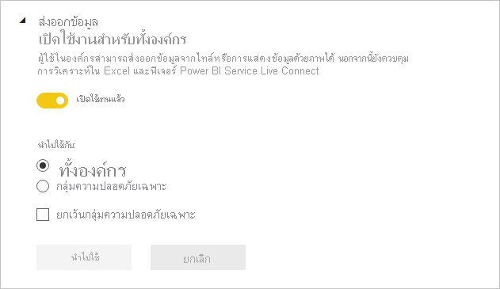
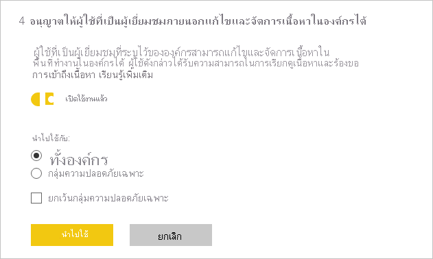

# คำแนะนำเกี่ยวกับการตั้งค่าผู้ดูแลระบบของผู้เช่า

บทความนี้มีผู้อ่านเป้าหมายเป็นผู้ดูแลระบบของ Power BI ที่มีหน้าที่รับผิดชอบเกี่ยวกับการตั้งค่าและการกำหนดค่าสภาพแวดล้อมของ Power BI ในองค์กรของตนเอง

เราให้คำแนะนำสำหรับการตั้งค่าเฉพาะของผู้เช่า ซึ่งจะช่วยปรับปรุงประสบการณ์ใช้งานเกี่ยวกับ Power BI ให้ดียิ่งขึ้ หรืออาจทำให้องค์กรของคุณตกอยู่ในความเสี่ยงได้เช่นกัน เราขอแนะนำให้คุณกำหนดค่าผู้เช่าของคุณให้ตรงกับนโยบายและกระบวนการขององค์กรของคุณเสมอ

[การตั้งค่าผู้เช่า](../admin/service-admin-portal.md#tenant-settings) สามารถจัดการได้ใน [พอร์ทัลผู้ดูแลระบบ](https://app.powerbi.com/admin-portal/tenantSettings) และสามารถกำหนดค่าโดย [ผู้ดูแลระบบบริการ Power BI](../admin/service-admin-administering-power-bi-in-your-organization.md#administrator-roles-related-to-power-bi) การตั้งค่าผู้เช่าจำนวนมากอาจจำกัดความสามารถและคุณลักษณะต่า ๆ สำหรับชุดผู้ใช้ที่จำกัด ดังนั้น เราขอแนะนำให้คุณทำความคุ้นเคยกับการตั้งค่าต่าง ๆ ก่อน เพื่อวางแผนกลุ่มความปลอดภัยที่คุณจะต้องใช้ คุณอาจพบว่า คุณสามารถปรับใช้กลุ่มความปลอดภัยเดียวกันกับการตั้งค่าหลายอย่าง

## ปรับปรุงประสบการณ์ใช้งาน Power BI ให้ดียิ่งขึ้น

### เผยแพร่ข้อมูล "รับความช่วยเหลือ"

เราสนับสนุนให้คุณตั้งค่าไซต์ที่เกี่ยวข้องกับ Power BI ภายใน โดยใช้ [Microsoft Teams](/microsoftteams) หรือแพลตฟอร์มอื่น ๆ ที่ทำงานร่วมกัน ไซต์เหล่านี้อาจใช้สำหรับจัดเก็บเอกสารการฝึกอบรม เป็นพื้นที่ในการอภิปราย ส่งคำขอรับใบอนุญาต หรือตอบสนองเพื่อให้ความช่วยเหลือ

หากคุณดำเนินการดังกล่าวด้วย เราขอแนะนำให้คุณเปิดใช้งานการตั้งค่า **เผยแพร่ข้อมูล "รับความช่วยเหลือ"** _สำหรับทั้งองค์กร_ โดยเข้าไปได้ในกลุ่ม **การตั้งค่าความช่วยเหลือและการสนับสนุน** คุณสามารถตั้งค่า URL สำหรับ:

- เอกสารการฝึกอบรม
- ฟอรัมการอภิปราย
- คำขอสิทธิ์อนุญาตการใช้งาน
- บริการช่วยเหลือ

URL เหล่านี้จะมีให้ใช้งานในรูปแบบลิงก์ในเมนูความช่วยเหลือของ Power BI

> [!NOTE]
> การระบุ URL ของ **คำขอสิทธิ์อนุญาตการใช้งาน** จะทำให้ผู้ใช้รายบุคคลไม่สามารถลงทะเบียนทดลองใช้ Power BI Pro ฟรี 60 วันได้ แต่ระบบจะนำพวกเขาไปที่ไซต์ภายในของคุณที่มีข้อมูลเกี่ยวกับวิธีการได้รับสิทธิ์การใช้งานแทน อาจเป็นแบบฟรีหรือ Pro

## จัดการความเสี่ยง

### รับการแจ้งเตือนทางอีเมลสำหรับการหยุดทำงานหรือเหตุขัดข้องของการบริการ

คุณอาจได้รับการแจ้งเตือนทางอีเมล หากผู้เช่าของคุณได้รับผลกระทบจากการหยุดทำงานหรือเหตุขัดข้องของการบริการ หากเป็นเช่นนี้ คุณอาจตอบสนองในเชิงรุกต่อเหตุขัดข้องดังกล่าวได้

เราขอแนะนำให้คุณเปิดใช้การตั้งค่า **รับการแจ้งเตือนทางอีเมลสำหรับการหยุดทำงานหรือเหตุขัดข้องของการบริการ** โดยเข้าไปได้ในกลุ่ม **การตั้งค่าความช่วยเหลือและการสนับสนุน** กำหนดกลุ่มความปลอดภัยที่_เปิดใช้งานเมล_อย่างน้อยหนึ่งกลุ่ม

### การปกป้องข้อมูล

การปกป้องข้อมูล จะอนุญาตการเปิดใช้การตั้งค่าการป้องกันต่าง ๆ เช่น การเข้ารหัสหรือลายน้ำ ขณะทำการส่งออกข้อมูลจากบริการ Power BI

โดยมีการตั้งค่าผู้เช่าสองแบบที่เกี่ยวข้องกับการปกป้องข้อมูล ตามค่าเริ่มต้นแล้ว การตั้งค่าทั้งสองรายการจะปิดใช้งานสำหรับทั้งองค์กร

เราขอแนะนำให้คุณเปิดใช้การตั้งค่าดังกล่าวเมื่อคุณต้องการจัดการและปกป้องข้อมูลที่สำคัญ สำหรับข้อมูลเพิ่มเติม โปรดดู [การปกป้องข้อมูลใน Power BI](../admin/service-security-data-protection-overview.md)

### สร้างพื้นที่ทำงาน

คุณสามารถจำกัดผู้ใช้ไม่ให้สร้างพื้นที่ทำงาน ด้วยวิธีนี้ คุณจะสามารถควบคุมสิ่งที่สร้างขึ้นภายในองค์กรของคุณได้

> [!NOTE]
> ปัจจุบัน จะมีระยะเวลาการเปลี่ยนผ่านระหว่างประสบการณ์ใช้งานพื้นที่ทำงานแบบเดิมกับแบบใหม่ ทั้งนี้ การตั้งค่าผู้เช่านี้จะปรับใชักับประสบการณ์ใช้งานแบบใหม่เท่านั้น

ตามค่าเริ่มต้น การตั้งค่า **สร้างพื้นที่ทำงาน** จะเปิดใช้งานสำหรับทั้งองค์กร โดยพบได้ในกลุ่ม **การตั้งค่าพื้นที่ทำงาน**

เราขอแนะนำให้คุณกำหนดกลุ่มความปลอดภัยอย่างน้อยหนึ่งกลุ่ม กลุ่มเหล่านี้อาจมีสิทธิ์อนุญาตทั้งแบบอนุญาต _หรือปฏิเสธ_ ในการสร้างพื้นที่ทำงานก็ได้

โปรดแน่ใจว่าได้ระบุคำชี้แจงไว้ในเอกสารของคุณ เพื่อแจ้งให้ผู้ใช้ (บุคคลที่ไม่มีสิทธิ์ในการสร้างพื้นที่ทำงาน) ทราบวิธีการส่งคำขอพื้นที่ทำงานใหม่

### แชร์เนื้อหาไปยังผู้ใช้ภายนอก

ผู้ใช้สามารถแชร์รายงานและแดชบอร์ดกับผู้คนที่อยู่ภายนอกองค์กรของคุณได้

ตามค่าเริ่มต้น การตั้งค่า **แชร์เนื้อหากับผู้ใช้ภายนอก** จะเปิดใช้งานสำหรับทั้งองค์กร โดยพบได้ในกลุ่ม **การตั้งค่าการส่งออกและการแชร์**

เราขอแนะนำให้คุณกำหนดกลุ่มความปลอดภัยอย่างน้อยหนึ่งกลุ่ม กลุ่มเหล่านี้อาจมีสิทธิ์อนุญาตเป็นแบบอนุญาต _หรือปฏิเสธ_ ในการแชร์เนื้อหากับผู้ใช้ภายนอกก็ได้

### เผยแพร่บนเว็บ

คุณลักษณะ [เผยแพร่ไปยังเว็บ](../collaborate-share/service-publish-to-web.md) จะอนุญาตการเผยแพร่รายงานสาธารณะบนเว็บ ถ้ามีการใช้อย่างไม่เหมาะสม มีความเสี่ยงที่ข้อมูลลับอาจรั่วไหลไปบนเว็บ

ตามค่าเริ่มต้น การตั้งค่า **เผยแพร่ไปยังเว็บ** นี้จะเปิดใช้งานสำหรับทั้งองค์กร แต่จะจำกัดความสามารถในการสร้างโค้ดฝังตัวสำหรับผู้ใชที่ไม่ใช่ผู้ดูแลระบบ โดยพบได้ในกลุ่ม **การตั้งค่าการส่งออกและการแชร์**

หากเปิดใช้งาน เราขอแนะนำให้คุณกำหนดกลุ่มความปลอดภัยอย่างน้อยหนึ่งกลุ่ม กลุ่มเหล่านี้อาจมีสิทธิ์อนุญาตทั้งแบบอนุญาต _หรือปฏิเสธ_ ในการเผยแพร่รายงานก็ได้

นอกจากนี้ ยังมีตัวเลือกสำหรับเลือกลักษณะการทำงานของโค้ดฝังตัวของคุณอีกด้วย ตามค่าเริ่มต้น จะมีการตั้งค่าเป็น **อนุญาตเฉพาะโค้ดที่มีอยู่เท่านั้น** หมายความว่า ผู้ใช้จะได้รับการร้องขอให้ติดต่อผู้ดูแลระบบ Power BI สร้างโค้ดฝังตัว

นอกจากนี้ เราขอแนะนำให้คุณตรวจสอบ [โค้ดฝังตัวของการเผยแพร่ไปยังเว็บ](https://app.powerbi.com/admin-portal/embedCodes) เป็นประจำ โปรดลบโค้ดออก หากมีการเผยแพร่ข้อมูลส่วนตัวหรือข้อมูลลับ

### ส่งออกข้อมูล

คุณสามารถจำกัดผู้ใช้ไม่ให้ส่งออกข้อมูลจากไทล์แดชบอร์ดหรือวิชวลรายงานได้

ตามค่าเริ่มต้น การตั้งค่า **ส่งออกข้อมูล** จะเปิดใช้งานสำหรับทั้งองค์กร โดยพบได้ในกลุ่ม **การตั้งค่าการส่งออกและการแชร์**

เราขอแนะนำให้คุณกำหนดกลุ่มความปลอดภัยอย่างน้อยหนึ่งกลุ่ม กลุ่มเหล่านี้อาจมีสิทธิ์อนุญาตทั้งแบบอนุญาต _หรือปฏิเสธ_ ในการเผยแพร่รายงานก็ได้

> [!IMPORTANT]
> นอกจากนี้ การปิดใช้งานการตั้งค่านี้จะจำกัดการใช้คุณลักษณะ [การวิเคราะห์ใน Excel](../collaborate-share/service-analyze-in-excel.md) และ[การเชื่อมต่อแบบสด](../connect-data/desktop-report-lifecycle-datasets.md#using-a-power-bi-service-live-connection-for-report-lifecycle-management)ของบริการ Power BI

> [!NOTE]
> หากผู้ใช้อนุญาตให้ผู้ใช้ส่งออกข้อมูลได้ คุณจะสามารถเพิ่มระดับชั้นการปกป้องได้โดยการเปิดใช้ [การปกป้องข้อมูล](../admin/service-security-data-protection-overview.md) หลังจากกำหนดค่าแล้ว ระบบจะบล็อกผู้ใช้ที่ไม่ได้รับอนุญาต ไม่ให้ส่งออกเนื้อหาที่มีป้ายกำกับว่าเป็นข้อมูลสำคัญ

### อนุญาตให้ผู้ใช้ที่เป็นผู้เยี่ยมชมภายนอกแก้ไขและจัดการเนื้อหาในองค์กร

มีความเป็นไปได้ที่ผู้ใช้ที่เป็นผู้เยี่ยมชมจากภายนอกสามารถแก้ไขและจัดการเนื้อหา Power BI ได้ สำหรับข้อมูลเพิ่มเติม โปรดดู [กระจายเนื้อหา Power BI ไปยังผู้ใช้ที่เป็นผู้เยี่ยมชมจากภายนอกด้วย Azure AD B2B](../admin/service-admin-azure-ad-b2b.md)

ตามค่าเริ่มต้น การตั้งค่า **อนุญาตให้ผู้ใช้ที่เป็นผู้เยี่ยมชมภายนอกแก้ไขและจัดการเนื้อหาในองค์กร** จะปิดใช้งานสำหรับทั้งองค์กร โดยพบได้ในกลุ่ม **การตั้งค่าการส่งออกและการแชร์**

หากคุณต้องการอนุญาตให้ผู้ใช้ภายนอกสามารถแก้ไขและจัดการเนื้อหาได้ เราขอแนะนำให้คุณกำหนดกลุ่มความปลอดภัยอย่างน้อยหนึ่งกลุ่ม กลุ่มเหล่านี้อาจมีสิทธิ์อนุญาตทั้งแบบอนุญาต _หรือปฏิเสธ_ ในการเผยแพร่รายงานก็ได้

### การตั้งค่าผู้พัฒนา

มีการตั้งค่าผู้เช่าที่เกี่ยวกับ [การฝังเนื้อหา Power BI](../developer/embedded/embedding.md) สองแบบ คือ:

- เนื้อหาที่ฝังในแอป (เปิดใช้งานตามค่าเริ่มต้น)
- อนุญาตให้ผู้ใช้บริการหลักใช้ API ของ Power BI (ปิดใช้งานตามค่าเริ่มต้น)

หากคุณไม่ต้องการใช้ API ของนักพัฒนาในการฝังเนื้อหา เราขอแนะนำให้คุณปิดการใช้งานฟังก์ชันนี้ หรืออย่างน้อย กำหนดค่ากลุ่มความปลอดภัยเฉพาะที่จะทำงานนี้

## ขั้นตอนถัดไป

สำหรับข้อมูลเพิ่มเติมที่เกี่ยวข้องกับบทความนี้ โปรดดูทรัพยากรต่อไปนี้:

- [การดูแลระบบ Power BI คืออะไร?](../admin/service-admin-administering-power-bi-in-your-organization.md)
- [การดูแล Power BI ในพอร์ทัลผู้ดูแลระบบ](../admin/service-admin-portal.md)
- มีคำถามหรือไม่? [ลองถามชุมชน Power BI](https://community.powerbi.com/)
- มีข้อเสนอแนะไหม [สนับสนุนแนวคิดในการปรับปรุง Power BI](https://ideas.powerbi.com)

