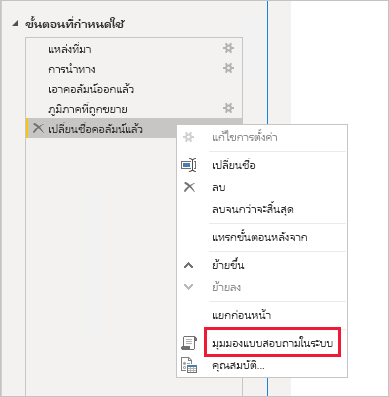
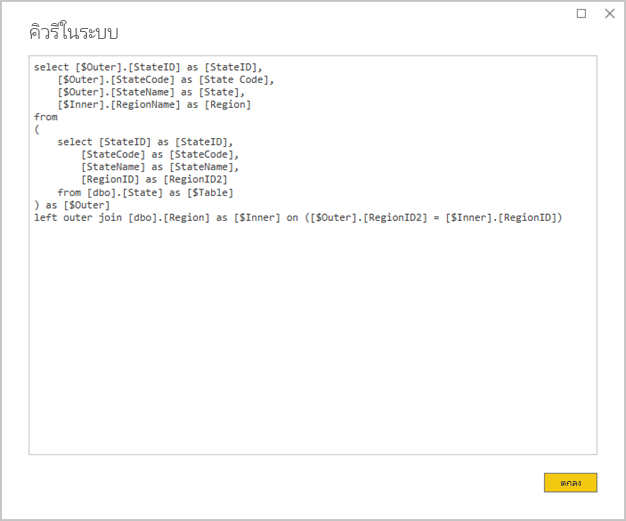
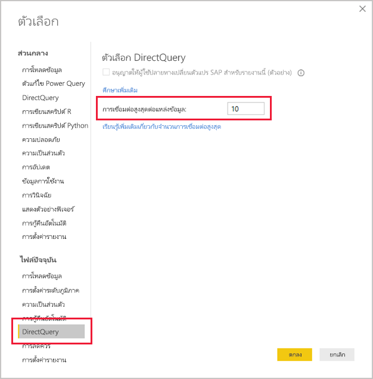
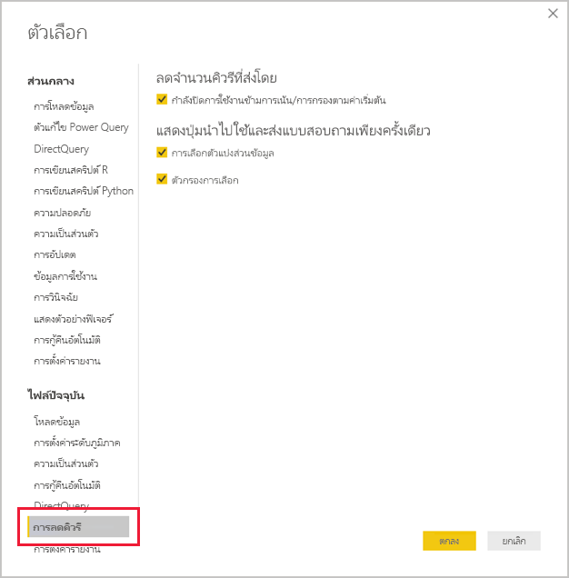
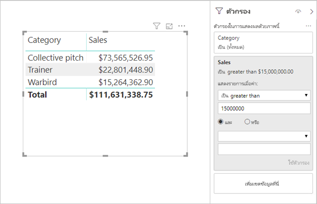

# <a name="directquery-model-guidance-in-power-bi-desktop"></a>คำแนะนำแบบจำลอง DirectQuery ใน Power BI Desktop

บทความนี้มีเป้าหมายสำหรับผู้สร้างแบบจำลองข้อมูลที่กำลังพัฒนาแบบจำลอง Power BI DirectQuery ซึ่งพัฒนาโดยใช้ Power BI Desktop หรือบริการของ Power BI ซึ่งอธิบายถึงกรณีที่ใช้ DirectQuery ข้อจำกัด และคำแนะนำ คำแนะนำได้รับการออกแบบมาเพื่อช่วยให้คุณตรวจสอบว่า DirectQuery เป็นโหมดที่เหมาะสมสำหรับแบบจำลองของคุณหรือไม ่และเพื่อปรับปรุงประสิทธิภาพของรายงานของคุณตามแบบจำลอง DirectQuery บทความนี้นำไปใช้กับแบบจำลอง DirectQuery ที่โฮสต์ในบริการของ Power BI หรือเซิร์ฟเวอร์รายงาน Power BI

บทความนี้ไม่ได้มีไว้เพื่อจัดการอภิปรายที่สมบูรณ์เกี่ยวกับการออกแบบแบบจำลอง DirectQuery สำหรับคำแนะนำ ให้ดูที่บทความ [แบบจำลอง DirectQuery ใน Power BI Desktop](../desktop-directquery-about.md) สำหรับการอภิปรายเชิงลึก ให้ดูที่เอกสารทางเทคนิค [DirectQuery ใน SQL Server 2016 Analysis Services](https://download.microsoft.com/download/F/6/F/F6FBC1FC-F956-49A1-80CD-2941C3B6E417/DirectQuery%20in%20Analysis%20Services%20-%20Whitepaper.pdf)โดยตรง โปรดทราบว่าเอกสารทางเทคนิคจะอธิบายโดยใช้ DirectQuery ใน SQL Server Analysis Services อย่างไรก็ตาม เนื้อหาส่วนใหญ่จะยังคงสามารถใช้ได้กับแบบจำลอง Power BI DirectQuery 

บทความนี้ไม่ได้ครอบคลุมแบบจำลองคอมโพสิตโดยตรง แบบจำลองคอมโพสิตจะประกอบด้วยแหล่งข้อมูล DirectQuery อย่างน้อยหนึ่งรายการและอาจเพิ่มเติมได้ คำแนะนำที่อธิบายไว้ในบทความนี้ยังคงเกี่ยวข้องกับการออกแบบแบบจำลองคอมโพสิตเป็นอย่างน้อย อย่างไรก็ตาม ความเกี่ยวข้องของการรวมตารางนำเข้ากับตาราง DirectQuery ไม่ได้อยู่ในขอบเขตสำหรับบทความนี้ สำหรับข้อมูลเพิ่มเติม โปรดดูการ[ใช้โมเดลแบบรวมใน Power BI Desktop](../desktop-composite-models.md)

สิ่งสำคัญคือต้องทำความเข้าใจว่าแบบจำลอง DirectQuery กำหนดปริมาณงานที่แตกต่างกันในสภาพแวดล้อม Power BI (บริการของ Power BI หรือเซิร์ฟเวอร์รายงาน Power BI) และบนแหล่งข้อมูลต้นแบบ ถ้าคุณตัดสินใจว่า DirectQuery เป็นวิธีการออกแบบที่เหมาะสม เราขอแนะนำให้คุณร่วมมือกับบุคคลที่เหมาะสมกับโครงการ เรามักจะเห็นว่าการปรับใช้แบบจำลองDirectQuery ที่ประสบความสำเร็จนั้นเป็นผลมาจากทีมผู้เชี่ยวชาญด้านไอทีที่ทำงานร่วมกันอย่างใกล้ชิด ทีมมักจะประกอบด้วยนักพัฒนาแบบจำลองและผู้ดูแลระบบฐานข้อมูลต้นทาง นอกจากนี้ยังสามารถเกี่ยวข้องกับสถาปนิกข้อมูลและคลังข้อมูลและนักพัฒนา ETL บ่อยครั้งที่การปรับให้เหมาะสมจะต้องถูกนำไปใช้กับแหล่งข้อมูลโดยตรงเพื่อให้ได้ผลลัพธ์ประสิทธิภาพที่ดี

## <a name="design-in-power-bi-desktop"></a>ออกแบบใน Power BI Desktop

ทั้งคลังข้อมูล Azure SQL และแหล่งข้อมูล Azure HDInsight Spark สามารถเชื่อมต่อโดยตรงได้โดยไม่จำเป็นต้องใช้ Power BI Desktop ซึ่งสามารถทำได้ในบริการของ Power BI โดย "การรับข้อมูล" และการเลือกไทล์ฐานข้อมูล สำหรับข้อมูลเพิ่มเติม ดูที่[คลังข้อมูล Azure SQL ที่มี DirectQuery](../service-azure-sql-data-warehouse-with-direct-connect.md)

แม้ว่าการเชื่อมต่อโดยตรงจะสะดวก แต่เราไม่แนะนำให้คุณใช้วิธีนี้ เหตุผลหลักคือไม่สามารถรีเฟรชโครงสร้างแบบจำลองหากมีการเปลี่ยนแปลง Schema แหล่งข้อมูลต้นแบบ

เราขอแนะนำให้คุณใช้ Power BI Desktop เพื่อสร้างและจัดการแบบจำลอง DirectQuery ทั้งหมดของคุณ วิธีนี้ช่วยให้คุณสามารถควบคุมได้อย่างเต็มที่เพื่อกำหนดแบบจำลองที่คุณต้องการ ซึ่งรวมถึงการใช้คุณลักษณะที่ได้รับการสนับสนุนเช่น ลำดับชั้น คอลัมน์จากการคำนวณ หน่วยวัด และอื่น ๆ อีกมากมาย นอกจากนี้ยังจะช่วยให้คุณสามารถแก้ไขการออกแบบแบบจำลองหากมีการเปลี่ยนแปลง Schema แหล่งข้อมูลต้นแบบ

## <a name="optimize-data-source-performance"></a>ปรับประสิทธิภาพของแหล่งข้อมูลให้เหมาะสม

แหล่งฐานข้อมูลเชิงสัมพันธ์สามารถปรับให้เหมาะสมได้ในหลายวิธีตามที่อธิบายไว้ในรายการหัวข้อย่อยต่อไปนี้

> [!NOTE]
> เราเข้าใจว่าผู้สร้างแบบจำลองบางคนไม่ได้รับอนุญาตหรือไม่มีทักษะในการปรับประสิทธิภาพฐานข้อมูลเชิงสัมพันธ์ให้เหมาะสม แม้ว่าจะเป็นเลเยอร์ที่จำเป็นในการเตรียมข้อมูลสำหรับแบบจำลอง DirectQuery แต่การเพิ่มประสิทธิภาพบางอย่างยังสามารถทำได้ในการออกแบบแบบจำลองโดยไม่ต้องแก้ไขฐานข้อมูลต้นทาง อย่างไรก็ตาม ผลการเพิ่มประสิทธิภาพที่ดีที่สุดมักจะทำได้โดยใช้การปรับให้เหมาะสมกับฐานข้อมูลต้นทาง

- **ตรวจสอบให้แน่ใจว่าข้อมูลมีความถูกต้อง:** เป็นสิ่งสำคัญอย่างยิ่งที่ตารางประเภทมิติต้องประกอบด้วยคอลัมน์ของค่าที่ไม่ซ้ำกัน (คีย์มิติ) ซึ่งแมปกับตารางประเภทข้อเท็จจริง นอกจากนี้ ยังเป็นสิ่งสำคัญที่คอลัมน์มิติข้อเท็จจริงต้องมีค่าคีย์มิติที่ถูกต้อง การดำเนินการนี้จะช่วยให้การกำหนดค่าความสัมพันธ์แบบจำลองมีประสิทธิภาพมากขึ้น ซึ่งคาดว่าจะมีค่าที่ตรงกันทั้งสองด้านของความสัมพันธ์ หากข้อมูลต้นฉบับไม่ถูกต้อง ขอแนะนำให้เพิ่มไฟล์ข้อมูลมิติ "ไม่ทราบ" เพื่อซ่อมแซมข้อมูลอย่างมีประสิทธิภาพ ตัวอย่างเช่น คุณสามารถเพิ่มแถวลงในตาราง**ผลิตภัณฑ์** เพื่อแสดงถึงผลิตภัณฑ์ที่ไม่รู้จัก และจากนั้นกำหนดคีย์ที่อยู่นอกช่วงเช่น -1 ถ้าแถวในตาราง**ยอดขาย**ประกอบด้วยค่าคีย์ผลิตภัณฑ์ที่ขาดหายไป ให้แทนที่ด้วย -1 การดำเนินการนี้จะทำให้แน่ใจว่าค่าคีย์ผลิตภัณฑ์**ยอดขาย**ทั้งหมดมีแถวที่สอดคล้องกันในตาราง**ผลิตภัณฑ์**
- **เพิ่มดัชนี:** กำหนดดัชนีที่เหมาะสม—ในตารางหรือมุมมองเพื่อสนับสนุนการดึงข้อมูลที่มีประสิทธิภาพสำหรับการกรองและการจัดกลุ่มวิชวลรายงานที่คาดไว้ สำหรับ SQL Server ฐานข้อมูล Azure SQL หรือแหล่งข้อมูลคลัง Azure SQL ให้ดู [คู่มือสถาปัตยกรรมและการออกแบบ SQL Server Index](/sql/relational-databases/sql-server-index-design-guide?view=sql-server-2017) สำหรับข้อมูลที่เป็นประโยชน์เกี่ยวกับคำแนะนำการออกแบบดัชนี สำหรับแหล่งข้อมูลที่เปลี่ยนแปลงได้ของ SQL Server หรือ Azure SQL Database ให้ดู [เริ่มต้นใช้งานด้วย Columnstore เพื่อการวิเคราะห์การดำเนินงานแบบเรียลไทม์](/sql/relational-databases/indexes/get-started-with-columnstore-for-real-time-operational-analytics?view=sql-server-2017)
- **ออกแบบตารางแบบกระจาย:** สำหรับแหล่งคลังข้อมูล Azure SQL ซึ่งใช้ประโยชน์จากสถาปัตยกรรม Massively Parallel Processing (MPP) ให้พิจารณากำหนดค่าตารางประเภทข้อเท็จจริงขนาดใหญ่เป็นแฮชที่กระจาย และตารางประเภทมิติเพื่อทำซ้ำในโหนดการคำนวณทั้งหมด สำหรับข้อมูลเพิ่มเติม ให้ดู[คำแนะนำสำหรับการออกแบบตารางแบบกระจายในคลังข้อมูล Azure SQL](/azure/sql-data-warehouse/sql-data-warehouse-tables-distribute#what-is-a-distributed-table)
- **ตรวจสอบให้แน่ใจว่ามีการแปลงข้อมูลที่จำเป็นให้เป็นรูปธรรม:** สำหรับแหล่งฐานข้อมูลเชิงสัมพันธ์ SQL Server (และแหล่งฐานข้อมูลเชิงสัมพันธ์อื่นๆ) สามารถเพิ่มคอลัมน์จากการคำนวณลงในตารางได้ คอลัมน์เหล่านี้จะยึดตามนิพจน์เช่น **ปริมาณ** คูณด้วย **UnitPrice**. คอลัมน์จากการคำนวณสามารถคงอยู่ได้ (เป็นรูปธรรม) และเช่นเดียวกับคอลัมน์ปกติ บางครั้งก็สามารถสร้างดัชนีได้ สำหรับข้อมูลเพิ่มเติม ให้ดู[ดัชนีบนคอลัมน์จากการคำนวณ](/sql/relational-databases/indexes/indexes-on-computed-columns?view=sql-server-2017)

    พิจารณามุมมองที่มีการจัดทำดัชนีซึ่งสามารถรวบรวมข้อมูลตารางข้อเท็จจริงล่วงหน้าในระดับเกรนที่สูงขึ้นได้ ตัวอย่างเช่น ถ้าตาราง**ยอดขาย** จัดเก็บข้อมูลที่ระดับใบสั่งซื้อ คุณสามารถสร้างมุมมองเพื่อสรุปข้อมูลนี้ได้ มุมมองอาจขึ้นอยู่กับคำสั่ง SELECT ที่จัดกลุ่มข้อมูลตาราง**ยอดขาย**ตามวันที่ (ในระดับเดือน) ลูกค้า ผลิตภัณฑ์ และสรุปค่าหน่วยวัดเช่น ยอดขาย ปริมาณ, ฯลฯ จากนั้นสามารถทำดัชนีมุมมองได้ สำหรับ SQL Server หรือแหล่งฐานข้อมูล Azure SQL ให้ดู [สร้างมุมมองที่จัดทำดัชนี](/sql/relational-databases/views/create-indexed-views?view=sql-server-2017)
- **ทำตารางวันที่ให้เป็นรูปธรรม:** ข้อกำหนดในการสร้างแบบจำลองทั่วไปเกี่ยวข้องกับการเพิ่มตารางวันที่เพื่อสนับสนุนการกรองตามเวลา เพื่อสนับสนุนตัวกรองตามเวลาที่รู้จักในองค์กรของคุณ ให้สร้างตารางในฐานข้อมูลต้นทางและตรวจสอบให้แน่ใจว่าตารางได้ถูกโหลดในช่วงวันที่ ซึ่งครอบคลุมวันที่ของตารางข้อเท็จจริง นอกจากนี้ยังตรวจสอบให้แน่ใจว่ามีคอลัมน์สำหรับช่วงเวลาที่มีประโยชน์ เช่น ปี ไตรมาส เดือน สัปดาห์ ฯลฯ

## <a name="optimize-model-design"></a>ปรับแต่งการออกแบบแบบจำลอง

แบบจำลอง DirectQuery สามารถปรับให้เหมาะสมได้หลายวิธีตามที่อธิบายไว้ในรายการหัวข้อย่อยต่อไปนี้

- **หลีกเลี่ยงการใช้คิวรี Power Query ที่ซับซ้อน:** การออกแบบรูปแบบที่มีประสิทธิภาพสามารถทำได้โดยไม่จำเป็นต้องใช้คิวรี Power Query เพื่อทำการแปลงข้อมูลใด ๆ ซึ่งหมายความว่าคิวรีแต่ละรายการจะแมปไปยังตารางแหล่งข้อมูลเชิงสัมพันธ์หรือมุมมองเดียว คุณสามารถแสดงตัวอย่างของคำสั่งคิวรี SQL ที่แท้จริงสำหรับขั้นตอนที่ใช้ Power Query โดยการเลือกตัวเลือก **ดูคิวรีในระบบของฐานข้อมูล**

    
    
    

- **ตรวจสอบการใช้งานของคอลัมน์จากการคำนวณและการเปลี่ยนแปลงชนิดข้อมูล** แบบจำลอง DirectQuery รองรับการเพิ่มการคำนวณและขั้นตอน Power Query เพื่อแปลงชนิดข้อมูล อย่างไรก็ตาม ประสิทธิภาพที่ดีขึ้นมักจะทำได้โดยการทำให้ผลการแปลงข้อมูลเป็นรูปธรรมในแหล่งฐานข้อมูลเชิงสัมพันธ์เมื่อเป็นไปได้
- **อย่าใช้การกรองวันที่ที่สัมพันธ์กันของ Power Query:** คุณสามารถกำหนดการกรองวันที่ที่สัมพันธ์กันในคิวรี Power Query ได้ ตัวอย่างเช่น ในการดึงข้อมูลใบสั่งขายที่สร้างขึ้นในปีที่ผ่านมา (เทียบกับวันที่ปัจจุบัน) ตัวกรองชนิดนี้จะแปลเป็นคิวรีในระบบของฐานข้อมูลที่ไม่มีประสิทธิภาพ ดังต่อไปนี้:

    ```SQL
    …
    from [dbo].[Sales] as [_]
    where [_].[OrderDate] >= convert(datetime2, '2018-01-01 00:00:00') and [_].[OrderDate] < convert(datetime2, '2019-01-01 00:00:00'))  
    ```
    
    วิธีการออกแบบที่ดีกว่าคือการรวมคอลัมน์เวลาที่สัมพันธ์กันในตารางวันที่ คอลัมน์เหล่านี้จะจัดเก็บค่าตรงข้ามที่สัมพันธ์กับวันที่ปัจจุบัน ตัวอย่างเช่น ในคอลัมน์ **RelativeYear** ค่าศูนย์แทนปีปัจจุบัน -1 แทนปีก่อนหน้า เป็นต้น อย่างไรก็ตาม คอลัมน์ **RelativeYear** จะปรากฎขึ้นในตารางวันที่ แม้ว่าประสิทธิภาพจะน้อยลง แต่ก็ยังสามารถเพิ่มเป็นคอลัมน์จากการคำนวณของแบบจำลองโดยยึดตามนิพจน์โดยใช้ฟังก์ชัน DAX ของ [TODAY](/dax/today-function-dax) และ [DATE](/dax/date-function-dax)

- **เก็บหน่วยวัดแบบง่าย:** อย่างน้อยในขั้นตอนแรก เราาขอแนะนำให้จำกัดหน่วยวัดเป็นผลรวมอย่างง่าย ฟังก์ชันการรวมประกอบด้วย SUM, COUNT, MIN, MAX และ AVERAGE จากนั้นหากการวัดนั้นสามารถตอบสนองได้อย่างเพียงพอ คุณสามารถทดสอบด้วยการวัดที่ซับซ้อนมากขึ้น แต่ให้ความสนใจกับประสิทธิภาพของการวัดแต่ละรายการ แม้ว่าฟังก์ชัน DAX ของ [CALCULATE](/dax/calculate-function-dax) สามารถใช้ในการสร้างนิพจน์หน่วยวัดที่มีความซับซ้อนซึ่งจัดการบริบทตัวกรอง แต่อาจก่อให้เกิดคิวรีในระบบของฐานข้อมูลที่มีราคาแพงที่ไม่ได้ทำงานได้ดี
- **หลีกเลี่ยงความสัมพันธ์บนคอลัมน์จากการคำนวณ:** ความสัมพันธ์ของแบบจำลองสามารถเชื่อมโยงคอลัมน์เดียวในตารางเดียวกับคอลัมน์เดียวในตารางอื่นเท่านั้น อย่างไรก็ตาม ในบางครั้งคุณจำเป็นต้องเชื่อมโยงตารางโดยใช้หลายคอลัมน์ ตัวอย่างเช่น ตาราง**ยอดขาย**และ **ภูมิศาสตร์** จะเชื่อมโยงกันโดยสองคอลัมน์ได้แก่ **ประเทศ** และ**เมือง**. ในการสร้างความสัมพันธ์ระหว่างตาราง ต้องใช้คอลัมน์เดียว และในตาราง **ภูมิศาสตร์** คอลัมน์จะต้องมีค่าที่ไม่ซ้ำกัน การเชื่อมโยงประเทศและเมืองด้วยตัวคั่นยัติภังค์สามารถบรรลุผลลัพธ์นี้ได้

    คอลัมน์ที่รวมสามารถสร้างขึ้นได้ด้วยคอลัมน์แบบกำหนดเองของ Power Query หรือในแบบจำลองเป็นคอลัมน์จากการคำนวณ อย่างไรก็ตาม การดำเนินการนี้ควรหลีกเลี่ยงเนื่องจากนิพจน์การคำนวณจะถูกฝังลงในคิวรีแหล่งข้อมูล ไม่เพียงแต่จะไม่มีประสิทธิภาพเท่านั้น แต่ยังขัดขวางมิให้มีการใช้ดัชนี ให้เพิ่มคอลัมน์ที่เป็นรูปธรรมในแหล่งฐานข้อมูลเชิงสัมพันธ์แทน และพิจารณาการจัดทำดัชนีคอลัมน์เหล่านั้น นอกจากนี้คุณยังสามารถพิจารณาเพิ่มคอลัมน์คีย์ตัวแทนไปยังตารางชนิดมิติ ซึ่งเป็นแนวทางปฏิบัติทั่วไปในการออกแบบคลังข้อมูลเชิงสัมพันธ์
    
    มีข้อยกเว้นหนึ่งข้อสำหรับคำแนะนำนี้ และเกี่ยวข้องกับการใช้ฟังก์ชัน DAX ของ [COMBINEVALUES](/dax/combinevalues-function-dax) วัตถุประสงค์ของฟังก์ชันนี้คือการสนับสนุนความสัมพันธ์ของแบบจำลองที่มีหลายคอลัมน์ ให้สร้างเพรดิเคตการรวม SQL แบบหลายคอลัมน์ แทนการสร้างนิพจน์ที่ความสัมพันธ์ใช้
- **หลีกเลี่ยงความสัมพันธ์บนคอลัมน์ “ตัวระบุที่ไม่ซ้ำกัน”** โดยดั้งเดิมแล้ว Power BI จะไม่สนับสนุนชนิดข้อมูลตัวระบุที่ไม่ซ้ำกัน (GUID) เมื่อกำหนดความสัมพันธ์ระหว่างคอลัมน์ประเภทนี้ Power BI จะสร้างคิวรีแหล่งข้อมูลด้วยการรวมที่เกี่ยวข้องกับการแปลง การแปลงข้อมูลเวลาของคิวรีนี้ส่งผลให้ประสิทธิภาพการทำงานแย่ลง การแก้ไขปัญหาชั่วคราวเป็นเพียงการทำให้คอลัมน์ของประเภทข้อมูลทางเลือกเป็นรูปธรรมในฐานข้อมูลต้นแบบเท่านั้น จนกว่ากรณีนี้จะได้รับการปรับให้เหมาะสม
- **ซ่อนคอลัมน์ด้านเดียวของความสัมพันธ์:** คอลัมน์ด้านเดียวของความสัมพันธ์ควรจะถูกซ่อนไว้ (ซึ่งมักจะเป็นคอลัมน์คีย์หลักของตารางชนิดมิติ) เมื่อซ่อนอยู่ จะไม่สามารถใช้งานได้ในบานหน้าต่าง **เขตข้อมูล** และดังนั้นจึงไม่สามารถใช้ในการกำหนดค่าวิชวลได้. คอลัมน์แบบหลายด้านสามารถมองเห็นได้ถ้าเป็นประโยชน์ในการจัดกลุ่มหรือกรองรายงานตามค่าของคอลัมน์ ตัวอย่างเช่น ให้พิจารณาแบบจำลองที่มีความสัมพันธ์ระหว่างตาราง **ยอดขาย** และ **ผลิตภัณฑ์** คอลัมน์ความสัมพันธ์ประกอบด้วยค่า SKU (หน่วยการเก็บสินค้าคงคลัง) ของผลิตภัณฑ์ ถ้าต้องเพิ่ม SKU ของผลิตภัณฑ์ในวิชวล ควรมองเห็นได้เฉพาะในตาราง**ยอดขาย** เมื่อคอลัมน์นี้ถูกใช้ในการกรองหรือจัดกลุ่มในวิชวล Power BI จะสร้างคิวรีที่ไม่จำเป็นต้องรวมตาราง**ยอดขาย** และ **ผลิตภัณฑ์**
- **กำหนดความสัมพันธ์เพื่อทำให้ถูกต้อง:** คุณสมบัติ**ตั้งสมมุติฐานแบบ Referential Integrity**ของความสัมพันธ์ DirectQuery จะกำหนดว่า Power BI จะสร้างคิวรีแหล่งข้อมูลโดยใช้การรวมภายในแทนการรวมภายนอก ซึ่งโดยทั่วไปแล้วจะช่วยปรับปรุงประสิทธิภาพการทำงานของคิวรี แม้ว่าจะขึ้นอยู่กับแหล่งฐานข้อมูลเชิงสัมพันธ์ สำหรับข้อมูลเพิ่มเติม ให้ดู [สมมติว่ามีการตั้งค่า Referential Integrity ใน Power BI Desktop](../desktop-assume-referential-integrity.md)
- **หลีกเลี่ยงการใช้การกรองความสัมพันธ์แบบสองทิศทาง:** การใช้การกรองความสัมพันธ์แบบสองทิศทางสามารถทำให้คำสั่งคิวรีทำงานได้ไม่ดี ใช้คุณลักษณะความสัมพันธ์นี้เฉพาะเมื่อจำเป็นเท่านั้น และโดยปกติแล้วจะเป็นกรณีที่มีความสัมพันธ์แบบกลุ่ม-ต่อ-กลุ่มในตารางการเชื่อมโยง สำหรับข้อมูลเพิ่มเติม ดู [ความสัมพันธ์กับคาร์ดินัลลิตี้แบบกลุ่ม-ต่อ-กลุ่มใน Power BI Desktop](../desktop-many-to-many-relationships.md)
- **จำกัดคิวรีแบบขนาน:** คุณสามารถตั้งค่าจำนวนสูงสุดของการเชื่อมต่อที่ DirectQuery เปิดขึ้นสำหรับแหล่งข้อมูลต้นแบบแต่ละแหล่ง การดำเนินการนี้จะควบคุมจำนวนคิวรีที่ส่งไปยังแหล่งข้อมูลพร้อมกัน

    
    
    การตั้งค่าจะเปิดใช้งานเฉพาะเมื่อมีอย่างน้อยหนึ่งแหล่งข้อมูล DirectQuery ในแบบจำลอง ค่าดังกล่าวจะนำไปใช้กับแหล่งข้อมูล DirectQuery ทั้งหมด และแหล่งข้อมูล DirectQuery ใหม่ใด ๆ ที่เพิ่มลงในแบบจำลอง

    การเพิ่มค่า**การเชื่อมต่อสูงสุดต่อแหล่งข้อมูล** ช่วยให้มั่นใจได้ว่าจะสามารถส่งคิวรีไปยังแหล่งข้อมูลต้นแบบได้มากขึ้น (ถึงจำนวนสูงสุดตามที่ระบุ) ซึ่งเป็นประโยชน์เมื่อมีวิชวลจำนวนมากในหน้าเดียวหรือมีผู้ใช้หลายคนที่เข้าถึงรายงานในเวลาเดียวกัน  เมื่อถึงขีดจำกัดจำนวนสูงสุดของการเชื่อมต่อ เพิ่มเติมคิวรีอยู่ในคิวจนกว่าการเชื่อมต่อจะพร้อมใช้งาน การเพิ่มขีดจำกัดนี้จะทำให้เกิดการโหลดในแหล่งข้อมูลต้นแบบ ดังนั้นการตั้งค่าจึงไม่ได้รับการรับประกันการปรับปรุงประสิทธิภาพการทำงานโดยรวม
    
    เมื่อมีการเผยแพร่แบบจำลองไปยัง Power BI จำนวนสูงสุดของคิวรีที่เกิดขึ้นพร้อมกันที่ส่งไปยังแหล่งข้อมูลต้นแบบจะขึ้นอยู่กับสภาพแวดล้อมด้วย สภาพแวดล้อมต่าง ๆ (เช่น Power BI, Power BI Premium หรือ เซิร์ฟเวอร์รายงาน Power BI) แต่ละรายการสามารถกำหนดขีดจำกัดอัตราความเร็วที่แตกต่างกัน สำหรับข้อมูลเพิ่มเติมเกี่ยวกับข้อจำกัดของทรัพยากรความจุ Power BI Premium ให้ดู [การปรับใช้และการจัดการความจุ Power BI Premium](https://docs.microsoft.com/power-bi/whitepaper-powerbi-premium-deployment)

## <a name="optimize-report-designs"></a>ปรับการออกแบบรายงานให้เหมาะสม

รายงานที่ยึดตามชุดข้อมูล DirectQuery สามารถปรับให้เหมาะสมได้หลายวิธีตามที่อธิบายไว้ในรายการหัวข้อย่อยต่อไปนี้

- **เปิดใช้งานเทคนิคการลดคิวรี:** _ตัวเลือกและการตั้งค่า_ Power BI Desktop มีหน้าการลดคิวรี หน้านี้มีตัวเลือกที่เป็นประโยชน์สามอย่าง คุณสามารถปิดใช้งานการไฮไลต์แบบเชื่อมโยงและการกรองข้ามได้ตามค่าเริ่มต้น แม้ว่าการดำเนินการนี้จะถูกแทนที่ด้วยการแก้ไขการโต้ตอบก็ตาม นอกจากนี้ยังสามารถแสดงปุ่มนำไปใช้บนตัวแบ่งส่วนข้อมูลและตัวกรองได้ ไม่สามารถใช้ตัวเลือกตัวแบ่งส่วนข้อมูลหรือตัวกรองได้จนกว่าผู้ใช้รายงานจะคลิกปุ่ม ถ้าคุณเปิดใช้งานตัวเลือกเหล่านี้ เราขอแนะนำให้คุณทำเช่นนั้นเมื่อสร้างรายงานก่อน

    
    
- **ใช้ตัวกรองเป็นอันดับแรก:** เมื่อทำการออกแบบรายงานครั้งแรก เราขอแนะนำให้คุณใช้ตัวกรองที่เกี่ยวข้องต่าง ๆ ในรายงาน หน้า หรือระดับวิชวล ก่อนที่จะแมปเขตข้อมูลไปยังเขตข้อมูลวิชวล ตัวอย่างเช่น ให้ใช้ตัวกรองบนเขตข้อมูล **ปี**ก่อน แทนการลากในหน่วยวัด**ประเทศ**และ**ยอดขาย** และจากนั้นกรองตามปีเฉพาะ ทั้งนี้เนื่องจากแต่ละขั้นตอนของการสร้างวิชวลจะส่งคิวรี และคุณสามารถทำการเปลี่ยนแปลงอื่น ๆ ก่อนที่คิวรีแรกจะเสร็จสมบูรณ์ การดำเนินการนี้ยังจะก่อให้เกิดโหลดที่ไม่จำเป็นในแหล่งข้อมูลต้นแบบได้ จากการใช้ตัวกรองในช่วงแรก โดยทั่วไปแล้วจะทำให้คิวรีขั้นกลางมีค่าใช้จ่ายน้อยและเร็วขึ้น นอกจากนี้ หากไม่สามารถใช้ตัวกรองได้ตั้งแต่ต้นอาจส่งผลให้เกินขีด จำกัด 1 ล้านแถวตามที่อธิบายไว้ข้างต้น
- **จำกัดจำนวนของวิชวลในหน้า:** เมื่อหน้ารายงานเปิดขึ้น (และเมื่อมีการใช้ตัวกรองหน้า) วิชวลทั้งหมดในหน้านั้นจะถูกรีเฟรช อย่างไรก็ตาม มีขีดจำกัดเกี่ยวกับจำนวนของคิวรีที่สามารถส่งในแบบขนาน ซึ่งกำหนดโดยสภาพแวดล้อม Power BI และการตั้งค่าแบบจำลอง**การเชื่อมต่อสูงสุดต่อหนึ่งแหล่งข้อมูล**ตามที่อธิบายไว้ด้านบน ดังนั้นเมื่อจำนวนวิชวลหน้าเพิ่มขึ้น จึงมีโอกาสสูงที่วิชวลเหล่านั้นจะถูกรีเฟรชในลักษณะต่อเนื่องกัน การดำเนินการนี้จะเพิ่มเวลาในการรีเฟรชทั้งหน้า และยังเพิ่มโอกาสที่วิชวลอาจแสดงผลลัพธ์ที่ไม่สอดคล้องกัน (สำหรับแหล่งข้อมูลที่เปลี่ยนแปลงได้) ด้วยเหตุผลเหล่านี ้ขอแนะนำให้จำกัดจำนวนวิชวลในหน้าต่าง ๆ และใช้หน้าเว็บที่ง่ายกว่าแทน การแทนที่วิชวลการ์ดหลายใบด้วยวิชวลการ์ดแบบหลายแถววิชวลเดียวสามารถสร้างเค้าโครงหน้ากระดาษที่คล้ายกันได้
- **ปิดการโต้ตอบระหว่างวิชวล:** การโต้ตอบด้วยการไฮไลต์แบบเชื่อมโยงและการกรองข้ามจะต้องมีการส่งคิวรีไปยังแหล่งข้อมูลต้นแบบ ถ้าไม่จำเป็นต้องมีการโต้ตอบเหล่านี้ เราขอแนะนำให้ปิดถ้าเวลาที่ใช้ในการตอบสนองต่อการเลือกของผู้ใช้จะใช้เวลานานเกินสมควร คุณสามารถปิดการโต้ตอบเหล่านี้สำหรับรายงานทั้งหมด (ตามที่อธิบายไว้ด้านบนสำหรับ ตัวเลือกการลดคิวรี) หรือในแต่ละกรณ สำหรับข้อมูลเพิ่มเติม โปรดดู [วิธีการใช้วิชวลกรองข้ามกันในรายงาน Power BI](../consumer/end-user-interactions.md)

นอกเหนือจากรายการเทคนิคการเพิ่มประสิทธิภาพ ความสามารถแต่ละอย่างในการรายงานต่อไปนี้อาจก่อให้เกิดปัญหาด้านประสิทธิภาพการทำงานได้

- **ตัวกรองหน่วยวัด:** วิชวลที่มีหน่วยวัด (หรือการรวมของคอลัมน์) อาจมีตัวกรองที่ใช้กับหน่วยวัดเหล่านั้น ตัวอย่างเช่น วิชวลด้านล่างจะแสดง**ยอดขาย** ตาม **ประเภท** แต่เพียงแค่สำหรับประเภทที่มียอดขายมากกว่า 15 ล้านเหรียญเท่านั้น

    
    
    
    ซึ่งอาจส่งผลให้มีการส่งคิวรีสองคิวรีไปยังแหล่งข้อมูลต้นแบบ
    
    - คิวรีแรกจะดึงข้อมูลประเภทที่ตรงตามเงื่อนไข (ยอดขาย > 15 ล้านเหรียญ)
    - คิวรีที่สองจะดึงข้อมูลจำเป็นสำหรับวิชวล ซึ่งเพิ่มประเภทที่ตรงตามเงื่อนไขในคำสั่ง WHERE
    
    ซึ่งโดยทั่วไปแล้วจะดำเนินการได้ดีหากมีหลายร้อยหรือหลายพันประเภท ตามตัวอย่างนี้ อย่างไรก็ตาม ประสิทธิภาพการทำงานจะลดลงถ้าจำนวนของประเภทมีขนาดใหญ่มาก (และคิวรีจะล้มเหลวถ้ามีมากกว่า 1 ล้านประเภทที่ตรงตามเงื่อนไข เนื่องจากขีดจำกัดแถวคือ 1 ล้านแถวตามที่กล่าวไว้ข้างต้น)
- **ตัวกรอง TopN:** สามารถกำหนดตัวกรองขั้นสูงเพื่อกรองเฉพาะค่า N สูงสุด (หรือต่ำสุด) เท่านั้นที่จัดอันดับด้วยหน่วยวัด ตัวอย่างเช่น เมื่อต้องการแสดงเฉพาะห้าประเภทสูงสุดในวิชวลข้างต้น เช่นเดียวกับตัวกรองหน่วยวัด การดำเนินการนี้จะส่งผลให้มีการส่งคิวรีสองคิวรีไปยังแหล่งข้อมูลต้นแบบด้วย อย่างไรก็ตาม คิวรีแรกจะส่งกลับทุกประเภทจากแหล่งข้อมูลต้นแบบ และ N สูงสุดจะถูกกำหนดโดยยึดตามผลลัพธ์ที่ส่งกลับ การดำเนินการนี้อาจทำให้เกิดปัญหาด้านประสิทธิภาพการทำงาน (หรือความล้มเหลวของคิวรีเนื่องจากขีดจำกัดแถว 1 ล้านแถว) ซึ่งขึ้นอยู่กับคาร์ดินัลลิติ้ของคอลัมน์เกี่ยวข้อง
- **ค่ากลาง:** โดยทั่วไปแล้ว การรวมใด ๆ (ผลรวม จำนวนนับเฉพาะ ฯลฯ) จะถูกผลักไปยังแหล่งข้อมูลต้นแบบ อย่างไรก็ตาม การดำเนินการนี้ไม่ถูกต้องสำหรับค่ามัธยฐาน เนื่องจากการรวมนี้ไม่ได้รับการสนับสนุนโดยแหล่งข้อมูลต้นแบบ ในกรณีดังกล่าว ข้อมูลรายละเอียดจะถูกดึงมาจากแหล่งข้อมูลต้นแบบ และ Power BI จะคำนวณค่ามัธยฐานจากผลลัพธ์ที่ส่งกลับ การทำเช่นนี้จะผลดีเมื่อมีการคำนวณค่ามัธยฐานจากจำนวนผลลัพธ์ที่ค่อนข้างน้อย แต่ปัญหาด้านประสิทธิภาพการทำงาน (หรือความล้มเหลวของคิวรีเนื่องจากขีดจำกัดแถว 1 ล้านแถว) จะเกิดขึ้นหากคาร์ดินัลลิติ้มีขนาดใหญ่ ตัวอย่างเช่น จำนวนประชากรของประเทศโดยเฉลี่ยอาจเหมาะสม แต่ราคาขายโดยเฉลี่ยนอาจไม่เหมาะสม
- **เลือกตัวแบ่งส่วนข้อมูลหลายรายการ:** การอนุญาตให้มีการเลือกหลายรายการในตัวแบ่งส่วนข้อมูลและตัวกรองอาจทำให้เกิดปัญหาด้านประสิทธิภาพการทำงานได้ ทั้งนี้เนื่องจากผู้ใช้เลือกรายการตัวแบ่งส่วนข้อมูลเพิ่มเติม (ตัวอย่างเช่น การสร้างผลิตภัณฑ์ที่ผู้ใช้มีความสนใจจำนวน 10 รายการ) การเลือกใหม่แต่ละรายการจะส่งให้มีการส่งคิวรีใหม่ไปยังแหล่งข้อมูลต้นแบบ ผู้ใช้สามารถเลือกรายการถัดไปก่อนที่จะดำเนินการคิวรีให้เสร็จสิ้น ซึ่งจะส่งผลให้เกิดภาระส่วนเกินในแหล่งข้อมูลต้นแบบ สถานการณ์นี้สามารถหลีกเลี่ยงได้โดยการแสดงปุ่มนำไปใช้ตามที่อธิบายไว้ด้านบนในเทคนิคการลดคิวรี
- **ผลรวมวิชวล:** ตามค่าเริ่มต้น ตารางและเมทริกซ์จะแสดงผลรวมและผลรวมย่อย ในหลายกรณี คิวรีเพิ่มเติมจะต้องถูกส่งไปยังแหล่งข้อมูลต้นแบบเพื่อรับค่าสำหรับผลรวม การดำเนินการนี้จะนำมาใช้เมื่อใดก็ตามที่ใช้ผลรวมของจำนวนนับเฉพาะหรือมัธยฐาน และในทุกกรณีเมื่อใช้ DirectQuery บน SAP HANA หรือ SAP Business Warehouse ผลรวมดังกล่าวควรจะปิด (โดยใช้บานหน้าต่างรูปแบบ) ถ้าไม่จำเป็นต้องใช้

## <a name="convert-to-a-composite-model"></a>แปลงเป็นแบบจำลองคอมโพสิต

ประโยชน์ของแบบจำลองการนำเข้าและ DirectQuery สามารถรวมเป็นแบบจำลองเดี่ยวได้โดยการกำหนดค่าโหมดที่เก็บข้อมูลของตารางแบบจำลอง โหมดที่เก็บข้อมูลตารางสามารถนำเข้าหรือ DirectQuery หรือทั้งสองอย่างที่เรียกว่าคู่ เมื่อแบบจำลองมีตารางที่มีโหมดที่เก็บข้อมูลที่แตกต่างกัน แบบจำลองดังกล่าวจะเรียกว่าแบบจำลองคอมโพสิต สำหรับข้อมูลเพิ่มเติม โปรดดูการ[ใช้โมเดลแบบรวมใน Power BI Desktop](../desktop-composite-models.md)

มีการปรับปรุงฟังก์ชันการทำงานและประสิทธิภาพการทำงานจำนวนมากที่สามารถทำได้โดยการแปลงแบบจำลอง DirectQuery เป็นแบบจำลองคอมโพสิต แบบจำลองคอมโพสิตสามารถผนวกแหล่งข้อมูล DirectQuery ได้มากกว่าหนึ่งรายการ และยังรวมถึงการรวมด้วย ตารางการรวมสามารถเพิ่มลงในตาราง DirectQuery เพื่อนำเข้าการแสดงผลสรุปของตาราง ซึ่งสามารถปรับปรุงประสิทธิภาพการทำงานได้อย่างมากเมื่อวิชวลทำการคิวรีการรวมในระดับที่สูงขึ้น สำหรับข้อมูลเพิ่มเติม ดู[การรวมใน Power BI Desktop](../desktop-aggregations.md)

## <a name="educate-users"></a>ให้ความรู้แก่ผู้ใช้

สิ่งสำคัญคือต้องให้ความรู้แก่ผู้ใช้ของคุณเกี่ยวกับวิธีทำงานอย่างมีประสิทธิภาพกับรายงานตามชุดข้อมูล DirectQuery ผู้เขียนรายงานของคุณควรมีความรู้เกี่ยวกับเนื้อหาที่อธิบายไว้ใน [ปรับการออกแบบรายงานให้เหมาะสม](#optimize-report-designs section)

เราขอแนะนำให้คุณให้ความรู้แก่ผู้ใช้รายงานเกี่ยวกับรายงานของคุณที่อิงกับชุดข้อมูล DirectQuery ซึ่งอาจเป็นประโยชน์สำหรับผู้ใช้พื่อทำความเข้าใจสถาปัตยกรรมข้อมูลทั่วไป รวมถึงข้อจำกัดที่เกี่ยวข้องใด ๆ ที่อธิบายไว้ในบทความนี้ แจ้งให้ผู้ใช้ทราบว่าการตอบสนองต่อการรีเฟรชและการกรองแบบโต้ตอบอาจจะช้าในบางครั้ง เมื่อผู้ใช้รายงานเข้าใจว่าเหตุใดประสิทธิภาพการทำงานจึงลดลง ความเชื่อถือของพวกเขาที่มีต่อรายงานและข้อมูลอาจไม่ลดน้อยลง

เมื่อส่งรายงานเกี่ยวกับแหล่งข้อมูลที่เปลี่ยนแปลงได้ ต้องให้แน่ใจว่าผู้ใช้รายงานมีความรู้เกี่ยวกับการใช้ปุ่มรีเฟรช แจ้งให้ผู้ใช้ทราบว่าอาจเป็นไปได้ที่จะเห็นผลลัพธ์ที่ไม่สอดคล้องกันและการรีเฟรชรายงานสามารถแก้ไขความไม่สอดคล้องกันต่าง ๆ บนหน้ารายงานได้

## <a name="next-steps"></a>ขั้นตอนถัดไป

สำหรับข้อมูลเพิ่มเติมเกี่ยวกับ DirectQuery โปรดดูที่ทรัพยากรดังต่อไปนี้:

- [แบบจำลอง DirectQuery ใน Power BI Desktop](../desktop-directquery-about.md)
- [ใช้ DirectQuery ใน Power BI Desktop](../desktop-use-directquery.md)
- [การแก้ไขปัญหาแบบจำลอง DirectQuery ใน Power BI Desktop](../desktop-directquery-troubleshoot.md)
- มีคำถามหรือไม่ [ลองถามชุมชน Power BI](https://community.powerbi.com/)
