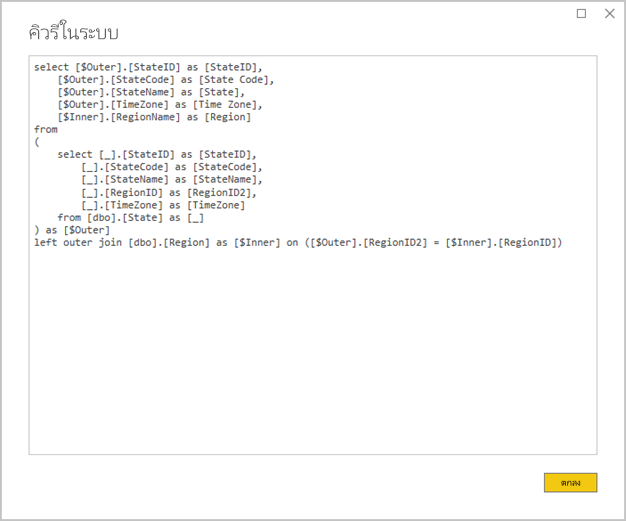
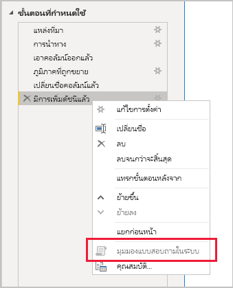

# <a name="the-importance-of-query-folding"></a>ความสำคัญของการพับคิวรี

บทความนี้มีเป้าหมายให้ผู้สร้างแบบจำลองข้อมูลทำการพัฒนาแบบจำลองใน Power BI Desktop ซึ่งอธิบายว่าการพับคิวรีคืออะไรและเหตุใดจึงเป็นสิ่งสำคัญ นอกจากนี้ยังอธิบายแหล่งข้อมูลและการแปลงข้อมูลที่อาจมีการพับคิวรี และวิธีการตรวจสอบว่าสามารถพับคิวรี Power Query ของคุณได้หรือไม่ ไม่ว่าจะพับทั้งหมดหรือบางส่วน สุดท้ายจะให้คำแนะนำแนวทางปฏิบัติเกี่ยวกับช่วงเวลาและวิธีการที่จะทำการพับคิวรี

## <a name="background"></a>พื้นหลัง

การพับคิวรีคือความสามารถสำหรับคิวรี Power Query เพื่อสร้างคำสั่งคิวรีเดียวในการดึงและแปลงข้อมูลต้นทาง กลไกการผสมเข้าด้วยกันของ Power Query มีเป้าหมายเพื่อให้สามารถทำการพับคิวรีได้เมื่อใดก็ตามที่เป็นไปได้เพราะจะส่งผลให้มีเส้นทางที่มีประสิทธิภาพมากที่สุดในการเชื่อมต่อกับตารางแบบจำลอง Power BI ไปยังแหล่งข้อมูลเบื้องต้น

การพับคิวรีเป็นหัวข้อที่สำคัญสำหรับการสร้างแบบจำลองข้อมูลด้วยเหตุผลหลายประการ:

- **ตารางแบบจำลองการนำเข้า:** การรีเฟรชข้อมูลจะเป็นไปอย่างมีประสิทธิภาพสำหรับการนำเข้าตารางแบบจำลองในแง่ของการใช้ทรัพยากรและระยะเวลาการรีเฟรช
- **ตารางโหมดที่เก็บข้อมูลแบบ DirectQuery และคู่:** ตารางโหมดที่เก็บข้อมูล DirectQuery และคู่แต่ละตารางจะต้องยึดตามคิวรี Power Query ที่สามารถพับได้
- **การรีเฟรชแบบเพิ่มหน่วย:** การรีเฟรชข้อมูลแบบเพิ่มหน่วยจะมีประสิทธิภาพในแง่ของการใช้ทรัพยากรและระยะเวลาการรีเฟรช ในความเป็นจริง หน้าต่างการกำหนดค่าการรีเฟรชแบบเพิ่มหน่วยจะแจ้งเตือนให้คุณทราบว่าการพับคิวรีสำหรับตารางไม่สามารถทำได้ ถ้าไม่สามารถทำได้ วัตถุประสงค์ของการรีเฟรชแบบเพิ่มหน่วยจะตกไป จากนั้นกลไกจัดการผสมเข้าด้วยกันจะต้องดึงข้อมูลแถวต้นทางทั้งหมด แล้วใช้ตัวกรองเพื่อกำหนดการเปลี่ยนแปลงแบบเพิ่มหน่วย

การพับคิวรีอาจเกิดขึ้นสำหรับคิวรี Power Query ทั้งหมดหรือสำหรับชุดย่อยของขั้นตอน เมื่อไม่สามารถทำการพับคิวรีได้ ไม่ว่าจะพียงบางส่วนหรือทั้งหมด กลไกการผสมเข้าด้วยของ Power Query ใน Power BI จะต้องชดเชยโดยการประมวลผลการแปลงข้อมูลด้วยตัวเอง การดำเนินการนี้อาจเกี่ยวข้องกับการดึงข้อมูลผลลัพธ์ของคิวรีต้นทาง สำหรับชุดข้อมูลขนาดใหญ่ที่มีทรัพยากรมากและช้ามาก

เราขอแนะนำให้ผู้สร้างแบบจำลองข้อมูลพยายามที่จะเพิ่มประสิทธิภาพในการออกแบบแบบจำลองการนำเข้าของตน โดยให้แน่ใจว่าสามารถทำการพับคิวรีได้เมื่อใดที่ต้องการ

## <a name="sources-that-support-query-folding"></a>แหล่งข้อมูลที่สนับสนุนการพับคิวรี

แหล่งข้อมูลส่วนใหญ่ที่มีแนวคิดของภาษาคิวรีจะสามารถรองรับการพับคิวรีได้ ซึ่งอาจรวมถึงฐานข้อมูลเชิงสัมพันธ์ ฟีด OData (รวมถึงรายการ SharePoint ), Exchange และ Active Directory อย่างไรก็ตาม แหล่งข้อมูล เช่น ไฟล์ข้อมูลธรรมดา, blobs, และเว็บมักไม่มี

## <a name="transformations-that-can-achieve-query-folding"></a>การแปลงข้อมูลที่สามารถทำการพับคิวรีได้

การแปลงแหล่งข้อมูลเชิงสัมพันธ์ซึ่งสามารถทำการพับคิวรีสามารถเขียนเป็นคำสั่ง SELECT แบบเดียวได้ คำสั่ง SELECT สามารถสร้างได้ด้วยส่วนคำสั่ง WHERE, GROUP BY และ JOIN ที่เหมาะสม นอกจากนี้ยังอาจมีนิพจน์คอลัมน์ (การคำนวณ) ที่ใช้ฟังก์ชันที่มีอยู่แล้วภายในที่ได้รับการสนับสนุนโดยฐานข้อมูล SQL

โดยทั่วไป รายการหัวข้อย่อยต่อไปนี้อธิบายถึงการแปลงข้อมูลที่สามารถทำการพับคิวรีได้

- การลบคอลัมน์ออก
- การเปลี่ยนชื่อคอลัมน์ (นามแฝงของคอลัมน์ SELECT)
- การกรองแถวด้วยค่าคงที่หรือพารามิเตอร์ Power Query (เพรดิเคตส่วนคำสั่ง WHERE)
- การจัดกลุ่มและการสรุป (ส่วนคำสั่ง GROUP BY)
- การขยายคอลัมน์ไฟล์ข้อมูล (คอลัมน์ Foreign Key ของแหล่งข้อมูล) เพื่อให้สามารถรวมตารางแหล่งข้อมูลสองตาราง (ส่วนคำสั่ง JOIN)
- การผสานคิวรีที่สามารถพับได้แบบ Non - fuzzy โดยยึดตามแหล่งข้อมูลเดียวกัน (ส่วนคำสั่ง JOIN)
- การผนวกคิวรีที่สามารถพับได้โดยยึดตามแหล่งข้อมูลเดียวกัน (ตัวดำเนินการ UNION ALL)
- การเพิ่มคอลัมน์แบบกำหนดเองด้วย _ตรรกะอย่างง่าย_ (นิพจน์คอลัมน์ SELECT) ตรรกะอย่างง่ายหมายถึงการดำเนินการที่ไม่ซับซ้อนอาจมีการใช้ฟังก์ชัน M ที่มีฟังก์ชันที่เทียบเท่าในแหล่งข้อมูล SQL เช่นคณิตศาสตร์ หรือฟังก์ชันการจัดการข้อความ ตัวอย่างเช่น นิพจน์ต่อไปนี้จะส่งกลับคอมโพเนนท์ปีของค่าคอลัมน์ **OrderDate** (เพื่อส่งกลับค่าตัวเลข)

    ```powerquery-m
    Date.Year([OrderDate])
    ```

- การหมุนรอบและการยกเลิกการหมุนรอบ (ตัวดำเนินการ PIVOT และ UNPIVOT)

## <a name="transformations-that-prevent-query-folding"></a>การแปลงข้อมูลที่ขัดขวางมิให้มีการพับคิวรี

โดยทั่วไป รายการหัวข้อย่อยต่อไปนี้อธิบายถึงการแปลงข้อมูลที่ขัดขวางมิให้มีการพับคิวรี ซึ่งไม่ได้มีไว้เพื่อให้เป็นรายการที่ครบถ้วน

- การผสานคิวรีที่ยึดตามแหล่งข้อมูลที่แตกต่างกัน
- การผนวก (ยูเนี่ยน-อิง) คิวรีที่ยึดตามแหล่งข้อมูลที่แตกต่างกัน
- การเพิ่มคอลัมน์แบบกำหนดเองด้วย _ตรรกะที่ซับซ้อน_ ตรรกะที่ซับซ้อนหมายถึงการใช้ฟังก์ชัน M ที่ไม่มีฟังก์ชันที่เทียบเท่าในแหล่งข้อมูล ตัวอย่างเช่น นิพจน์ต่อไปนี้จะจัดรูปแบบค่าคอลัมน์ **OrderDate** (เพื่อส่งกลับค่าที่เป็นข้อความ)

    ```powerquery-m
    Date.ToText([OrderDate], "yyyy")
    ```

- การเพิ่มคอลัมน์ดัชนี
- การเปลี่ยนแปลงชนิดข้อมูลของคอลัมน์

โปรดทราบว่าเมื่อคิวรี Power Query ประกอบด้วยแหล่งข้อมูลจำนวนมาก ความไม่เข้ากันเกี่ยวกับระดับความเป็นส่วนตัวของแหล่งข้อมูลอาจขัดขวางไม่ให้มีการพับคิวรีได้ สำหรับข้อมูลเพิ่มเติม อ่านบทความ [ระดับความเป็นส่วนตัวของ Power BI Desktop](../desktop-privacy-levels.md)

## <a name="determine-when-a-query-can-be-folded"></a>กำหนดช่วงเวลาที่สามารถพับคิวรีได้

ในหน้าต่างตัวแก้ไข Power Query อาจเป็นไปได้ที่จะกำหนดช่วงเวลาที่สามารถพับคิวรี Power Query ได้ ในบานหน้าต่าง**การตั้งค่าคิวรี** เมื่อคุณคลิกขวาที่ขั้นตอนที่ใช้ล่าสุด หากเปิดใช้งานตัวเลือก **ดูคิวรีในระบบของฐานข้อมูล** (ไม่ใช่สีเทา) แล้วคิวรีจะสามารถพับได้


หากต้องการดูคิวรีแบบพับ ให้ไปข้างหน้าและเลือกตัวเลือก **ดูคิวรีในระบบของฐานข้อมูล** จากนั้นคุณจะพบกับคิวรีในระบบของฐานข้อมูลที่ Power Query จะใช้กับแหล่งข้อมูล



ถ้าไม่มีการเปิดใช้งานตัวเลือก**คิวรีในระบบของฐานข้อมูล**(สีเทา) นี่คือหลักฐานว่าขั้นตอนคิวรีทั้งหมดไม่สามารถพับได้ อย่างไรก็ตาม อาจหมายความว่าชุดย่อยของขั้นตอนยังคงสามารถพับได้ ด้วยการทำงานย้อนกลับจากขั้นตอนสุดท้าย คุณสามารถตรวจสอบแต่ละขั้นตอนเพื่อดูว่ามีการเปิดใช้งานตัวเลือก **ดูคิวรีในระบบของฐานข้อมูล** หรือไม่ ถ้าเป็นกรณีนี้ คุณจะได้เรียนรู้ว่าการพับคิวรีไม่สามารถทำได้อีกต่อไปตามลำดับขั้นตอน



## <a name="best-practice-guidance"></a>แนวทางปฏิบัติที่ดีที่สุด

ในระยะสั้น สำหรับตารางโหมดที่เก็บข้อมูล DirectQuery หรือคู่ คิวรี Power Query จะต้องทำการพับคิวรีได้ สำหรับตารางนำเข้าที่ยึดตามแหล่งข้อมูลเชิงสัมพันธ์และเมื่อสามารถสร้างคำสั่ง SELECT แบบเดียว _ประสิทธิภาพการรีเฟรชข้อมูลที่ดีที่สุด_จะเกิดขึ้นได้โดยต้องทำให้แน่ใจว่าการพับคิวรีจะเกิดขึ้น ถ้ากลไกจัดการผสมเข้าด้วยกันยังคงจำเป็นในการประมวลผลการแปลงข้อมูล คุณควรพยายามลดการทำงานที่กลไกจำเป็นต้องทำ โดยเฉพาะอย่างยิ่งสำหรับชุดข้อมูลขนาดใหญ่

รายการหัวข้อย่อยต่อไปนี้แสดงแนวทางปฏิบัติที่ดีที่สุด

- **กำหนดการประมวลผลสำหรับแหล่งข้อมูลให้มากที่สุดเท่าที่เป็นไปได้:** เมื่อไม่สามารถพับขั้นตอนทั้งหมดของคิวรี Power Query ได้ ให้ค้นหาขั้นตอนที่ขัดขวางมิให้มีการพับคิวรี เมื่อเป็นไปได้ ให้ย้ายขั้นตอนที่ตามมาก่อนหน้านี้ตามลำดับ ซึ่งอาจเป็นปัจจัยที่ทำให้สามารถทำการพับคิวรีได้ โปรดทราบว่ากลไกการผสมเข้าด้วยกันของ Power Query อาจมีความชาญฉลาดพอที่จะเรียงลำดับขั้นตอนคิวรีของคุณใหม่เมื่อมีการสร้างคิวรีแหล่งข้อมูล

สำหรับแหล่งข้อมูลเชิงสัมพันธ์ ถ้าขั้นตอนที่ขัดขวางไม่ให้สามารถทำการพับคิวรีได้ในคำสั่ง SELECT เดียวหรือภายในตรรกะเชิงกระบวนงานของ Stored Procedure ให้พิจารณาการใช้คำสั่งคิวรีในระบบของฐานข้อมูลตามที่อธิบายไว้ในขั้นตอนถัดไป

- **ใช้คิวรี SQL แบบดั้งเดิม:** เมื่อคิวรี Power Query ดึงข้อมูลจากแหล่งข้อมูลเชิงสัมพันธ์ คุณสามารถใช้คิวรี SQL แบบดั้งเดิมได้ ในความเป็นจริง คิวรีอาจเป็นคำสั่งที่ถูกต้อง รวมถึงการดำเนินการของ Stored Procedure ถ้าคำสั่งสร้างชุดผลลัพธ์หลายรายการ จะมีการส่งกลับค่าแรกเท่านั้น สามารถประกาศพารามิเตอร์ได้ในคำสั่ง และเราแนะนำให้คุณใช้ฟังก์ชัน M ของ [Value.NativeQuery](/powerquery-m/value-nativequery) เพื่อส่งผ่านค่าพารามิเตอร์อย่างปลอดภัยและสะดวก สิ่งสำคัญคือต้องทำความเข้าใจว่ากลไกผสมเข้าด้วยกันของ Power Query ไม่สามารถพับขั้นตอนคิวรีที่ตามมาได้ และดังนั้นจึงเป็นสิ่งสำคัญที่ต้องรวมตรรกะการแปลงข้อมูลทั้งหมด (หรือเป็นจำนวนมาก) ในคำสั่งคิวรีในระบบของฐานข้อมูล

    มีข้อควรพิจารณาที่สำคัญสองประการที่ต้องคำนึงถึงเมื่อใช้คิวรี SQL แบบดั้งเดิม:

    - สำหรับตารางแบบจำลอง DirectQuery คิวรีต้องเป็นคำสั่ง SELECT และไม่สามารถใช้นิพจน์ตารางทั่วไป (CTEs) หรือ Stored Procedure
    - การรีเฟรชแบบเพิ่มหน่วยไม่สามารถใช้ประโยชน์จากคิวรี SQL แบบดั้งเดิม และดังนั้นจึงจะบังคับให้กลไกการผสมเข้าด้วยกันของ Power Query เพื่อดึงข้อมูลแถวต้นทางทั้งหมด และจากนั้นใช้ตัวกรองเพื่อกำหนดการเปลี่ยนแปลงแบบเพิ่มหน่วย

    > [!IMPORTANT]
    > คิวรีในระบบของฐานข้อมูลสามารถทำได้มากกว่าการดึงข้อมูล คำสั่งที่ถูกต้องใด ๆ ที่สามารถดำเนินการได้ (และอาจมีหลายครั้ง) รวมถึงคำสั่งที่ปรับเปลี่ยนหรือลบข้อมูล สิ่งสำคัญคือต้องใช้หลักการของสิทธิ์พิเศษน้อยที่สุด เพื่อให้แน่ใจว่าบัญชีที่ใช้ในการเข้าถึงฐานข้อมูลมีสิทธิ์ในการอ่านเฉพาะข้อมูลที่จำเป็นเท่านั้น

- **จัดเตรียมและแปลงข้อมูลในแหล่งข้อมูล:** ถ้าคุณระบุว่าไม่สามารถพับขั้นตอนคิวรี Power Query ได้ อาจเป็นไปได้ที่จะใช้การแปลงข้อมูลในแหล่งข้อมูล การดำเนินการนี้สามารถทำได้โดยการเขียนมุมมองฐานข้อมูลที่มีการแปลงข้อมูลต้นฉบับอย่างมีตรรกะ หรือด้วยการจัดเตรียมและการทำให้ข้อมูลแบบจริง ก่อนหน้าที่ Power BI จะทำการคิวรี คลังข้อมูลเชิงสัมพันธ์คือตัวอย่างที่ยอดเยี่ยมของข้อมูลที่มีการจัดเตรียมไว้ใช้งาน โดยทั่วไปแล้วจะประกอบด้วยแหล่งข้อมูลขององค์กรที่รวมไว้ล่วงหน้า

## <a name="next-steps"></a>ขั้นตอนถัดไป

สำหรับข้อมูลเพิ่มเติมเกี่ยวกับการพับคิวรี และหัวข้อที่เกี่ยวข้อง กรุณาดูที่แหล่งข้อมูลต่อไปนี้:

- [ใช้แบบจำลองแบบรวมใน Power BI Desktop](../desktop-composite-models.md)
- [การรีเฟรชแบบเพิ่มหน่วยใน Power BI Premium](../service-premium-incremental-refresh.md)
- [การใช้ตาราง ดูเพื่อดำเนินการพับคิวรี](/power-query/handlingqueryfolding)
- มีคำถามหรือไม่ [ลองถามชุมชน Power BI](https://community.powerbi.com/)
