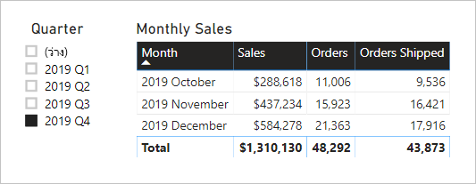

# <a name="active-vs-inactive-relationship-guidance"></a>คำแนะนำความสัมพันธ์ที่ใช้งานอยู่และไม่ได้ใช้งาน

บทความนี้มุ่งเป้าหมายไปที่เรื่อง ตัวสร้างแบบจำลองข้อมูลนำเข้าที่ทำงานกับ Power BI Desktop ซึ่งจะให้คำแนะนำคุณเกี่ยวกับเวลาที่จะสร้างความสัมพันธ์ของรูปแบบที่ใช้งานอยู่หรือไม่ได้ใช้งาน ตามค่าเริ่มต้น ความสัมพันธ์ที่ใช้งานอยู่จะเผยแพร่ตัวกรองไปยังตารางอื่น อย่างไรก็ตามความสัมพันธ์ที่ไม่ได้ใช้งานจะเผยแพร่เฉพาะตัวกรองเมื่อมีการเรียกใช้งานนิพจน์ DAX

[!INCLUDE [relationships-prerequisite-reading](includes/relationships-prerequisite-reading.md)]

## <a name="active-relationships"></a>ความสัมพันธ์ที่ไม่ได้ใช้งาน

โดยทั่วไป เราขอแนะนำให้กำหนดความสัมพันธ์ที่ใช้งานอยู่เมื่อใดก็ตามที่ทำได้ โดยจะขยายขอบเขตและศักยภาพของวิธีที่คุณสามารถใช้แบบจำลองของคุณโดยผู้เขียนรายงานและการทำงานกับการถามตอบ

พิจารณาตัวอย่างของแบบจำลองการนำเข้าที่ออกแบบมาเพื่อวิเคราะห์ประสิทธิภาพการทำงานตามเวลาของเที่ยวบิน (OTP) แบบจำลองมีตาราง**เที่ยวบิน**ซึ่งเป็นตารางชนิดข้อเท็จจริงที่จัดเก็บหนึ่งแถวต่อตัวเที่ยวบิน แต่ละแถวจะบันทึกวันที่เที่ยวบินหมายเลขเที่ยวบิน การออกเดินทาง สนามบินขาเข้า และเวลาล่าช้า (เป็นนาที) นอกจากนี้ยังมีตาราง**สนามบิน**ซึ่งเป็นตารางชนิดมิติที่จัดเก็บหนึ่งแถวต่อสนามบิน แต่ละแถวจะอธิบายรหัสสนามบิน ชื่อสนามบิน และประเทศ

นี่คือไดอะแกรมแบบจำลองบางส่วนของสองตาราง


มีสองความสัมพันธ์แบบจำลองระหว่างตาราง**เที่ยวบิน**และ**สนามบิน** ในตาราง**เที่ยวบิน**คอลัมน์ **DepartureAirport** และ **ArrivalAirport** เชื่อมโยงกับคอลัมน์**สนามบิน**ของตาราง**สนามบิน** ในการออกแบบ schema ของดาว ตาราง**สนามบิน**ได้รับการอธิบายเป็น[มิติการเล่นตามบทบาท](star-schema.md#role-playing-dimensions)  ในแบบจำลองนี้ บทบาททั้งสองคือ_สนามบินขาออก_และ_สนามบินขาเข้า_

ในขณะที่การออกแบบนี้ทำงานได้ดีสำหรับการออกแบบ schema ดาวเชิงสัมพันธ์ซึ่งไม่ใช่สำหรับแบบจำลอง Power BI เนื่องจากความสัมพันธ์แบบจำลองคือเส้นทางสำหรับการเผยแพร่ตัวกรองและเส้นทางเหล่านี้ต้องเป็นแบบเชิงกำหนด ด้วยเหตุนี้ แบบจำลองไม่สามารถมีความสัมพันธ์ที่ใช้งานอยู่ระหว่างสองตารางได้ ดังนั้น ตามที่อธิบายไว้ในตัวอย่างนี้ นั่นคือความสัมพันธ์ที่ใช้งานอยู่ในขณะที่ความสัมพันธ์อื่นไม่ได้ใช้งานอยู่ (แสดงเป็นเส้นประ) โดยเฉพาะจะมีความสัมพันธ์กับคอลัมน์ **ArrivalAirport** ที่ใช้งานอยู่ ซึ่งหมายความว่าตัวกรองที่นำไปใช้กับตาราง**สนามบิน**จะเผยแพร่ไปยังคอลัมน์ **ArrivalAirport** ของตาราง**เที่ยวบิน**โดยอัตโนมัติ

การออกแบบแบบจำลองนี้มีขีดจำกัดที่รุนแรงเกี่ยวกับวิธีการรายงานข้อมูล โดยเฉพาะไม่สามารถกรองตาราง**สนามบิน**เพื่อแยกรายละเอียดเที่ยวบินสำหรับสนามบินต้นทางโดยอัตโนมัติได้ ในฐานะที่เป็นข้อกำหนดในการรายงานที่เกี่ยวข้องกับการกรอง (หรือการจัดกลุ่ม) โดยสนามบินขาออกและขาเข้า_ในเวลาเดียวกัน_ความสัมพันธ์ที่ใช้งานอยู่ทั้สองอย่างจึงจำเป็น การแปลข้อกำหนดนี้ลงในการออกแบบแบบจำลอง Power BI หมายความว่าแบบจำลองจะต้องมีตารางสนามบินสองตาราง

นี่คือการออกแบบแบบจำลองที่ได้รับการปรับปรุงแล้ว


แบบจำลองนี้มีตารางสนามบินสองตาราง: **สนามบินขาออก**และ**สนามบินขาเข้า** ความสัมพันธ์แบบจำลองระหว่างตารางเหล่านี้กับตาราง**เที่ยวบิน**มีการใช้งานอยู่ นอกจากนี้โปรดทราบว่าชื่อคอลัมน์ในตาราง**สนามบินขาออก**และ**สนามบินที่ขาเข้า**จะถูกขึ้นต้นด้วยคำว่า_ขาออก_หรือ_ขาเข้า_

การออกแบบแบบจำลองที่ได้รับการปรับปรุงรองรับการสร้างการออกแบบรายงานต่อไปนี้


ตัวกรองหน้ารายงานโดยเมลเบิร์นเป็นสนามบินขาออกและกลุ่มการแสดงผลด้วยภาพของตารางโดยสนามบินขาเข้า

> [!NOTE]
> สำหรับแบบจำลองที่นำเข้า ตารางเพิ่มเติมจะส่งผลให้มีขนาดแบบจำลองที่เพิ่มขึ้นและเวลารีเฟรชที่นานขึ้น ดังนั้นจึงขัดต่อคำแนะนำที่อธิบายไว้ในบทความ[เทคนิคการลดข้อมูลสำหรับการนำเข้าแบบจำลอง](import-modeling-data-reduction.md) อย่างไรก็ตาม ในตัวอย่าง ข้อกำหนดในการมีเฉพาะความสัมพันธ์ที่ใช้งานอยู่จะแทนที่คำแนะนำเหล่านี้
>
> นอกจากนี้ เป็นเรื่องปกติที่ตารางชนิดมิติประกอบด้วยจำนวนแถวต่ำเมื่อเทียบกับจำนวนแถวตารางชนิดข้อเท็จจริง ดังนั้น ขนาดของแบบจำลองที่เพิ่มขึ้นและเวลาการรีเฟรชไม่น่าจะมีขนาดใหญ่เกินไป

### <a name="refactoring-methodology"></a>วิธีการ Refactoring

ต่อไปนี้คือวิธีการปรับโครงสร้างแบบจำลองจากตารางชนิดมิติการเล่นตามบทบาทเดียวกับการออกแบบที่มี _หนึ่งตารางต่อบทบาท_

1. นำความสัมพันธ์ที่ไม่ได้ใช้งานออก
2. พิจารณาเปลี่ยนชื่อตารางชนิดมิติการเล่นตามบทบาทเพื่ออธิบายบทบาทนั้นๆ ให้ดียิ่งขึ้น ในตัวอย่าง ตาราง**สนามบิน**จะเชื่อมโยงกับคอลัมน์ **ArrivalAirport** ของตาราง**เที่ยวบิน** ดังนั้นจึงถูกเปลี่ยนชื่อเป็น**สนามบินขาเข้า**
3. สร้างสำเนาของตารางการเล่นบทบาทให้มีชื่อที่แสดงถึงบทบาท ถ้าเป็นตารางนำเข้า เราขอแนะนำให้กำหนดตารางที่มีการคำนวณ ถ้าเป็นตาราง DirectQuery คุณสามารถทำซ้ำแบบสอบถาม Power Query ได้

    ในตัวอย่าง ตาราง**สนามบินขาออก**ถูกสร้างขึ้นโดยใช้ข้อกำหนดตารางที่มีการคำนวณต่อไปนี้

    ```dax
    Departure Airport = 'Arrival Airport'
    ```

4. สร้างความสัมพันธ์ที่ใช้งานอยู่เพื่อเชื่อมโยงตารางใหม่
5. พิจารณาเปลี่ยนชื่อคอลัมน์ในตารางเพื่อให้สะท้อนบทบาทของคอลัมน์ได้อย่างถูกต้อง ในตัวอย่าง คอลัมน์ทั้งหมดถูกขึ้นต้นด้วยคำว่า_ขาออก_หรือ_ขาเข้า_ ชื่อเหล่านี้ทำให้มั่นใจได้ว่ารายงานการแสดงผลด้วยภาพจะมีป้ายชื่อที่อธิบายตัวเองและไม่ชัดเจน นอกจากนี้ยังปรับปรุงประสบการณ์การถามและตอบ ช่วยให้ผู้ใช้สามารถเขียนคำถามได้อย่างง่ายดาย
6. พิจารณาการเพิ่มคำอธิบายไปยังตารางการเล่นตามบทบาท (ในบานหน้าต่าง**เขตข้อมูล** คำอธิบายจะปรากฏในคำแนะนำเครื่องมือเมื่อผู้เขียนรายงานเลื่อนเคอร์เซอร์ไปที่ตาราง) ด้วยวิธีนี้ คุณสามารถสื่อสารรายละเอียดการเผยแพร่ตัวกรองเพิ่มเติมใดๆ ก็ตามให้กับผู้เขียนรายงานของคุณได้

## <a name="inactive-relationships"></a>ความสัมพันธ์ที่ไม่ได้ใช้งาน

ในบางสถานการณ์ ความสัมพันธ์ที่ไม่ใช้งานจะสามารถตอบสนองความต้องการการรายงานพิเศษได้

ตอนนี้เรามาพิจารณาความต้องการแบบจำลองและการรายงานที่แตกต่างกัน:

- แบบจำลองการขายประกอบด้วยตาราง**ยอดขาย**ที่มีสองคอลัมน์วันที่ดังนี้: **OrderDate** และ **ShipDate**
- แต่ละแถวในตาราง**ยอดขาย**จะบันทึกคำสั่งเดียว
- ตัวกรองวันที่จะถูกนำไปใช้กับคอลัมน์ **OrderDate** ซึ่งจะจัดเก็บวันที่ที่ถูกต้องเสมอ
- เพียงหนึ่งหน่วยวัดเท่านั้นที่จำเป็นต้องมีการเผยแพร่ตัวกรองวันที่ไปยังคอลัมน์ **ShipDate** ซึ่งสามารถมีช่องว่างได้ (จนกว่าจะมีการจัดส่งรายการสั่งซื้อ)
- ไม่มีความต้องการในตัวกรอง (หรือจัดกลุ่มตาม) _และ_ระยะเวลาการวันที่จัดส่งพร้อมกัน

นี่คือไดอะแกรมแบบจำลองบางส่วนของสองตาราง


มีสองความสัมพันธ์แบบจำลองระหว่างตาราง**ยอดขาย**และ**วันที่** ในตาราง **ยอดขาย** คอลัมน์ **OrderDate** และ **ShipDate** คอลัมน์ที่เชื่อมโยงกับคอลัมน์ **วันที่** ของตาราง **วันที่** ในแบบจำลองนี้ บทบาทที่สองสำหรับตาราง**วันที่**เป็น_วันที่สั่งซื้อ_และ_วันที่จัดส่ง_ ซึ่งเป็นความสัมพันธ์กับคอลัมน์ **OrderDate** ที่ใช้งานอยู่

หน่วยวัดทั้งหกข้อยกเว้นหนึ่งรายการจะต้องถูกกรองโดยคอลัมน์ **OrderDate** หน่วยวัด**คำสั่งซื้อที่จัดส่งแล้ว** อย่างไรก็ตามต้องกรองโดยคอลัมน์ **ShipDate**

นี่คือ**คำสั่งซื้อ**ของตัววัด เพียงแค่นับแถวของตาราง**ยอดขาย**ภายในบริบทตัวกรอง ตัวกรองใดๆ ที่ใช้กับตาราง**วันที่**จะเผยแพร่ไปยังคอลัมน์ **OrderDate**

```dax
Orders = COUNTROWS(Sales)
```

นี่คือ**คำสั่งซื้อที่จัดส่งแล้ว**ของตัววัด ซึ่งจะใช้ฟังก์ชัน[USERELATIONSHIP](/dax/userelationship-function-dax) DAX ซึ่งจะเปิดการเผยแพร่ตัวกรองสำหรับความสัมพันธ์เฉพาะในระหว่างการประเมินของนิพจน์เท่านั้น ในตัวอย่างนี้ ความสัมพันธ์กับคอลัมน์ **ShipDate** มีการใช้งานอยู่

```dax
Orders Shipped =
CALCULATE(
    COUNTROWS(Sales)
    ,USERELATIONSHIP('Date'[Date], Sales[ShipDate])
)
```

การออกแบบแบบจำลองที่ได้รับการปรับปรุงรองรับการสร้างการออกแบบรายงานต่อไปนี้



ตัวกรองหน้ารายงานตามไตรมาสที่ 4 ปี 2019 กลุ่มการแสดงผลด้วยภาพตารางตามเดือนและแสดงสถิติการขายต่างๆ หน่วยวัด**คำสั่งซื้อ**และ**คำสั่งซื้อที่จัดส่งแล้ว**ให้ผลลัพธ์ที่แตกต่างกัน โดยใช้ตรรกะการสรุปเดียวกัน (นับจำนวนแถวของตาราง**ยอดขาย**) แต่การเผยแพร่ตัวกรองตาราง **วันที่**แตกต่างกัน

โปรดสังเกตว่าตัวแบ่งส่วนข้อมูลไตรมาสมีรายการที่ว่างเปล่า รายการตัวแบ่งส่วนข้อมูลนี้จะปรากฏขึ้นมาเป็นผลลัพธ์ของ[การขยายตาราง](../transform-model/desktop-relationships-understand.md#strong-relationships) ในขณะที่แถวของตาราง**ยอดขาย**แต่ละรายการมีวันที่สั่งซื้อ บางแถวมีวันที่จัดส่งที่ว่างเปล่า — คำสั่งซื้อเหล่านี้ยังไม่ได้รับการจัดส่ง การขยายตารางพิจารณาความสัมพันธ์ที่ไม่ได้ใช้งานด้วยเช่นกัน ดังนั้นค่าว่างจึงสามารถปรากฏได้เนื่องจากมีค่าว่างในหลายๆ ด้านของความสัมพันธ์หรือเนื่องจากปัญหาความสมบูรณ์ของข้อมูล

## <a name="recommendations"></a>คำแนะนำ

โดยทั่วไป เราขอแนะนำให้กำหนดความสัมพันธ์ที่ใช้งานอยู่เมื่อใดก็ตามที่ทำได้ โดยจะขยายขอบเขตและศักยภาพของวิธีที่คุณสามารถใช้แบบจำลองของคุณโดยผู้เขียนรายงานและการทำงานกับการถามตอบ ซึ่งหมายความว่าตารางชนิดมิติการเล่นบทบาทจะถูกทำซ้ำในแบบจำลองของคุณ

ในบางสถานการณ์ อย่างไรก็ตาม คุณสามารถกำหนดความสัมพันธ์ที่ไม่ได้ใช้งานอย่างน้อยหนึ่งรายการสำหรับตารางชนิดมิติการเล่นบทบาทได้ คุณสามารถพิจารณาการออกแบบนี้ได้เมื่อ:

- ไม่มีข้อกำหนดสำหรับการแสดงผลด้วยภาพเพื่อกรองตามบทบาทที่แตกต่างกัน
- คุณใช้ฟังก์ชัน DAX USERELATIONSHIP เพื่อเปิดใช้งานความสัมพันธ์เฉพาะสำหรับการคำนวณแบบจำลองที่เกี่ยวข้อง

## <a name="next-steps"></a>ขั้นตอนถัดไป

สำหรับข้อมูลเพิ่มเติมที่เกี่ยวข้องกับบทความนี้ โปรดดูทรัพยากรต่อไปนี้:

- [ความสัมพันธ์ของแบบจำลองใน Power BI Desktop](../transform-model/desktop-relationships-understand.md)
- [ทำความเข้าใจแบบจำลองมิติที่มีลักษณะคล้ายดาวและความสำคัญที่มีต่อ Power BI](star-schema.md)
- [คำแนะนำการแก้ไขปัญหาความสัมพันธ์](relationships-troubleshoot.md)
- มีคำถามหรือไม่ [ลองถามชุมชน Power BI](https://community.powerbi.com/)
- มีข้อเสนอแนะไหม [สนับสนุนแนวคิดในการปรับปรุง Power BI](https://ideas.powerbi.com/)
