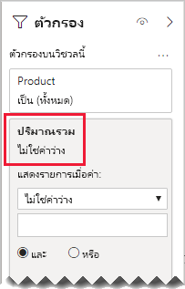

# <a name="bi-directional-relationship-guidance"></a>คำแนะนำความสัมพันธ์แบบสองทิศทาง

บทความนี้มุ่งเป้าหมายไปที่เรื่อง ตัวสร้างแบบจำลองข้อมูลนำเข้าที่ทำงานกับ Power BI Desktop ซึ่งจะให้คำแนะนำแก่คุณว่าเวลาใดที่ควรสร้างแบบจำลองความสัมพันธ์แบบสองทิศทาง ความสัมพันธ์แบบสองทิศทางคือตัวกรองใน_ทั้งสองทิศทาง_

[!INCLUDE [relationships-prerequisite-reading](includes/relationships-prerequisite-reading.md)]

โดยทั่วไปแล้ว เราขอแนะนำให้ลดการใช้ความสัมพันธ์แบบสองทิศทาง ซึ่งความสัมพันธ์สามารถส่งผลกระทบต่อประสิทธิภาพการทำงานของคิวรีแบบจำลอง และอาจสร้างความสับสนสำให้กับผู้ใช้รายงานของคุณ

มีสามสถานการณ์สมมติเมื่อการกรองแบบสองทิศทางสามารถแก้ไขข้อกำหนดเฉพาะได้:

- [ความสัมพันธ์แบบจำลองพิเศษ](#special-model-relationships)
- [รายการตัวแบ่งส่วนข้อมูล "ด้วยข้อมูล"](#slicer-items-with-data)
- [การวิเคราะห์มิติไปยังมิติ](#dimension-to-dimension-analysis)

## <a name="special-model-relationships"></a>ความสัมพันธ์แบบจำลองพิเศษ

ความสัมพันธ์แบบสองทิศทางมีบทบาทสำคัญในการสร้างความสัมพันธ์แบบสองทิศทางรุ่นพิเศษสองประเภทดังต่อไปนี้:

- **แบบหนึ่งต่อหนึ่ง**: ความสัมพันธ์แบบหนึ่งต่อหนึ่งจะต้องเป็นแบบสองทิศทาง ซึ่งไม่สามารถกำหนดเป็นค่าอื่นได้  โดยทั่วไปแล้ว เราไม่แนะนำให้สร้างชนิดของความสัมพันธ์เหล่านี้ สำหรับการสนทนาที่สมบูรณ์และการออกแบบทางเลือก โปรดดู[คำแนะนำความสัมพันธ์แบบหนึ่งต่อหนึ่ง](relationships-one-to-one.md)
- **แบบกลุ่มต่อกลุ่ม**: จำเป็นต้องมีตารางเชื่อมโยงเมื่อเชื่อมโยงตารางประเภทมิติสองตารางเข้าด้วยกัน จำเป็นต้องใช้ตัวกรองแบบสองทิศทางเพื่อให้แน่ใจว่าตัวกรองเผยแพร่ไปทั่วตารางการเชื่อมโยง สำหรับข้อมูลเพิ่มเติม โปรดดู[คำแนะนำความสัมพันธ์แบบกลุ่มต่อกลุ่ม (เชื่อมโยงตารางประเภทมิติสองตาราง)](relationships-many-to-many.md#relate-many-to-many-dimensions)

## <a name="slicer-items-with-data"></a>รายการตัวแบ่งส่วนข้อมูล "ด้วยข้อมูล"

ความสัมพันธ์แบบสองทิศทางสามารถส่งตัวแบ่งส่วนข้อมูลที่จำกัดรายการไปยังตำแหน่งที่มีข้อมูลอยู่ได้ (หากคุณคุ้นเคยกับ Excel PivotTables และตัวแบ่งส่วนข้อมูล นี่คือพฤติกรรมเริ่มต้นเมื่อทำการจัดหาข้อมูลจากชุดข้อมูล Power BI หรือแบบจำลองบริการการวิเคราะห์) เพื่อช่วยอธิบายให้เข้าใจความหมาย ก่อนอื่นให้พิจารณาไดอะแกรมแบบจำลองต่อไปนี้


ตารางแรกที่มีชื่อว่า**ลูกค้า** ซึ่งมีสามคอลัมน์ดังต่อไปนี้: **ประเทศ-ภูมิภาค** **ลูกค้า** และ **CustomerCode** ตารางที่สองที่มีชื่อว่า**ผลิตภัณฑ์** ซึ่งมีสามคอลัมน์ดังต่อไปนี้: **สี** **ผลิตภัณฑ์** และ **SKU** ตารางที่สามชื่อว่า**ยอดขาย** ซึ่งมีสี่คอลัมน์ดังต่อไปนี้: **CustomerCode** **OrderDate** **Quantity** และ **SKU** ตาราง**ลูกค้า**และ**ผลิตภัณฑ์** เป็นตารางชนิดมิติและแต่ละรายการมีความสัมพันธ์แบบหนึ่งต่อกลุ่มไปยังตาราง**ยอดขาย** แต่ละความสัมพันธ์จะกรองในทิศทางเดียว

เพื่อช่วยอธิบายวิธีการกรองแบบสองทิศทาง ไดอะแกรมแบบจำลองได้รับการแก้ไขเพื่อแสดงแถวของตาราง ตัวอย่างทั้งหมดในบทความนี้เป็นไปตามข้อมูลนี้

> [!NOTE]
> ไม่สามารถแสดงแถวตารางในไดอะแกรมแบบจำลอง Power BI Desktop ได้ การดำเนินการนี้จะทำในบทความนี้เพื่อสนับสนุนการสนทนาด้วยตัวอย่างที่ชัดเจน


รายละเอียดแถวสำหรับสามตารางอธิบายไว้ในหัวข้อย่อยต่อไปนี้:

- ตาราง **Customer** มีสองแถว:
  - **CustomerCode** CUST-01 **Customer** Customer-1 **ประเทศ-ภูมิภาค** สหรัฐอเมริกา
  - **CustomerCode** CUST-02 **Customer** Customer-1 **ประเทศ-ภูมิภาค** ออสเตรเลีย
- ตาราง**ผลิตภัณฑ์**มีสามแถว:
  - **SKU** CL-01 **ผลิตภัณฑ์** เสื้อยืด **สี** เขียว
  - **SKU** CL-02 **ผลิตภัณฑ์** กางเกงยีนส์ **สี**น้ำเงิน
  - **SKU** AC-01 **ผลิตภัณฑ์** หมวก **สี**น้ำเงิน
- ตาราง**ยอดขาย**มีสามแถวดังต่อไปนี้:
  - **OrderDate** 1 มกราคม 2019 **CustomerCode** CUST-01 **SKU** CL-01 **จำนวน** 10
  - **OrderDate** 2 กุมภาพันธ์ 2019 **CustomerCode** CUST-01 **SKU** CL-02 **จำนวน** 20
  - **OrderDate** 3 มีนาคม 2019 **CustomerCode** CUST-02 **SKU** CL-01 **จำนวน** 30

ในตอนนี้ ให้พิจารณาหน้ารายงานต่อไปนี้


หน้านี้ประกอบด้วยตัวแบ่งส่วนข้อมูลสองตัวและการ์ดแสดงผลด้วยภาพ ตัวแบ่งส่วนข้อมูลแรกคือสำหรับ**ประเทศ-ภูมิภาค** และมีสองรายการดังต่อไปนี้: ออสเตรเลียและสหรัฐอเมริกา ในขณะนี้จะมีการแบ่งส่วนตามประเทศออสเตรเลีย ตัวแบ่งส่วนข้อมูลที่สองสำหรับ**ผลิตภัณฑ์** และมีสามรายการดังต่อไปนี้: หมวก กางเกงยีนส์ และเสื้อยืด ไม่มีรายการที่ถูกเลือก (หมายความว่า_ไม่มีการกรอง_ผลิตภัณฑ์) การ์ดแสดงผลด้วยภาพแสดงปริมาณ 30

เมื่อรายงานผู้ใช้ส่วนแบ่งจากออสเตรเลีย คุณอาจต้องการจำกัดตัวแบ่งส่วนข้อมูล**ผลิตภัณฑ์** เพื่อแสดงรายการที่ข้อมูล_เกี่ยวข้อง_กับยอดขายของประเทศออสเตรเลีย ซึ่งหมายความว่ามีการแสดงรายการตัวแบ่งส่วนข้อมูล "ด้วยข้อมูล" คุณสามารถบรรลุลักษณะการทำงานนี้ได้โดยการกำหนดค่าความสัมพันธ์ระหว่าง**ผลิตภัณฑ์** และตาราง**ยอดขาย**เพื่อกรองทั้งสองทิศทาง


ตัวในขณะนี้แบ่งส่วนข้อมูล**ผลิตภัณฑ์**แสดงรายการเดียวดังนี้: เสื้อยืด รายการนี้แสดงเฉพาะผลิตภัณฑ์ที่ขายให้กับลูกค้าชาวออสเตรเลียเท่านั้น


ก่อนอื่นเราขอแนะนำให้คุณพิจารณาอย่างรอบคอบว่างานออกแบบนี้เหมาะกับผู้ใช้รายงานของคุณหรือไม่ ผู้ใช้รายงานบางรายเจอกับการใช้งานที่สับสน พวกเขาไม่เข้าใจว่าทำไมรายการตัวแบ่งส่วนข้อมูลแบบไดนามิกปรากฏหรือหายไปเมื่อใดก็ตามที่มีการโต้ตอบกับแบ่งส่วนข้อมูลอื่นๆ

ถ้าคุณตัดสินใจที่จะแสดงรายการตัวแบ่งส่วนข้อมูล "ด้วยข้อมูล" เราไม่แนะนำให้คุณกำหนดค่าความสัมพันธ์เป็นแบบสองทิศทาง ความสัมพันธ์แบบสองทิศทางจำเป็นต้องใช้การประมวลผลที่มากขึ้นและอาจส่งผลกระทบต่อประสิทธิภาพการทำงานของคิวรีได้ โดยเฉพาะอย่างยิ่งเมื่อจำนวนความสัมพันธ์แบบสองทิศทางในแบบจำลองของคุณเพิ่มขึ้น

มีวิธีที่ดีกว่าเพื่อให้ได้ผลลัพธ์เดียวกัน: แทนที่จะใช้ตัวกรองแบบสองทิศทาง คุณสามารถนำตัวกรองระดับแสดงผลด้วยภาพไปใช้กับตัวแบ่งส่วนข้อมูล**ผลิตภัณฑ์**ได้

ตอนนี้เรามาพิจารณาว่าความสัมพันธ์ระหว่าง**ผลิตภัณฑ์**และตาราง**ยอดขาย**ไม่มีการกรองในสองทิศทางอีกต่อไป และมีการเพิ่มข้อกำหนดหน่วยวัดต่อไปนี้ลงในตาราง**ยอดขาย**

```dax
Total Quantity = SUM(Sales[Quantity])
```

หากต้องการแสดงรายการ**ผลิตภัณฑ์** ตัวแบ่งส่วนข้อมูล "ด้วยข้อมูล" จะต้องมีการกรองโดยหน่วยวัด**ปริมาณรวม**โดยใช้เงื่อนไข "ไม่ใช่ค่าว่าง"



## <a name="dimension-to-dimension-analysis"></a>การวิเคราะห์มิติไปยังมิติ

สถานการณ์ที่แตกต่างกันที่เกี่ยวข้องกับความสัมพันธ์แบบสองทิศทางจะถือว่าตารางชนิดข้อเท็จจริงเหมือนกับตารางเชื่อมโยง โดยวิธีนี้สนับสนุนการวิเคราะห์ข้อมูลตารางชนิดมิติภายในบริบทตัวกรองของตารางชนิดมิติที่แตกต่างกัน

ในการใช้แบบจำลองตัวอย่างในบทความนี้   ให้พิจารณาว่าสามารถตอบคำถามต่อไปนี้ได้อย่างไร:

- มีสีกี่สีที่ถูกจำหน่ายให้กับลูกค้าชาวออสเตรเลีย
- มีประเทศจำนวนกี่ประเทศที่ซื้อกางเกงยีนส์

ทั้งสองคำถามสามารถตอบ_ได้โดยไม่ต้อง_สรุปข้อมูลในตารางชนิดข้อเท็จจริงของการเชื่อมโยง อย่างไรก็ตาม จำเป็นต้องใช้ใตัวกรองเผยแพร่จากตารางชนิดมิติหนึ่งไปยังอีกตารางหนึ่ง เมื่อตัวกรองเผยแพร่ผ่านตารางชนิดข้อเท็จจริงแล้ว การสรุปคอลัมน์ประเภทชนิดมิติสามารถทำได้โดยใช้ฟังก์ชัน [DISTINCTCOUNT](/dax/distinctcount-function-dax) DAX และอาจเป็นฟังก์ชั่น [ MIN ](/dax/min-function-dax) และ [ MAX ](/dax/max-function-dax) DAX

ในขณะที่ตารางชนิดข้อเท็จจริงทำงานเหมือนกับตารางการเชื่อมโยงคุณสามารถปฏิบัติตามคำแนะนำความสัมพันธ์แบบกลุ่มต่อกลุ่มเพื่อเชื่อมโยงตารางชนิดสองมิติได้ ซึ่งจะต้องมีการกำหนดค่าความสัมพันธ์อย่างน้อยหนึ่งค่าเพื่อกรองทั้งสองทิศทาง สำหรับข้อมูลเพิ่มเติม โปรดดู[คำแนะนำความสัมพันธ์แบบกลุ่มต่อกลุ่ม (เชื่อมโยงตารางประเภทมิติสองตาราง)](relationships-many-to-many.md#relate-many-to-many-dimensions)

อย่างไรก็ตาม ตามที่อธิบายไว้ในบทความนี้ การออกแบบนี้มักจะส่งผลกระทบเชิงลบต่อประสิทธิภาพการทำงานและการใช้งานของผู้ใช้ที่เกี่ยวข้องกับ [รายการตัวแบ่งส่วนข้อมูล "ด้วยข้อมูล"](#slicer-items-with-data) ดังนั้นเราขอแนะนำให้คุณเปิดใช้งานการกรองแบบสองทิศทาง_ในข้อกำหนดหน่วยวัด_ โดยใช้ฟังก์ชัน [CROSSFILTER](/dax/crossfilter-function) DAX แทน สามารถใช้ฟังก์ชัน CROSSFILTER เพื่อปรับเปลี่ยนทิศทางตัวกรองหรือแม้กระทั่งปิดการใช้งานความสัมพันธ์ ระหว่างการประเมินของนิพจน์ได้

พิจารณาข้อกำหนดหน่วยวัดต่อไปนี้ที่เพิ่มไปยังตาราง**ยอดขาย** ในตัวอย่างนี้ ความสัมพันธ์แบบจำลองระหว่างตาราง**ลูกค้า**และ**ยอดขาย**ได้รับการกำหนดค่าให้กรองใน_ทิศทางเดียว_

```dax
Different Countries Sold =
CALCULATE(
    DISTINCTCOUNT(Customer[Country-Region]),
    CROSSFILTER(
        Customer[CustomerCode],
        Sales[CustomerCode],
        BOTH
    )
)
```

ในระหว่างการประเมินผลของนิพจน์หน่วยวัด**ยอดขายจากแต่ละประเทศ** ความสัมพันธ์ระหว่างตาราง**ลูกค้า**และ**ยอดขาย**จะกรองทั้งสองทิศทาง.

สถิติการแสดงผลด้วยภาพในตารางต่อไปนี้สำหรับแต่ละผลิตภัณฑ์ที่ขาย คอลัมน์**ปริมาณ**เป็นเพียงผลรวมของค่าปริมาณ คอลัมน์**ยอดขายจากแต่ละประเทศ**แสดงจำนวนที่แตกต่างของค่าภูมิภาคและประเทศของลูกค้าทั้งหมดที่ได้ซื้อผลิตภัณฑ์


## <a name="next-steps"></a>ขั้นตอนถัดไป

สำหรับข้อมูลเพิ่มเติมที่เกี่ยวข้องกับบทความนี้ โปรดดูทรัพยากรต่อไปนี้:

- [ความสัมพันธ์ของแบบจำลองใน Power BI Desktop](../transform-model/desktop-relationships-understand.md)
- [ทำความเข้าใจแบบจำลองมิติที่มีลักษณะคล้ายดาวและความสำคัญที่มีต่อ Power BI](star-schema.md)
- [คำแนะนำความสัมพันธ์แบบหนึ่งต่อหนึ่ง](relationships-one-to-one.md)
- [คำแนะนำความสัมพันธ์แบบกลุ่มต่อกลุ่ม](relationships-many-to-many.md)
- [คำแนะนำการแก้ไขปัญหาความสัมพันธ์](relationships-troubleshoot.md)
- มีคำถามหรือไม่ [ลองถามชุมชน Power BI](https://community.powerbi.com/)
- มีข้อเสนอแนะไหม [สนับสนุนแนวคิดในการปรับปรุง Power BI](https://ideas.powerbi.com/)

