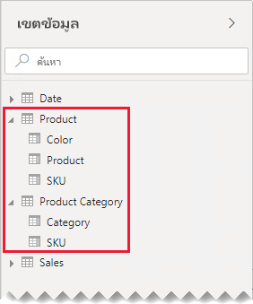
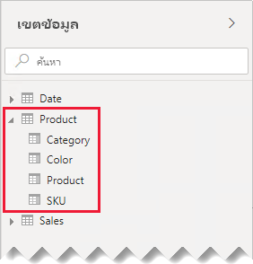
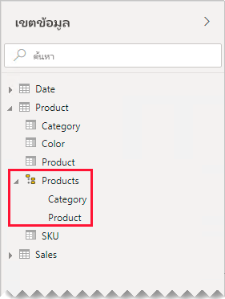
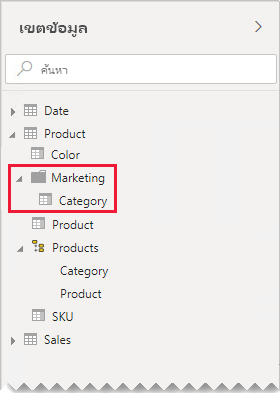

# คำแนะนำความสัมพันธ์แบบหนึ่งต่อหนึ่ง

บทความนี้มุ่งเป้าหมายไปที่เรื่อง ตัวสร้างแบบจำลองข้อมูลนำเข้าที่ทำงานกับ Power BI Desktop ซึ่งจะให้คำแนะนำเกี่ยวกับการทำงานกับความสัมพันธ์แบบจำลองหนึ่งต่อหนึ่ง สามารถสร้างความสัมพันธ์แบบหนึ่งต่อหนึ่งได้เมื่อทั้งสองตารางมีคอลัมน์ของค่าทั่วไปและไม่ซ้ำกัน

[!INCLUDE [relationships-prerequisite-reading](includes/relationships-prerequisite-reading.md)]

มีสองสถานการณ์ที่เกี่ยวข้องกับความสัมพันธ์แบบหนึ่งต่อหนึ่งดังนี้:

- [มิติลดรูป](#degenerate-dimensions): คุณสามารถหา[มิติลดรูป](star-schema.md#degenerate-dimensions)จากตารางชนิดข้อเท็จจริงได้
- [ข้อมูลแถวที่ขยายข้ามตาราง](#row-data-spans-across-tables): เอนทิตีธุรกิจเดี่ยวหรือหัวเรื่องถูกโหลดเป็นตารางแบบจำลองสองตางราง (หรือมากกว่า) ซึ่งอาจเนื่องมาจากข้อมูลเป็นที่มาจากร้านค้าข้อมูลที่แตกต่างกัน สถานการณ์นี้อาจเป็นเรื่องปกติสำหรับตารางชนิดมิติ ตัวอย่างเช่น รายละเอียดผลิตภัณฑ์หลักจะถูกจัดเก็บไว้ในระบบการขายการดำเนินงาน และรายละเอียดผลิตภัณฑ์เสริมจะถูกจัดเก็บไว้ในแหล่งข้อมูลอื่น

    อย่างไรก็ตาม คุณจะต้องเชื่อมโยงตารางชนิดข้อเท็จจริงสองรายการกับความสัมพันธ์แบบหนึ่งต่อหนึ่ง เนื่องจากตารางชนิดข้อเท็จจริงทั้งสองตารางจะต้องมีมิติและส่วนประกอบเดียวกัน นอกจากนี้ ตารางชนิดข้อเท็จจริงแต่ละตารางจะต้องมีคอลัมน์ที่ไม่ซ้ำกันเพื่อให้สามารถสร้างความสัมพันธ์แบบจำลองได้

## ตัวอย่างมิติลดรูป

เมื่อคอลัมน์จากตารางชนิดข้อเท็จจริงถูกใช้สำหรับการกรองหรือการจัดกลุ่ม คุณสามารถทำให้พร้อมใช้งานได้ในตารางที่แยกต่างหาก ด้วยวิธีนี้ คุณจะแยกคอลัมน์ที่ใช้สำหรับตัวกรองหรือการจัดกลุ่มจากคอลัมน์นั้นๆ ที่ใช้เพื่อสรุปแถวข้อเท็จจริงได้ การแยกนี้สามารถ:

- ลดพื้นที่การจัดเก็บ
- ลดความซับซ้อนของการคำนวณแบบจำลอง
- มีส่วนร่วมในการปรับปรุงประสิทธิภาพการทำงานของคิวรี
- จัดส่งเขตข้อมูลบานหน้าต่าง**เขตข้อมูล**ที่ใช้งานง่ายขึ้นให้กับผู้เขียนรายงานของคุณ

พิจารณาตารางยอดขายแหล่งที่มาที่จัดเก็บรายละเอียดคำสั่งซื้อในทั้งสองคอลัมน์

คอลัมน์ **OrderNumber** จะจัดเก็บหมายเลขลำดับ และคอลัมน์ **OrderLineNumber** จะจัดเก็บลำดับของบรรทัดภายในลำดับ

ในไดอะแกรมแบบจำลองต่อไปนี้ โปรดสังเกตว่าคอลัมน์หมายเลขลำดับและหมายเลขบรรทัดคำสั่งซื้อไม่ได้โหลดไปยังตาราง**ยอดขาย** แต่ค่าเหล่านั้นถูกใช้ในการสร้าง[คีย์ตัวแทน](star-schema.md#surrogate-keys) คอลัมน์ที่ชื่อว่า **SalesOrderLineID** (ค่าคีย์ถูกคำนวณโดยการคูณหมายเลขคำสั่งซื้อด้วย 1,000 จากนั้นเพิ่มหมายเลขบรรทัดคำสั่ง)

ตาราง**คำสั่งซื้อ**ให้ประสบการณ์การใช้งานที่หลากหลายสำหรับผู้เขียนรายงานที่มีคอลัมน์สามคอลัมน์: **คำสั่งซื้อ** **บรรทัดคำสั่งซื้อ** และ**หมายเลขบรรทัด** นอกจากนี้ยังมีลำดับชั้นอีกด้วย ทรัพยากรตารางเหล่านี้รองรับการออกแบบรายงานที่ต้องการกรอง จัดกลุ่ม หรือเจอะลึกรายละเอียดคำสั่งซื้อและรายการคำสั่งซื้อ

เนื่องจากตาราง**คำสั่งซื้อ**ที่ได้มาจากข้อมูลการขาย ดังนั้นควรมีจำนวนแถวเท่ากันในแต่ละตาราง นอกจากนี้ควรมีค่าที่ตรงกันในแต่ละคอลัมน์ **SalesOrderLineID**

## ข้อมูลแถวที่ขยายข้ามตาราง:

ลองพิจารณาตัวอย่างที่เกี่ยวข้องกับตารางมิติข้อมูลที่เกี่ยวข้องแบบหนึ่งต่อหนึ่งสองตารางต่อไปนี้: **ผลิตภัณฑ์** และ**ประเภทผลิตภัณฑ์** แต่ละตารางแสดงข้อมูลที่นำเข้าและมีคอลัมน์ **SKU** (หน่วยเก็บรักษาสต็อค) ที่มีค่าที่ไม่ซ้ำกัน

นี่คือไดอะแกรมแบบจำลองบางส่วนของสองตาราง

ตารางที่สองที่มีชื่อว่า**ผลิตภัณฑ์** ซึ่งมีสามคอลัมน์ดังต่อไปนี้: **สี** **ผลิตภัณฑ์** และ **SKU** ตารางที่สองที่มีชื่อว่า**ประเภทผลิตภัณฑ์** ซึ่งมีสองคอลัมน์ดังต่อไปนี้: **ประเภท** และ **SKU** ความสัมพันธ์แบบหนึ่งต่อหนึ่งเกี่ยวข้องกับคอลัมน์ **SKU** สองคอลัมน์ ตัวกรองความสัมพันธ์ทั้งสองทิศทางซึ่งเป็นกรณีสำหรับความสัมพันธ์แบบหนึ่งต่อหนึ่งเสมอ

เพื่อช่วยในการอธิบายวิธีการทำงานของการถ่ายถอดตัวกรองความสัมพันธ์ ไดอะแกรมแบบจำลองได้รับการแก้ไขเพื่อแสดงแถวตาราง ตัวอย่างทั้งหมดในบทความนี้เป็นไปตามข้อมูลนี้

> [!NOTE]
> ไม่สามารถแสดงแถวตารางในไดอะแกรมแบบจำลอง Power BI Desktop ได้ การดำเนินการนี้จะทำในบทความนี้เพื่อสนับสนุนการสนทนาด้วยตัวอย่างที่ชัดเจน

รายละเอียดแถวสำหรับสองตารางอธิบายในหัวข้อย่อยต่อไปนี้:

- ตาราง**ผลิตภัณฑ์**มีสามแถวดังนี้:
  - **SKU** CL-01 **ผลิตภัณฑ์** เสื้อยืด **สี** เขียว
  - **SKU** CL-02 **ผลิตภัณฑ์** กางเกงยีนส์ **สี**น้ำเงิน
  - **SKU** AC-01 **ผลิตภัณฑ์** หมวก **สี**น้ำเงิน
- ตาราง**ประเภทผลิตภัณฑ์**ซึ่งมีสองแถวดังนี้:
  - **SKU** CL-01 **ประเภท** เสื้อผ้า
  - **SKU** AC-01 **ประเภท** อุปกรณ์

โปรดสังเกตว่าตาราง**ประเภทผลิตภัณฑ์**ไม่มีแถวสำหรับผลิตภัณฑ์ SKU CL-02 เราจะกล่าวถึงผลกระทบของแถวที่หายไปนี้ในบทความนี้ในภายหลัง

ในบานหน้าต่าง**เขตข้อมูล**ผู้เขียนรายงานจะพบเขตข้อมูลที่เกี่ยวข้องกับผลิตภัณฑ์ในสองตารางดังนี้: **ผลิตภัณฑ์**และ**ประเภทผลิตภัณฑ์**

มาดูกันว่าจะเกิดอะไรขึ้นเมื่อมีการเพิ่มเขตข้อมูลจากทั้งสองตารางลงในภาพตาราง ในตัวอย่างนี้ คอลัมน์ **SKU** คือที่มาจากตาราง**ผลิตภัณฑ์**

โปรดสังเกตว่าค่า**ประเภท**สำหรับผลิตภัณฑ์ SKU CL-02 ว่างเปล่า เนื่องจากไม่มีแถวในตาราง**ประเภทผลิตภัณฑ์**สำหรับผลิตภัณฑ์นี้

### คำแนะนำ

เมื่อเป็นไปได้ เราขอแนะนำให้คุณหลีกเลี่ยงการสร้างความสัมพันธ์แบบจำลองหนึ่งต่อหนึ่งเมื่อข้อมูลแถวขยายข้ามตารางแบบจำลอง เนื่องจากการออกแบบนี้สามารถทำสิ่งต่อไปนี้ได้:

- มีส่วนร่วมกับกองข้อความของบานหน้าต่างของ**เขตข้อมูล** แสดงรายการตารางมากเกินความจำเป็น
- ทำให้เป็นเรื่องยากสำหรับผู้เขียนรายงานในการค้นหาเขตข้อมูลที่เกี่ยวข้องเนื่องจากมีการกระจายข้ามหลายตาราง
- จำกัดความสามารถในการสร้างลำดับชั้น เนื่องจากระดับของพวกเขาจะต้องยึดตามคอลัมน์จาก_ตารางเดียวกัน_
- สร้างผลลัพธ์ที่ไม่คาดคิดเมื่อไม่มีการจับคู่แถวระหว่างตารางทั้งหมด

คำแนะนำเฉพาะที่แตกต่างกันโดยขึ้นอยู่กับว่าความสัมพันธ์แบบหนึ่งต่อหนึ่งคือ _ภายในเกาะ_หรือ_ระหว่างเกาะ_ เมื่อต้องการเรียนรู้เพิ่มเติมเกี่ยวกับความสัมพันธ์ โปรดดู[ความสัมพันธ์แบบจำลองใน Power BI Desktop (การประเมินผลความสัมพันธ์)](../transform-model/desktop-relationships-understand.md#relationship-evaluation)

### ความสัมพันธ์แบบหนึ่งต่อหนึ่งภายในเกาะ

เมื่อมีความสัมพันธ์แบบหนึ่งต่อหนึ่ง_ภายในเกาะ_ที่มีอยู่ระหว่างตาราง เราขอแนะนำให้รวมข้อมูลลงในตารางแบบจำลองเดียว ซึ่งทำได้โดยการผสานคิวรี Power Query

ขั้นตอนต่อไปนี้แสดงวิธีการรวมและแบบจำลองข้อมูลที่เกี่ยวข้องแบบหนึ่งต่อหนึ่ง:

1. **การผสานคิวรี**: เมื่อ[รวมคิวรีสองคิวรีเข้าด้วยกัน](../connect-data/desktop-shape-and-combine-data.md#combine-queries) ให้พิจารณาความสมบูรณ์ของข้อมูลในแต่ละคิวรี ถ้าคิวรีหนึ่งมีชุดแถวทั้งหมด (เช่นรายการหลัก) ให้ผสานคิวรีอื่นเข้าด้วยกัน กำหนดค่าการแปลงแบบผสานเพื่อใช้_การรวมภายนอกด้านซ้าย_ ซึ่งเป็นชนิดการเข้าร่วมเริ่มต้น ชนิดการรวมนี้ช่วยให้แน่ใจว่าคุณจะเก็บแถวทั้งหมดของคิวรีแรกและเสริมให้กับแถวใดๆ ก็ตามที่ตรงกันของคิวรีที่สอง ขยายคอลัมน์ที่จำเป็นทั้งหมดของคิวรีที่สองลงในคิวรีแรก
2. **ปิดใช้งานการโหลดคิวรี**: ตรวจสอบให้แน่ใจว่าได้[ปิดใช้งาน](import-modeling-data-reduction.md#disable-power-query-query-load)การโหลดคิวรีที่สอง ด้วยวิธีนี้ ระบบจะไม่โหลดผลลัพธ์เป็นตารางแบบจำลอง การกำหนดค่านี้จะช่วยลดขนาดการจัดเก็บแบบจำลองข้อมูล และช่วยในการลดกองข้อความบานหน้าต่าง**เขตข้อมูล**

    ในตัวอย่างของเรา ตอนนี้ผู้เขียนรายงานค้นหาตารางเดียวที่ชื่อว่า**ผลิตภัณฑ์**ในบานหน้าต่าง **เขตข้อมูล** ซึ่งประกอบด้วยเขตข้อมูลที่เกี่ยวข้องกับผลิตภัณฑ์ทั้งหมด

    
3. **แทนที่ค่าที่หายไป**: ถ้าคิวรีที่สองมีแถวที่ไม่ตรงกันค่า Null จะปรากฏในคอลัมน์ที่นำมาใช้จากที่นั่น เมื่อเหมาะสม ให้พิจารณาเปลี่ยนค่า Null ด้วยค่าโทเค็น การแทนที่ค่าที่หายไปเป็นสิ่งสำคัญโดยเฉพาะอย่างยิ่งเมื่อผู้สร้างรายงานกรองหรือจัดกลุ่มตามค่าของคอลัมน์เนื่องจากช่องว่างอาจปรากฏในภาพรายงาน

    ในการแสดงผลด้วยภาต่อไพตารางปนี้ โปรดสังเกตว่าประเภทสำหรับผลิตภัณฑ์ SKU CL-02 แสดงเป็น _[ไม่ได้กำหนด]_ ในแบบสอบถามประเภท ค่า null ถูกแทนที่ด้วยค่าข้อความโทเค็นนี้

    

4. **สร้างลำดับชั้น**: ถ้ามีความสัมพันธ์อยู่_ระหว่างคอลัมน์_ของตารางที่รวมอยู่ในขณะนี้ ให้พิจารณาการสร้างลำดับชั้น ด้วยวิธีนี้ ผู้เขียนรายงานจะระบุโอกาสสำหรับการเจาะลึกภาพรายงานได้อย่างรวดเร็ว

    ในตัวอย่างของเรา ผู้เขียนรายงานสามารถใช้ลำดับชั้นที่มีสองระดับได้แล้วในขณะนี้: **ประเภท**และ **SKU**.

    

ถ้าคุณต้องการให้ตารางที่แยกต่างหากช่วยจัดระเบียบเขตข้อมูลของคุณ เรายังคงแนะนำให้ทำการรวมบัญชีลงในตารางเดียว คุณยังสามารถจัดระเบียบเขตข้อมูลของคุณได้แต่โดยใช้การ_แสดงโฟลเดอร์_แทน

ในตัวอย่างของเรา ผู้เขียนรายงานสามารถค้นหาเขตข้อมูล**ประเภท**ภายในโฟลเดอร์การแสดงผล**การตลาด**ได้

คุณยังคงตัดสินใจที่จะกำหนดความสัมพันธ์ภายในเกาะแบบหนึ่งต่อหนึ่งในโมเดลของคุณ เมื่อเป็นไปได้ ให้ตรวจสอบให้แน่ใจว่ามีแถวที่ตรงกันในตารางที่เกี่ยวข้อง ในฐานะที่เป็นความสัมพันธ์ภายในเกาะแบบหนึ่งต่อหนึ่ง ความสัมพันธ์จะได้รับการประเมินเป็น[ความสัมพันธ์ที่แข็งแกร่ง](../transform-model/desktop-relationships-understand.md#strong-relationships) โดยปัญหาการทำงานของข้อมูลที่สามารถทำให้พื้นผิวในภาพรายงานของคุณเป็นช่องว่างได้ (คุณสามารถดูตัวอย่างของการจัดกลุ่มว่างในตารางแรกที่แสดงในบทความนี้ได้)

### ความสัมพันธ์แบบหนึ่งต่อหนึ่งภายในเกาะ

เมื่อมีความสัมพันธ์แบบหนึ่งต่อหนึ่ง_ระหว่างเกาะ_ที่มีอยู่ระหว่างตาราง จะไม่มีการออกแบบจำลองสำรองไว้ เว้นแต่ว่าคุณจะรวบรวมข้อมูลในแหล่งข้อมูลของคุณไว้ล่วงหน้า Power BI จะประเมินความสัมพันธ์ของแบบจำลองหนึ่งต่อหนึ่งเป็น[ความสัมพันธ์ที่อ่อนแอ](../transform-model/desktop-relationships-understand.md#weak-relationships) ดังนั้นการดูแลรักษาเพื่อให้แน่ใจว่ามีแถวที่ตรงกันในตารางที่เกี่ยวข้องเนื่องจากแถวที่ไม่สอดคล้องกันจะถูกตัดออกจากผลลัพธ์คิวรี

มาดูกันว่าจะเกิดอะไรขึ้นเมื่อมีการเพิ่มเขตข้อมูลจากทั้งสองตารางลงในภาพตารางและความสัมพันธ์ที่อ่อนแออยู่ระหว่างตาราง

ตารางแสดงแถวสองแถวเท่านั้น ผลิตภัณฑ์ SKU CL-02 หายไปเนื่องจากไม่มีแถวที่ตรงกันในตาราง**ประเภทผลิตภัณฑ์**

## ขั้นตอนถัดไป

สำหรับข้อมูลเพิ่มเติมที่เกี่ยวข้องกับบทความนี้ โปรดดูทรัพยากรต่อไปนี้:

- [ความสัมพันธ์ของแบบจำลองใน Power BI Desktop](../transform-model/desktop-relationships-understand.md)
- [ทำความเข้าใจแบบจำลองมิติที่มีลักษณะคล้ายดาวและความสำคัญที่มีต่อ Power BI](star-schema.md)
- [คำแนะนำการแก้ไขปัญหาความสัมพันธ์](relationships-troubleshoot.md)
- มีคำถามหรือไม่ [ลองถามชุมชน Power BI](https://community.powerbi.com/)
- มีข้อเสนอแนะไหม [สนับสนุนแนวคิดในการปรับปรุง Power BI](https://ideas.powerbi.com/)
