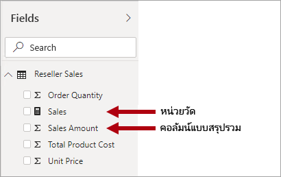
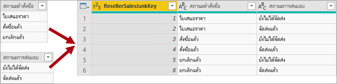
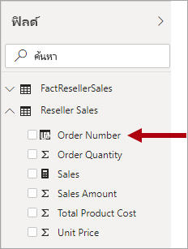

# ทำความเข้าใจกับแบบจำลองมิติที่มีลักษณะคล้ายดาวและความสำคัญที่มีต่อ Power BI

บทความนี้มีเป้าหมายที่ตัวสร้างแบบจำลองข้อมูลของ Power BI Desktop บทความนี้อธิบายการออกแบบแบบจำลองมิติที่มีลักษณะคล้ายดาวและความสัมพันธ์ของการออกแบบนั้นเพื่อพัฒนาแบบจำลองข้อมูล Power BI ที่ปรับให้เหมาะสมเพื่อประสิทธิภาพการทำงานและความสามารถในการใช้งาน

บทความนี้ไม่ได้เจตนาที่จะพูดคุยถึงการออกแบบแบบจำลองมิติที่มีลักษณะคล้ายดาวที่สมบูรณ์แต่อย่างใด สำหรับรายละเอียดเพิ่มเติม ให้ดูที่เนื้อหาที่เผยแพร่โดยตรง เช่น **ชุดเครื่องมือคลังข้อมูล: คำแนะนำในการสร้างแบบจำลองเชิงมิติฉบับสมบูรณ์** (พิมพ์ครั้งที่ 3, 2013) โดย Ralph Kimball และคณะ

## ภาพรวมแบบจำลองมิติที่มีลักษณะคล้ายดาว

**แบบจำลองมิติที่มีลักษณะคล้ายดาว** คือ วิธีการสร้างแบบจำลองที่เสร็จสมบูรณ์ซึ่งนำมาใช้โดยคลังข้อมูลเชิงสัมพันธ์อย่างแพร่หลาย ซึ่งกำหนดให้ตัวสร้างแบบจำลองจัดประเภทตารางแบบจำลองให้เป็นแบบ _มิติ_ หรือ _ค่าความจริง_

**ตารางสำหรับจัดเก็บข้อมูลสำหรับแต่ละมิติทางธุรกิจ** อธิบายถึงเอนทิตี้ธุรกิจซึ่งเป็น_สิ่ง_ที่คุณสร้างแบบจำลองขึ้นมา เอนทิตี้สามารถรวมถึงผลิตภัณฑ์ ผู้คน สถานที่ และแนวความคิด รวมถึงเวลาด้วยในตัว ตารางที่สอดคล้องกันมากที่สุดที่คุณจะพบในแบบจำลองมิติที่มีลักษณะคล้ายดาวก็คือ ตารางสำหรับจัดเก็บข้อมูลสำหรับแต่ละมิติทางธุรกิจในรูปวันที่ ตารางสำหรับจัดเก็บข้อมูลสำหรับแต่ละมิติทางธุรกิจประกอบด้วยคอลัมน์หลัก (หรือคอลัมน์) ที่ทำหน้าที่เป็นตัวระบุที่ไม่ซ้ำกัน และคอลัมน์เชิงบรรยาย

**ตารางข้อเท็จจริง** จัดเก็บข้อมูลการสังเกตการณ์หรือเหตุการณ์ ซึ่งสามารถเป็นคำสั่งซื้อ ยอดคงเหลือสินค้าคงคลัง อัตราแลกเปลี่ยน อุณหภูมิ ฯลฯ ตารางสำหรับเก็บข้อมูลตัวชี้วัดประกอบด้วยคอลัมน์คีย์มิติที่เกี่ยวข้องกับตารางสำหรับจัดเก็บข้อมูลสำหรับแต่ละมิติทางธุรกิจิ และคอลัมน์หน่วยวัดตัวเลข คอลัมน์คีย์มิติจะกำหนด _มิติ_ ของตารางสำหรับเก็บข้อมูลตัวชี้วัด ในขณะที่ค่าคีย์มิติจะกำหนด _ส่วนประกอบย่อย_ ของตารางสำหรับเก็บข้อมูลตัวชี้วัด ตัวอย่างเช่น พิจารณาตารางสำหรับเก็บข้อมูลตัวชี้วัดที่ออกแบบมาเพื่อจัดเก็บเป้ายอดขายที่มีสองคอลัมน์คีย์มิติ **วันที่** และ **ProductKey** ถือเป็นเรื่องง่ายในการทำความเข้าใจว่าตารางมีสองมิติ อย่างไรก็ตาม ่ไม่สามารถกำหนดรายละเอียดของข้อมูลได้โดยไม่คำนึงถึงค่าคีย์มิติ ในตัวอย่างนี้ พิจารณาว่าค่าที่จัดเก็บไว้ในคอลัมน์ **วันที่** คือ วันแรกของแต่ละเดือน ในกรณีนี้ รายละเอียดของข้อมูลจะอยู่ในระดับเดือน-ผลิตภัณฑ์

โดยทั่วไปแล้ว ตารางสำหรับจัดเก็บข้อมูลสำหรับแต่ละมิติทางธุรกิจจะประกอบด้วยจำนวนแถวที่ค่อนข้างน้อย ในทางกลับกัน ตารางสำหรับเก็บข้อมูลตัวชี้วัดสามารถประกอบด้วยแถวจำนวนมากและเพิ่มขึ้นต่อเนื่องเมื่อเวลาผ่านไป

## ความสัมพันธ์ของแบบจำลองมิติที่มีลักษณะคล้ายดาวต่อแบบจำลอง Power BI

การออกแบบแบบจำลองมิติที่มีลักษณะคล้ายดาวและแนวคิดที่เกี่ยวข้องมากมายที่แนะนำในบทความนี้จะสัมพันธ์กันมากในการพัฒนาแบบจำลอง Power BI ที่ได้รับการปรับให้เหมาะสมเพื่อประสิทธิภาพการทำงานและความสามารถในการใช้งาน

ให้พิจารณาว่าวิชวลรายงาน Power BI แต่ละรายการจะสร้างคิวรีที่ถูกส่งไปยังแบบจำลอง Power BI (ซึ่งบริการของ Power BI จะเรียกใช้ชุดข้อมูล) คิวรีเหล่านี้จะใช้เพื่อกรอง จัดกลุ่มและสรุปข้อมูลแบบจำลอง จากนั้นแบบจำลองที่ได้รับการออกแบบมาเป็นอย่างดีก็คือ แบบจำลองที่มีตารางสำหรับการกรองและการจัดกลุ่ม และตารางสำหรับการสรุปข้อมูล การออกแบบนี้เหมาะสมกับหลักการ Schema ของดาว:

- ตารางสำหรับจัดเก็บข้อมูลสำหรับแต่ละมิติทางธุรกิจสนับสนุน _การกรอง_ และ _การจัดกลุ่ม_
- ตารางสำหรับเก็บข้อมูลตัวชี้วัดสนับสนุน_การสรุปข้อมูล_

ไม่มีคุณสมบัติของตารางที่ผู้สร้างแบบจำลองตั้งค่าเพื่อกำหนดชนิดตารางเป็นมิติหรือความเป็นจริง ซึ่งเป็นข้อเท็จจริงที่กำหนดโดยความสัมพันธ์แบบจำลอง ความสัมพันธ์แบบจำลองสร้างเส้นทางการแพร่กระจายตัวกรองระหว่างสองตาราง และเป็นคุณสมบัติ **คาร์ดินาลลิตี้** ของความสัมพันธ์ที่กำหนดชนิดของตาราง ภาวะเชิงการนับของเซ็ตของความสัมพันธ์ทั่วไปคือ_หนึ่งต่อกลุ่ม_หรือในทางกลับกันเป็นแบบ_กลุ่มต่อหนึ่ง_ ด้าน "หนึ่ง" คือ ตารางชนิดมิติตายตัวในขณะที่ด้าน "กลุ่ม" คือ ตารางชนิดค่าความจริงตายตัวเช่นกัน เมื่อต้องการเรียนรู้เพิ่มเติมเกี่ยวกับความสัมพันธ์ โปรดดู[แบบจำลองความสัมพันธ์ใน Power BI Desktop](../desktop-relationships-understand.md)

การออกแบบแบบจำลองที่มีโครงสร้างเป็นอย่างดีควรรวมเอาตารางที่เป็นตารางชนิดมิติหรือตารางชนิดค่าความจริง คุณควรหลีกเลี่ยงการผสมตารางทั้งสองชนิดเข้าด้วยกันสำหรับตารางเดี่ยว นอกจากนี้เราขอแนะนำว่าคุณควรพยายามส่งจำนวนตารางที่ถูกต้องกับความสัมพันธ์ที่ถูกต้องในตำแหน่งเดิม นอกจากนี้ยังเป็นสิ่งสำคัญที่ว่าตารางชนิดค่าความจริงจะโหลดข้อมูลที่หน่วยมาตราวัดที่สอดคล้องกันเสมอ

สุดท้ายนี้ ถือว่ามีความสำคัญในการทำความเข้าใจว่าการออกแบบแบบจำลองที่เหมาะสมนั้นถือเป็นวิทยาศาสตร์ส่วนหนึ่งและศิลปะส่วนหนึ่ง ในบางครั้งคุณสามารถแบ่งมันออกด้วยคำแนะนำที่ดีเมื่อดูแล้วสมเหตสมุผลในการที่จะทำเช่นนั้น

มีแนวคิดเพิ่มเติมมากมายที่เกี่ยวข้องกับการออกแบบแบบจำลองมิติที่มีลักษณะคล้ายดาวที่สามารถนำไปใช้กับแบบจำลอง Power BI ได้ แนวคิดเหล่านี้ประกอบด้วย:

- [หน่วยวัด](#measures)
- [คีย์ตัวแทน](#surrogate-keys)
- [แบบจำลองมิติที่เพิ่มการทำนอร์มอลไลซ์กับข้อมูล](#snowflake-dimensions)
- [มิติการเล่นบทบาท](#role-playing-dimensions)
- [มิติเปลี่ยนแปลงอย่างช้า ๆ](#slowly-changing-dimensions)
- [มิติขยะ](#junk-dimensions)
- [ลดรูปมิติ](#degenerate-dimensions)
- [ตารางสำหรับเก็บข้อมูลตัวชี้วัดที่ไม่มีการเก็บค่าความจริงหรือมาตรวัดใด ๆ](#factless-fact-tables)

## หน่วยวัด

ในการออกแบบแบบจำลองมิติที่มีลักษณะคล้ายดาว **หน่วยวัด** คือ คอลัมน์ตารางสำหรับเก็บข้อมูลตัวชี้วัดที่จัดเก็บค่าที่จะใช้ในการสรุปข้อมูล

ในแบบจำลอง Power BI **หน่วยวัด** มีความแตกต่างกัน—แต่นิยามนั้น—คล้ายกัน ซึ่งเป็นสูตรที่เขียนใน[นิพจน์การวิเคราะห์ข้อมูล (DAX)](https://docs.microsoft.com/dax/data-analysis-expressions-dax-reference) ที่ทำการสรุปเป็นผลสำเร็จ นิพจน์หน่วยวัดมักจะใช้ประโยชน์จากฟังก์ชันการรวม DAX เช่น SUM, MIN, MAX, AVERAGE ฯลฯ เพื่อสร้างผลลัพธ์การคืนค่าเป็นข้อมูลชนิดพื้นฐานเพียงตัวเดียวในเวลาที่ทำการคิวรี (จะไม่มีการจัดเก็บค่าไว้ในแบบจำลอง) นิพจน์หน่วยวัดมีความหลากหลายมากตั้งแต่การรวมคอลัมน์แบบง่ายไปจนถึงสูตรที่ซับซ้อนมากขึ้นซึ่งลบล้างบริบทตัวกรองและ/หรือการกระจายความสัมพันธ์ สำหรับข้อมูลเพิ่มเติม อ่านบทความ [พื้นฐาน DAX ใน Power BI Desktop](https://docs.microsoft.com/power-bi/desktop-quickstart-learn-dax-basics)

ถือเป็นสิ่งสำคัญที่ต้องทำความเข้าใจว่าแบบจำลอง Power BI สนับสนุนวิธีการที่สองสำหรับการบรรลุผลการให้ข้อสรุป คอลัมน์ใด ๆ —และคอลัมน์ตัวเลขโดยทั่วไป—สามารถสรุปได้โดยการวิชวลรายงานหรือการถามตอบ คอลัมน์เหล่านี้จะเรียกว่า _หน่วยวัดทางอ้อม_ ซึ่งจะมีความสะดวกสำหรับคุณในฐานะนักพัฒนาแบบจำลอง เช่นเดียวกับในอินสแตนซ์จำนวนมากที่คุณไม่จำเป็นต้องสร้างหน่วยวัด ตัวอย่างเช่น คอลัมน์ **ยอดขาย** ยอดขายของผู้ค้าปลีกของงานผจญภัยสามารถสรุปได้หลายวิธี (เช่น สรุป, นับ, เฉลี่ย, มัธยฐาน, ต่ำสุด, สูงสุด, ฯลฯ) โดยไม่จำเป็นต้องสร้างหน่วยวัดสำหรับแต่ละชนิดการรวมที่เป็นไปได้

อย่างไรก็ตาม มีสามสาเหตุที่น่าสนใจสำหรับคุณในการสร้างหน่วยวัด แม้แต่กับการให้ข้อสรุปในระดับคอลัมน์แบบง่าย:

- เมื่อคุณทราบว่าผู้เขียนรายงานจะคิวรีแบบจำลองโดยใช้ [นิพจน์แบบหลายมิติ (MDX)](https://docs.microsoft.com/sql/analysis-services/multidimensional-models/mdx/mdx-query-the-basic-query?view=sql-server-2017) แบบจำลองจะต้องรวม_หน่วยวัดโดยตรง_ มีการกำหนดหน่วยวัดโดยตรงโดยใช้ DAX วิธีการออกแบบนี้มีความเกี่ยวข้องอย่างมากเมื่อมีการคิวรีชุดข้อมูล Power BI โดยใช้ MDX เนื่องจาก MDX ไม่สามารถทำการสรุปของค่าคอลัมน์ได้ โดยเฉพาะอย่างยิ่ง MDX จะใช้เมื่อทำการ [วิเคราะห์ใน Excel](https://docs.microsoft.com/power-bi/service-analyze-in-excel) เพราะคิวรี MDX ของปัญหา PivotTable
- เมื่อคุณทราบว่าผู้เขียนรายงานของคุณจะสร้างรายงานที่มีการแบ่งหน้าของ Power BI โดยใช้ตัวออกแบบคิวรี MDX แบบจำลองจะต้องมีหน่วยวัดโดยตรง เฉพาะตัวออกแบบคิวรี MDX เท่านั้นที่สนับสนุน [การรวมเซิร์ฟเวอร์](/sql/reporting-services/report-design/report-builder-functions-aggregate-function) ดังนั้นถ้าผู้เขียนรายงานจำเป็นต้องมีหน่วยวัดที่ประเมินโดย Power BI (แทนที่จะเป็นโดยกลไกจัดการรายงานที่มีการแบ่งหน้า) พวกเขาต้องใช้ตัวออกแบบคิวรี MDX
- หากคุณต้องการให้แน่ใจว่าผู้เขียนรายงานของคุณสามารถสรุปคอลัมน์ในรูปแบบที่เฉพาะเจาะจงเท่านั้น ตัวอย่างเช่น คอลัมน์**ราคาต่อหน่วย** ของยอดขายของผู้ค้าปลีก (ซึ่งแสดงถึงอัตราต่อหน่วย) สามารถสรุปได้โดยการใช้ฟังก์ชันการรวมเฉพาะเท่านั้น ซึ่งไม่ควรมีการรวมข้อมูลแต่ถือว่ามีความเหมาะสมในการสรุปโดยใช้ฟังก์ชันการรวมอื่น ๆ เช่น ต่ำสุด, สูงสุด, เฉลี่ย, ฯลฯ ในอินสแตนซ์นี้ ตัวสร้างแบบจำลองสามารถซ่อนคอลัมน์ **ราคาต่อหน่วย** และสร้างหน่วยวัดสำหรับฟังก์ชันการรวมที่เหมาะสมทั้งหมดได้

โปรดทราบว่าวิธีการออกแบบนี้ทำงานได้เป็นอย่างดีสำหรับรายงานที่เขียนในบริการของ Power BI และสำหรับการถามตอบ อย่างไรก็ตาม การเชื่อมต่อสดของ Power BI Desktop อนุญาตให้ผู้สร้างรายงานแสดงเขตข้อมูลที่ซ่อนอยู่ในบานหน้าต่าง **เขตข้อมูล** ซึ่งอาจส่งผลให้เกิดการเลี่ยงวิธีการออกแบบลักษณะนี้

## คีย์ตัวแทน

**คีย์ตัวแทน** คือ ตัวระบุที่ไม่ซ้ำกันที่คุณเพิ่มไปยังตารางเพื่อสนับสนุนการสร้างแบบจำลองมิติที่มีลักษณะคล้ายดาว ตามข้อกำหนด จะไม่มีการกำหนดหรือจัดเก็บไว้ในข้อมูลต้นฉบับ โดยทั่วไปแล้วจะมีการเพิ่มคีย์ตัวแทนไปยังตารางสำหรับจัดเก็บข้อมูลสำหรับแต่ละมิติทางธุรกิจคลังข้อมูลที่เกี่ยวข้องเพื่อมอบตัวระบุที่ไม่ซ้ำกันสำหรับแต่ละแถวตารางมิติ

ความสัมพันธ์ของแบบจำลอง Power BI จะขึ้นอยู่กับคอลัมน์เดี่ยวที่ไม่ซ้ำกันในหนึ่งตาราง ซึ่งแพร่กระจายตัวกรองไปยังคอลัมน์เดี่ยวในอีกตาราง เมื่อตารางชนิดมิติในแบบจำลองของคุณไม่มีคอลัมน์เดี่ยวที่ไม่ซ้ำกันเพียง คุณต้องเพิ่มตัวระบุที่ไม่ซ้ำกันเพื่อให้เป็นด้าน "หนึ่ง" ของความสัมพันธ์ ใน Power BI Desktop คุณสามารถดำเนินการได้อย่างง่ายดายโดยการสร้าง [คอลัมน์ดัชนี Power Query](https://docs.microsoft.com/powerquery-m/table-addindexcolumn)

คุณต้องผสานคิวรีนี้กับคิวรีด้าน "หลากหลาย" เพื่อให้คุณสามารถเพิ่มคอลัมน์ดัชนีไปยังคิวรีได้อีกด้วย เมื่อคุณโหลดคิวรีเหล่านี้ไปยังแบบจำลอง คุณสามารถสร้างความสัมพันธ์แบบหนึ่งต่อกลุ่มระหว่างตารางแบบจำลองได้

## แบบจำลองมิติที่เพิ่มการทำนอร์มอลไลซ์กับข้อมูล

**แบบจำลองมิติที่เพิ่มการทำนอร์มอลไลซ์กับข้อมูล** คือ ชุดของตารางที่ทำการนอร์มอลไลซ์สำหรับเอนทิตี้ธุรกิจเดี่ยว ตัวอย่างเช่น งานผจญภัยจัดประเภทผลิตภัณฑ์ตามหมวดหมู่และหมวดหมู่ย่อย หมวดหมู่จะถูกกำหนดให้กับหมวดหมู่ย่อย และในทางกลับกันผลิตภัณฑ์จะถูกกำหนดให้เป็นหมวดหมู่ย่อย ในคลังข้อมูลเชิงสัมพันธ์ของงานผจญภัย จะมีการนอร์มอลไลซ์มิติของผลิตภัณฑ์และจัดเก็บไว้ในตารางที่เกี่ยวข้องสามตารางด้วยกัน: **DimProductCategory** , **DimProductSubcategory** และ **DimProduct**

หากคุณใช้จินตนาการของคุณ คุณสามารถนึกภาพตารางที่ทำการนอร์มอลไลซ์ตั้งอยู่ในตำแหน่งที่ตั้งออกข้างนอกจากตารางสำหรับเก็บข้อมูลตัวชี้วัด ก่อขึ้นเป็นการออกแบบแบบจำลองมิติที่เพิ่มการทำนอร์มอลไลซ์กับข้อมูล

ใน Power BI Desktop คุณสามารถเลือกจำลองการออกแบบแบบจำลองมิติที่เพิ่มการทำนอร์มอลไลซ์กับข้อมูลได้ (บางทีอาจเนื่องมาจากข้อมูลต้นฉบับของคุณ) หรือรวม (ที่ไม่มีการนอร์มอลไลซ์) ตารางแหล่งข้อมูลลงในตารางแบบจำลองเดี่ยว โดยทั่วไปแล้ว ประโยชน์ของตารางแบบจำลองเดี่ยวมีค่าเกินประโยชน์จากตารางแบบจำลองหลากหลาย การตัดสินใจที่เหมาะสมที่สุดอาจขึ้นอยู่กับปริมาณของข้อมูลและความต้องการความสามารถในการใช้งานสำหรับแบบจำลอง

เมื่อคุณเลือกจำลองการออกแบบแบบจำลองมิติที่เพิ่มการทำนอร์มอลไลซ์กับข้อมูล:

- Power BI จะโหลดตารางเพิ่มเติม ซึ่งมีประสิทธิภาพน้อยกว่าจากที่จัดเก็บข้อมูลและมุมมองเชิงประสิทธิภาพ ตารางเหล่านี้จะต้องรวมเอาคอลัมน์เพื่อสนับสนุนความสัมพันธ์แบบจำลอง และการดำเนินการนี้อาจส่งผลให้ขนาดของแบบจำลองมีขนาดใหญ่ขึ้น
- ห่วงโซ่การแพร่กระจายตัวกรองความสัมพันธ์ที่ยาวกว่าจะต้องได้รับการสำรวจ ซึ่งมีแนวโน้มว่าอาจจะมีประสิทธิภาพด้อยกว่าตัวกรองที่ใช้กับตารางเดี่ยว
- บานหน้าต่าง **เขตข้อมูล** แสดงตารางแบบจำลองเพิ่มเติมให้กับผู้สร้างรายงาน ซึ่งอาจส่งผลให้ประสบการณ์การใช้งานที่ง่ายลดน้อยลง โดยเฉพาะอย่างยิ่งเมื่อตารางสำหรับจัดเก็บข้อมูลสำหรับแต่ละมิติทางธุรกิจที่เพิ่มการทำนอร์มอลไลซ์กับข้อมูลมีแค่หนึ่งหรือสองคอลัมน์
- จึงเป็นไปไม่ได้ที่จะสร้างลำดับชั้นที่ครอบคลุมทั้งตารางได้

เมื่อคุณเลือกที่จะรวมลงในตารางแบบจำลองเดี่ยว คุณยังสามารถกำหนดลำดับชั้นที่ครอบคลุมถึงหน่วยมาตราชั่งสูงสุดและต่ำสุดของมิติได้อีกด้วย มีความเป็นไปได้ว่าการจัดเก็บข้อมูลที่ไม่มีการนอร์มอลไลซ์ที่ซ้ำซ้อนอาจส่งผลให้ขนาดพื้นที่การจัดเก็บแบบจำลองนั้นเพิ่มขึ้น โดยเฉพาะอย่างยิ่งสำหรับตารางสำหรับจัดเก็บข้อมูลสำหรับแต่ละมิติทางธุรกิจที่มีขนาดใหญ่มาก

## มิติที่มีการเปลี่ยนแปลงอย่างช้า ๆ

**มิติที่มีการเปลี่ยนแปลงอย่างช้า ๆ** (SCD) คือ หนึ่งมิติจัดการการเปลี่ยนแปลงของสมาชิกมิติเมื่อเวลาผ่านไปได้อย่างเหมาะสม ซึ่งจะใช้เมื่อค่าเอนทิตี้ทางธุรกิจเปลี่ยนไปตามเวลาและในลักษณะเฉพาะกิจ ตัวอย่างที่ดีของมิติที่มีการเปลี่ยนแปลงอย่าง _ช้า ๆ_ คือ มิติลูกค้า โดยเฉพาะคอลัมน์รายละเอียดการติดต่อ เช่น ที่อยู่อีเมลและหมายเลขโทรศัพท์ ในทางตรงกันข้าม บางมิติจะพิจารณาว่าเป็นการเปลี่ยนแปลง _อย่างรวดเร็ว_ เมื่อมีการเปลี่ยนแปลงแอตทริบิวต์มิติบ่อยครั้ง เช่น ราคาตลาดของหุ้น เป็นต้น วิธีการออกแบบทั่วไปในอินสแตนซ์เหล่านี้คือ เพื่อจัดเก็บค่าแอตทริบิวต์ที่เปลี่ยนแปลงอย่างรวดเร็วในหน่วยวัดของตารางสำหรับเก็บข้อมูลตัวชี้วัด

ทฤษฎีการออกแบบแบบจำลองมิติที่มีลักษณะคล้ายดาวดาวอ้างอิงถึง SCD สองชนิดที่พบบ่อย: ชนิดที่ 1และชนิดที่ 2 ตารางชนิดมิติอาจเป็นชนิดที่ 1 หรือชนิดที่ 2 หรือสนับสนุนทั้งสองชนิดในเวลาเดียวกันสำหรับคอลัมน์ที่แตกต่างกัน

### SCD ชนิดที่ 1

**SCD** **ชนิดที่ 1** แสดงค่าล่าสุดเสมอ และเมื่อตรวจพบการเปลี่ยนแปลงในข้อมูลต้นฉบับ ข้อมูลตารางสำหรับจัดเก็บข้อมูลสำหรับแต่ละมิติทางธุรกิจถูกเขียนทับอย่างง่ายดาย วิธีการออกแบบนี้ถือเป็นเรื่องปกติสำหรับคอลัมน์ที่จัดเก็บค่าเสริม เช่น ที่อยู่อีเมลหรือหมายเลขโทรศัพท์ของลูกค้า เมื่อที่อยู่อีเมลหรือหมายเลขโทรศัพท์ของลูกค้ามีการเปลี่ยนแปลง ตารางสำหรับจัดเก็บข้อมูลสำหรับแต่ละมิติทางธุรกิจจะอัปเดตแถวลูกค้าด้วยค่าใหม่ ซึ่งเทียบได้ว่าลูกค้ามีข้อมูลการติดต่อนี้อยู่เสมอ

การรีเฟรชแบบไม่เพิ่มของตารางชนิดมิติแบบจำลอง Power BI จะทำให้เกิดผลลัพธ์เป็น SCD ชนิดที่ 1 เป็นการรีเฟรชข้อมูลตารางเพื่อให้แน่ใจว่ามีการโหลดค่าล่าสุด

### SCD ชนิดที่ 2

**SCD** **ชนิดที่ 2** สนับสนุนการกำหนดเวอร์ชันของสมาชิกมิติ ถ้าระบบต้นทางไม่ได้จัดเก็บเวอร์ชันไว้ จากนั้นมักจะเป็นกระบวนการโหลดของคลังข้อมูลที่ตรวจหาการเปลี่ยนแปลง และจัดการการเปลี่ยนแปลงในตารางสำหรับจัดเก็บข้อมูลสำหรับแต่ละมิติทางธุรกิจได้อย่างเหมาะสม ในกรณีนี้ ตารางสำหรับจัดเก็บข้อมูลสำหรับแต่ละมิติทางธุรกิจต้องใช้คีย์ตัวแทนเพื่อระบุการอ้างอิงที่ไม่ซ้ำกันกับ _เวอร์ชัน_ ของสมาชิกมิติ นอกจากนี้ยังรวมถึงคอลัมน์ที่กำหนดความถูกต้องของช่วงวันที่ของเวอร์ชันแ(เช่น **StartDate** และ **EndDate**) และอาจเป็นคอลัมน์ค่าสถานะ (เช่น **IsCurrent**) เพื่อกรองตามสมาชิกมิติปัจจุบันได้อย่างง่ายดาย

ตัวอย่างเช่น งานผจญภัยกำหนดพนักงานขายให้กับภูมิภาคการขาย เมื่อพนักงานขายย้ายภูมิภาค จะต้องมีการสร้างเวอร์ชันใหม่ของพนักงานขายเพื่อให้แน่ใจว่าค่าความจริงในอดีตยังคงเชื่อมโยงกับภูมิภาคก่อนหน้านี้ เมื่อต้องการสนับสนุนการวิเคราะห์ประวัติยอดขายที่ถูกต้องตามพนักงานขาย ตารางสำหรับจัดเก็บข้อมูลสำหรับแต่ละมิติทางธุรกิจิต้องจัดเก็บเวอร์ชันของพนักงานขายและภูมิภาคที่เกี่ยวข้องของพวกเขา นอกจากนี้ตารางควรรวมค่าวันที่เริ่มต้นและสิ้นสุดเพื่อกำหนดความสมเหตุสมผลด้านเวลา เวอร์ชันปัจจุบันอาจกำหนดวันสิ้นสุดว่างเปล่า (หรือ 12/31/9999) ซึ่งบ่งชี้ว่าแถวเป็นเวอร์ชันปัจจุบัน นอกจากนี้ตารางต้องกำหนดคีย์ตัวแทนเนื่องจากคีย์ธุรกิจ (ในอินสแตนซ์นี้ รหัสพนักงาน) จะไม่ซ้ำกัน

ถือเป็นสิ่งสำคัญที่ต้องทำความเข้าใจว่าเมื่อข้อมูลต้นฉบับไม่ได้จัดเก็บเวอร์ชันไว้ คุณต้องใช้ระบบขั้นกลาง (เช่น คลังข้อมูล) เพื่อตรวจหาและจัดเก็บการเปลี่ยนแปลง กระบวนการการโหลดตารางต้องรักษาข้อมูลที่มีอยู่และตรวจหาการเปลี่ยนแปลง เมื่อตรวจพบการเปลี่ยนแปลง กระบวนการโหลดตารางต้องทำให้เวอร์ชันปัจจุบันหมดอายุ ซึ่งจะบันทึกการเปลี่ยนแปลงเหล่านี้โดยการอัปเดตค่า **EndDate** และการแทรกเวอร์ชันใหม่ด้วยค่า **StartDate** ที่เริ่มต้นจากค่า **EndDate** ก่อนหน้า นอกจากนี้ ข้อเท็จจริงที่เกี่ยวข้องต้องใช้การค้นหาโดยยึดตามเวลาเพื่อค้นคืนค่าคีย์มิติที่สัมพันธ์กับวันที่ตามค่าความจริง แบบจำลอง Power BI ที่ใช้ Power Query ไม่สามารถสร้างผลลัพธ์นี้ได้ อย่างไรก็ตาม แบบจำลองสามารถโหลดข้อมูลจากตารางสำหรับจัดเก็บข้อมูลสำหรับแต่ละมิติทางธุรกิจชนิด SCD ชนิดที่ 2 ที่โหลดไว้ล่วงหน้าได้

แบบจำลอง Power BI ควรสนับสนุนการคิวรีข้อมูลประวัติสำหรับสมาชิก โดยไม่คำนึงถึงการเปลี่ยนแปลง และสำหรับเวอร์ชันของสมาชิกซึ่งแสดงสถานะเฉพาะของสมาชิกในเวลา ในบริบทของงานผจญภัย การออกแบบนี้จะช่วยให้คุณสามารถคิวรีพนักงานขายได้ โดยไม่คำนึงถึงภูมิภาคการขายที่กำหนด หรือสำหรับเวอร์ชันเฉพาะของพนักงานขาย

ในการดำเนินการนี้ ตารางชนิดมิติแบบจำลอง Power BI ต้องรวมคอลัมน์สำหรับการกรองพนักงานขาย และคอลัมน์ที่แตกต่างกันสำหรับการกรองเวอร์ชันเฉพาะของพนักงานขาย ถือเป็นสิ่งสำคัญที่คอลัมน์เวอร์ชันจะต้องมีคำอธิบายที่ไม่กำกวม เช่น "Michael Blythe (12/15/2008-06/26/2019)" หรือ "Michael Blythe (ปัจจุบัน)" นอกจากนี้ยังถือเป็นสิ่งสำคัญที่จะให้ความรู้แก่ผู้เขียนรายงานและผู้บริโภคเกี่ยวกับพื้นฐานของ SCD ชนิดที่ 2 และวิธีการออกแบบรายงานที่เหมาะสมโดยนำเอาตัวกรองที่ถูกต้องมาใช้

นอกจากนี้ยังเป็นแนวทางปฏิบัติด้านการออกแบบที่ดีเพื่อรวมลำดับชั้นที่อนุญาตให้วิชวลทำการเจาะลงไปยังระดับเวอร์ชัน

## มิติการเล่นบทบาท

**มิติการเล่นบทบาท**คือ มิติที่สามารถกรองค่าความจริงที่เกี่ยวข้องอย่างแตกต่างกันได้ ตัวอย่างเช่น ในงานผจญภัย ตารางสำหรับจัดเก็บข้อมูลสำหรับแต่ละมิติทางธุรกิจวันที่มีสามความสัมพันธ์ไปยังค่าความจริงยอดขายของผู้ค้าปลีก ตารางสำหรับจัดเก็บข้อมูลสำหรับแต่ละมิติทางธุรกิจเดียวกันสามารถใช้เพื่อกรองค่าความจริงตามวันที่สั่งซื้อ, วันที่ส่งหรือวันที่จัดส่ง

ในคลังข้อมูล วิธีการออกแบบที่ได้รับการยอมรับคือ เพื่อกำหนดตารางสำหรับจัดเก็บข้อมูลสำหรับแต่ละมิติทางธุรกิจวันที่เดี่ยว ณ เวลาที่ทำการคิวรี "บทบาท" ของมิติวันที่จะถูกสร้างขึ้นโดยคอลัมน์ค่าความจริงที่คุณใช้ในการรวมตาราง ตัวอย่างเช่น เมื่อคุณวิเคราะห์ยอดขายตามวันที่ในใบสั่งซื้อ การรวมตารางจะเกี่ยวข้องกับคอลัมน์วันที่ในใบสั่งขายของผู้ค้าปลีก

ในแบบจำลอง Power BI การออกแบบนี้สามารถลอกเลียนแบบได้โดยการสร้างความสัมพันธ์ที่หลากหลายระหว่างสองตาราง ในตัวอย่างงานผจญภัย ตารางวันที่และยอดขายของผู้ค้าปลีกจะมีสามความสัมพันธ์ ในขณะที่การออกแบบนี้มีความเป็นไปได้ จำเป็นต้องทำความเข้าใจว่าความสัมพันธ์สามารถใช้งานได้เฉพาะระหว่างสองตารางแบบจำลองของ Power BI เท่านั้น ต้องตั้งค่าความสัมพันธ์ที่เหลือทั้งหมดเป็นไม่ได้ใช้งาน การมีความสัมพันธ์ที่ใช้งานเดี่ยวหมายความว่ามีการแพร่กระจายตัวกรองค่าเริ่มต้นจากวันที่ไปยังยอดขายของผู้ค้าปลีก ในอินสแตนซ์นี้ ความสัมพันธ์ที่ใช้งานอยู่ถูกตั้งค่าเป็นตัวกรองทั่วไปมากที่สุดที่ใช้โดยรายงาน ซึ่งที่งานผจญภัยคือ ความสัมพันธ์ของวันที่สั่งซื้อ

วิธีเดียวที่จะใช้ความสัมพันธ์ที่ไม่ได้ทำงานคือ เพื่อกำหนดนิพจน์ DAX ที่ใช้ [ฟังก์ชัน USERELATIONSHIP](https://docs.microsoft.com/dax/userelationship-function-dax) ในตัวอย่างของเรา นักพัฒนาแบบจำลองจะต้องสร้างหน่วยวัดเพื่อเปิดใช้งานการวิเคราะห์ยอดขายของผู้ค้าปลีกตามวันที่จัดส่งและวันที่ส่งมอบ การทำงานนี้อาจเป็นเรื่องน่าเบื่อ โดยเฉพาะอย่างยิ่งเมื่อตารางผู้ค้าปลีกกำหนดหน่วยวัดจำนวนมาก นอกจากนี้ยังสร้างพื้นที่ทำงานของบานหน้าต่าง **เขตข้อมูล** ด้วยหน่วยวัดที่มากเกินไป รวมถึงยังมีข้อจำกัดอื่น ๆ อีกด้วย:

- เมื่อผู้สร้างรายงานอาศัยการสรุปคอลัมน์ แทนที่จะเป็นการกำหนดหน่วยวัด พวกเขาไม่จึงสามารถบรรลุการให้ข้อสรุปสำหรับความสัมพันธ์ที่ไม่ได้ใช้งานโดยไม่ต้องเขียนหน่วยวัดระดับรายงาน สามารถกำหนดหน่วยวัดระดับรายงานเมื่อทำการเขียนรายงานใน Power BI Desktop เท่านั้น
- ด้วยเส้นทางความสัมพันธ์ที่ใช้งานอยู่ระหว่างวันที่และผู้จำหน่ายเท่านั้นจึงเป็นไปไม่ได้ที่จะกรองยอดขายของผู้จำหน่ายได้ในเวลาเดียวกันตามชนิดของวันที่ที่แตกต่างกัน ตัวอย่างเช่น คุณไม่สามารถสร้างวิชวลที่วางแผนยอดขายของวันที่สั่งซื้อตามยอดขายที่จัดส่ง

เพื่อเอาชนะข้อจำกัดเหล่านี้ เทคนิคการสร้างแบบจำลอง Power BI ทั่วไปก็คือ เพื่อสร้างตารางชนิดมิติสำหรับแต่ละอินสแตนซ์การเล่นตามบทบาท โดยทั่วไปคุณสร้างตารางสำหรับจัดเก็บข้อมูลสำหรับแต่ละมิติทางธุรกิจเพิ่มเติมเป็น [ตารางที่มีการคำนวณ](https://docs.microsoft.com/dax/calculatetable-function-dax) โดยใช้ DAX การใช้ตารางที่มีการคำนวณ แบบจำลองสามารถประกอบด้วยตาราง **วันที่** ตาราง **วันที่จัดส่ง** และตาราง **วันที่ส่งมอบ** ซึ่งแต่ละตารางมีความสัมพันธ์แบบเดี่ยวกับแบบที่ใช้งานอยู่ไปยังคอลัมน์ตารางยอดขายของผู้ค้าปลีกที่เกี่ยวข้อง

วิธีการออกแบบนี้ไม่จำเป็นต้องให้คุณกำหนดหน่วยวัดหลาหลายให้กับบทบาทวันที่ที่แตกต่างกัน และอนุญาตให้มีการกรองในเวลาเดียวกันตามบทบาทวันที่อื่นที่แตกต่างกัน อย่างไรก็ตาม ราคาเล็กน้อยในการชำระเงิน ด้วยวิธีการออกแบบนี้คือ จะมีการทำซ้ำของตารางสำหรับจัดเก็บข้อมูลสำหรับแต่ละมิติทางธุรกิจวันที่ซึ่งส่งผลให้ขนาดพื้นที่จัดเก็บแบบจำลองเพิ่มขึ้น โดยทั่วไปแล้ว ตารางชนิดมิติจะจัดเก็บแถวน้อยกว่าที่สัมพันธ์กับตารางชนิดค่าความจริง ซึ่งไม่ใช่เรื่องที่น่ากังวลแต่อย่างใด

สังเกตแนวทางปฏิบัติด้านการออกแบบที่ดีต่อไปนี้เมื่อคุณสร้างตารางชนิดมิติแบบจำลองสำหรับแต่ละบทบาท:

- ตรวจสอบให้แน่ใจว่าชื่อคอลัมน์สามารถอธิบายตัวเอง ในขณะที่เป็นไปได้ที่จะมีคอลัมน์ **ปี** ในตารางวันที่ทั้งหมด (ชื่อคอลัมน์จะไม่ซ้ำกันภายในตารางของเหล่านั้น) ซึ่งจะไม่มีการอธิบายตัวเองตามชื่อวิชวลที่เป็นค่าเริ่มต้น พิจารณาเปลี่ยนชื่อคอลัมน์ในแต่ละตารางบทบาทมิติ เพื่อให้ตาราง **วันที่จัดส่ง** มีคอลัมน์ปีที่ชื่อว่า **ปีการจัดส่ง** ฯลฯ
- เมื่อเกี่ยวเนื่องกัน ตรวจสอบให้แน่ใจว่าคำอธิบายตารางมอบคำติชมไปยังผู้เขียนรายงาน (ผ่านเคล็ดลับเครื่องมือของบานหน้าต่าง **เขตข้อมูล**) เกี่ยวกับวิธีการกำหนดค่าการแพร่กระจายตัวกรอง ความชัดเจนนี้ถือเป็นสิ่งสำคัญเมื่อแบบจำลองประกอบด้วยตารางที่มีชื่อโดยทั่วไป เช่น **วันที่** ซึ่งถูกใช้เพื่อกรองตารางชนิดค่าความจริงจำนวนมาก ตัวอย่างเช่น ในกรณีที่ตารางนี้มีความสัมพันธ์ที่ใช้งานอยู่ไปยังคอลัมน์วันที่ของใบสั่งขายของผู้ค้าปลีก ลองพิจารณาให้คำอธิบายตารางเช่น "กรองยอดขายของผู้ค้าปลีกตามวันที่สั่งซื้อ"

สำหรับข้อมูลเพิ่มเติม โปรดดู[คำแนะนำความแตกต่างระหว่างความสัมพันธ์ที่ใช้และไม่ได้ใช้งาน](relationships-active-inactive.md)

## มิติขยะ

**มิติขยะ** มีประโยชน์เมื่อมมิติจำนวนมาก โดยเฉพาะอย่างยิ่งที่ประกอบด้วยสองถึงสามแอตทริบิวต์ (บางทีอาจเป็นหนึ่ง) และเมื่อแอตทริบิวต์เหล่านี้มีค่าไม่มาก ผู้สมัครที่ดีจะรวมคอลัมน์สถานะคำสั่งซื้อ หรือคอลัมน์เชิงประชากรศาสตร์ของลูกค้า (เพศ กลุ่มอายุ ฯลฯ)

วัตถุประสงค์ในการออกแบบมิติขยะก็คือ เพื่อรวมมิติ "ขนาดเล็ก" จำนวนมากเข้าเป็นมิติเดี่ยวเพื่อทั้งลดขนาดการจัดเก็บแบบจำลองและยังลดกลุ่มของบานหน้าต่าง **เขตข้อมูล** โดยทำให้ตารางแบบจำลองที่น้อยกว่าปรากฎขึ้น

โดยทั่วไปแล้ว ตารางสำหรับจัดเก็บข้อมูลสำหรับแต่ละมิติทางธุรกิจขยะมักจะเป็นผลิตภัณฑ์คาร์ทีเซียนของสมาชิกแอตทริบิวต์มิติทั้งหมดที่มีคอลัมนคีย์ตัวแทน คีย์ตัวแทนให้การอ้างอิงที่ไม่ซ้ำกันกับแต่ละแถวในตาราง คุณสามารถสร้างมิติในคลังข้อมูล หรือโดยการใช้ Power Query เพื่อสร้างคิวรีที่ดำเนินการ [รวมคิวรีภายนอกแบบเต็ม](https://docs.microsoft.com/powerquery-m/table-join) จากนั้นจึงเพิ่มคีย์ตัวแทน (คอลัมน์ดัชนี)

คุณโหลดคิวรีนี้ไปยังแบบจำลองเป็นตารางชนิดมิติ นอกจากนี้คุณยังต้องผสานคิวรีนี้กับคิวรีค่าความจริง ดังนั้นจึงมีการโหลดคอลัมน์ดัชนีไปยังแบบจำลองเพื่อสนับสนุนการสร้างความสัมพันธ์แบบจำลองแบบ "หนึ่งต่อกลุ่ม"

## ตัวอย่างมิติลดรูป

**มิติลดรูป** อ้างอิงถึงแอตทริบิวต์ของตารางสำหรับเก็บข้อมูลตัวชี้วัดที่กำหนดสำหรับการกรอง ในงานผจญภัย หมายเลขใบสั่งขายของผู้ค้าปลีกคือ ตัวอย่างที่ดี ในกรณีนี้จะไม่ทำให้การออกแบบแบบจำลองที่ดีมีความสมเหตุสมผลในการสร้างตารางอิสระที่ประกอบด้วยแค่หนึ่งคอลัมน์นี้ เนื่องจากมันจะเพิ่มขนาดการจัดเก็บแบบจำลองและผลลัพธ์ในบานหน้าต่าง **เขตข้อมูล** ที่ไม่เป็นระเบียบ

ในแบบจำลอง Power BI ถือว่าเหมาะสมที่จะเพิ่มคอลัมน์หมายเลขใบสั่งขายไปยังตารางชนิดค่าความจริงเพื่ออนุญาตให้มีการกรองหรือการจัดกลุ่มตามหมายเลขใบสั่งขาย ซึ่งเป็นข้อยกเว้นสำหรับกฎที่แนะนำก่อนหน้านี้ที่คุณไม่ควรผสมชนิดของตารางเข้าด้วยกัน (เช่น โดยทั่วไปแล้ว ตารางแบบจำลองควรเป็นชนิดมิติหรือชนิดค่าความจริง)

อย่างไรก็ตาม ถ้าตารางยอดขายของผู้จำหน่ายใน Adventure Works มีหมายเลขคำสั่งซื้อ_และ_คอลัมน์หมายเลขบรรทัดคำสั่งซื้อ และคุณจำเป็นต้องใช้ทั้งสองคอลัมน์ในการกรอง ควรเลือกใช้ตารางแบบ degenerate dimension สำหรับข้อมูลเพิ่มเติม โปรดดู[คำแนะนำความสัมพันธ์แบบหนึ่งต่อหนึ่ง (มิติลดรูป)](relationships-one-to-one.md#degenerate-dimensions)

## ตารางสำหรับเก็บข้อมูลตัวชี้วัดที่ไม่มีการเก็บค่าความจริงหรือมาตรวัดใด ๆ

ตาราง **สำหรับเก็บข้อมูลตัวชี้วัดที่ไม่มีการเก็บค่าความจริงหรือมาตรวัดใด ๆ** จะไม่รวมคอลัมน์หน่วยวัดใด ๆ ซึ่งประกอบด้วยคีย์มิติเท่านั้น

ตารางสำหรับเก็บข้อมูลตัวชี้วัดที่ไม่มีการเก็บค่าความจริงหรือมาตรวัดใด ๆ สามารถจัดเก็บการสังเกตการณ์ที่กำหนดโดยคีย์มิติได้ ตัวอย่างเช่น ณ วันที่และเวลาเฉพาะ ลูกค้าเฉพาะเข้าสู่ระบบในเว็บไซต์ของคุณ คุณสามารถกำหนดหน่วยวัดเพื่อนับจำนวนแถวของตารางสำหรับเก็บข้อมูลตัวชี้วัดที่ไม่มีการเก็บค่าความจริงหรือมาตรวัดใด ๆ เพื่อดำเนินการวิเคราะห์ว่าจำนวนลูกค้าที่เข้าสู่ระบบมีจำนวนกี่รายและเมื่อใดบ้าง

การใช้งานที่น่าสนใจมากขึ้นของตารางสำหรับเก็บข้อมูลตัวชี้วัดที่ไม่มีการเก็บค่าความจริงหรือมาตรวัดใด ๆ ก็คือ เพื่อจัดเก็บความสัมพันธ์ระหว่างมิติ และเป็นวิธีการออกแบบแบบจำลอง Power BI ที่เราแนะนำให้กำหนดความสัมพันธ์ของมิติแบบกลุ่ม-ต่อ-กลุ่ม ใน[การออกแบบความสัมพันธ์ของมิติแบบกลุ่ม-ต่อ-กลุ่ม ](relationships-many-to-many.md#relate-many-to-many-dimensions)ตารางสำหรับเก็บข้อมูลตัวชี้วัดที่ไม่มีการเก็บค่าความจริงหรือมาตรวัดใด ๆ จะเรียกว่าเป็น_ตารางการเชื่อมโยง_

ตัวอย่างเช่น พิจารณาว่าพนักงานขายสามารถกำหนดให้กับหนึ่งภูมิภาคการขาย_ขึ้นไป_ ตารางการเชื่อมโยงจะได้รับการออกแบบเป็นตารางสำหรับเก็บข้อมูลตัวชี้วัดที่ไม่มีการเก็บค่าความจริงหรือมาตรวัดใด ๆ ที่ประกอบด้วยสองคอลัมน์: คีย์พนักงานขายและคีย์ภูมิภาค สามารถจัดเก็บค่าที่ซ้ำกันได้ในทั้งสองคอลัมน์

วิธีการออกแบบแบบกลุ่ม-ต่อ-กลุ่มนี้ได้รับการจัดทำเป็นเอกสารไว้เป็นอย่างดี และสามารถดำเนินการให้สำเร็จได้โดยไม่ต้องมีตารางการเชื่อมโยง อย่างไรก็ตาม วิธีการของตารางการเชื่อมโยงถือว่าเป็นแนวทางปฏิบัติที่ดีที่สุดเมื่อสัมพันธ์กับสองมิติ สำหรับข้อมูลเพิ่มเติม โปรดดู[คำแนะนำความสัมพันธ์แบบกลุ่มต่อกลุ่ม เชื่อมโยงตารางประเภทมิติสองตาราง)](relationships-many-to-many.md#relate-many-to-many-dimensions)

## ขั้นตอนถัดไป

สำหรับข้อมูลเพิ่มเติมเกี่ยวกับการออกแบบแบบจำลองมิติที่มีลักษณะคล้ายดาวและการออกแบบแบบจำลอง Power BI ให้ดูบทความต่อไปนี้:

- [บทความของวิกิพีเดียเกี่ยวกับการทำแบบจำลองเชิงมิติ](https://go.microsoft.com/fwlink/p/?linkid=246459)
- [สร้างและจัดการความสัมพันธ์ใน Power BI Desktop](../desktop-create-and-manage-relationships.md)
- [คำแนะนำความสัมพันธ์แบบหนึ่งต่อหนึ่ง](relationships-one-to-one.md)
- [คำแนะนำความสัมพันธ์แบบกลุ่มต่อกลุ่ม](relationships-many-to-many.md)
- [คำแนะนำความสัมพันธ์แบบสองทิศทาง](relationships-bidirectional-filtering.md)
- [คำแนะนำความสัมพันธ์ที่ใช้งานอยู่และไม่ได้ใช้งาน](relationships-active-inactive.md)
- มีคำถามหรือไม่ [ลองถามชุมชน Power BI](https://community.powerbi.com/)
- มีข้อเสนอแนะไหม [สนับสนุนแนวคิดในการปรับปรุง Power BI](https://ideas.powerbi.com/)
