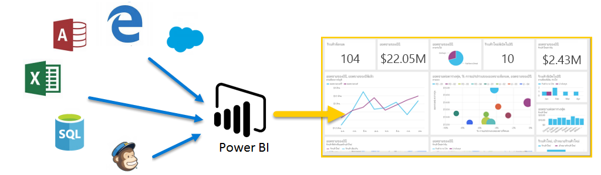
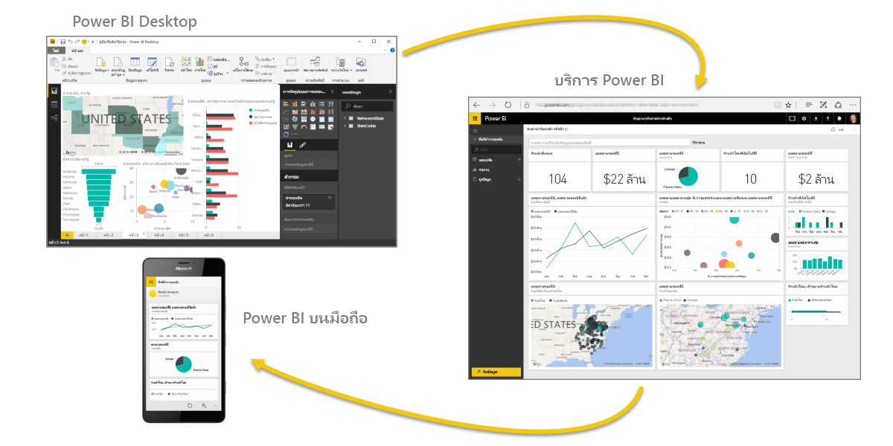

ยินดีต้อนรับสู่**การเรียนรู้พร้อมคำแนะนำ**สำหรับ Power BI หลักสูตรเรียนรู้ด้วยตนเองทางออนไลน์นี้จะอธิบาย Power BI ตามลำดับ ดังนั้น คุณจึงสามารถสร้างความรู้ของคุณได้ตั้งแต่พื้นฐาน

หลักสูตรถูกออกแบบให้มีแนวทางที่รวบรัดและเข้าใจได้ง่าย ด้วยลำดับทางตรรกะที่ช่วยให้คุณเรียนรู้แนวคิด รายละเอียด และตัวอย่าง ซึ่งรวมถึงการแสดงผลด้วยภาพและวิดีโอจำนวนมากที่จะช่วยให้คุณเรียนรู้เช่นกัน

หลักสูตร**การเรียนรู้พร้อมคำแนะนำ**นี้มี**ส่วน**มากมาย และแต่ละส่วนมี**หัวข้อ**อีกหลายหัวข้อ หลังจากหัวข้อช่วงแรกในส่วน**เริ่มต้นใช้งาน**นี้ เกือบทุกหัวข้อจะมีวิดีโอที่อธิบายสิ่งที่คุณจะได้เรียนรู้ เนื้อหาทางด้านล่างวิดีโอจะอธิบายแนวคิด ทำให้คุณสามารถทบทวนและเรียนรู้ตามที่คุณต้องการได้

ถ้าคุณเป็น**ผู้เริ่มต้น**ใน Power BI หลักสูตรนี้จะช่วยให้คุณเริ่มต้นใช้งาน และถ้าคุณเป็น**ผู้มีประสบการณ์**ใน Power BI หลักสูตรนี้จะรวบรวมแนวคิดเข้าด้วยกัน และเติมเต็มสิ่งที่คุณขาด เราหวังว่าคุณจะเพลิดเพลินไปกับหลักสูตรนี้ และคาดหวังจะได้เพิ่มเนื้อหาอื่นๆ อีกในอนาคต

## Power BI คืออะไร
**Power BI** คือคอลเลกชันของบริการซอฟต์แวร์ แอป และตัวเชื่อมต่อที่ทำงานร่วมกันเพื่อเปลี่ยนแหล่งข้อมูลที่ไม่เกี่ยวข้องของคุณให้เป็นข้อมูลเชิงลึกที่สอดคล้องกัน แสดงข้อมูลได้ และโต้ตอบได้ ไม่ว่าข้อมูลของคุณจะเป็นสเปรดชีต Excel ง่ายๆ หรือคอลเลกชันของคลังข้อมูลแบบไฮบริดบนระบบคลาวด์และในองค์กร **Power BI** จะช่วยให้คุณเชื่อมต่อกับแหล่งข้อมูลของคุณ แสดง (หรือค้นพบ) ข้อมูลสำคัญ และแชร์ข้อมูลนั้นกับใครก็ตามหรือทุกคนที่คุณต้องการได้อย่างง่ายดาย

**Power BI** สามารถใช้งานได้ง่ายและสะดวก – สามารถสร้างข้อมูลเชิงลึกด่วนจากสเปรดชีต Excel หรือฐานข้อมูลในเครื่อง แต่ **Power BI** ยังทนทานและเป็นเครื่องมือระดับองค์กร พร้อมสำหรับการวางรูปแบบพิเศษและการวิเคราะห์แบบเรียลไทม์ เช่นเดียวกับการพัฒนาที่กำหนดเอง ดังนั้น จึงสามารถเป็นรายงานส่วนบุคคลและเครื่องมือการจัดรูปแบบการแสดงข้อมูลของคุณ และยังสามารถทำหน้าที่เป็นเครื่องมือวิเคราะห์และตัดสินใจในโครงการกลุ่ม แผนก หรือทั้งองค์กร

## ส่วนต่างๆ ของ Power BI
Power BI มีแอปพลิเคชันบนเดสก์ท็อป Windows ที่เรียกว่า **Power BI Desktop** และบริการ SaaS (*Software as a Service*) ออนไลน์ที่เรียกว่า**บริการ Power BI** และ**แอป** Power BI สำหรับอุปกรณ์เคลื่อนที่ที่พร้อมใช้งานบนโทรศัพท์และแท็บเล็ต Windows และอุปกรณ์ iOS และ Android

สามองค์ประกอบเหล่านี้ – **Desktop** **บริการ** และ **Mobile** – ได้รับการออกแบบให้ช่วยผู้ใช้ในการสร้าง แชร์ และใช้ข้อมูลเชิงลึกทางธุรกิจด้วยวิธีที่พวกเขาหรือบทบาทของพวกเขาต้องการได้อย่างมีประสิทธิภาพสูงสุด

## Power BI เหมาะสมกับบทบาทของคุณอย่างไร
วิธีที่คุณใช้ Power BI อาจขึ้นอยู่กับบทบาทของคุณในโครงการหรือในทีม และผู้อื่น ในบทบาทอื่น อาจใช้ Power BI แตกต่างกันไป ซึ่งเป็นสิ่งที่สามารถทำได้

ตัวอย่างเช่น คุณอาจใช้**บริการ Power BI**  เป็นหลัก แต่เพื่อนร่วมงานที่ทำงานกับตัวเลขและสร้างรายงานทางธุรกิจอาจใช้งาน **Power BI Desktop** (และเผยแพร่รายการเดสก์ท็อปไปยังบริการ Power BI ซึ่งคุณสามารถดูได้) และเพื่อนร่วมงานคนอื่นๆ ในแผนกการขายอาจใช้แอป Power BI บนโทรศัพท์เพื่อตรวจดูความคืบหน้าของโควต้าการขาย และดูรายละเอียดลูกค้าเป้าหมาย

คุณยังอาจใช้แต่ละองค์ประกอบของ **Power BI** ในช่วงเวลาที่ต่างกัน โดยขึ้นอยู่กับสิ่งที่คุณต้องการทำหรือบทบาทของคุณในโครงการหรือการทำงาน

คุณอาจดูสินค้าคงคลังและกระบวนการผลิตในแดชบอร์ดแบบเรียลไทม์ในบริการ และยังใช้ **Power BI Desktop** ในการสร้างรายงานเกี่ยวกับการส่วนมีส่วนร่วมกับลูกค้าสำหรับทีมของคุณเอง วิธีที่คุณใช้ Power BI อาจขึ้นอยู่กับฟีเจอร์หรือบริการของ Power BI ที่เป็นเครื่องมือที่ดีที่สุดสำหรับสถานการณ์ของคุณ แต่ทุกส่วนของ Power BI พร้อมใช้งานสำหรับคุณ ทำให้มีความยืดหยุ่นและน่าสนใจ

เราจะอธิบายทั้งสามองค์ประกอบเหล่านี้ – **Desktop** **บริการ** และแอป **Mobile** – ด้วยรายละเอียดเพิ่มเติมในภายหลังในหลังใน**การเรียนรู้พร้อมคำแนะนำ**นี้ เรายังจะสร้างรายงานใน Power BI Desktop แชร์ในบริการ และเจาะลึกบนอุปกรณ์เคลื่อนที่ของเราในบทความถัดจากนี้ เช่นกัน

## ลำดับการทำงานใน Power BI
ลำดับการทำงานใน Power BI เริ่มต้นใน **Power BI Desktop** ซึ่งเป็นที่สร้างรายงาน รายงานนั้นจะถูกเผยแพร่ไปยัง**บริการ** Power BI และแชร์กับผู้ใช้แอป **Power BI บนมือถือ** ที่สามารถใช้ข้อมูล

ซึ่งอาจไม่ได้เป็นตามลำดับนี้ทุกครั้งซึ่งเกิดขึ้นได้ แต่เราจะใช้ลำดับนั้นในการช่วยให้คุณเรียนรู้ส่วนต่างๆ ของ Power BI และวิธีที่แต่ละส่วนเติมเต็มส่วนอื่นๆ

เอาล่ะ ตอนนี้เราอธิบายภาพรวมของหลักสูตรนี้ หน้าที่ของ Power BI และองค์ประกอบหลักทั้งสาม มาดูที่ลักษณะการใช้งาน **Power BI** กันเถอะ

