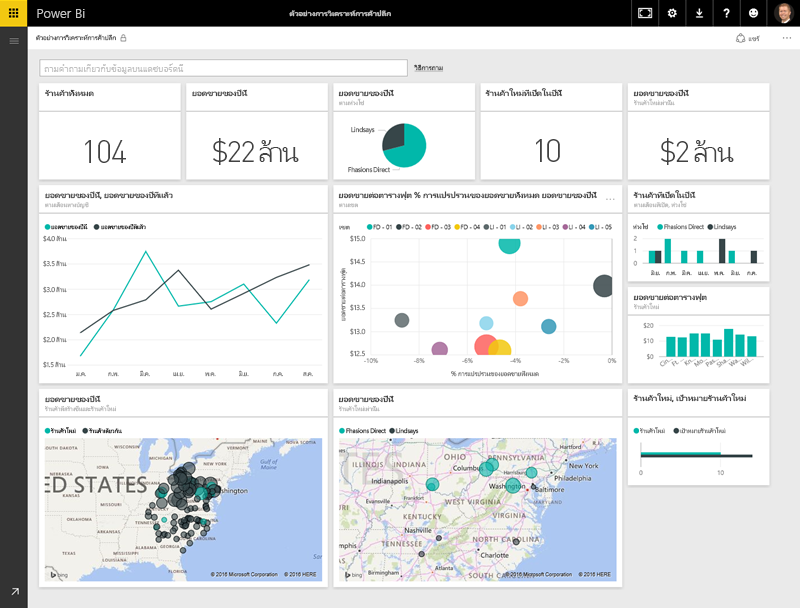
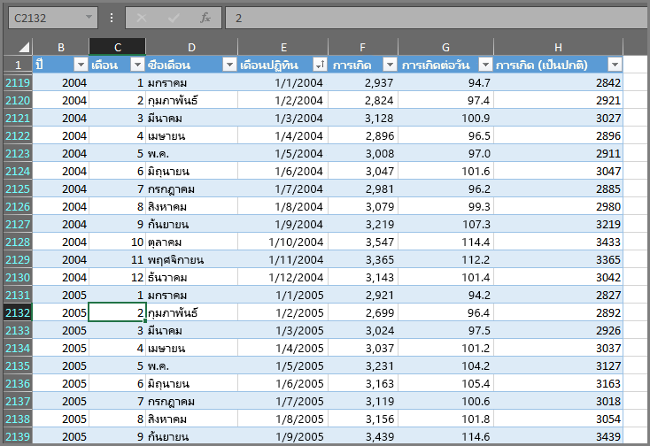
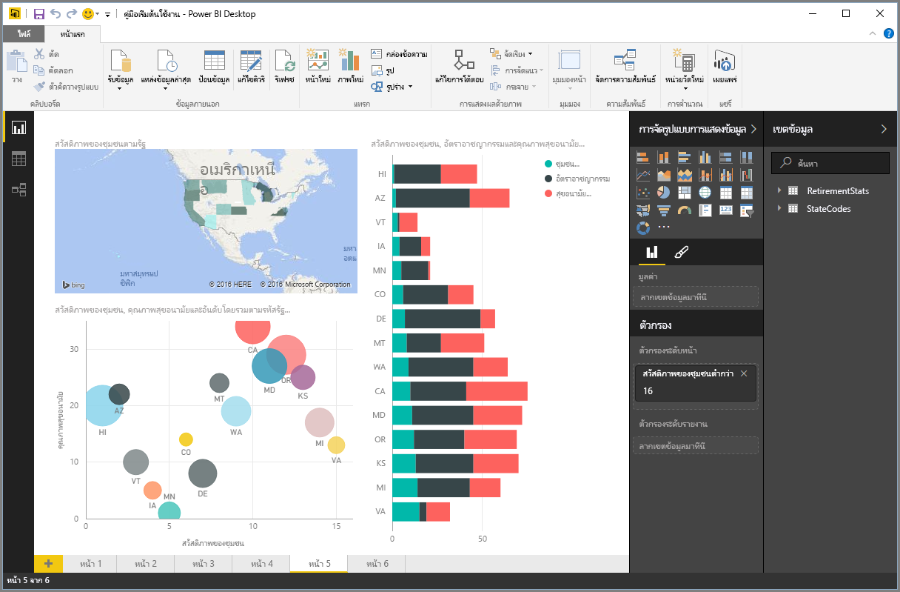
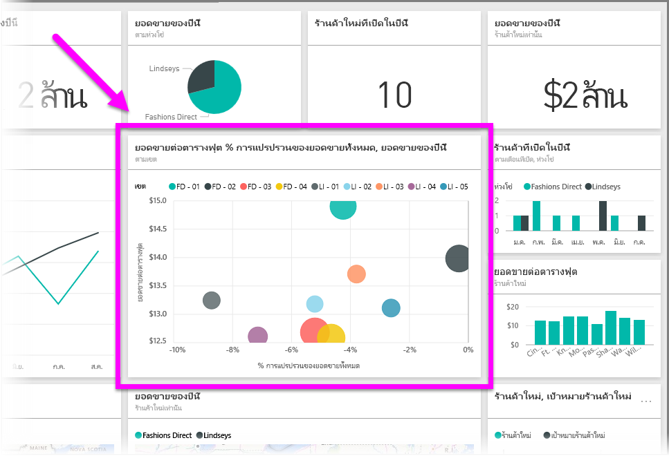

ทุกอย่างที่คุณทำใน Power BI สามารถแบ่งเป็น**โครงสร้าง**พื้นฐานหลายส่วน เมื่อคุณเข้าใจโครงสร้างเหล่านี้ คุณจะสามารถใช้งานแต่ละส่วนได้ดียิ่งขึ้นและเริ่มสร้างรายงานที่ละเอียดและซับซ้อนได้ แม้แต่สิ่งที่ซับซ้อนที่สุดก็ถูกสร้างขึ้นจากโครงสร้างพื้นฐาน เช่นเดียวกับที่อาคารถูกสร้างขึ้นจากไม้ เหล็ก คอนกรีต และกระจก รถยนต์ทำมาจากเหล็ก ผ้า และยาง แน่นอน อาคารและรถยนต์อาจมีรูปแบบพื้นฐานหรือซับซ้อนได้เช่นกัน โดยขึ้นอยู่กับวิธีการจัดโครงสร้างพื้นฐานเหล่านั้น

มาดูที่โครงสร้างพื้นฐานเหล่านี้ เรียนรู้สิ่งง่ายๆ ที่สามารถสร้างขึ้นได้ แล้วดูสิ่งที่ซับซ้อนที่สามารถสร้างขึ้นได้เช่นกัน

โครงสร้างพื้นฐานใน Power BI มีดังต่อไปนี้:

* การจัดรูปแบบการแสดงข้อมูล
* ชุดข้อมูล
* รายงาน
* แดชบอร์ด
* ไทล์

## การจัดรูปแบบการแสดงข้อมูล
**การจัดรูปแบบการแสดงข้อมูล** (ในบางครั้งจะเรียกว่า **การแสดงผลด้วยภาพ**) คือการแสดงแทนข้อมูล เช่น แผนภูมิ กราฟ แผนที่รหัสสี หรือสิ่งที่น่าสนใจอื่นๆ ที่คุณสามารถสร้างขึ้นเพื่อแสดงแทนข้อมูลของคุณ Power BI มีชนิดการจัดรูปแบบการแสดงข้อมูลทุกชนิด และมีชนิดอื่นๆ เพิ่มเข้ามาตลอดเวลา รูปภาพต่อไปนี้แสดงคอลเลกชันของการจัดรูปแบบการแสดงข้อมูลต่างๆ ที่ถูกสร้างขึ้นในบริการ Power BI

การจัดรูปแบบการแสดงข้อมูลอาจไม่ซับซ้อน เช่น ตัวเลขเดียวที่แสดงถึงสิ่งสำคัญ หรืออาจซับซ้อน เช่น แผนที่ไล่ระดับสีที่แสดงทัศนคติต่อปัญหาทางสังคมหรือความกังวล เป้าหมายของการแสดงผลด้วยภาพคือเพื่อแสดงข้อมูลด้วยวิธีที่มีบริบทและข้อมูลเชิงลึก ซึ่งอาจแสดงด้วยตารางข้อมูลตัวเลขหรือข้อความได้ยากลำบาก

## ชุดข้อมูล
**ชุดข้อมูล**คือคอลเลกชันของข้อมูลที่ Power BI ใช้ในการสร้างการจัดรูปแบบการแสดงข้อมูล

คุณสามารถสร้างฐานข้อมูลง่ายๆ โดยยึดตามตารางเดียวจากเวิร์กบุ๊ก Excel คล้ายกับที่แสดงในรูปภาพต่อไปนี้

**ชุดข้อมูล**ยังสามารถเป็นการผสมผสานของแหล่งข้อมูลต่างๆ มากมาย ซึ่งคุณสามารถกรองและผสมเพื่อให้ได้ข้อมูลคอลเลกชันที่ไม่ซ้ำกัน (ชุดข้อมูล) สำหรับใช้ใน Power BI

ตัวอย่างเช่น คุณสามารถสร้างชุดข้อมูลจากสามเขตข้อมูลฐานข้อมูลที่ต่างกัน คือ หนึ่งตารางเว็บไซต์ หนึ่งตาราง Excel และผลลัพธ์ของแคมเปญด้านการตลาดทางอีเมล การผสมผสานที่ไม่ซ้ำกันจะยังคงถือเป็นหนึ่ง**ชุดข้อมูล** แม้ว่าจะมีข้อมูลที่ดึงมารวมกันจากหลายแหล่งข้อมูลก็ตาม

การกรองข้อมูลก่อนที่จะนำเข้าสู่ Power BI จะช่วยให้คุณสามารถเน้นข้อมูลที่สำคัญได้ ตัวอย่างเช่น คุณสามารถกรองฐานข้อมูลที่ติดต่อของคุณเพื่อให้มีเฉพาะลูกค้าที่รับอีเมลจากแคมเปญด้านการตลาดอยู่ในฐานข้อมูล จากนั้น คุณสามารถสร้างการแสดงผลด้วยภาพโดยยึดตามชุดย่อย (คอลเลกชันที่กรองแล้ว) ของลูกค้าที่เข้าร่วมแคมเปญ การกรองจะช่วยให้คุณเน้นข้อมูลของคุณ และการทำงานของคุณ

ส่วนสำคัญและเปิดใช้งานอยู่ของ Power BI คือ**ตัวเชื่อมต่อ**ข้อมูลที่หลากหลายที่รวมอยู่ ไม่ว่าข้อมูลที่คุณต้องการจะอยู่ใน Excel หรือฐานข้อมูล SQL ใน Azure หรือ Oracle หรือในบริการอย่าง Facebook, Salesforce หรือ MailChimp Power BI ก็มีตัวเชื่อมต่อข้อมูลที่มีอยู่ภายในที่จะช่วยให้คุณสามารถเชื่อมต่อกับข้อมูลนั้น กรองหากจำเป็น และนำเข้าสู่ชุดข้อมูลของคุณได้อย่างง่ายดาย

เมื่อคุณมีชุดข้อมูลแล้ว คุณสามารถเริ่มสร้างการจัดรูปแบบการแสดงข้อมูลที่แสดงส่วนต่างๆ ของชุดข้อมูลนั้นด้วยวิธีต่างๆ แล้วดูข้อมูลเชิงลึกจากสิ่งที่คุณเห็น ซึ่งเป็นส่วนที่รายงานเข้ามามีบทบาท

## รายงาน
ใน Power BI **รายงาน**คือคอลเลกชันของการจัดรูปแบบการแสดงข้อมูลที่ปรากฏขึ้นร่วมกันบนหนึ่งหน้าหรือมากกว่า คล้ายกับรายการอื่นๆ คุณอาจสร้างสำหรับงานนำเสนอยอดขาย หรือรายงานที่คุณเขียนสำหรับงานที่ได้รับมอบหมายจากโรงเรียน ใน Power BI **รายงาน**คือคอลเลกชันของรายการที่เกี่ยวข้องกัน รูปภาพต่อไปนี้แสดง**รายงาน**ใน Power BI Desktop ในกรณีนี้ คือหน้าที่ห้าในรายงานหกหน้า คุณยังสามารถสร้างรายงานในบริการ Power BI ได้อีกด้วย

รายงานจะช่วยให้คุณสามารถสร้างการจัดรูปแบบการแสดงข้อมูลได้มากมายในหลายหน้าถ้าจำเป็น และช่วยให้คุณสามารถจัดเรียงด้วยวิธีที่ถ่ายทอดเรื่องราวของคุณได้ดีที่สุด

คุณอาจมีรายงานเกี่ยวกับยอดขายรายไตรมาส รายงานเกี่ยวกับการเติบโตของผลิตภัณฑ์ในเฉพาะส่วน หรือคุณอาจสร้างรายงานเกี่ยวกับรูปแบบการย้ายถิ่นของหมีโพลา ไม่ว่าเรื่องราวของคุณจะเกี่ยวกับอะไร รายงานก็สามารถช่วยให้คุณรวบรวมและจัดระเบียบการจัดรูปแบบการแสดงข้อมูลได้บนหนึ่งหน้า (หรือมากกว่า)

## แดชบอร์ด
เมื่อคุณพร้อมที่จะแชร์หน้าหนึ่งจากรายงาน หรือแชร์คอลเลกชันของการจัดรูปแบบการแสดงข้อมูล คุณสามารถสร้าง**แดชบอร์ด** คล้ายกับแดชบอร์ดในรถยนต์ **แดชบอร์ด** Power BI คือคอลเลกชันของการแสดงผลด้วยภาพจากหนึ่งหน้าที่คุณสามารถแชร์กับผู้อื่น บ่อยครั้ง ที่จะเป็นกลุ่มการแสดงผลด้วยภาพที่เลือกที่ให้ข้อมูลเชิงลึกด่วนที่เป็นข้อมูลหรือเรื่องราวที่คุณพยายามนำเสนอ

แดชบอร์ดต้องมีขนาดพอดีกับหนึ่งหน้า ซึ่งมักจะเรียกว่าพื้นที่วาดรูป (พื้นที่วาดรูปคือพื้นหลังที่ว่างเปล่าใน Power BI Desktop หรือบริการ ที่คุณวางการจัดรูปแบบการแสดงข้อมูล) ลองนึกว่าคล้ายกับพื้นที่วาดรูปที่ศิลปินหรือจิตรกรใช้ พื้นที่ทำงานที่คุณสร้าง ผสม และปรับปรุงจุดที่น่าสนใจ และการแสดงผลด้วยภาพที่ดึงดูดความสนใจ
คุณสามารถแชร์แดชบอร์ดกับผู้อื่นหรือกลุ่ม ซึ่งจะสามารถโต้ตอบกับแดชบอร์ดของคุณเมื่อพวกเขาใช้บริการ Powre BI หรือบนอุปกรณ์เคลื่อนที่ของพวกเขา

## ไทล์
ใน Power BI **ไทล์**คือการจัดรูปแบบการแสดงผลด้วยภาพที่พบในรายงานหรือบนแดชบอร์ด ซึ่งเป็นกล่องสี่เหลี่ยมผืนผ้าที่มีการแสดงผลด้วยภาพแต่ละรายการ ในรูปภาพต่อไปนี้ คุณจะเห็นหนึ่งไทล์ (เน้นด้วยกล่องสว่าง) ที่ถูกล้อมรอบด้วยไทล์อื่นๆ

เมื่อคุณ*กำลังสร้าง*รายงานหรือแดชบอร์ดใน Power BI คุณสามารถย้ายหรือจัดเรียงไทล์ได้ตามที่คุณต้องการนำเสนอข้อมูลของคุณ คุณสามารถทำให้ไทล์ใหญ่ขึ้น เปลี่ยนความสูงหรือความกว้าง และจัดชิดกับไทล์อื่นๆ ตามที่คุณต้องการ

เมื่อคุณ*กำลังดู*หรือ*กำลังใช้*แดชบอร์ดหรือรายงาน ซึ่งหมายความว่าคุณไม่ใช่ผู้สร้างหรือเจ้าของ แต่ถูกแชร์กับคุณ คุณสามารถโต้ตอบได้แต่ไม่สามารถเปลี่ยนแปลงขนาดของไทล์หรือเปลี่ยนการจัดเรียงได้

## เมื่อรวมกันแล้ว
สิ่งเหล่านั้นคือพื้นฐานของ Power BI และเป็นโครงสร้าง มาใช้เวลาสักครู่เพื่อทบทวน

Power BI คือคอลเลกชันของบริการ แอป และตัวเชื่อมต่อที่ทำให้คุณสามารถเชื่อมต่อข้อมูลของคุณ – ไม่ว่าจะอยู่ที่ไหนก็ตาม – กรองข้อมูลหากจำเป็น แล้วนำเข้าสู่ Power BI ซึ่งคุณสามารถสร้างการจัดรูปแบบการแสดงข้อมูลที่น่าสนใจที่คุณสามารถแชร์กับผู้อื่นได้  

ในตอนนี้ คุณเข้าใจประโยชน์ของโครงสร้างของ Power BI แล้ว คุณสามารถสร้างชุดข้อมูลที่*คุณ*สามารถเข้าใจได้ และสร้างรายงานที่ดึงดูดความสนใจที่บอกเล่าเรื่องราวของคุณ เรื่องราวที่บอกเล่าด้วย Power BI ไม่จำเป็นต้องซับซ้อน หรือยุ่งยาก เพื่อให้ดึงดูดความสนใจ

สำหรับผู้ใช้บางราย การใช้ตาราง Excel เดียวในชุดข้อมูล แล้วแชร์แดชบอร์ดกับทีมของพวกเขา เป็นวิธีสะดวกอย่างไม่น่าเชื่อในการใช้ Power BI

สำหรับผู้อื่น การใช้ตารางคลังข้อมูล Azure SQL แบบเรียลไทม์ที่ผสมกับฐานข้อมูลอื่นๆ และแหล่งข้อมูลแบบเรียลไทม์ ที่กรองแบบเรียลไทม์เพื่อสร้างชุดข้อมูลที่ตรวจดูกระบวนการผลิตตลอดเวลาคือคุณค่าใน Power BI ที่พวกเขาค้นหา

สำหรับผู้ใช้ทั้งสองแบบ กระบวนการจะเหมือนกัน: สร้างชุดข้อมูล สร้างการแสดงผลด้วยภาพที่ดึงดูดความสนใจ และแชร์กับผู้อื่น และในทางที่คล้ายกัน ผลลัพธ์ของผู้ใช้ทั้งสองแบบ (สำหรับแต่ละแบบ) จะเหมือนกัน: ควบคุมโลกของข้อมูลที่ขยายตัวตลอดเวลาของคุณ และเปลี่ยนเป็นข้อมูลเชิงลึกที่สามารถดำเนินการได้

ไม่ว่าข้อมูลเชิงลึกของคุณจะใช้ชุดข้อมูลแบบตรงไปตรงมาหรือแบบซับซ้อน Power BI ก็สามารถช่วยให้คุณเริ่มต้นใช้งานได้อย่างรวดเร็ว และสามารถปรับเปลี่ยนได้ตามความต้องการของคุณตามความซับซ้อนที่โลกของข้อมูลของคุณต้องใช้ และเนื่องจาก Power BI เป็นผลิตภัณฑ์ของ Microsoft คุณสามารถคาดหวังในด้านความทนทาน การประยุกต์ใช้ ใช้งานร่วมกับ Office และพร้อมสำหรับองค์กร

ในตอนนี้ มาดูวิธีการทำงานกันเถอะ เราจะเริ่มด้วยการดูที่บริการ Power BI

