ในหัวข้อนี้ เราจะมาดูรายละเอียดของการทำงานร่วมกันของสองส่วนแรกของ Power BI

* สร้างรายงานใน **Power BI Desktop**
* เผยแพร่รายงานใน**บริการของ Power BI**

เราจะเริ่มต้นใน Power BI Desktop แล้วเลือก **รับข้อมูล** คอลเลกชันของแหล่งข้อมูลจะปรากฏขึ้น ทำให้คุณเลือกแหล่งข้อมูลได้ รูปภาพต่อไปนี้แสดงการเลือกหน้าเว็บเป็นแหล่งข้อมูล ในวิดีโอทางด้านบน Will จะเลือกเวิร์กบุ๊ก **Excel**

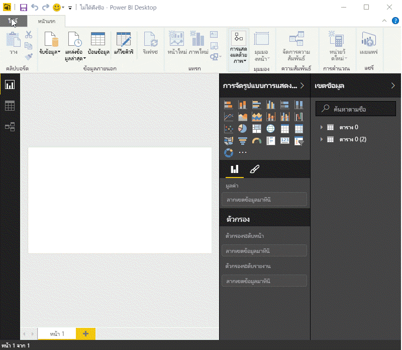

ไม่ว่าคุณจะเลือกแหล่งข้อมูลใด Power BI จะเชื่อมต่อกับแหล่งข้อมูลนั้นและแสดงข้อมูลที่พร้อมใช้งานจากแหล่งข้อมูลดังกล่าว รูปภาพต่อไปนี้เป็นอีกตัวอย่างหนึ่ง แหล่งข้อมูลนี้มาจากหน้าเว็บที่วิเคราะห์รัฐต่างๆ และสถิติการเกษียณที่น่าสนใจบางอย่าง

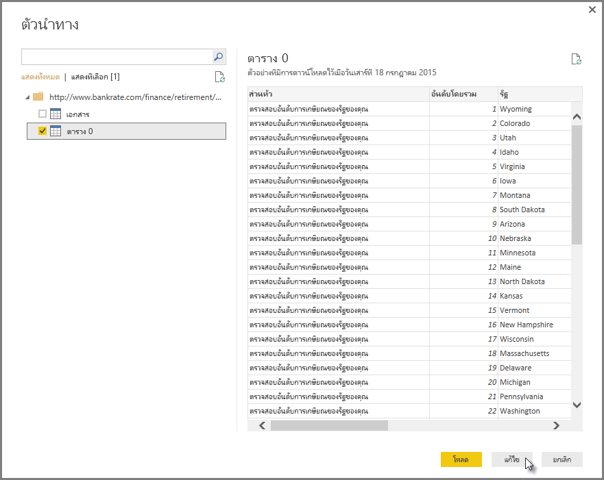

ในมุมมอง **รายงาน** ของ Power BI Desktop คุณสามารถเริ่มสร้างรายงานได้

มุมมอง **รายงาน** มีพื้นที่หลักห้าพื้นที่:

1. Ribbon ที่แสดงงานทั่วไปที่เชื่อมโยงกับรายงานและการแสดงภาพ
2. มุมมอง **รายงาน** หรือพื้นที่รายงาน คือพื้นที่สำหรับสร้างและจัดเรียงการแสดงภาพ
3. พื้นที่แท็บ **หน้า** ตลอดแนวด้านล่างมีไว้เพื่อให้คุณเลือกหรือเพิ่มหน้ารายงาน
4. ช่อง **การแสดงภาพ** คือที่ที่คุณสามารถเปลี่ยนการแสดงภาพ กำหนดค่าสีหรือแกน นำตัวกรองไปใช้ ลากเขตข้อมูล และอื่น ๆ ได้
5. ช่อง **เขตข้อมูล** คือที่ที่สามารถลากองค์ประกอบคิวรี่และตัวกรองไปยังมุมมอง **รายงาน** หรือลากไปยังพื้นที่ **ตัวกรอง** ของช่อง **การแสดงภาพ** ได้

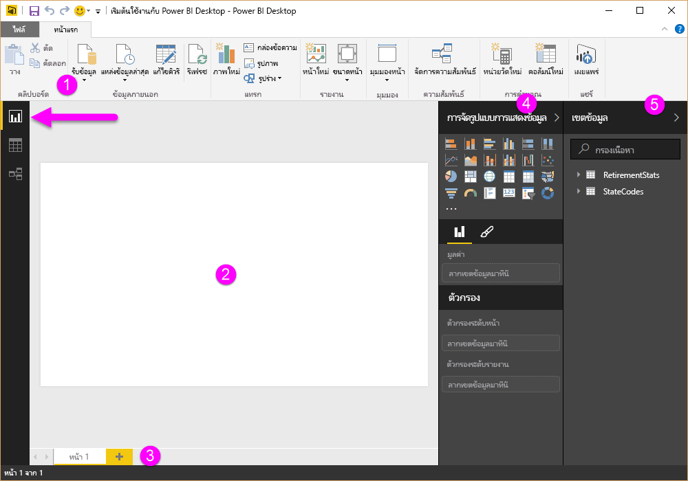

สามารถย่อช่อง **การแสดงภาพ** และ **เขตข้อมูล** ได้โดยการเลือกลูกศรขนาดเล็กที่ขอบ เพื่อให้มีพื้นที่มากขึ้นในมุมมอง **รายงาน** เพื่อสร้างการแสดงภาพที่ยอดเยี่ยม เมื่อปรับเปลี่ยนการแสดงภาพ คุณจะยังเห็นลูกศรเหล่านี้ชี้ขึ้นหรือลง ซึ่งหมายความว่าคุณสามารถขยายหรือย่อส่วนนั้นได้

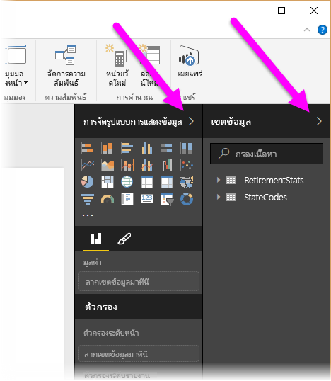

เมื่อต้องการสร้างการจัดรูปแบบการแสดงข้อมูล ให้ลากเขตข้อมูลจากรายการ **เขตข้อมูล** ไปยังมุมมอง **รายงาน** ในกรณีนี้ เราจะลากเขตข้อมูล รัฐ จาก *RetirementStats* แล้วดูว่าจะเกิดอะไรขึ้น

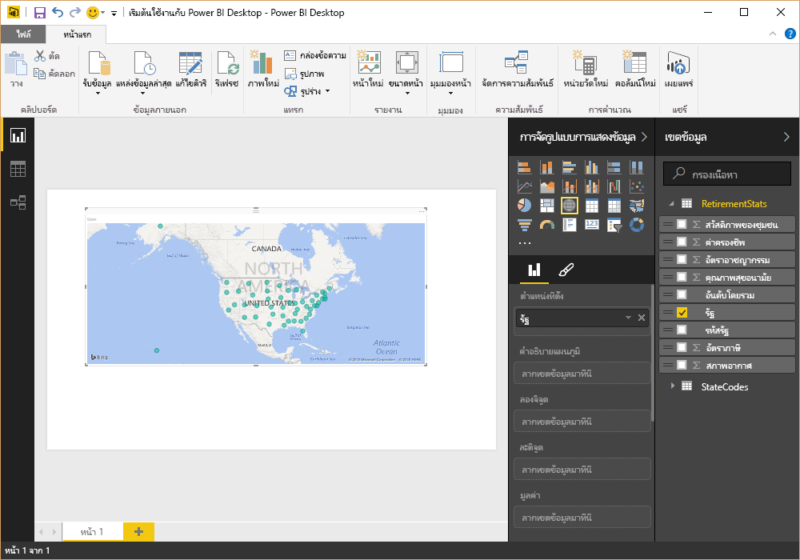

ดูนั่นสิ... Power BI Desktop สร้างการจัดรูปแบบการแสดงข้อมูลที่ยึดตามแผนที่ขึ้นโดยอัตโนมัติ เนื่องจากระบุได้ว่าเขตข้อมูล รัฐ นั้นเป็นข้อมูลทางภูมิศาสตร์

ในตอนนี้ เราจะเร่งความเร็วเล็กน้อย และหลังจากที่สร้างรายงานด้วยการจัดรูปแบบการแสดงข้อมูลแล้ว เราก็พร้อมที่จะเผยแพร่ไปยังบริการของ Power BI บน Ribbon **หน้าแรก** ใน Power BI Desktop ให้เลือก **เผยแพร่**

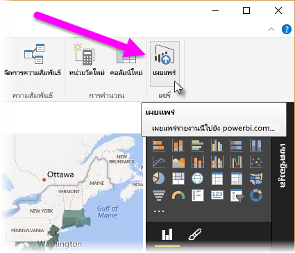

คุณจะได้รับพร้อมท์ให้ลงชื่อเข้าใช้ Power BI

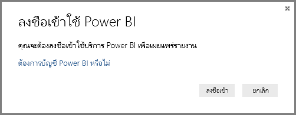

เมื่อคุณลงชื่อเข้าใช้และเผยแพร่เรียบร้อยแล้ว คุณจะเห็นกล่องโต้ตอบต่อไปนี้ คุณสามารถเลือกลิงก์ (ทางด้านล่างของ**สำเร็จแล้ว!**) เพื่อไปยังบริการของ Power BI ที่คุณสามารถดูรายงานที่คุณเผยแพร่ได้

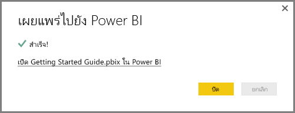

เมื่อคุณลงชื่อเข้าใช้ Power BI คุณจะเห็นไฟล์ Power BI Desktop ที่คุณเพิ่งเผยแพร่ในบริการ ในรูปภาพทางด้านล่าง รายงานที่สร้างขึ้นใน Power BI Desktop จะแสดงในส่วน **รายงาน**

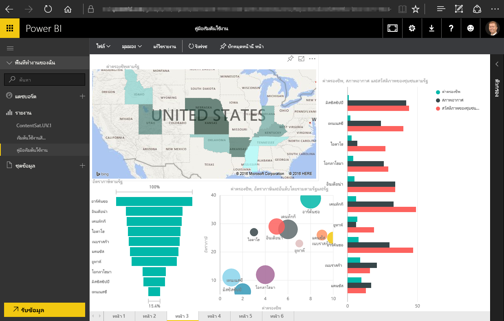

ในรายงานนั้น ผมสามารถเลือกไอคอน **ปักหมุด** เพื่อปักหมุดการแสดงผลด้วยภาพนั้นในแดชบอร์ดได้ รูปภาพต่อไปนี้แสดงไอคอนปักหมุดที่มีการไฮไลต์ไว้ด้วยกล่องสว่างและลูกศร

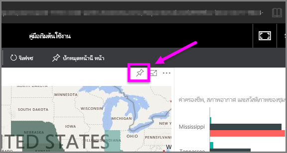

เมื่อผมเลือกแล้ว กล่องโต้ตอบต่อไปนี้จะปรากฏขึ้น ทำให้ผมสามารถปักหมุดการแสดงผลด้วยภาพในแดชบอร์ดที่มีอยู่แล้วได้ หรือสร้างแดชบอร์ดใหม่

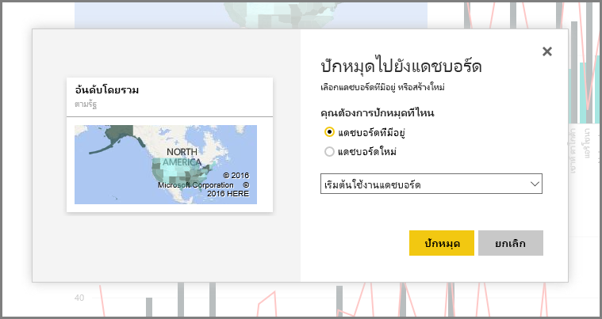

เมื่อเราปักหมุดการแสดงผลด้วยภาพบางส่วนจากรายงานของเราแล้ว เราจะสามารถดูได้ในแดชบอร์ด

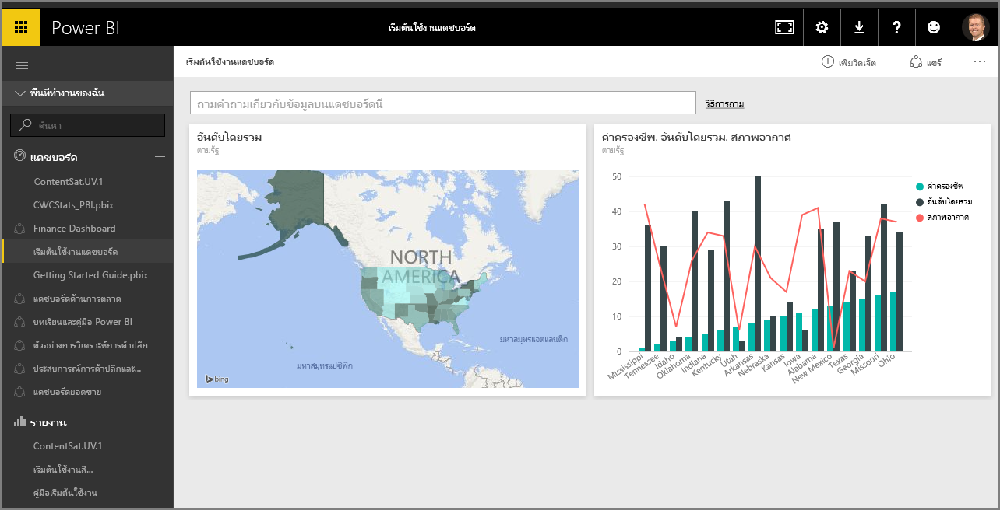

แน่นอนว่ายังมีอีกหลายอย่างที่คุณสามารถทำได้ด้วย Power BI เช่น การแชร์แดชบอร์ดที่คุณสร้างขึ้น เราจะอธิบายการแชร์ในภายหลังในหลักสูตรนี้

ถัดจากนี้ เราจะแนะนำฟีเจอร์ที่สามารถสร้างแดชบอร์ดให้คุณได้โดยอัตโนมัติ เพียงเชื่อมต่อกับบริการระบบคลาวด์ เช่น Facebook, Salesforce และอื่นๆ อีกมากมาย

