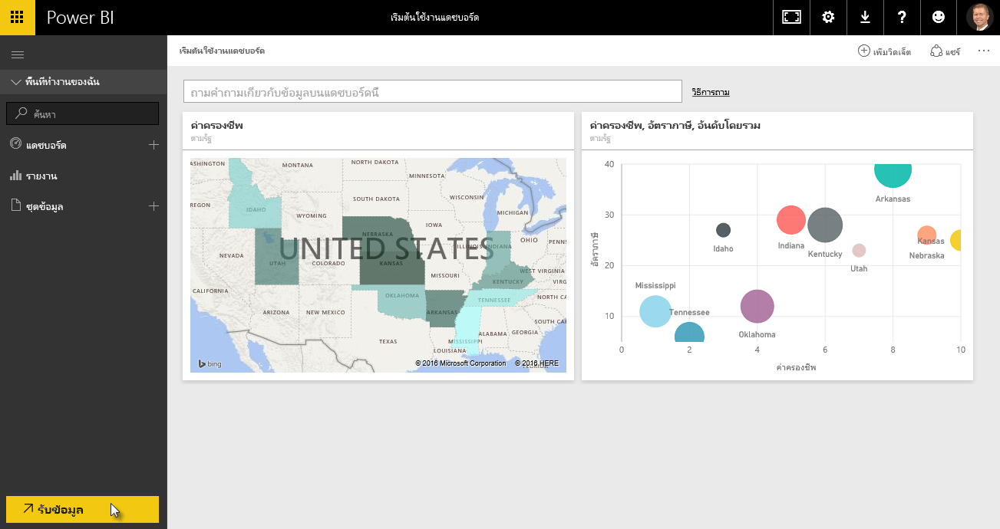
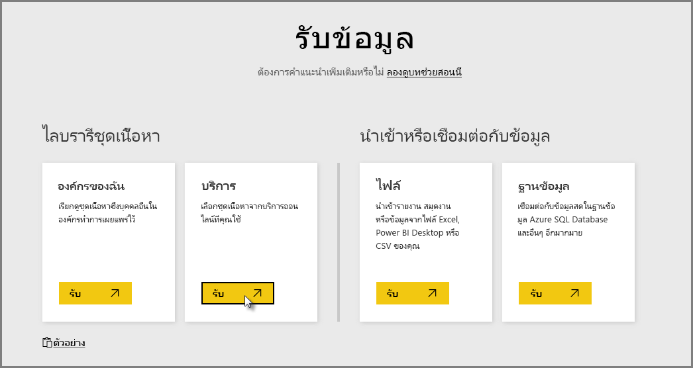
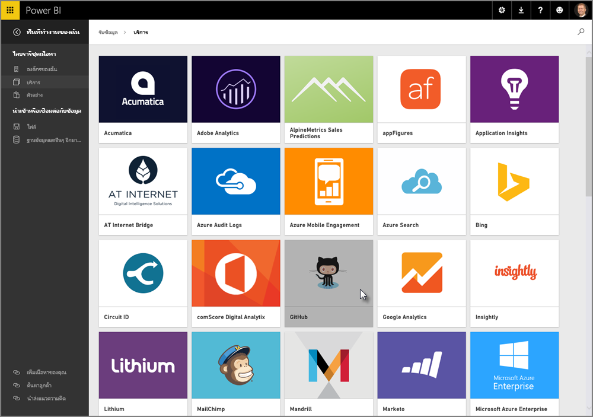
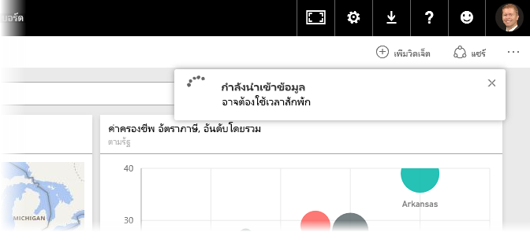
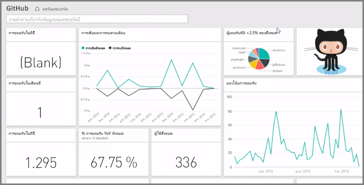
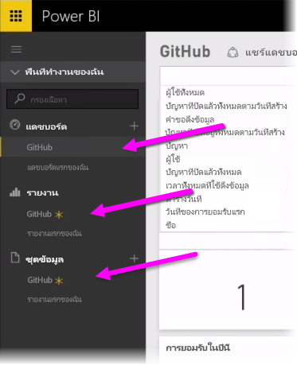
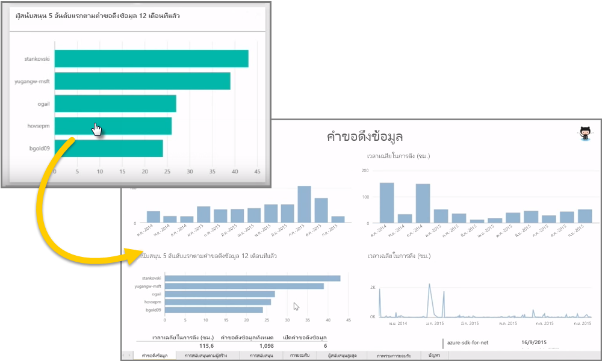
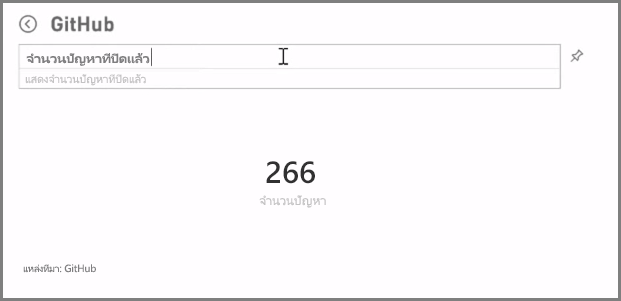
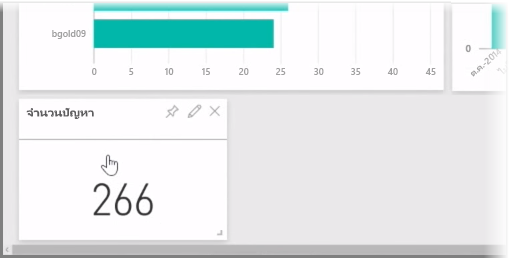
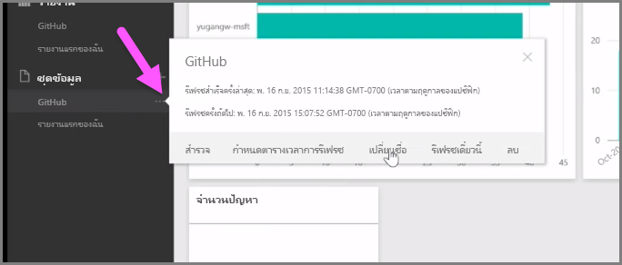

เท่าที่เราได้เรียนรู้มา ลำดับทั่วไปของการทำงานใน Power BI คือสร้างรายงานใน Power BI Desktop เผยแพร่ไปยังบริการของ Power BI แล้วแชร์กับผู้อื่นเพื่อให้พวกเขาสามารถดูได้ในบริการหรือบนแอปสำหรับอุปกรณ์เคลื่อนที่

ผู้ใช้บางรายอาจเริ่มต้นในบริการของ Power BI ดังนั้น เราจะแนะนำข้อมูลคร่าวๆ ของบริการ และเรียนรู้เกี่ยวกับวิธีง่ายๆ ที่เป็นที่นิยมในการสร้างการแสดงผลด้วยภาพอย่างรวดเร็วใน Power BI: *ชุดเนื้อหา*

**ชุดเนื้อหา**คือคอลเลกชันของการแสดงผลด้วยภาพและรายงานที่กำหนดค่าไว้ล่วงหน้าและพร้อมใช้งานตามแหล่งข้อมูลเฉพาะ เช่น Salesforce การใช้ชุดเนื้อหาคล้ายกับการไมโครเวฟอาหารค่ำหน้าทีวีหรือการสั่งมื้ออาหารจานด่วน: ด้วยการคลิกเพียงไม่กี่ครั้งและข้อคิดเห็น คุณจะได้รับคอลเลกชันของข้อมูลที่ออกแบบให้เข้ากันอย่างรวดเร็ว ในรูปแบบของชุดข้อมูลที่ดูเรียบร้อยและพร้อมสำหรับนำไปใช้งาน

ดังนั้น มาดูข้อมูลคร่าวๆ เกี่ยวกับชุดเนื้อหา บริการ และวิธีการทำงานกันเถอะ เราจะเจาะลึกรายละเอียดเกี่ยวกับชุดเนื้อหา (และบริการ) ในส่วนถัดจากนี้ คิดว่าเป็นการทดลองชิมอาหารของคุณ

## สร้างแดชบอร์ดที่ไม่ซ้ำใครด้วยบริการระบบคลาวด์
เมื่อใช้ Power BI การเชื่อมต่อกับข้อมูลก็เป็นเรื่องง่าย จากบริการของ Power BI คุณสามารถเลือกปุ่ม **รับข้อมูล** ที่มุมซ้ายล่างของหน้าจอหลักได้

*พื้นที่วาดรูป* (พื้นที่ตรงกลางของบริการของ Power BI) จะแสดงแหล่งข้อมูลที่พร้อมใช้งานในบริการของ Power BI นอกจากแหล่งข้อมูลทั่วไป เช่น ไฟล์ Excel, ฐานข้อมูล หรือข้อมูล Azure แล้ว Power BI สามารถเชื่อมต่อกับ**บริการซอฟต์แวร์** (หรือที่เรียกว่าผู้ให้บริการ SaaS หรือบริการระบบคลาวด์) เช่น Salesforce, Facebook, Google Analytics และประเภทอื่นทั้งหมดของบริการ SaaS ได้อย่างง่ายดายอีกด้วย

จากบริการซอฟต์แวร์เหล่านี้ **บริการของ Power BI** มีคอลเลกชันของการแสดงผลด้วยภาพที่พร้อมใช้งานและจัดเรียงไว้ล่วงหน้าในแดชบอร์ดและรายงาน ซึ่งเรียกว่า **ชุดเนื้อหา** ชุดเนื้อหาจะช่วยให้คุณเริ่มต้นและทำงานใน Power BI ได้อย่างรวดเร็วด้วยข้อมูลจากบริการที่คุณเลือก ตัวอย่างเช่น เมื่อคุณใช้ชุดเนื้อหา Salesforce, Power BI จะเชื่อมต่อกับบัญชี Salesforce ของคุณ (เมื่อคุณใส่ข้อมูลประจำตัวของคุณ) แล้วใส่คอลเลกชันของการแสดงผลและแดชบอร์ดใน Power BI

Power BI มีชุดเนื้อหาสำหรับบริการทุกประเภท รูปภาพต่อไปนี้แสดงหน้าจอแรกของบริการ ตามลำดับตัวอักษร ที่แสดงขึ้นเมื่อคุณเลือก **รับ** จากกล่อง **บริการ** (แสดงในรูปภาพก่อนหน้านี้) ตามที่คุณเห็นจากรูปภาพทางด้านล่าง ยังมีสิ่งที่คุณเลือกได้อีกมากมาย

เพื่อวัตถุประสงค์ของเรา เราจะเลือก **GitHub** GitHub คือแอปพลิเคชันสำหรับตัวควบคุมแหล่งข้อมูลออนไลน์ เมื่อผมใส่ข้อมูลและข้อมูลประจำตัวสำหรับชุดเนื้อหา GitHub แล้ว ก็จะเริ่มนำเข้าข้อมูลของผม

เมื่อโหลดข้อมูลเรียบร้อยแล้ว แดชบอร์ดของชุดเนื้อหา GitHub ที่กำหนดไว้ล่วงหน้าจะปรากฏขึ้น

นอกเหนือจาก**แดชบอร์ด** แล้ว **รายงาน** ที่ถูกสร้างขึ้น (เป็นส่วนหนึ่งของชุดเนื้อหา GitHub) สำหรับสร้างแดชบอร์ดจะพร้อมใช้งานเช่นกัน ตาม**ชุดข้อมูล** (คอลเลกชันของข้อมูลที่ดึงจาก GitHub) ที่สร้างขึ้นระหว่างการนำเข้าข้อมูล และใช้ในการสร้างรายงาน GitHub

บนแดชบอร์ด คุณสามารถคลิกการแสดงผลด้วยภาพใดก็ได้ แล้วไปที่หน้า**รายงาน** ที่สร้างการแสดงผลด้วยภาพโดยอัตโนมัติ ดังนั้น เมื่อคลิกการแสดงผลด้วยภาพ **5 ผู้ใช้สูงสุดตามการดึงคำขอ** Power BI จะเปิดหน้า **ดึงคำขอ** ในรายงาน (หน้า รายงาน ที่สร้างการแสดงผลด้วยภาพ)

## การถามคำถามเกี่ยวกับข้อมูลของคุณ
คุณยังสามารถถามคำถามเกี่ยวกับข้อมูลของคุณได้ และบริการของ Power BI จะสร้างการแสดงผลด้วยภาพตามคำถามของคุณ แบบเรียลไทม์ ในรูปภาพต่อไปนี้ คุณจะเห็นว่า Power BI สร้างการแสดงผลด้วยภาพจำนวนหนึ่งที่แสดง จำนวนปัญหาที่แก้ไขแล้ว ตามสิ่งที่พิมพ์ในแถบ **คิวรีภาษาธรรมชาติ**

เมื่อคุณมีการแสดงผลด้วยภาพที่คุณพอใจแล้ว คุณสามารถเลือกไอคอน **ปักหมุด** ทางด้านขวาของแถบ คิวรีภาษาธรรมชาติ เพื่อปักหมุดการแสดงผลด้วยภาพนั้นในแดชบอร์ด ในกรณีนี้ การแสดงผลด้วยภาพจะถูกปัดหมุดในแดชบอร์ด GitHub เนื่องจากแดชบอร์ดนั้นได้ถูกเลือกไว้

## การรีเฟรชข้อมูลในบริการของ Power BI
คุณยังสามารถเลือก**รีเฟรช**ชุดข้อมูลสำหรับชุดเนื้อหา หรือข้อมูลอื่นๆ ที่คุณใช้ใน Power BI เมื่อต้องการตั้งค่าการรีเฟรช ให้เลือกจุดไข่ปลา (สามจุด) ที่อยู่ถัดจากชุดข้อมูล แล้วเมนูจะปรากฏขึ้น

เลือกตัวเลือก **จัดกำหนดการรีเฟรช** จากทางด้านล่างของเมนูนั้น กล่องโต้ตอบ ตั้งค่า จะปรากฏขึ้นบนพื้นที่ทำงาน เพื่อให้คุณสามารถตั้งค่าการรีเฟรชที่ตรงกับความต้องการของคุณได้

ซึ่งทั้งหมดนี้เพียงพอสำหรับข้อมูลคร่าวๆ เกี่ยวกับบริการของ Power BI ของเราแล้ว ยังมีสิ่งต่างๆ อีกมากมายที่คุณสามารถทำได้ด้วยบริการ ซึ่งเราจะอธิบายเพิ่มเติมในภายหลังในหลักสูตรนี้ โปรดจำไว้ว่ายังมีข้อมูลอีกหลายชนิดที่คุณสามารถเชื่อมต่อด้วย และชุดเนื้อหาทุกประเภทที่มีมาเพิ่มตลอดเวลา

เอาล่ะ เราจะไปต่อที่หัวข้อถัดไป ที่เราจะสรุปส่วน **เริ่มต้นใช้งาน** นี้ แล้วเตรียมพร้อมสำหรับส่วนถัดไป

