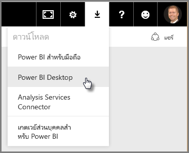

ยินดีต้อนรับสู่ส่วนที่สองในหลักสูตร **การเรียนรู้พร้อมคำแนะนำ** สำหรับ Power BI นี้ ซึ่งมีชื่อว่า **การรับข้อมูล** ส่วนนี้จะอธิบายฟีเจอร์และเครื่องมือจำนวนมากที่ทำงานกับข้อมูลของ Power BI โดยจะเน้นไปที่ Power BI Desktop บางส่วนของเครื่องมือเหล่านี้ยังถูกนำไปใช้กับบริการของ Power BI ดังนั้น คุณจึงได้เรียนรู้หน้าที่สองอย่างด้วยการเรียนรู้ในส่วนนี้

ในบางครั้ง เมื่อคุณรับข้อมูล ข้อมูลที่คุณได้รับอาจไม่ได้มีสภาพดี หรือ*สะอาด*ตามที่คุณต้องการ ดังนั้น ในส่วนนี้ คุณจะได้เรียนรู้วิธีการรับข้อมูล วิธีการทำความสะอาด (บางครั้งเรียกว่า*การทำความสะอาด*หรือ*การแปลง*ข้อมูล) และยังจะได้เรียนรู้เคล็ดลับขั้นสูงบางอย่างที่สามารถทำให้นำข้อมูลมาใช้งานจริงได้ง่ายยิ่งขึ้น

เช่นเดียวกับส่วนอื่นๆ ในหลักสูตรนี้ การเรียนรู้ของคุณจะตามเส้นทางเดียวกับลำดับการทำงานใน Power BI ดังนั้น มาดูที่ **Power BI Desktop** ที่มักจะเป็นจุดเริ่มต้น

## ภาพรวมของ Power BI Desktop
Power BI Desktop คือเครื่องมือในการเชื่อมต่อ ทำความสะอาด และแสดงข้อมูลของคุณ เมื่อใช้ Power BI Desktop คุณจะสามารถเชื่อมต่อกับข้อมูล แล้วจำลองและแสดงข้อมูลด้วยวิธีต่างๆ ได้ ผู้ใช้ส่วนใหญ่ที่ทำงานกับโครงการ Business Intelligence จะใช้เวลาส่วนใหญ่ไปกับการใช้ Power BI Desktop

คุณสามารถดาวน์โหลด Power BI Desktop ได้ [จากเว็บ](http://go.microsoft.com/fwlink/?LinkID=521662) คุณยังสามารถติดตั้ง **Power BI Desktop** เป็นแอปจาก [**Windows Store**](http://aka.ms/pbidesktopstore) หรือคุณสามารถดาวน์โหลดได้จากบริการของ Power BI ในบริการ เมื่อต้องการรับ **Power BI Desktop** ให้คุณเลือกปุ่มลูกศรชี้ลงที่ด้านขวาบนของ Power BI แล้วเลือก Power BI Desktop

Power BI Desktop จะถูกติดตั้งเป็นแอปพลิเคชันบนคอมพิวเตอร์ Windows ของคุณ

ดังนั้น เมื่อคุณดาวน์โหลดแล้ว คุณจะสามารถติดตั้ง Power BI Desktop และเรียกใช้ได้เหมือนกับแอปพลิเคชันอื่นๆ บน Windows รูปภาพต่อไปนี้แสดง หน้าจอเริ่มต้น ของ Power BI Desktop ที่จะปรากฏขึ้นเมื่อคุณเริ่มต้นแอปพลิเคชัน

Power BI Desktop เชื่อมต่อกับแหล่งข้อมูลหลายประเภท ตั้งแต่ฐานข้อมูลภายในองค์กรไปจนถึงเวิร์กชีต Excel และบริการบนระบบคลาวด์ ซึ่งจะช่วยให้คุณสามารถทำความสะอาดและจัดรูปแบบข้อมูลของคุณเพื่อให้ใช้งานได้ง่ายขึ้น รวมถึงการแบ่งและการเปลี่ยนชื่อคอลัมน์ การเปลี่ยนชนิดข้อมูล และการทำงานกับวันที่ คุณยังสามารถสร้างความสัมพันธ์ระหว่างคอลัมน์ได้ เพื่อให้ง่ายต่อการจำลองและวิเคราะห์ข้อมูลของคุณ

