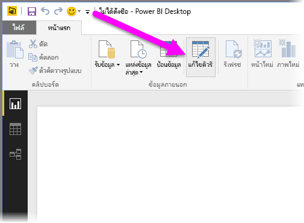
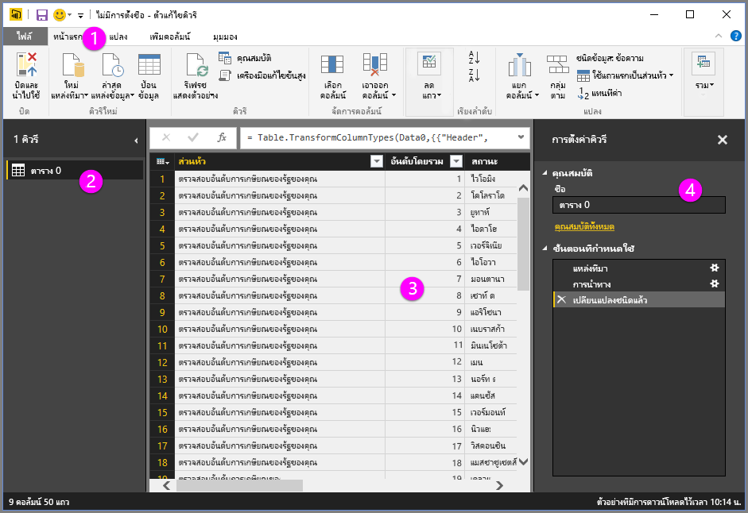
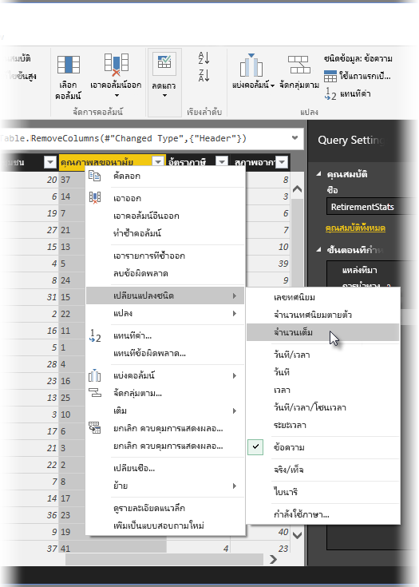

**Power BI Desktop** มี**ตัวแก้ไขคิวรี** ซึ่งเป็นเครื่องมือที่มีประสิทธิภาพสำหรับการจัดรูปร่างและการแปลงข้อมูล เพื่อให้พร้อมสำหรับแบบจำลองและการจัดรูปแบบการแสดงข้อมูลของคุณ เมื่อคุณเลือกตัวแก้ไขจากตัวนำทาง ตัวแก้ไขคิวรีจะเปิดขึ้นพร้อมกับตารางหรือรายการอื่นๆ ที่คุณเลือกจากแหล่งข้อมูลของคุณ

คุณยังสามารถเรียกใช้**ตัวแก้ไขคิวรี**ได้โดยตรงจาก **Power BI Desktop** โดยใช้ปุ่ม **แก้ไขคิวรี** บน Ribbon **หน้าแรก**

เมื่อตัวแก้ไขคิวรีมีข้อมูลที่พร้อมให้คุณจัดรูปร่างแล้ว คุณจะเห็นส่วนต่างๆ:

1. ใน Ribbon มีปุ่มจำนวนมากพร้อมใช้งานเพื่อโต้ตอบกับข้อมูลในคิวรี
2. ในบานหน้าต่างด้านซ้าย คิวรี (สำหรับแต่ละตารางหรือรายการ) จะแสดงอยู่และพร้อมใช้งานสำหรับการเลือก การดู และการจัดรูปร่าง
3. ในบานหน้าต่างตรงกลาง ข้อมูลจากคิวรีที่เลือกจะแสดงและพร้อมใช้งานสำหรับการจัดรูปร่าง
4. หน้าต่างการตั้งค่าคิวรีจะปรากฏขึ้น พร้อมกับคุณสมบัติของคิวรีและขั้นตอนที่ถูกนำไปใช้

ในบานหน้าต่างตรงกลาง การคลิกขวาบนคอลัมน์จะแสดงการแปลงต่างๆ จำนวนหนึ่งที่พร้อมใช้งาน เช่น การนำคอลัมน์ออกจากตาราง การทำซ้ำคอลัมน์โดยใช้ชื่อใหม่ และการแทนที่ค่า จากเมนูนี้ คุณยังสามารถแยกคอลัมน์ข้อความเป็นหลายคอลัมน์ได้โดยใช้ตัวคั่นทั่วไป

Ribbon ของ**ตัวแก้ไขคิวรี**มีเครื่องมือเพิ่มเติม เช่น การเปลี่ยนชนิดข้อมูลของข้อมูล การเพิ่มสัญลักษณ์ทางวิทยาศาสตร์ หรือการแยกองค์ประกอบจากวันที่ เช่น วันในสัปดาห์

เมื่อคุณนำการแปลงไปใช้ แต่ละขั้นตอนจะปรากฏในรายการ **ขั้นตอนที่ถูกนำไปใช้** ในบานหน้าต่าง **การตั้งค่าคิวรี** ทางด้านขวาของ **ตัวแก้ไขคิวรี** คุณสามารถใช้รายการเพื่อเลิกทำหรือตรวจทานการเปลี่ยนแปลงต่างๆ หรือแม้แต่เปลี่ยนชื่อของขั้นตอน เมื่อต้องการบันทึกการเปลี่ยนของคุณ ให้เลือก **ปิดและนำไปใช้** บนแท็บ **หน้าแรก**

เมื่อคุณเลือก **ปิดและนำไปใช้** ตัวแก้ไขคิวรีจะนำการเปลี่ยนแปลงที่คุณทำไปใช้ และนำไปใช้กับ Power BI Desktop

ยังมีสิ่งต่างๆ อีกมากมายที่คุณสามารถทำได้เมื่อแปลข้อมูลใน**ตัวแก้ไขคิวรี** รวมถึง การแปลงขั้นสูง ในส่วนถัดไป เราจะอธิบายบางส่วนของการแปลงขั้นสูงเหล่านั้น เพื่อให้คุณเข้าใจวิธีที่คุณสามารถแปลงข้อมูลของคุณด้วย**ตัวแก้ไขคิวรี**ได้อย่างไม่จำกัด

