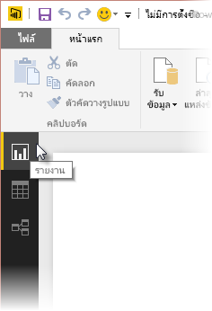
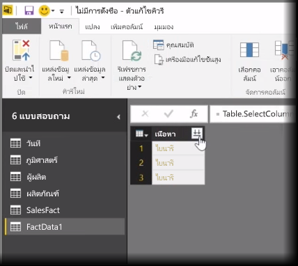
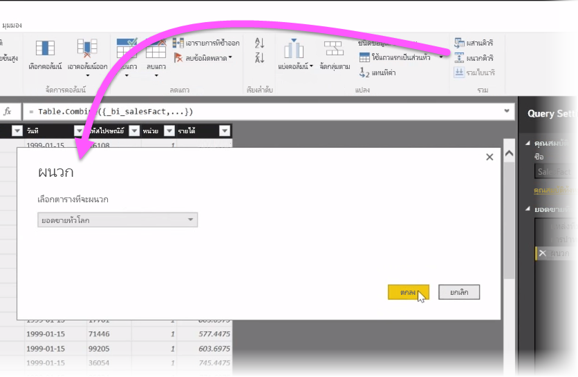
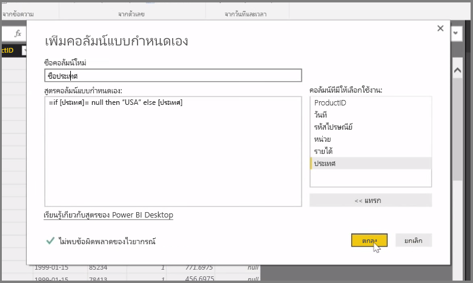

ในบทความนี้ เราจะอธิบายเทคนิคการนำเข้าและการล้างข้อมูลขั้นสูงบางอย่างสำหรับ **Power BI Desktop** เมื่อคุณจัดรูปทรงข้อมูลของคุณใน**ตัวแก้ไขคิวรี**และนำเข้าสู่ **Power BI Desktop** แล้ว คุณจะสามารถดูข้อมูลนั้นได้ด้วยหลายวิธี มีสามมุมมองใน Power BI Desktop: มุมมอง**รายงาน** มุมมอง**ข้อมูล** และมุมมอง**ความสัมพันธ์** คุณสามารถดูแต่ละมุมมองได้โดยการเลือกไอคอนทางด้านซ้ายบนของพื้นที่วาดรูป ในรูปภาพต่อไปนี้ จะมีการเลือกมุมมอง**รายงาน**ไว้แล้ว แถบสีเหลืองที่อยู่ถัดจากไอคอนจะระบุมุมมองที่ทำงานอยู่

เมื่อต้องการเปลี่ยนมุมมอง เพียงเลือกหนึ่งในสองไอคอนที่เหลือ แถบสีเหลืองที่อยู่ถัดจากไอคอนจะระบุมุมมองที่ทำงานอยู่

Power BI Desktop สามารถรวมข้อมูลจากหลายแหล่งข้อมูลให้เป็นรายงานเดียวได้ ไม่ว่าจะอยู่ในขั้นตอนใดก็ตามระหว่างกระบวนการการวางรูปแบบ เมื่อต้องการเพิ่มแหล่งข้อมูลเพิ่มเติมไปยังรายงานที่มีอยู่ ให้เลือก **แก้ไขคิวรี** ใน Ribbon **หน้าแรก** แล้วเลือก **แหล่งข้อมูลใหม่** ใน **ตัวแก้ไขคิวรี**

ยังมีแหล่งข้อมูลที่คุณสามารถใช้งานได้ใน **Power BI Desktop** อีกมากมายรวมถึงโฟลเดอร์ เมื่อเชื่อมต่อกับโฟลเดอร์ คุณจะสามารถนำเข้าข้อมูลจากหลายไฟล์พร้อมกัน เช่น ชุดข้อมูลของไฟล์ Excel ของไฟล์ CSV ไฟล์ที่อยู่ภายในโฟลเดอร์ที่คุณเลือกจะปรากฏขึ้นใน **ตัวแก้ไขคิวรี** เป็นเนื้อหาแบบไบนารี และการคลิกที่ไอคอนลูกศรคู่ทางด้านบนของคอลัมน์ **เนื้อหา** จะโหลดค่าของไฟล์เหล่านั้น

หนึ่งในเครื่องมือที่มีประโยชน์ที่สุดของ Power BI คือ *ตัวกรอง* ตัวอย่างเช่น การเลือกลูกศรดรอปดาวน์ที่อยู่ถัดจากคอลัมน์ จะเป็นการเปิดรายการตรวจสอบของตัวกรองข้อความที่คุณสามารถใช้เพื่อนำค่าออกจากแบบจำลองของคุณ

คุณยังสามารถผสานและผนวกคิวรี และเปลี่ยนหลายตาราง (หรือข้อมูลจากไฟล์ต่างๆ ในโฟลเดอร์) ให้เป็นตารางเดียวที่มีเฉพาะข้อมูลที่คุณต้องการ คุณสามารถใช้เครื่องมือ **ผนวกคิวรี** เพื่อเพิ่มข้อมูลจากตารางใหม่ไปยังคิวรีที่มีอยู่ Power BI Desktop จะพยายามจับคู่คอลัมน์ในคิวรีของคุณ ซึ่งคุณสามารถปรับใน**ตัวแก้ไขคิวรี**ได้ตามความจำเป็นในภายหลัง

สุดท้ายนี้ เครื่องมือ **เพิ่มคอลัมน์แบบกำหนดเอง** จะทำให้ผู้ใช้ขั้นสูงมีตัวเลือกในการเขียนนิพจน์ของคิวรีตั้งแต่เริ่มต้นโดยใช้ภาษา M ที่มีประสิทธิภาพ คุณสามารถเพิ่มคอลัมน์แบบกำหนดเองโดยยึดตามคำสั่งในภาษาคิวรี M และได้รับข้อมูลของคุณตามที่คุณต้องการ

