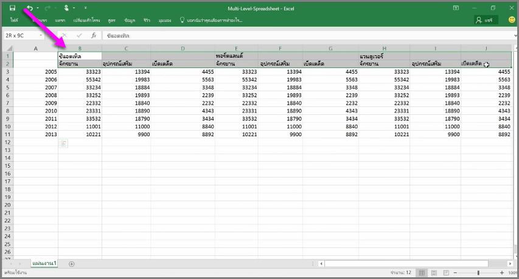
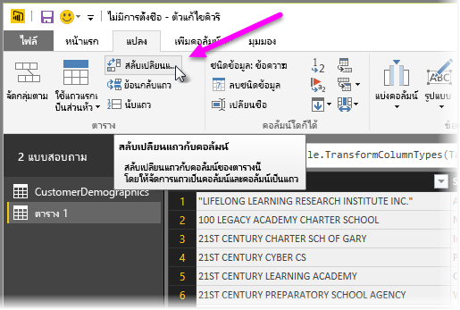
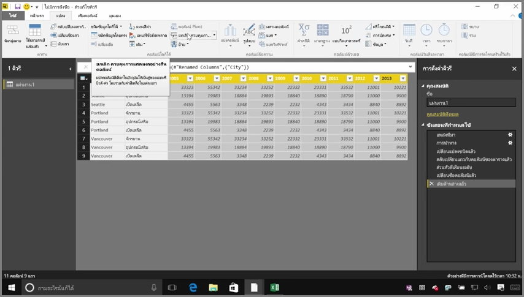
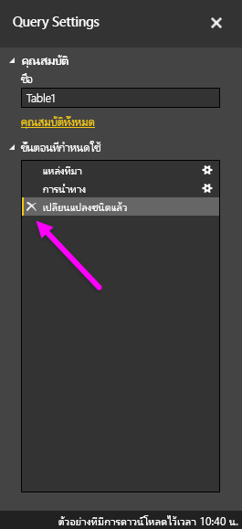
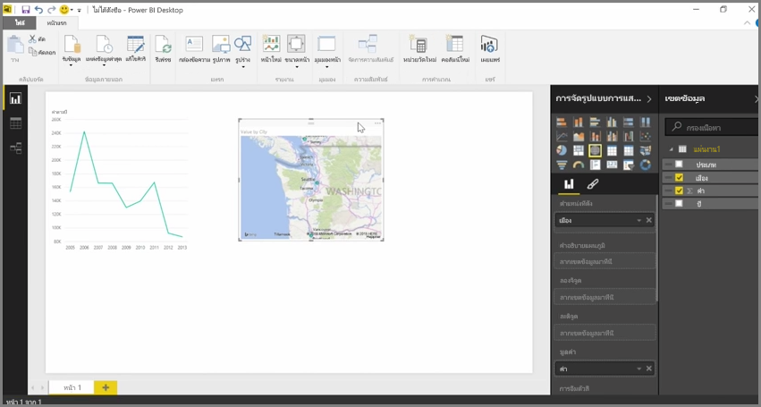

ขณะที่ Power BI สามารถนำเข้าข้อมูลของคุณได้จากเกือบทุกแหล่งข้อมูล เครื่องมือการจัดรูปแบบการแสดงข้อมูลและการวางรูปแบบก็สามารถทำงานได้อย่างดีเยี่ยมกับข้อมูลที่เป็นคอลัมน์ ในบางครั้ง ข้อมูลของคุณจะถูกจัดรูปแบบให้เป็นคอลัมน์ง่ายๆ ซึ่งมักจะเกิดขึ้นเมื่อคุณใช้สเปรดชีต Excel ซึ่งมีเค้าโครงตารางลักษณะสวยงามที่ไม่จำเป็นต้องปรับสำหรับคิวรีอัตโนมัติ ตัวอย่างเช่น สเปรดชีตต่อไปนี้มีส่วนที่ขยายเป็นหลายคอลัมน์

โชคดีที่ Power BI มีเครื่องมือในการแปลงตารางหลายคอลัมน์ให้เป็นชุดข้อมูลที่คุณสามารถใช้งานได้อย่างรวดเร็ว

## สลับเปลี่ยนแถวข้อมูลกับคอลัมน์
ตัวอย่างเช่น เมื่อใช้ **สลับเปลี่ยนแถวกับคอลัมน์** ใน **ตัวแก้ไขคิวรี** คุณจะสามารถพลิกข้อมูล (เปลี่ยนคอลัมน์ให้เป็นแถว และเปลี่ยนแถวให้เป็นคอลัมน์) เพื่อให้คุณสามารถแบ่งข้อมูลเป็นรูปแบบที่คุณสามารถจัดการได้

เมื่อคุณทำเช่นนี้เพียงไม่กี่ครั้ง ตามที่ได้อธิบายไว้ในวิดีโอ ตารางของคุณจะเริ่มมีลักษณะที่ Power BI สามารถนำไปใช้งานได้ง่ายยิ่งขึ้น

## จัดรูปแบบข้อมูล
คุณยังอาจต้องจัดรูปแบบข้อมูล เพื่อให้ Power BI สามารถจัดประเภทและระบุข้อมูลได้อย่างถูกต้องเมื่อนำเข้า

ด้วยการแปลงต่างๆ รวมถึง *การเพิ่มระดับแถวให้เป็นส่วนหัว* เพื่อแบ่งส่วนหัว การใช้ **เติม** เพื่อเปลี่ยนค่า *Null* ให้เป็นค่าที่อยู่ทางด้านบนหรือด้านล่างของคอลัมน์ที่ระบุ และ **ยกเลิกคอลัมน์** คุณสามารถล้างข้อมูลนั้นไปเป็นชุดข้อมูลที่คุณสามารถใช้ใน Power BI ได้

เมื่อใช้ Power BI คุณสามารถทดลองใช้การแปลงเหล่านี้กับข้อมูลของคุณ และกำหนดชนิดข้อมูลที่จะทำเป็นรูปแบบตารางที่ทำงานกับ Power BI ได้ และจำไว้ว่า การกระทำทุกอย่างที่คุณทำจะถูกบันทึกไว้ในส่วนขั้นตอนที่ถูกนำไปใช้ของตัวแก้ไขคิวรี ดังนั้น ถ้าการแปลงไม่ทำงานตามที่คุณคาดไว้ คุณสามารถคลิก **x** ที่อยู่ถัดจากขั้นตอน แล้วเลิกทำได้

## สร้างการแสดงผลด้วยภาพ
เมื่อข้อมูลของคุณอยู่ในรูปแบบที่ Power BI สามารถใช้ได้ ไม่ว่าจะด้วยการแปลงและการล้างข้อมูล คุณสามารถเริ่มสร้างการแสดงข้อมูลได้

## ขั้นตอนถัดไป
**ยินดีด้วย!** คุณได้สำเร็จส่วนนี้ของหลักสูตร **การเรียนรู้พร้อมคำแนะนำ** สำหรับ Power BI แล้ว ในตอนนี้ คุณทราบวิธีการ**รับข้อมูล**เข้าสู่ Power BI Desktop และวิธีการ*จัดรูปทรง*หรือ*แปลง*ข้อมูลนั้น เพื่อให้คุณสามารถสร้างการแสดงข้อมูลที่ดูน่าสนใจได้แล้ว

ขั้นตอนถัดไปในการเรียนรู้การทำงานของ Power BI และการทำงานที่เหมาะ*สำหรับคุณ*คือการทำความเข้าใจสิ่งที่ใช้ใน**การวางรูปแบบ** ตามที่คุณได้เรียนรู้ **ชุดข้อมูล**คือโครงสร้างพื้นฐานของ Power BI แต่บางชุดข้อมูลอาจซับซ้อนและยึดตามแหล่งข้อมูลจำนวนมาก และในบางครั้ง คุณต้องเพิ่มสัมผัสพิเศษของคุณเอง (หรือ*เขตข้อมูล*) ให้กับชุดข้อมูลที่คุณสร้าง

คุณจะได้เรียนรู้เกี่ยวกับ**การวางรูปแบบ** และสิ่งอื่นๆ อีกมากมายในส่วนถัดไป เจอกันที่นั่น!

