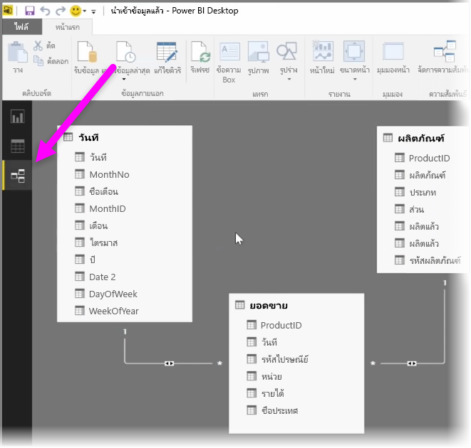
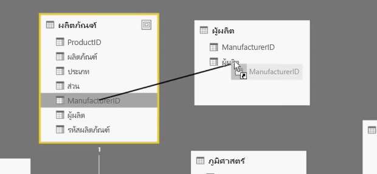
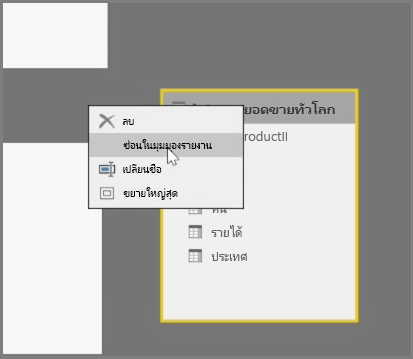
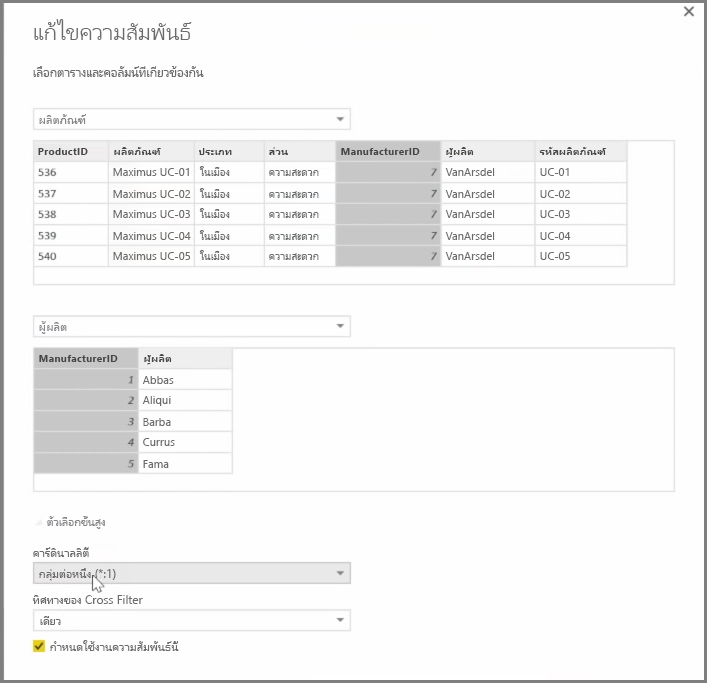

Power BI ช่วยให้คุณสามารถตั้งค่าความสัมพันธ์ที่มองเห็นได้ระหว่างตารางและองค์ประกอบ เมื่อต้องการดูมุมมองแผนผังของข้อมูลของคุณ ให้ใช้ **มุมมองความสัมพันธ์** ที่อยู่ทางด้านซ้ายสุดของหน้าจอ ถัดจากพื้นที่ทำงานของรายงาน

จากมุมมอง**ความสัมพันธ์** คุณจะเห็นบล็อกที่แสดงแทนแต่ละตารางและคอลัมน์ และเส้นที่แสดงความสัมพันธ์

การเพิ่มและการลบความสัมพันธ์สามารถทำได้ง่าย เมื่อต้องการลบความสัมพันธ์ ให้คลิกขวา แล้วเลือก **ลบ** เมื่อต้องการสร้างความสัมพันธ์ ให้ลากแล้วปล่อยเขตข้อมูลที่คุณต้องการเชื่อมโยงระหว่างตาราง

เมื่อต้องการซ่อนตารางหรือคอลัมน์จากรายงานของคุณ ให้คลิกขวาในมุมมองความสัมพันธ์ แล้วเลือก **ซ่อนในมุมมองรายงาน**

สำหรับมุมมองโดยละเอียดของความสัมพันธ์ของข้อมูลของคุณ ให้เลือก **จัดการความสัมพันธ์** ในแท็บ **หน้าแรก** กล่องโต้ตอบ **จัดการความสัมพันธ์** จะเปิดขึ้น และแสดงความสัมพันธ์เป็นรายการแทนที่จะเป็นแผนผังรูปภาพ จากที่นี่ คุณสามารถเลือก **ตรวจหาโดยอัตโนมัติ** เพื่อค้นหาความสัมพันธ์ในข้อมูลใหม่หรือข้อมูลที่มีการอัปเดต เลือก **แก้ไข** ในกล่องโต้ตอบ **จัดการความสัมพันธ์** เพื่อแก้ไขความสัมพันธ์ของคุณด้วยตนเอง นอกจากนี้ คุณจะพบตัวเลือกขั้นสูงเพื่อตั้งค่า*คาร์ดินาลลิตี้* และทิศทาง*ข้ามตัวกรอง*ของความสัมพันธ์ของคุณ

ตัวเลือกของคุณสำหรับ คาร์ดินาลลิตี้ คือ *กลุ่มต่อหนึ่ง* และ *หนึ่งต่อหนึ่ง* *กลุ่มต่อหนึ่ง* คือข้อเท็จจริงของความสัมพันธ์ชนิดขนาด ตัวอย่างเช่น ตารางยอดขายที่มีหลายแถวต่อหนึ่งผลิตภัณฑ์ที่จับคู่กับผลิตภัณฑ์รายการในตารางในแถวที่ไม่ซ้ำกัน *หนึ่งต่อหนึ่ง* มักจะใช้สำหรับการเชื่อมต่อรายการเดียวในตารางอ้างอิง

ตามค่าเริ่มต้น ความสัมพันธ์จะถูกตั้งค่าให้ข้ามตัวกรองในทั้งสองทิศทาง การข้ามตัวกรองเพียงทิศทางเดียวจะจำกัดความสามารถการวางรูปแบบบางอย่างในความสัมพันธ์

การตั้งค่าความสัมพันธ์ที่แม่นยำระหว่างข้อมูลของคุณจะช่วยให้คุณสามารถสร้างการคำนวณที่ซับซ้อนในหลายองค์ประกอบข้อมูลได้

