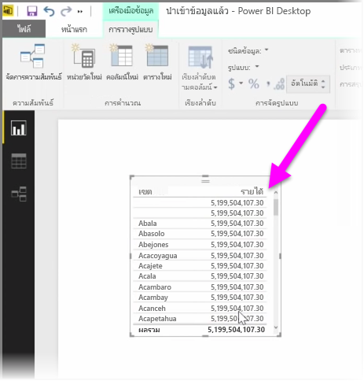
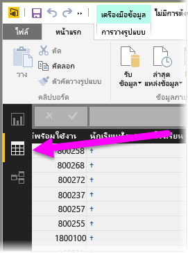
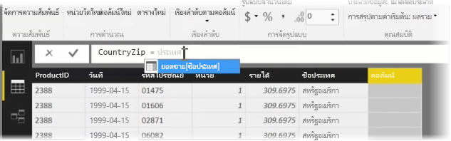
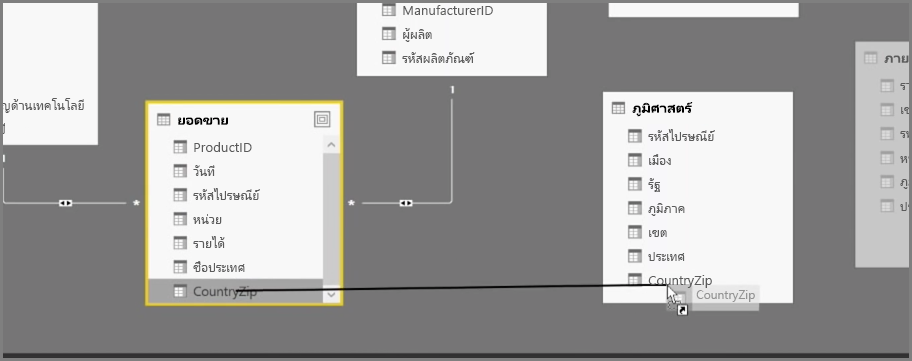
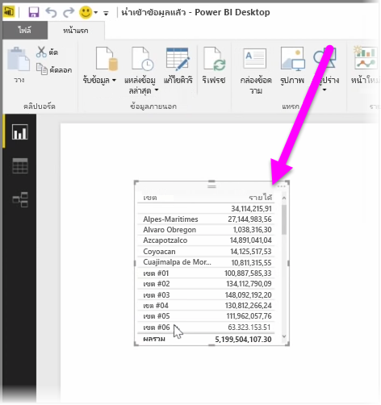

การสร้างคอลัมน์จากการคำนวณคือวิธีง่ายๆ ในการส่งเสริมและเพิ่มประสิทธิภาพของข้อมูลของคุณ **คอลัมน์จากการคำนวณ**คือ คอลัมน์ใหม่ที่คุณสร้างขึ้นโดยการกำหนดการคำนวณที่แปลงหรือรวมสององค์ประกอบหรือมากกว่าของข้อมูลที่มีอยู่ ตัวอย่างเช่น คุณสามารถสร้างคอลัมน์ใหม่โดยการรวมสองคอลัมน์ให้เป็นคอลัมน์เดียว

สาเหตุหนึ่งข้อที่เป็นประโยชน์สำหรับการสร้างคอลัมน์จากการคำนวณคือเพื่อสร้างความสัมพันธ์ระหว่างตาราง เมื่อไม่มีเขตข้อมูลที่ไม่ซ้ำกันที่คุณสามารถใช้เพื่อสร้างความสัมพันธ์ การขาดความสัมพันธ์จะปรากฏอย่างชัดเจนเมื่อคุณสร้างการแสดงข้อมูลตารางง่ายๆ ใน Power BI Desktop และคุณจะได้รับค่าเดียวกับสำหรับรายการทั้งหมด แม้ว่าคุณจะทราบว่าข้อมูลย่อยต่างกัน

เมื่อต้องการสร้างความสัมพันธ์ด้วยเขตข้อมูลที่ไม่ซ้ำกันในข้อมูล คุณสามารถสร้างคอลัมน์จากการคำนวณใหม่สำหรับ “หมายเลขโทรศัพท์แบบเต็ม” โดยการผสมค่าจากคอลัมน์ “รหัสพื้นที่” และ “หมายเลขท้องถิ่น” เมื่อมีค่าเหล่านั้นอยู่ในข้อมูลของคุณ คอลัมน์จากการคำนวณคือ เครื่องมือที่มีประโยชน์สำหรับการสร้างแบบจำลองและการจัดรูปแบบการแสดงข้อมูลอย่างรวดเร็ว

เมื่อต้องการสร้างคอลัมน์จากการคำนวณ ให้เลือก **มุมมองข้อมูล** ใน Power BI Desktop จากด้านซ้ายของพื้นที่ทำงานของรายงาน

จากแท็บ การวางรูปแบบ ให้เลือก **คอลัมน์ใหม่** การทำเช่นนี้จะเปิดใช้งานแถบสูตรที่คุณสามารถใส่การคำนวณโดยใช้ภาษา DAX (นิพจน์วิเคราะห์ข้อมูล) DAX คือ ภาษาสูตรที่มีประสิทธิภาพ ที่ใช้ใน Excel ที่ช่วยให้คุณสามารถสร้างการคำนวณที่ซับซ้อนได้ เมื่อคุณพิมพ์สูตร Power BI Desktop จะแสดงสูตรหรือองค์ประกอบข้อมูลที่ตรงกัน เพื่อช่วยเหลือและเร่งความเร็วในการสร้างสูตรของคุณ

แถบสูตรของ Power BI จะแนะนำฟังก์ชัน DAX เฉพาะและคอลัมน์ข้อมูลที่เกี่ยวข้องเมื่อคุณใส่นิพจน์ของคุณ

เมื่อคอลัมน์จากการคำนวณถูกสร้างขึ้นในแต่ละตารางแล้ว จะสามารถใช้เป็นคีย์ที่ไม่ซ้ำกันเพื่อสร้างความสัมพันธ์ระหว่างตารางได้ เมื่อไปที่มุมมอง**ความสัมพันธ์** คุณจะสามารถลากเขตข้อมูลจากตารางหนึ่งไปยังอีกตารางหนึ่งได้เพื่อสร้างความสัมพันธ์

เมื่อย้อนกลับไปที่มุมมอง**รายงาน** คุณจะเห็นค่าต่างๆ สำหรับแต่ละเขต

ยังมีสิ่งอื่นๆ อีกมากมายที่คุณสามารถทำได้โดยการสร้างคอลัมน์จากการคำนวณ

