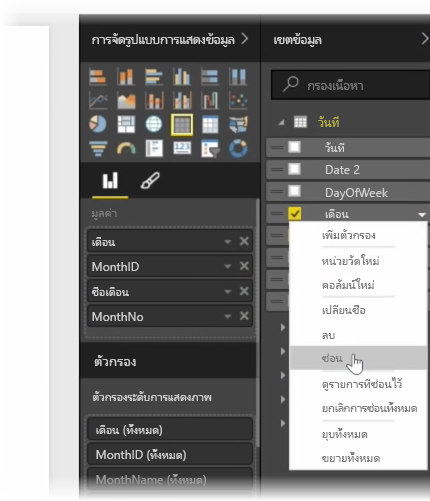
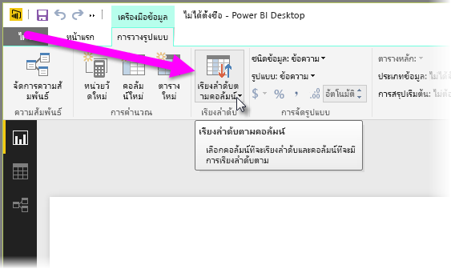
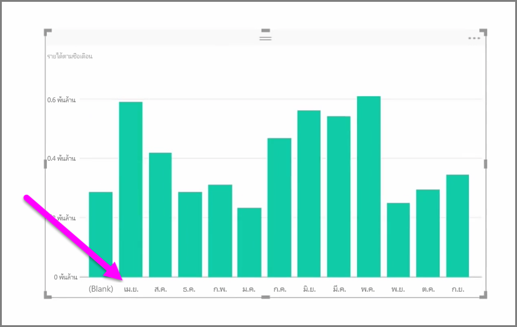
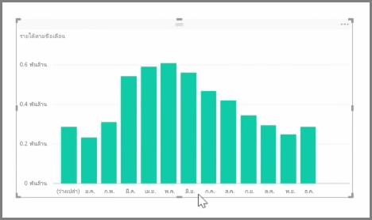

ข้อมูลที่นำเข้ามักจะมีเขตข้อมูลที่คุณไม่ต้องการสำหรับงานการรายงานและการจัดรูปแบบการแสดงข้อมูลของคุณ เนื่องจากอาจมีข้อมูลมากเกินไป หรือเนื่องจากข้อมูลนั้นอยู่ในคอลัมน์อื่นอยู่แล้ว Power BI Desktop มีเครื่องมือในการใช้ข้อมูลของคุณให้เกิดประโยชน์สูงสุด และทำให้สามารถนำไปใช้สร้างรายงานและการแสดงข้อมูล และสำหรับการดูรายงานที่แชร์ของคุณ

## การซ่อนเขตข้อมูล
เมื่อต้องการซ่อนคอลัมน์ในบานหน้าต่าง **เขตข้อมูล** ของ Power BI Desktop ให้คลิกขวา แล้วเลือก **ซ่อน** โปรดทราบว่าคอลัมน์ที่ซ่อนอยู่ของคุณไม่ได้ถูกลบ ถ้าคุณใช้เขตข้อมูลนั้นในการจัดรูปแบบการแสดงข้อมูลที่มีอยู่ ข้อมูลจะยังคงอยู่ในการแสดงข้อมูลนั้น และคุณยังคงสามารถใช้ข้อมูลนั้นในการจัดรูปแบบการแสดงข้อมูลอื่นๆ เช่นกัน แต่เขตข้อมูลที่ซ่อนอยู่จะไม่แสดงในบานหน้าต่าง **เขตข้อมูล**

ถ้าคุณดูตารางในมุมมอง**ความสัมพันธ์** เขตข้อมูลที่ซ่อนอยู่จะเป็นสีเทา ข้อมูลเหล่านั้นยังคงพร้อมใช้งานและเป็นส่วนหนึ่งของแบบจำลอง แต่เพียงถูกซ่อนจากมุมมองเท่านั้น คุณสามารถยกเลิกการซ่อนเขตข้อมูลใดก็ตามที่ซ่อนอยู่ได้ตลอดเวลาโดยการคลิกขวาที่เขตข้อมูล แล้วเลือก **ยกเลิกการซ่อน**

## การเรียงลำดับข้อมูลการจัดรูปแบบการแสดงข้อมูลตามเขตข้อมูลอื่น
เครื่องมือ **เรียงลำดับตามคอลัมน์** ที่พร้อมใช้งานในแท็บ **การวางรูปแบบ** มีประโยชน์อย่างมากในการทำให้มั่นใจว่าข้อมูลของคุณจะถูกแสดงตามลำดับที่คุณต้องการ

ในตัวอย่างทั่วไป ข้อมูลที่มีชื่อเดือนจะถูกเรียงลำดับตามตัวอักษรตามค่าเริ่มต้น เช่น “August” จะปรากฏอยู่ก่อน “February”

ในกรณี การเลือกเขตข้อมูลในรายการเขตข้อมูล เลือก **เรียงลำดับตามคอลัมน์** จากแท็บ **การวางรูปแบบ** แล้วเลือกเขตข้อมูลที่จะเรียงลำดับตามสามารถแก้ไขปัญหาได้ ในกรณีนี้ ตัวเลือกเรียงลำดับประเภท “MonthNo” จะเรียงลำดับเดือนตามที่คุณต้องการ

การตั้งค่าชนิดข้อมูลสำหรับเขตข้อมูลเป็นอีกวิธีหนึ่งในการปรับข้อมูลของคุณให้เหมาะสม เพื่อให้ใช้งานได้อย่างถูกต้อง เมื่อต้องการเปลี่ยนชนิดข้อมูลจากพื้นที่ทำงานของรายงาน ให้เลือกคอลัมน์ในบานหน้าต่าง **เขตข้อมูล** แล้วใช้เมนูดรอปดาวน์ **รูปแบบ** เพื่อเลือกหนึ่งในตัวเลือกการจัดรูปแบบ การแสดงผลด้วยภาพใดก็ตามที่คุณสร้างขึ้นที่แสดงเขตข้อมูลนั้นจะได้รับการอัปเดตโดยอัตโนมัติ

