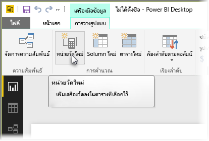
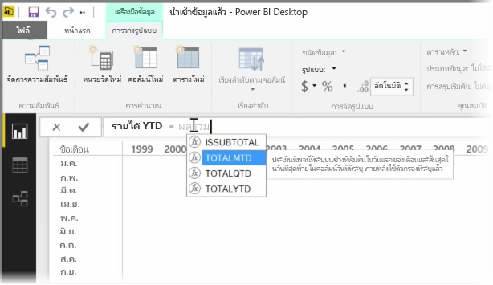
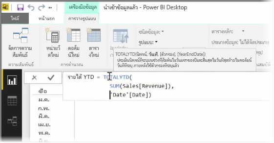
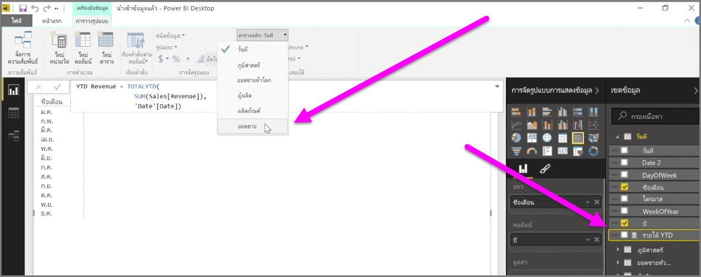

*หน่วยวัด*คือการคำนวณที่มีอยู่ในแบบจำลองข้อมูล Power BI ของคุณ เมื่อต้องการสร้างหน่วยวัด ในมุมมอง**รายงาน** ให้เลือก **หน่วยวัดใหม่** จากแท็บ **การวางรูปแบบ**

หนึ่งในสิ่งที่ยอดเยี่ยมเกี่ยวกับ DAX ที่เป็นภาษานิพจน์วิเคราะห์ข้อมูลใน Power BI คือ มีฟังก์ชันที่เป็นประโยชน์จำนวนมาก โดยเฉพาะเกี่ยวกับการคำนวณตามเวลา เช่น *เริ่มต้นปีจนถึงปัจจุบัน* หรือ *ปีปัจจุบันกับปีที่ผ่านมา* เมื่อใช้ DAX คุณจะสามารถกำหนดหน่วยวัดเวลา แล้วแบ่งตามจำนวนเขตข้อมูลต่างๆ ที่คุณต้องการจากแบบจำลองข้อมูลของคุณ

ใน Power BI การคำนวณที่กำหนดไว้จะเรียกว่า*หน่วยวัด* เมื่อต้องการสร้าง*หน่วยวัด* ให้เลือก **หน่วยวัดใหม่** จากแท็บ **หน้าแรก** การทำเช่นนี้จะเปิดแถบสูตรที่คุณสามารถใส่นิพจน์ DAX ที่กำหนดหน่วยวัดของคุณ เมื่อคุณพิมพ์ Power BI จะแนะนำฟังก์ชัน DAX และเขตข้อมูลที่เกี่ยวข้องเมื่อคุณใส่การคำนวณของคุณ และคุณยังจะได้รับคำแนะนำเครื่องมือที่อธิบายพารามิเตอร์ไวยากรณ์และฟังก์ชันบางอย่างอีกด้วย

ถ้าการคำนวณของคุณมีความยาวมาก คุณสามารถเพิ่มตัวแบ่งบรรทัดในตัวแก้ไขนิพจน์ได้โดยการพิมพ์ **ALT-Enter**

เมื่อคุณสร้างหน่วยวัดใหม่ จะปรากฏในหนึ่งในตารางบนบานหน้าต่าง **เขตข้อมูล** ที่อยู่ทางด้านขวาของหน้าจอ Power BI จะแทรกหน่วยวัดใหม่ลงในตารางใดก็ตามที่คุณเลือกอยู่ และไม่ว่าหน่วยวัดจะอยู่ที่ไหนในข้อมูลของคุณ คุณสามารถย้ายได้อย่างง่ายดายโดยการเลือกหน่วยวัดและใช้เมนูดรอปดาวน์ **ตารางหลัก**

คุณสามารถใช้หน่วยวัดด้วยวิธีที่คล้ายกับคอลัมน์ตารางอื่นๆ คือ เพียงลากแล้วปล่อยลงในพื้นที่ทำงานของรายงานหรือเขตข้อมูลการจัดรูปแบบการแสดงข้อมูล หน่วยวัดยังรวมกับตัวแบ่งส่วนข้อมูล การแบ่งส่วนข้อมูลของคุณระหว่างเดินทางได้อย่างราบรื่น ซึ่งหมายความว่าคุณสามารถกำหนดหน่วยวัดหนึ่งครั้ง และใช้ในการจัดรูปแบบการแสดงข้อมูลต่างๆ ได้หลายครั้ง

ฟังก์ชัน **คำนวณ** ของ DAX คือฟังก์ชันที่มีประสิทธิภาพที่สามารถทำการคำนวณที่เป็นประโยชน์ได้ทุกรูปแบบ โดยเฉพาะอย่างยิ่ง การทำรายงานและการแสดงข้อมูลด้านการเงิน

