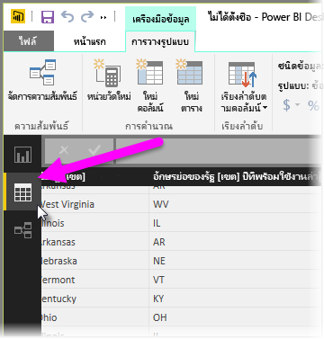
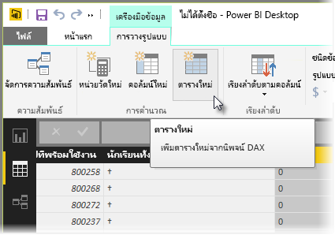
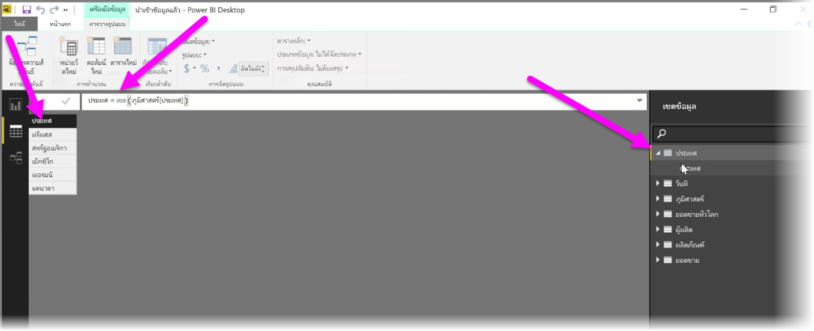

ตารางจากการคำนวณคือ ฟังก์ชันภายใน DAX ที่ช่วยให้คุณสามารถกำหนดช่วงทั้งหมดของความสามารถการวางรูปแบบใหม่ ตัวอย่างเช่น ถ้าคุณต้องการทำการผสานชนิดต่างๆ หรือสร้างตารางใหม่ระหว่างเดินทางโดยยึดตามผลลัพธ์ของสูตรฟังก์ชัน ตารางจากการคำนวณคือวิธีที่ช่วยให้คุณทำเช่นนั้นได้

เมื่อต้องการสร้างตารางจากการคำนวณ ให้ไปที่ **มุมมองข้อมูล** ใน Power BI Desktop ที่คุณสามารถเปิดใช้งานได้จากด้านซ้ายของพื้นที่รายงาน

เลือก **ตารางใหม่** จากแท็บการวางรูปแบบเพื่อเปิดแถบสูตร

พิมพ์ชื่อของตารางใหม่ของคุณทางด้านซ้ายของเครื่องหมายเท่ากับ และการคำนวณที่คุณต้องการใช้เพื่อสร้างตารางทางด้านขวา เมื่อคุณทำการคำนวณเสร็จเรียบร้อยแล้ว ตารางใหม่จะปรากฏขึ้นในบานหน้าต่างเขตข้อมูลในแบบจำลองของคุณ

เมื่อสร้างขึ้นแล้ว คุณสามารถใช้ตารางจากการคำนวณของคุณได้ตามที่คุณต้องการในความสัมพันธ์ สูตร และรายงาน

