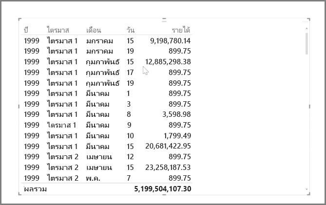
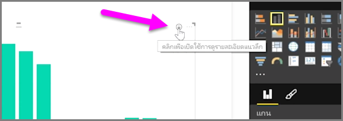
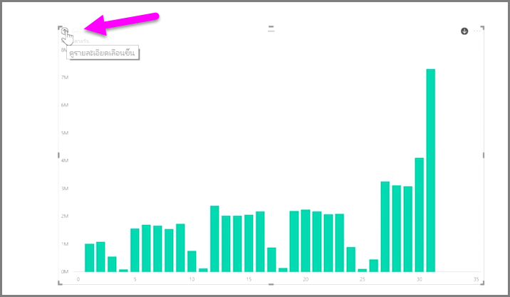
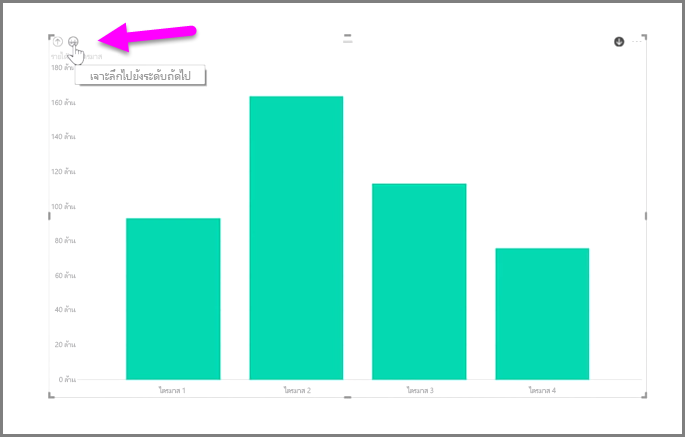
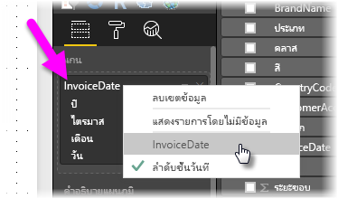

การวิเคราะห์ข้อมูลตามเวลาด้วย Power BI เป็นเรื่องง่าย เครื่องมือการวางรูปแบบใน Power BI Desktop จะใส่เขตข้อมูลที่สร้างขึ้นโดยอัตโนมัติ ซึ่งช่วยให้คุณสามารถดูรายละเอียดแนวลึกของปี ไตรมาส เดือน และวันได้ด้วยการคลิกเพียงครั้งเดียว  

เมื่อคุณสร้างการจัดรูปแบบการแสดงข้อมูลตารางในรายงานของคุณโดยใช้เขตข้อมูลวันที่ Power BI Desktop จะใส่การแบ่งตามช่วงเวลาโดยอัตโนมัติ ตัวอย่างเช่น เขตข้อมูลวันที่เดียวในตาราง **วันที่** จะถูกแบ่งเป็นปี ไตรมาส เดือน และวันโดยอัตโนมัติด้วย Power BI ตามที่แสดงในรูปภาพต่อไปนี้

การจัดรูปแบบการแสดงข้อมูลจะแสดงข้อมูลที่ระดับ*ปี*ตามค่าเริ่มต้น แต่คุณสามารถเปลี่ยนได้โดยการเปิด **ดูรายละเอียดแนวลึก** ที่มุมขวาบนของการแสดงข้อมูล

ในตอนนี้ เมื่อคุณคลิกที่แถบหรือเส้นในแผนภูมิจะดูรายละเอียดแนวลึกลงในระดับถัดไปของลำดับชั้นเวลา ตัวอย่างเช่น จาก*ปี*เป็น*ไตรมาส* คุณสามารถดูรายละเอียดแนวลึกได้อย่างต่อเนื่องจนกว่าจะถึงระดับที่เล็กที่สุดของลำดับชั้น ซึ่งในตัวอย่างนี้คือ*วัน* เมื่อต้องการย้อนกลับผ่านลำดับชั้นเวลา ให้คลิก **เลื่อนขึ้น** ที่มุมซ้ายบนของการแสดงข้อมูล

แทนที่จะดูรายละเอียดแนวลึกเฉพาะช่วงเวลาที่เลือก คุณยังสามารถเจาะลึกผ่านข้อมูลทั้งหมดที่แสดงบนการแสดงข้อมูลได้โดยใช้ไอคอนลูกศรคู่ **เจาะลึกทั้งหมด** ที่มุมขวาบนของการแสดงข้อมูล

ตราบใดที่แบบจำลองของคุณมีเขตข้อมูลวันที่ Power BI จะสร้างมุมมองต่างๆ สำหรับลำดับชั้นเวลาโดยอัตโนมัติ

เมื่อต้องการย้อนกลับไปยังวันที่แต่ละวันแทนที่จะใช้ลำดับชั้นวันที่ ให้คลิกขวาที่ชื่อคอลัมน์ใน **เขตข้อมูล** (ในรูปภาพต่อไปนี้ ชื่อของคอลัมน์จะเป็น *InvoiceDate*) แล้วเลือกชื่อคอลัมน์จากเมนูที่ปรากฏขึ้น แทนที่จะเลือก **ลำดับชั้นวันที่** การแสดงข้อมูลของคุณจะแสดงข้อมูลโดยยึดตามข้อมูลคอลัมน์โดยไม่ใช้ลำดับชั้นวันที่ ต้องการย้อนกลับไปใช้ลำดับชั้นวันที่ใช่ไหม ไม่มีปัญหา เพียงคลิกขวาอีกครั้ง แล้วเลือก **ลำดับชั้นวันที่** จากเมนู

## ขั้นตอนถัดไป
**ยินดีด้วย!** คุณได้สำเร็จส่วนนี้ของหลักสูตร **การเรียนรู้พร้อมคำแนะนำ** สำหรับ Power BI แล้ว ในตอนนี้ คุณทราบเกี่ยวกับข้อมูล*การวางรูปแบบ*แล้ว คุณพร้อมที่จะเรียนรู้เกี่ยวกับสิ่งที่น่าสนุกที่กำลังรอคุณอยู่ในส่วนถัดไป:  **การจัดรูปแบบการแสดงข้อมูล**

ตามที่เราเคยกล่าวไว้ก่อนหน้านี้ หลักสูตรนี้จะสร้างความรู้โดยการทำตามขั้นตอนการทำงานทั่วไปใน Power BI:

* นำข้อมูลเข้าสู่ **Power BI Desktop** แล้วสร้างรายงาน
* เผยแพร่ไปยังบริการของ Power BI ที่คุณสามารถสร้าง**การจัดรูปแบบการแสดงข้อมูล**ใหม่ได้ และสร้างแดชบอร์ด
* **แชร์**แดชบอร์ดของคุณกับผู้อื่น โดยเฉพาะผู้ที่กำลังเดินทาง
* ดูและโต้ตอบกับแดชบอร์ดและรายงานที่แชร์ในแอป **Power BI บนมือถือ**

แม้ว่าคุณอาจไม่ต้องทำงานทั้งหมดด้วยตนเอง คุณต้อง*ทำความเข้าใจ*วิธีการสร้างแดชบอร์ดเหล่านั้น และวิธีการเชื่อมต่อกับข้อมูล... และเมื่อคุณสำเร็จหลักสูตรนี้แล้ว คุณจะสามารถสร้างแดชบอร์ดของคุณเองได้

เจอกันในส่วนถัดไป!

