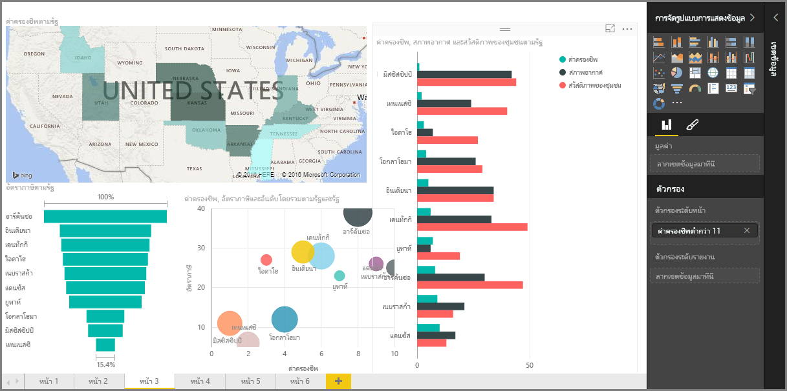

ยินดีต้อนรับสู่ส่วน **การจัดรูปแบบการแสดงข้อมูล** ของหลักสูตร **การเรียนรู้พร้อมคำแนะนำ** สำหรับ Power BI เตรียมพบกับความสนุก ความน่าสนใจ และการแนะนำที่จะอธิบายการจัดรูปแบบการแสดงข้อมูลมากมายที่ Power BI นำเสนอ และนี่ยังไม่ใช่ทั้งหมด ยังมีการจัดรูปแบบการแสดงข้อมูลอื่นๆ เข้ามาเพิ่มตลอดเวลา!

แน่นอน การแสดงผลด้วยภาพคือผลลัพธ์สุดท้ายของการทำงานอัจฉริยะทางธุรกิจ... เราต้องการใช้ข้อมูล แสดงข้อมูลด้วยวิธีที่น่าสนใจและเจาะลึกรายละเอียด และ*แสดง*ข้อมูลที่โดดเด่น และ Power Bi มีการแสดงข้อมูลที่น่าสนใจทุกประเภท และวิธีการปรับแต่งที่แทบจะเรียกได้ว่าไม่มีที่สิ้นสุด ดังนั้น ส่วนนี้จึงเป็นส่วนที่สำคัญ

อาจดูเหมือนว่ามีหลายหัวข้อในส่วนนี้ แต่ไม่ต้องกังวล แต่ละหัวข้อนั้นสั้นและเต็มไปด้วย (คุณสามารถคาดเดาได้) การแสดงผลด้วยภาพ และง่ายต่อการทำความเข้าใจ คุณจะรู้สึกเหมือนว่าตนเองผ่านส่วนนี้ไปอย่างรวดเร็ว และจินตนาการวิธีการใช้การแสดงผลด้วยภาพเหล่านี้ในการแสดงข้อมูลของคุณเอง

เราจะเริ่มต้นที่หลักสำคัญของการจัดรูปแบบการแสดงข้อมูล การแสดงข้อมูลง่ายๆ ที่เราคุ้นเคย และมั่นใจว่าคุณทราบวิธีการใช้งาน จากนั้น เราจะไปยังระดับที่สูงขึ้น หรือมีการนำไปใช้งานที่น้อยลง และเติมกล่องเครื่องการสร้างรายงานของคุณ

ขอให้สนุก มีอะไรมากมายให้เรียนรู้ที่นี่!

## แนะนำการแสดงผลด้วยภาพใน Power BI
การแสดงข้อมูลคือหนึ่งในส่วนหลักของ Power BI ซึ่งเป็นโครงสร้างพื้นฐานตามที่เราได้อธิบายไว้ก่อนหน้าในหลักสูตรนี้ และการสร้างการแสดงข้อมูลคือวิธีที่ง่ายที่สุดในการค้นหาและแชร์ข้อมูลเชิงลึกของคุณ

Power BI คือการจัดรูปแบบการแสดงข้อมูลที่หลากหลายที่พร้อมใช้งานตามค่าเริ่มต้น ตั้งค่าแผนภูมิแท่งไปจนถึงแผนภูมิวงกลมและแผนที่ พร้อมกับข้อเสนอที่น้อยคนจะรู้จัก เช่น วอเตอร์ฟอล กรวย มาตรวัด และอื่นๆ Power BI Desktop ยังเสนอเครื่องมือการจัดรูปแบบที่หลากหลาย เช่น รูปร่างและรูปภาพ ที่ช่วยปลุกชีวิตรายงานของคุณ

