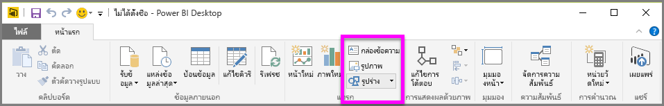
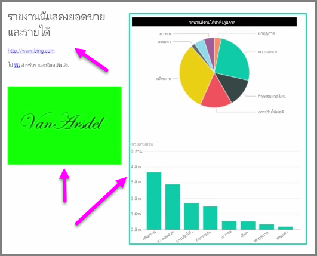

พร้อมกับการแสดงภาพที่ผูกกับข้อมูล คุณยังสามารถเพิ่มองค์ประกอบคงที่ เช่น กล่องข้อความ รูปภาพ และรูปร่างเพื่อปรับปรุงการออกแบบการแสดงข้อมูลของรายงานของคุณ เมื่อต้องการเพิ่มองค์ประกอบการแสดงข้อมูล ให้เลือก **กล่องข้อความ** **รูปภาพ** หรือ **รูปร่าง** จากแท็บ **หน้าแรก**

**กล่องข้อความ**คือวิธีที่ดีในการแสดงชื่อเรื่องขนาดใหญ่ คำบรรยาย หรือย่อหน้าสั้นๆ ของข้อมูลพร้อมกับการจัดรูปแบบการแสดงข้อมูลของคุณ กล่องข้อความสามารถมีลิงก์ ไม่ว่าจะเป็น URL ที่เขียนหรือการเน้นวลีจุดยึดและการเลือกสัญลักษณ์ลิงก์บนแถบตัวเลือกกล่องข้อความ คุณสามารถใส่ URL ในกล่องข้อความ และ Power BI จะตรวจหาลิงก์และทำให้ใช้งานได้โดยอัตโนมัติ

การเลือก **รูปภาพ** จะเปิดตัวเรียกดูไฟล์ที่คุณสามารถเลือกรูปภาพจากคอมพิวเตอร์ของคุณหรือแหล่งข้อมูลบนเครือข่ายอื่นๆ ตามค่าเริ่มต้น การปรับขนาดรูปภาพในรายงานของคุณจะรักษาอัตราส่วนไว้ แต่อาจถูกปิดใช้งานในตัวเลือกการจัดรูปแบบการแสดงข้อมูล

**รูปร่าง**มีตัวเลือกที่ต่างกันห้าตัวเลือกสำหรับแบบฟอร์ม รวมถึง สี่เหลี่ยมผืนผ้าและลูกศร รูปร่างอาจทึบแสง หรือโปร่งแสงด้วยเส้นขอบสี (รูปร่างโปร่งแสงจะมีประโยชน์สำหรับการสร้างเส้นขอบรอบๆ กลุ่มการจัดรูปแบบการแสดงข้อมูล)

