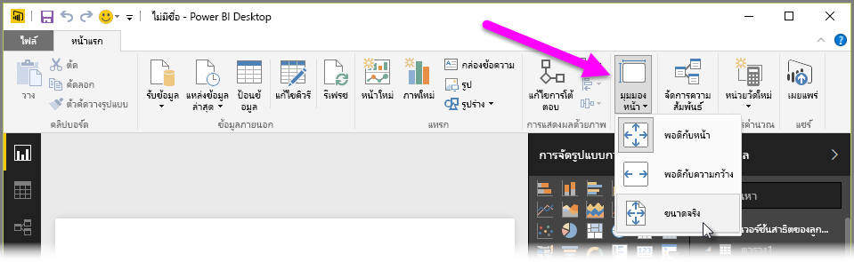
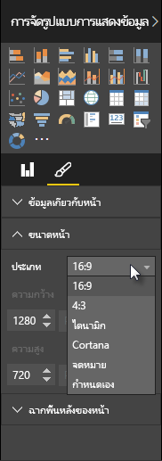

Power BI Desktop มีความสามารถในการควบคุมเค้าโครงและการจัดรูปแบบของหน้ารายงานของคุณ เช่น ขนาดและการวางแนว

ใช้เมนู **มุมมองหน้า** จากแท็บหน้าแรกเพื่อเปลี่ยนอัตราส่วนของหน้ารายงานของคุณ ตัวเลือกที่พร้อมใช้งาน ได้แก่ **พอดีกับหน้า** (ค่าเริ่มต้น) **พอดีกับความกว้าง** และ **ขนาดจริง**

คุณยังสามารถเปลี่ยนขนาดหน้าได้อีกด้วย ตามค่าเริ่มต้น หน้ารายงานคือ 16:9 เมื่อต้องการเปลี่ยนขนาดหน้า ให้ตรวจสอบให้แน่ใจว่าไม่ได้เลือกการแสดงผลด้วยภาพไว้ แล้วเลือกไอคอนพู่กันในบานหน้าต่างการจัดรูปแบบการแสดงข้อมูล แล้วเลือก **ขนาดหน้า** เพื่อขยายส่วนนั้น

ตัวเลือกสำหรับขนาดหน้า รวมถึง 4x3 (อัตราส่วนที่เป็นสี่เหลี่ยมจัตุรัสมากขึ้น) และไดนามิก (หน้าจะถูกยืดเพื่อเติมพื้นที่ที่พร้อมใช้งาน) มีขนาดจดหมายมาตรฐานสำหรับรายงานเช่นกัน โปรดจำไว้ว่าคุณอาจต้องปรับขนาดการแสดงข้อมูลของคุณหลังจากเปลี่ยนขนาดกระดาษเพื่อให้มั่นใจว่าอยู่บนพื้นที่วาดรูปทั้งหมด

คุณยังสามารถระบุขนาดหน้าแบบกำหนดเอง ตั้งค่าขนาดเป็นนิ้วหรือพิกเซล และเปลี่ยนสีพื้นหลังของทั้งรายงาน

ตัวเลือกอื่นคือเลือก Cortana ที่จะปรับรายงานให้สามารถใช้เป็นผลลัพธ์สำหรับการค้นหาโดยใช้ Cortana ได้

